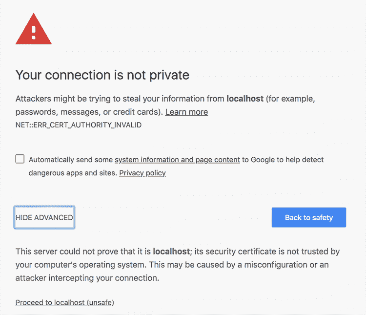
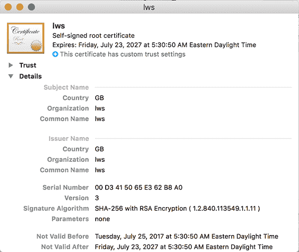
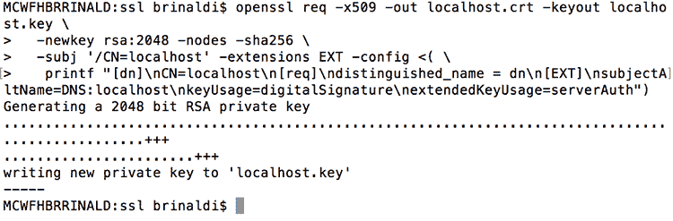
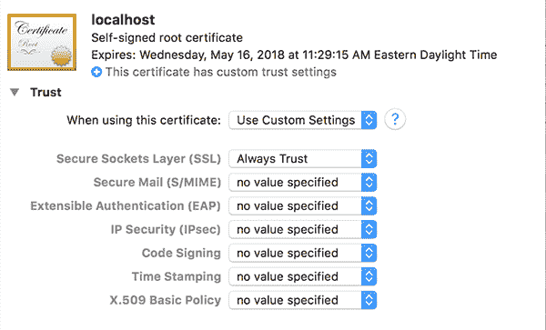
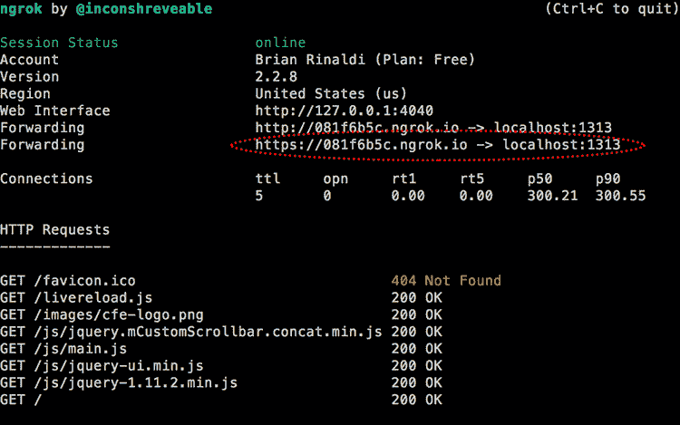

# 在本地主机上运行 SSL

> 原文：<https://dev.to/remotesynth/running-ssl-on-localhost-42ol>

在开始之前，我假设你们中的一些人可能会问，“为什么我关心在我的本地主机上运行 SSL？”嗯，有一些具体情况你可能会关心。以下是几个例子:

1.  您正在生产环境中实施 SSL，并希望确保在本地工作时可以测试生产环境中可能出现的错误。例如，与加载不安全的资源相关的错误和导致安全警告，或者与重定向到 SSL 时可能断开的链接相关的错误。
2.  您正在对使用 SSL 的 API 进行 ajax 调用，并且由于不同的协议而遇到了[同源策略](https://developer.mozilla.org/en-US/docs/Web/Security/Same-origin_policy)错误。如果你控制端点，这应该可以通过 [CORS](https://developer.mozilla.org/en-US/docs/Web/HTTP/CORS) 解决，但是你可能不能。
3.  您正在开发一个 PWA，它需要 SSL。虽然对于本地测试，您应该能够忽略与 SSL 相关的警告，但是您可能更喜欢在本地复制您的生产应用程序进行测试。

可能还有其他的，但是这些是我自己碰到的。

现在我们有了一些理由*为什么*您可能想要在 SSL 上运行您的本地主机，让我们看看如何去做。在这篇文章中，我将看一些使用简单节点 web 服务器、运行 Jekyll 和运行 Wordpress 的例子。我所有的例子都运行在 MacOS 上。显然，还有很多其他的本地 web 服务器设置，我不会一一介绍。

## SSL 与节点 Web 服务器上的本地主机

对于许多本地 web 开发任务，我依赖于构建在 Node 上的简单 HTTP 服务器。在 npm 中有很多这样的例子。原来他们很多都支持 SSL。我安装的选项之一， [local-web-server](https://www.npmjs.com/package/local-web-server) ，甚至附带了一个证书，您可以用它来自动启动 SSL 上的 localhost，只需一个命令行选项。

```
ws --https 
```

Enter fullscreen mode Exit fullscreen mode

问题是，默认情况下，你会得到这个可爱的错误。

[T2】](https://res.cloudinary.com/practicaldev/image/fetch/s--d7VFlI4_--/c_limit%2Cf_auto%2Cfl_progressive%2Cq_auto%2Cw_880/https://thepracticaldev.s3.amazonaws.com/i/7ukly0l39ep47uwh3szo.png)

当然，你可以进入 localhost，但你不会在 Chrome 中看到“安全”图标，这可能会掩盖其他安全问题(如安全页面上的不安全资源)。如果你想要安全的勾号，他们会给你提供如何在 Mac OS 上做到这一点的详细说明。

这些说明通常对我运行 MacOS Sierra 有效(是的，我仍然避免高 Sierra，直到有人说服我有一个令人信服的理由来改变)。我会注意到，我无法轻松地从“钥匙串访问”中导航到包含他们内置证书的安装文件夹(在我的情况下，这是`/usr/local/lib/node_modules/local-web-server/node_modules/lws`)。相反，我通过 Finder 找到它，然后简单地将证书拖到我的“登录”钥匙链中。一旦你这样做，点击它打开它。

[T2】](https://res.cloudinary.com/practicaldev/image/fetch/s--ZEZQWIAp--/c_limit%2Cf_auto%2Cfl_progressive%2Cq_auto%2Cw_880/https://thepracticaldev.s3.amazonaws.com/i/k7mkeav556ab0lva5y8f.png)

展开“信任”部分，并将“安全套接字层(SSL)”设置为“始终信任”

如果你不想使用 web 服务器附带的证书，而是想使用你自己的证书，那么[说明](https://github.com/lwsjs/local-web-server/wiki/How-to-get-the-%22green-padlock%22-using-the-built-in-certificate)也演示了如何做到这一点，尽管对我个人来说这不是一个关键问题。

## SSL 带本地主机带 Jekyll

我已经使用 Jekyll 建立了许多网站，包括我的博客，它执行 SSL。在本地构建 Jekyll 时，您通常会使用内置的 web 服务器来构建页面，并允许您在浏览器中测试它们。好消息是，如果您想这样做并使用 SSL 在本地测试页面，这是相当容易的。

第一步是为您的本地主机生成一个证书。《让我们加密》中的这个指南提供了很好的指导，你可以直接复制/粘贴到终端上。

```
openssl req -x509 -out localhost.crt -keyout localhost.key \
  -newkey rsa:2048 -nodes -sha256 \
  -subj '/CN=localhost' -extensions EXT -config <( \
   printf "[dn]\nCN=localhost\n[req]\ndistinguished_name = dn\n[EXT]\nsubjectAltName=DNS:localhost\nkeyUsage=digitalSignature\nextendedKeyUsage=serverAuth") 
```

Enter fullscreen mode Exit fullscreen mode

[T2】](https://res.cloudinary.com/practicaldev/image/fetch/s--d2utgo6T--/c_limit%2Cf_auto%2Cfl_progressive%2Cq_auto%2Cw_880/https://thepracticaldev.s3.amazonaws.com/i/jaq4kmk55feo0ci3ye2n.png)

我将生成的证书和密钥文件放在我的文档根目录下名为 ssl 的文件夹中。然而，正如本期所指出的，Jekyll 的 SSL 支持希望证书和密钥在网站的文件中。这是有道理的，如果你愿意，你可以很容易地把它们放在那里。因为我有很多项目可能会使用相同的证书，所以我没有这样做，而是在项目根目录下的文档中创建了一个到 ssl 文件夹的[符号链接](http://osxdaily.com/2015/08/06/make-symbolic-links-command-line-mac-os-x/)。

```
ln -s /Users/brinaldi/Documents/ssl /Users/brinaldi/Documents/projects/remotesynth.github.io/ssl 
```

Enter fullscreen mode Exit fullscreen mode

作为一个旁注，你会想确保你没有在你的项目中签入这个符号链接，所以你可能想把它添加到你的. gitignore 中。

现在，您可以启动 Jekyll 服务器，使用符号链接指定证书和密钥位置。

```
jekyll serve --ssl-key ssl/localhost.key --ssl-cert ssl/localhost.crt 
```

Enter fullscreen mode Exit fullscreen mode

当然，你需要经历我之前讨论的过程来避免 Chrome 中的安全警告。将证书拖到“钥匙串访问”中，点按它，然后将“安全套接字层(SSL)”设置为“总是信任”

[T2】](https://res.cloudinary.com/practicaldev/image/fetch/s--HjL8Z5WZ--/c_limit%2Cf_auto%2Cfl_progressive%2Cq_auto%2Cw_880/https://thepracticaldev.s3.amazonaws.com/i/a427ttedloav6f23mbfz.png)

现在，您将看到“安全”图标。

[T2】](https://res.cloudinary.com/practicaldev/image/fetch/s--WoVDBERe--/c_limit%2Cf_auto%2Cfl_progressive%2Cq_auto%2Cw_880/https://thepracticaldev.s3.amazonaws.com/i/em7f9f3xtoukc6s921xk.png)

## SSL 与本地主机使用 ngrok

我个人遇到了许多其他场景，在这些场景中，我可能需要在本地测试 SSL。例如，Hugo，我在本地构建的另一个静态站点服务器，不支持通过其内置的 web 服务器使用 SSL。或者我偶尔也在 Wordpress 网站上工作，这涉及到浏览一长串指令来更新 Apache 配置。

一个快速简单的解决方案是使用类似于 [ngrok](https://ngrok.com/) 的服务。对于基本的本地测试，免费帐户应该足够了，但如果你想寻找更多的选择，这是一个付费服务。

第一步当然是[下载 ngrok](https://ngrok.com/download) 。一旦你运行了它，你需要把它连接到你的 ngrok 账户——这个工具会引导你完成这个过程。我发现将 ngrok 添加到我的 PATH 变量中也更容易，这样我可以从任何地方通过命令行访问它。

一旦您设置好了(假设您的路径上有它)，您就可以启动 HTTP 端口转发服务了。例如，要对我的内置 Hugo 服务器进行端口转发(默认情况下，它使用端口 1313)，我只需使用下面的代码:

```
ngrok http 1313 
```

Enter fullscreen mode Exit fullscreen mode

现在，我可以通过提供的 URL 使用 SSL 访问本地运行的站点。

[T2】](https://res.cloudinary.com/practicaldev/image/fetch/s--DA9bJKDq--/c_limit%2Cf_auto%2Cfl_progressive%2Cq_auto%2Cw_880/https://thepracticaldev.s3.amazonaws.com/i/kcwwpr7m6iu09miq3cxo.png)

如果您正在寻找一种快速简单的方法在本地测试 SSL，并且同意注册一个 ngrok 帐户，那么这无疑是最简单的选择。