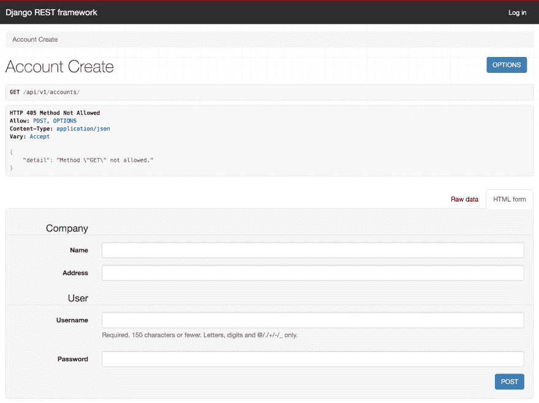
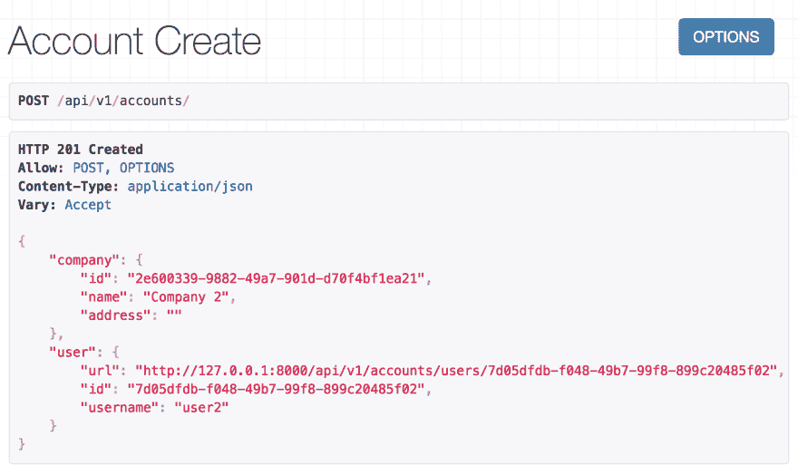
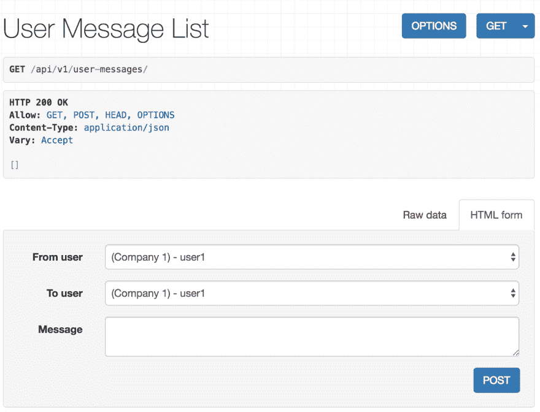
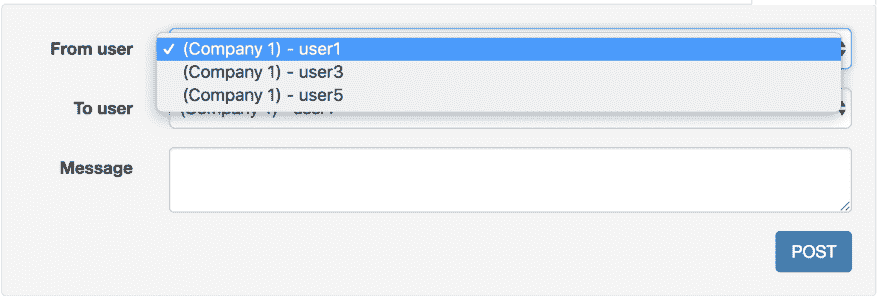
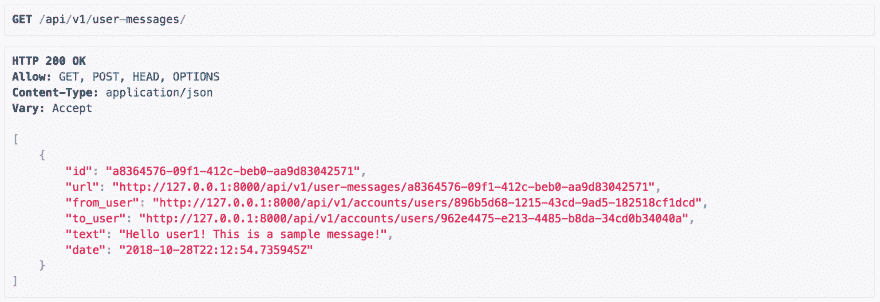
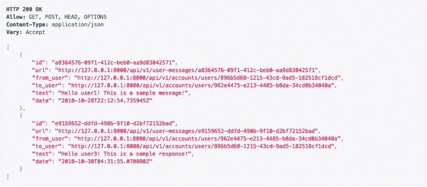

# SaaS 喜欢在 Django Rest 框架中孤立

> 原文：<https://dev.to/nicolasmesa/saas-like-isolation-in-django-rest-framework-k96>

交叉发布自我的个人博客[https://blog.nicolasmesa.co](https://blog.nicolasmesa.co)。

你好。在本文中，我们将讨论如何在不引入第三方库的情况下，将类似 SaaS 的隔离添加到 Django Rest 框架服务中。

首先，我们从为什么开始？我想通过构建一个小的 SaaS 服务来学习如何使用 Django Rest 框架。我开始谷歌搜索，看看是否有任何可用的资源。他们中的大多数人建议使用第三方库，如 [Django Organizations](https://github.com/bennylope/django-organizations) 、 [Django tenant schemas](https://django-tenant-schemas.readthedocs.io/en/latest/) 或使用 DB 名称空间，所有这些都只与 [Postgres](https://www.postgresql.org/) 兼容。我不想为此依赖第三方库，因为这将意味着大量的启动时间，另一个可能会崩溃的东西，另一个要更新的东西，以及另一个可能会妨碍我的抽象层。我决定自己做这件事。

如果你想跟着做，这里是你需要的:

*   安装了 **python 3** 的电脑(我用的是 python 3.6)。
*   已经创建了一个虚拟环境，使用了 Django(我用的是 2.1.2 版)和 Django rest 框架(我用的是 3.8.2 版)。

我们对数据库使用 SQLite，因为它对这个例子没有影响。注意，如果您计划将它用于生产，那么您不应该使用 SQLite。

### 用例

对于我们的示例项目，我们将为一家公司构建消息传递 API 的后端。以下是我们的应用需要支持的用例列表:

用户必须能够…

1.  注册。公司应该是自动创建的。
2.  在同一公司中创建其他用户(我们将忽略管理员用户和权限)。
3.  查看同一公司的用户列表。
4.  向同一公司的其他用户发送消息。
5.  查看他们发送或接收的消息。

用户不能…

1.  看看其他公司的用户。
2.  阅读其他公司的消息。
3.  向其他公司的用户发送消息。
4.  查看来自其他用户的消息(即使在同一公司)。

### 启动项目

让我们开始我们的项目。我给我的取名`saas_django`。

```
$  django-admin startproject saas_django
$  cd saas_django
$  tree | grep -v pyc
. ├── manage.py
└── saas_django
    ├── __init__.py
    ├── settings.py
    ├── urls.py
    └── wsgi.py

1 directory, 5 files 
```

**注意:**我通常会在每次开始一个项目或创建一个新应用时提交我所有的更改。这是一个很好的方式来为你自己提供检查点，以便在需要的时候能够返回。我将跳过这里的`git`命令，但是我鼓励你使用版本控制来跟踪你的项目。

### 账户 app

让我们创建一个名为`accounts`的应用程序。

```
$  python manage.py startapp accounts
$  tree | grep -v pyc
. ├── accounts
│   ├── __init__.py
│   ├── admin.py
│   ├── apps.py
│   ├── migrations
│   │   └── __init__.py
│   ├── models.py
│   ├── tests.py
│   └── views.py
├── manage.py
└── saas_django
    ├── __init__.py
    ├── settings.py
    ├── urls.py
    └── wsgi.py

4 directories, 14 files 
```

让我们打开`accounts`文件夹中的`models.py`，放入下面的代码。

```
import uuid
from django.contrib.auth.models import AbstractUser
from django.db import models, transaction

class CompanyManager(models.Manager):
    """Manager for the Company model. Also handles the account creation"""

    @transaction.atomic
    def create_account(self, company_name, username, password, company_address=None):
        """Creates a Company along with the User and returns them both"""

        company = Company(
            name=company_name,
            address=company_address,
        )
        company.save()

        user = User.objects.create_user(
            username=username,
            password=password,
            company=company,
        )

        return company, user

class Company(models.Model):
    id = models.UUIDField(primary_key=True, default=uuid.uuid4, editable=False)
    name = models.CharField('name', max_length=100)
    address = models.CharField('address', max_length=250, blank=True)

    objects = CompanyManager()

    class Meta:
        db_table = 'companies'

    def __str__ (self):
        return self.name

class User(AbstractUser):
    id = models.UUIDField(primary_key=True, default=uuid.uuid4, editable=False)
    company = models.ForeignKey(Company, related_name='%(class)s', on_delete=models.CASCADE, editable=False)

    class Meta:
        db_table = 'users'

    def __str__ (self):
        return f'({self.company.name}) - {self.username}' 
```

该代码定义了一个`CompanyManager`、一个`Company`和一个`User`。让我们深入了解其中每一项的功能:

*   `Company`:
    *   这是代表 SaaS 帐户的模型。
    *   每一个其他的模型都应该有一个`ForeignKey`链接回这个模型。
*   `CompanyManager`:
    *   提供一个`create_account`方法，确保创建的`Company`总是被赋予一个`User`。
    *   Tom Christie 建议我们这样做是为了能够推理出数据库的变化发生在哪里(见[这个很棒的视频](https://www.youtube.com/watch?v=3cSsbe-tA0E))。
*   `User`:
    *   自定义用户模型。建议不要使用 Django 提供的用户模型，而是创建一个自定义模型。事后改好像很痛苦。
    *   定义`__str__`方法来返回括号中的公司名称和用户名。这将有助于以后识别用户所属的公司。

**注**:我还添加了`db_table`元字段。这不是必需的，Django 会自动为您命名 DB 表(例如,`Company`表的名称是`accounts_company`)。我决定添加`db_table`来遵循这篇博文的建议，手动命名我所有的数据库表。

让我们打开我们的`settings.py`并添加以下内容:

```
INSTALLED_APPS = [
    'django.contrib.admin',
    'django.contrib.auth',
    'django.contrib.contenttypes',
    'django.contrib.sessions',
    'django.contrib.messages',
    'django.contrib.staticfiles',

    # Add these two lines
    'rest_framework',
    'accounts',
]

AUTH_USER_MODEL = 'accounts.User' 
```

我们将`rest_framework`和我们的`accounts`应用添加到`INSTALLED_APPS`列表中。我们还覆盖了默认的用户模型，通过将`AUTH_USER_MODEL`设置为`accounts.User`来使用我们自己的模型。

让我们创建迁移并迁移我们的数据库。

```
$  python manage.py makemigrations
Migrations for 'accounts':
  accounts/migrations/0001_initial.py
    - Create model User
    - Create model Company
    - Add field company to user
    - Add field groups to user
    - Add field user_permissions to user $  python manage.py migrate
Operations to perform:
  Apply all migrations: accounts, admin, auth, contenttypes, sessions
Running migrations:
  Applying contenttypes.0001_initial... OK
  Applying contenttypes.0002_remove_content_type_name... OK
  Applying auth.0001_initial... OK
  Applying auth.0002_alter_permission_name_max_length... OK
  Applying auth.0003_alter_user_email_max_length... OK
  Applying auth.0004_alter_user_username_opts... OK
  Applying auth.0005_alter_user_last_log in_null... OK
  Applying auth.0006_require_contenttypes_0002... OK
  Applying auth.0007_alter_validators_add_error_messages... OK
  Applying auth.0008_alter_user_username_max_length... OK
  Applying auth.0009_alter_user_last_name_max_length... OK
  Applying accounts.0001_initial... OK
  Applying admin.0001_initial... OK
  Applying admin.0002_logentry_remove_auto_add... OK
  Applying admin.0003_logentry_add_action_flag_choices... OK
  Applying sessions.0001_initial... OK 
```

我们的数据库现在连同`users`和`companies`表一起被创建。让我们开始研究我们的序列化程序。在`accounts`文件夹中创建一个名为`serializers.py`的新文件，并添加以下代码:

```
from django.contrib.auth import get_user_model
from rest_framework import serializers
from .models import Company

User = get_user_model()

class UserSerializer(serializers.HyperlinkedModelSerializer):

    class Meta:
        model = User
        fields = (
            'url',
            'id',
            'username',
            'password',
        )
        # Make sure that the password field is never sent back to the client.
        extra_kwargs = {
            'password': {'write_only': True},
        }

    def create(self, validated_data):
        return User.objects.create_user(**validated_data)

    def update(self, instance, validated_data):
        updated = super().update(instance, validated_data)

        # We save again the user if the password was specified to make sure it's properly hashed.
        if 'password' in validated_data:
            updated.set_password(validated_data['password'])
            updated.save()
        return updated

class CompanySerializer(serializers.HyperlinkedModelSerializer):

    class Meta:
        model = Company
        fields = (
            'id',
            'name',
            'address',
        )

class AccountSerializer(serializers.Serializer):
    """Serializer that has two nested Serializers: company and user"""

    company = CompanySerializer()
    user = UserSerializer()

    def create(self, validated_data):
        company_data = validated_data['company']
        user_data = validated_data['user']

        # Call our CompanyManager method to create the Company and the User
        company, user = Company.objects.create_account(
            company_name=company_data.get('name'),
            company_address=company_data.get('address'),
            username=user_data.get('username'),
            password=user_data.get('password'),
        )

        return {'company': company, 'user': user}

    def update(self, instance, validated_data):
        raise NotImplementedError('Cannot call update() on an account') 
```

我们创建了 3 个序列化程序:

*   `UserSerializer`
    *   序列化`User`模型。
    *   使`password`字段只写，以防止我们的客户看到密码(即使它是散列的)。
    *   覆盖`update`方法以正确处理密码更新(这不是最优雅的解决方案，因为它涉及两次对数据库的写入，但这是我发现的重用父逻辑的唯一方法)。
*   `CompanySerializer`
    *   序列化`Company`模型。
*   `AccountsSerializer`
    *   使用以前定义的序列化程序。
    *   调用我们在`CompanyManager`中添加的`create_account`方法来创建新的公司和用户。
    *   覆盖`update`方法以在被调用时抛出异常。我们这样做是因为我们只希望这个序列化程序用于帐户创建。之后，可以直接在`/api/v1/users`端点或`/api/v1/company`端点进行编辑(尚未实现)。

让我们为我们的帐户、用户和公司创建视图。打开`accounts`目录下的`views.py`文件，添加以下代码:

```
from django.contrib.auth import get_user_model
from rest_framework import generics, permissions
from . import serializers

User = get_user_model()

class AccountCreate(generics.CreateAPIView):
    name = 'account-create'
    serializer_class = serializers.AccountSerializer

class UserList(generics.ListCreateAPIView):
    name = 'user-list'
    permission_classes = (
        permissions.IsAuthenticated,
    )
    serializer_class = serializers.UserSerializer
    queryset = User.objects.all()

    def perform_create(self, serializer):
        company_id = self.request.user.company_id
        serializer.save(company_id=company_id)

    def get_queryset(self):
        # Ensure that the users belong to the company of the user that is making the request
        company_id = self.request.user.company_id
        return super().get_queryset().filter(company_id=company_id)

class UserDetail(generics.RetrieveUpdateDestroyAPIView):
    name = 'user-detail'
    permission_classes = (
       permissions.IsAuthenticated,
    )
    serializer_class = serializers.UserSerializer
    queryset = User.objects.all()

    def get_queryset(self):
        # Ensure that the user belongs to the company of the user that is making the request
        # Note that this method is identical to the one in `UserList`
        company_id = self.request.user.company_id
        return super().get_queryset().filter(company_id=company_id)

class CompanyDetail(generics.RetrieveUpdateAPIView):
    name = 'company-detail'
    permission_classes = (
        permissions.IsAuthenticated,
    )
    serializer_class = serializers.CompanySerializer

    def get_object(self):
        # Ensure that users can only see the company that they belong to
        return self.request.user.company 
```

我们定义了 4 个视图:

*   `AccountCreate`
    *   仅用于创建帐户。
    *   从`CreateAPIView`继承，所以没有办法列出或更新帐户。
*   `UserList`
    *   提供用户列表。
    *   覆盖`get_queryset`方法，只返回与调用者公司相关的结果。
*   `UserDetail`
    *   为单个用户提供视图。
    *   以与`UserList`视图相同的方式覆盖`get_queryset`方法(我们将在后面解决这个问题)。如果你试图从不同的公司获得用户，你会看到一个`404 Not Found`的回应。
*   `CompanyDetail`
    *   提供了一个`Company`的详细视图。
    *   覆盖`get_object`方法以返回用户所属的公司。
    *   我们不需要创建一个`CompanyList`，因为没有用例来查看所有公司的列表。

**注意**:我们只是检查`IsAuthenticated`权限(除了帐号创建)。这允许同一公司中的用户修改/删除公司中的任何用户(包括他们自己)。这可以通过创建自定义的`permissions`类来解决。

让我们创建我们的网址。在`accounts`文件夹中创建一个名为`urls.py`的文件，并添加以下代码:

```
from django.urls import path
from . import views

urlpatterns = [
    path('', views.AccountCreate.as_view(), name=views.AccountCreate.name),
    path('users/', views.UserList.as_view(), name=views.UserList.name),
    path('users/<uuid:pk>', views.UserDetail.as_view(), name=views.UserDetail.name),
    path('company', views.CompanyDetail.as_view(), name=views.CompanyDetail.name),
] 
```

打开位于`django_saas`文件夹中的主`urls.py`，添加以下代码:

```
from django.contrib import admin
from django.urls import path, include

urlpatterns = [
    path('admin/', admin.site.urls),
    path('api/v1/accounts/', include('accounts.urls')),

    path('api/v1/auth/', include('rest_framework.urls'))
] 
```

我们定义了我们的 URL，并包含了来自 rest_framework 的用于身份验证的 URL。我们的 API 的 URL 如下所示:

*   `/api/v1/accounts/`:我们只能`POST`到这个 URL 创建新账户(公司+用户)。
*   `/api/v1/users/`:可以调用`POST`为公司创建一个新用户，也可以调用`GET`获取公司的所有用户。
*   `/api/v1/users/<uuid>`:可以调用`GET`、`PUT`、`PATCH`、`DELETE`。`GET`返回主键为`<uuid>`的用户的详细视图。
*   `/api/v1/company`:可以调用`GET`和`PUT`、`PATCH`来获取/更新提出请求的用户的公司。
*   `/api/v1/auth/login`:使用 rest_framework 内置登录的 URL。

在测试我们的帐户应用程序之前，我还想做一个更改。打开`settings.py`文件，添加下面一行:

```
# ... LOGIN_REDIRECT_URL = '/api/v1/accounts/users' 
```

一旦用户成功登录，设置`LOGIN_REDIRECT_URL`将重定向到该 URL。

让我们启动服务器。转到您的终端，键入以下命令:

```
$  python manage.py runserver
Performing system checks...

System check identified no issues (0 silenced).
October 17, 2018 - 06:05:27
Django version 2.1.2, using settings 'saas_django.settings'
Starting development server at http://127.0.0.1:8000/
Quit the server with CONTROL-C. 
```

我们的服务器启动了！现在转到您最喜欢的浏览器并导航到`http://127.0.0.1:8000/api/v1/accounts/`。您应该会看到类似这样的内容:

[](https://res.cloudinary.com/practicaldev/image/fetch/s--nzib_6ka--/c_limit%2Cf_auto%2Cfl_progressive%2Cq_auto%2Cw_880/https://blog.nicolasmesa.co/posts/2018/10/rest_framework_create_accounts.png) 注意，`GET`实际上失败了，因为 **405 方法不允许**。这是意料之中的，因为该视图只应用于帐户创建。请注意，表单清楚地划分了公司和用户，因为我们使用的是`AccountSerializer`。

让我们创建两个帐户。

**账户 1 信息**

*   **公司名称**:公司 1
*   **用户名**:用户 1

**账户 2 信息**

*   **公司名称**:公司 2
*   **用户名**:用户 2

在字段中输入该信息(选择一个密码)并点击`POST`按钮。如果一切顺利，您应该会看到类似这样的内容:

[](https://res.cloudinary.com/practicaldev/image/fetch/s--ApO32Wax--/c_limit%2Cf_auto%2Cfl_progressive%2Cq_auto%2Cw_880/https://blog.nicolasmesa.co/posts/2018/10/company_2_creation.png) 注意，由于我们在`UserSerializer`中将密码设置为只写，所以它不会出现在返回的 JSON 中。

让我们以`user1`的身份登录。导航到`http://127.0.0.1:8000/api/v1/auth/login`，使用凭证以`user1`的身份登录。您应该会看到类似这样的内容:

[](https://res.cloudinary.com/practicaldev/image/fetch/s--kCgN3Y1E--/c_limit%2Cf_auto%2Cfl_progressive%2Cq_auto%2Cw_880/https://blog.nicolasmesa.co/posts/2018/10/user_list_right_after_logging_in_for_the_first_time.png) 我们只看到一个用户(`user1`)，尽管我们创建了两个。这显示了我们在行动视图中定义的`get_queryset`。让我们添加另一个用户，并确保我们可以看到那个用户。我们称这个为`user3`。创建用户后，点击`GET`按钮，你应该会看到`user1`和`user3`。

```
HTTP 200 OK
Allow: GET, POST, HEAD, OPTIONS
Content-Type: application/json
Vary: Accept

[
    {
        "url": "http://127.0.0.1:8000/api/v1/accounts/users/962e4475-e213-4485-b8da-34cd0b34040a",
        "id": "962e4475-e213-4485-b8da-34cd0b34040a",
        "username": "user1"
    },
    {
        "url": "http://127.0.0.1:8000/api/v1/accounts/users/896b5d68-1215-43cd-9ad5-182518cf1dcd",
        "id": "896b5d68-1215-43cd-9ad5-182518cf1dcd",
        "username": "user3"
    }
] 
```

记下下一个实验的 URL。让我们以`user2`的身份登录，并尝试访问一个属于`Company 1`的用户的 URL。您应该会看到类似这样的内容:

[](https://res.cloudinary.com/practicaldev/image/fetch/s--xjclAOU1--/c_limit%2Cf_auto%2Cfl_progressive%2Cq_auto%2Cw_880/https://blog.nicolasmesa.co/posts/2018/10/404_for_user_not_in_account.png) 这再次显示了我们的`get_queryset`方法在起作用。尽管具有那个`uuid`的用户存在，但它与`user2`所属的公司无关，所以我们的查询集将其过滤掉。

让我们再做一次实验。以`user2`身份登录，将浏览器指向`http://127.0.0.1:8000/api/v1/accounts/company`。您应该会看到类似这样的内容:

 `Company 2`返回，因为那是`user2`所属的公司。这在`CompanyDetail`视图中显示了我们的`get_object`方法。

当我们以`user2`的身份登录时，让我们创建`user4`和`user6`(对于该公司，让我们坚持使用偶数)。然后，以`user1`或`user3`的身份登录，创建`user5`。

### 用户消息 App

让我们创建另一个名为`user_messages`的应用程序(我之前试图将其命名为`messages`，但它与 Django 的一个内部应用程序冲突)。

```
$  python manage.py startapp user_messages
$ 
```

在开始我们的`UserMessage`模型之前，让我们创建一个处理与`Company`模型关系的模型。为此，让我们创建一个名为`core`的新目录，并在那里添加一个`models.py`。这个结构应该是这样的:

```
$  tree | grep -v pyc
. ├── accounts
│   ├── __init__.py
│   ├── ...
├── core
│   ├── __init__.py
│   └── models.py
├── manage.py
├── saas_django
│   ├── __init__.py
│   ├── ...
└── user_messages
    ├── __init__.py
    ├── ...

9 directories, 38 files 
```

让我们将下面的代码添加到`core/models.py` :

```
import uuid
from django.db import models

class CompanyRelatedModel(models.Model):
    """Abstract class used by models that belong to a Company"""

    id = models.UUIDField(primary_key=True, default=uuid.uuid4, editable=False)
    company = models.ForeignKey('accounts.Company', related_name='%(class)s', on_delete=models.CASCADE, editable=False)

    class Meta:
        abstract = True 
```

这里我们定义了一个抽象类，它有一个`accounts.Company`的外键。让我们通过添加下面的代码到`user_messages/models.py`来使用这个类:

```
from django.contrib.auth import get_user_model
from django.db import models

from core.models import CompanyRelatedModel

User = get_user_model()

class UserMessage(CompanyRelatedModel):
    text = models.TextField('message', blank=False, null=False)
    date = models.DateTimeField('date', auto_now_add=True)
    from_user = models.ForeignKey(User, related_name='sent_messages', on_delete=models.CASCADE)
    to_user = models.ForeignKey(User, related_name='received_messages', on_delete=models.CASCADE)

    class Meta:
        db_table = 'user_messages'
        ordering = ['date'] 
```

我们定义了一个继承自`CompanyRelatedModel`的`UserMessage`类。该模型包括以下字段:

*   `id`:该字段来自`CompanyRelatedModel`。
*   `company`:该字段来自`CompanyRelatedModel`。它将一个`user_message`与一个`company`联系起来。
*   `text`:用户消息的文本。
*   `date`:发送消息的日期和时间。
*   `from_user`:发送消息的用户的外键。
*   `to_user`:作为消息接收者的用户的外键。

让我们打开我们的`settings.py`，将我们的应用添加到`INSTALLED_APPS`列表:

```
INSTALLED_APPS = [
    ...

    'accounts',

    # Add this line
    'user_messages',
] 
```

让我们运行迁移:

```
$  python manage.py makemigrations
Migrations for 'user_messages':
  user_messages/migrations/0001_initial.py
    - Create model UserMessage $  python manage.py migrate
Operations to perform:
  Apply all migrations: accounts, admin, auth, contenttypes, sessions, user_messages
Running migrations:
  Applying user_messages.0001_initial... OK 
```

让我们在我们的`user_messages`应用程序中创建一个`serializers.py`文件，并添加以下代码:

```
from rest_framework import serializers
from .models import UserMessage

class UserMessageSerializer(serializers.HyperlinkedModelSerializer):
    class Meta:
        model = UserMessage
        fields = (
            'id',
            'url',
            'from_user',
            'to_user',
            'text',
            'date',
        ) 
```

我们用期望的字段创建一个`UserMessageSerializer`。我们稍后会做一些修改。

让我们打开我们的`views.py`并添加以下代码:

```
from rest_framework import permissions
from rest_framework import generics

from . import serializers
from .models import UserMessage

class UserMessageList(generics.ListCreateAPIView):
    name = 'usermessage-list'
    permission_classes = (
        permissions.IsAuthenticated,
    )
    serializer_class = serializers.UserMessageSerializer
    queryset = UserMessage.objects.all()

    def perform_create(self, serializer):
        company_id = self.request.user.company_id
        serializer.save(company_id=company_id)

    def get_queryset(self):
        company_id = self.request.user.company_id
        return super().get_queryset().filter(company_id=company_id)

class UserMessageDetail(generics.RetrieveAPIView):
    name = 'usermessage-detail'
    permission_classes = (
       permissions.IsAuthenticated,
    )
    serializer_class = serializers.UserMessageSerializer
    queryset = UserMessage.objects.all()

    def get_queryset(self):
        company_id = self.request.user.company_id
        return super().get_queryset().filter(company_id=company_id) 
```

我们定义了一个`UserMessageList`视图和一个`UserMessageDetail`视图。需要注意一些事情:

*   这两个视图都受到`IsAuthenticated`权限的保护。
*   `perform_create`功能确保`UserMessage`与当前登录用户所属的公司相关。
*   `UserMessageDetail`扩展了`generics.RetrieveAPIView`类。这意味着`UserMessage`不可编辑或删除(只能查看)。
*   这两个类中的`get_queryset`方法是相同的，在`accounts`应用程序中的`UserList`和`UserDetail`中也是如此。我们稍后会解决这个问题。
*   `get_queryset`方法确保用户只能看到他们公司内部的消息。但是，用户仍然可以看到来自其公司中其他用户的消息。我们稍后会解决这个问题。

让我们为`user_messages`应用程序创建`urls.py`，并添加以下代码:

```
from django.urls import path
from . import views

urlpatterns = [
    path('', views.UserMessageList.as_view(), name=views.UserMessageList.name),
    path('<uuid:pk>', views.UserMessageDetail.as_view(), name=views.UserMessageDetail.name),
] 
```

让我们将这些 URL 包含在主`urls.py` :
中

```
urlpatterns = [
    path('admin/', admin.site.urls),
    path('api/v1/accounts/', include('accounts.urls')),
    # Add this line
    path('api/v1/user-messages/', include('user_messages.urls')),

    path('api/v1/auth/', include('rest_framework.urls'))
] 
```

启动服务器后，导航至`http://127.0.0.1:8000/api/v1/user-messages/`。您应该会看到类似这样的内容:

[T2】](https://res.cloudinary.com/practicaldev/image/fetch/s--uUvMsaM_--/c_limit%2Cf_auto%2Cfl_progressive%2Cq_auto%2Cw_880/https://blog.nicolasmesa.co/posts/2018/10/empty_message_list.png)

太好了！我们成功了！

### 重构序列化程序

现在，关于坏消息，展开来自用户选择字段的*。您应该会看到类似这样的内容:*

[T2】](https://res.cloudinary.com/practicaldev/image/fetch/s--FmXRbr9g--/c_limit%2Cf_auto%2Cfl_progressive%2Cq_auto%2Cw_880/https://blog.nicolasmesa.co/posts/2018/10/users_from_multiple_companies.png)

请注意，我们看到两家公司的用户。为了修复它，让我们在`core`中创建一个`serializers.py`，并添加以下代码:

```
from rest_framework import serializers

class CompanySafeRelatedField(serializers.HyperlinkedRelatedField):
    """
    Ensures that the queryset only returns values for the company
    """
    def get_queryset(self):
        request = self.context['request']
        company_id = request.user.company_id
        return super().get_queryset().filter(company_id=company_id)

class CompanySafeSerializerMixin(object):
    """
    Mixin to be used with HyperlinkedModelSerializer to ensure that only company values are returned
    """
    serializer_related_field = CompanySafeRelatedField 
```

我们创建两个类:

*   `CompanySafeRelatedField`:
    *   扩展默认`HyperlinkedRelatedField`
    *   覆盖`get_queryset`方法，根据登录用户的公司过滤结果。
*   `CompanySafeSerializerMixin`:
    *   将先前定义的`CompanySafeRelatedField`分配给`serializer_related_field`。
    *   你可以在这里阅读更多关于`serializer_related_field` [的内容。](https://www.django-rest-framework.org/api-guide/serializers/#serializer_related_field)

打开`user_messages/serializers.py`并更改如下:

```
from rest_framework import serializers
# Changed line (adds the import of CompanySafeSerializerMixin) from core.serializers import CompanySafeSerializerMixin
from .models import UserMessage

# Changed line (adds the CompanySafeSerializerMixin) class UserMessageSerializer(CompanySafeSerializerMixin, serializers.HyperlinkedModelSerializer):
    class Meta:
        model = UserMessage
        fields = (
            'id',
            'url',
            'from_user',
            'to_user',
            'text',
            'date',
        ) 
```

让我们回到浏览器，刷新一下。您的用户列表应该只显示来自同一公司的用户:

[T2】](https://res.cloudinary.com/practicaldev/image/fetch/s--7Yw-4APg--/c_limit%2Cf_auto%2Cfl_progressive%2Cq_auto%2Cw_880/https://blog.nicolasmesa.co/posts/2018/10/users_only_from_same_company.png)

我们已经把其他公司的用户隔离了！

**注意**:这个 API 的一个奇怪之处是用户需要指定来自用户的*。这可能导致用户代表其他用户发送消息。因为发送消息的用户已经登录，所以没有必要指定来自用户*的*(API 应该负责此事)。我们稍后会解决这个问题。*

### 重构视图

让我们抽象视图中特定于`Company`的部分。创建`core/views.py`并添加以下代码:

```
from django.core import exceptions

class CompanySafeViewMixin:
    """
    Mixin to be used with views that ensures that models are related to the company during creation and are querysets
    are filtered for read operations
    """
    def get_queryset(self):
        queryset = super().get_queryset()

        if not self.request.user.is_authenticated:
            raise exceptions.NotAuthenticated()

        company_id = self.request.user.company_id
        return queryset.filter(company_id=company_id)

    def perform_create(self, serializer):
        company_id = self.request.user.company_id
        serializer.save(company_id=company_id) 
```

这段代码抽象了`get_queryset`和`perform_create`方法，因为它们对于大多数视图来说非常相似。

让我们把我们的混合加入到我们的观点中。打开`accounts/views.py`并添加以下代码:

```
from rest_framework import permissions
from rest_framework import generics
from django.contrib.auth import get_user_model

# New import from core.views import CompanySafeViewMixin
from . import serializers

User = get_user_model()

class AccountCreate(generics.CreateAPIView):
    name = 'account-create'
    serializer_class = serializers.AccountSerializer

# Added CompanySafeViewMixin class UserList(CompanySafeViewMixin, generics.ListCreateAPIView):
    name = 'user-list'
    permission_classes = (
        permissions.IsAuthenticated,
    )
    serializer_class = serializers.UserSerializer
    queryset = User.objects.all()

    # Removed get_queryset and perform_create 
# Added CompanySafeViewMixin class UserDetail(CompanySafeViewMixin, generics.RetrieveUpdateDestroyAPIView):
    name = 'user-detail'
    permission_classes = (
       permissions.IsAuthenticated,
    )
    serializer_class = serializers.UserSerializer
    queryset = User.objects.all()

    # Removed get_queryset 
class CompanyDetail(generics.RetrieveUpdateAPIView):
    name = 'company-detail'
    permission_classes = (
        permissions.IsAuthenticated,
    )
    serializer_class = serializers.CompanySerializer

    def get_object(self):
        return self.request.user.company 
```

我们从之前定义的`CompanySafeViewMixin`继承到我们的`UserList`和`UserDetail`视图。我们还删除了`get_queryset`和`perform_create`，因为它们已经在`CompanySafeViewMixin`中实现了。

### 防止用户假冒&保护用户隐私

我们也可以在我们的`user_messages`应用程序中使用`CompanySafeViewMixin`,当前的功能仍然可以工作。然而，我们现在有两个 API 问题:

1.  一个用户可以模拟另一个用户，因为来自用户的*可以在我们创建消息时指定。*
2.  用户可以阅读与他们的`Company`相关的所有消息，即使他们不是发件人或收件人。

为了解决这两个问题，我们需要调整我们自己的`perform_create`和`get_queryset`来满足我们的需求。让我们先对我们的`UserMessage`模型做一些改动。打开`user_messages/models.py`，添加以下代码:

```
from django.contrib.auth import get_user_model
from django.db import models
# New import from django.db.models import Q

from core.models import CompanyRelatedModel

User = get_user_model()

# New class class UserMessageManager(models.Manager):

    def get_for_user(self, user):
        """Retrieves all messages that a user either sent or received"""
        return self.all().filter(company_id=user.company_id).filter(Q(from_user=user) | Q(to_user=user))

class UserMessage(CompanyRelatedModel):
    text = models.TextField('message', blank=False, null=False)
    date = models.DateTimeField('date', auto_now_add=True)
    from_user = models.ForeignKey(User, related_name='sent_messages', on_delete=models.CASCADE)
    to_user = models.ForeignKey(User, related_name='received_messages', on_delete=models.CASCADE)

    # New model manager
    objects = UserMessageManager()

    class Meta:
        db_table = 'user_messages'
        ordering = ['date'] 
```

我们创建一个名为`UserMessageManager`的新模型管理器，并创建一个方法`get_for_user`。这个方法首先由`company_id`过滤，以确保不会从其他公司返回任何东西。然后，它进行筛选，以获取作为参数传入的用户发送或接收的消息。

让我们打开`user_messages/serializers.py`并添加以下代码:

```
from rest_framework import serializers
from core.serializers import CompanySafeSerializerMixin
from .models import UserMessage

class UserMessageSerializer(CompanySafeSerializerMixin, serializers.HyperlinkedModelSerializer):
    class Meta:
        model = UserMessage
        fields = (
            'id',
            'url',
            'from_user',
            'to_user',
            'text',
            'date',
        )
        # New read_only field
        read_only_fields = (
            'from_user',
        ) 
```

我们将`from_user`设为只读字段。这样，我们的 API 仍将返回消息的发送者，但不允许对其进行编辑。由于客户端不能指定`from_user`字段，我们需要在视图中进行更改。打开`user_messages/views.py`，添加以下代码:

```
from rest_framework import permissions
from rest_framework import generics

from . import serializers
from .models import UserMessage

class UserMessageList(generics.ListCreateAPIView):
    name = 'usermessage-list'
    permission_classes = (
        permissions.IsAuthenticated,
    )
    serializer_class = serializers.UserMessageSerializer
    queryset = UserMessage.objects.all()

    def perform_create(self, serializer):
        user = self.request.user
        company_id = user.company_id
        # Added from_user
        serializer.save(company_id=company_id, from_user=user)

    def get_queryset(self):
        # Changed this to use the UserMessageManager's method
        return UserMessage.objects.get_for_user(self.request.user)

class UserMessageDetail(generics.RetrieveAPIView):
    name = 'usermessage-detail'
    permission_classes = (
       permissions.IsAuthenticated,
    )
    serializer_class = serializers.UserMessageSerializer

    def get_queryset(self):
        # Changed this to use the UserMessageManager's method
        return UserMessage.objects.get_for_user(self.request.user) 
```

这解决了上面提到的两个问题。我们修改`perform_create`函数，将`from_user`包含在`serializer.save`调用中。我们传入当前登录的用户。我们还更改了`get_queryset`方法，只返回当前用户发送或接收的消息。

### 试探一下

让我们以`user3`的身份登录并导航到`http://127.0.0.1:8000/api/v1/user-messages/`。我们给`user1`发个消息吧:

[](https://res.cloudinary.com/practicaldev/image/fetch/s--n8gd2GtZ--/c_limit%2Cf_auto%2Cfl_progressive%2Cq_auto%2Cw_880/https://blog.nicolasmesa.co/posts/2018/10/sending_message_to_user1.png) 注意，用户不再选择设置*。让我们按下 *POST* 按钮，并验证消息是用`from_user`作为`user3`创建的:*

[](https://res.cloudinary.com/practicaldev/image/fetch/s--219sJEcJ--/c_limit%2Cf_auto%2Cfl_progressive%2Cq_auto%2Cw_880/https://blog.nicolasmesa.co/posts/2018/10/message_sent_from_user3.png) 注意，`from_user`字段是一个 URL。让我们单击该 URL 以确保它是`user3`。

[T2】](https://res.cloudinary.com/practicaldev/image/fetch/s--fVzITwgB--/c_limit%2Cf_auto%2Cfl_progressive%2Cq_auto%2Cw_880/https://blog.nicolasmesa.co/posts/2018/10/user3_view.png)

让我们在不同的浏览器中以`user1`的身份登录，并回复`user3`。这些消息对于`user1`和`user3`都应该是可见的。

[](https://res.cloudinary.com/practicaldev/image/fetch/s--u8t1d896--/c_limit%2Cf_auto%2Cfl_progressive%2Cq_auto%2Cw_880/https://blog.nicolasmesa.co/posts/2018/10/messages_view_from_user1.png) 不出所料，`user1`和`user3`都能看到消息。让我们以`user5`的身份登录，然后导航到`http://127.0.0.1/api/v1/user-messages/`。我们应该看不到我们创建的任何消息。

[](https://res.cloudinary.com/practicaldev/image/fetch/s--qoqaUq5M--/c_limit%2Cf_auto%2Cfl_progressive%2Cq_auto%2Cw_880/https://blog.nicolasmesa.co/posts/2018/10/user5_cannot_see_other_messages.png) 不出所料，`user5`看到一个空列表，因为该用户没有发送任何消息。

## 进一步改进

我们现在完成了一个简单的用例。以下是进一步改进的一些方法:

*   为 API 添加真正的[版本支持](https://www.django-rest-framework.org/api-guide/versioning/#versioning-with-rest-framework)。
*   改进目录结构，使之更接近于。
*   移除 SQLite 并使用 [Postgres](https://www.postgresql.org/) 。
*   防止用户删除自己(可以使用[权限](https://www.django-rest-framework.org/api-guide/permissions/)完成)。
*   验证用户不会自己发消息。
*   防止用户修改其他用户(可以使用[权限](https://www.django-rest-framework.org/api-guide/permissions/)来完成)。
*   添加更多的模型和视图以使用`CompanyRelatedModel`和`CompanySafeViewMixin`。
*   为用户消息添加过滤，以便能够通过`from_user`、`to_user`、`date`等进行过滤(可以使用 [django-filter](https://django-filter.readthedocs.io/en/master/) 来完成)。
*   增加了将邮件标记为已读的功能。

## 结论

我们经历了创建 SaaS 消息传递应用程序的过程，该应用程序为每个人使用相同的数据库模式。我们经历了不断增加的特性和改进，最终得到了一个实现了我们所有用例的产品。我们还抽象出了重复的代码，使其更易于维护。

## 链接

*   [原帖](https://blog.nicolasmesa.co/posts/2018/10/saas-like-isolation-in-django-rest-framework/)
*   [模型经理](https://docs.djangoproject.com/en/2.1/topics/db/managers/)
*   [Tom Christie 关于 Django Rest 框架在 Django:引擎盖下](https://www.youtube.com/watch?v=3cSsbe-tA0E)
*   [从 DoorDash 大规模构建高质量 django 应用的技巧](https://blog.doordash.com/tips-for-building-high-quality-django-apps-at-scale-a5a25917b2b5)
*   [串行器相关字段](https://www.django-rest-framework.org/api-guide/serializers/#serializer_related_field)
*   [rest 框架中的 API 版本控制](https://www.django-rest-framework.org/api-guide/versioning/#versioning-with-rest-framework)
*   [库克科特项目](https://github.com/pydanny/cookiecutter-django)
*   [Postgres](https://www.postgresql.org/)
*   [rest 框架中的权限](https://www.django-rest-framework.org/api-guide/permissions/)
*   [姜戈组织](https://github.com/bennylope/django-organizations)
*   [Django 租户模式](https://django-tenant-schemas.readthedocs.io/en/latest/)
*   [姜戈-过滤器](https://django-filter.readthedocs.io/en/master/)