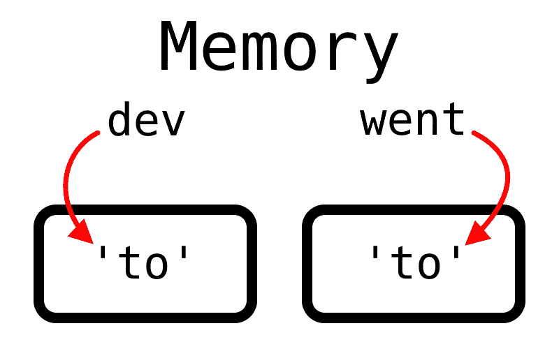
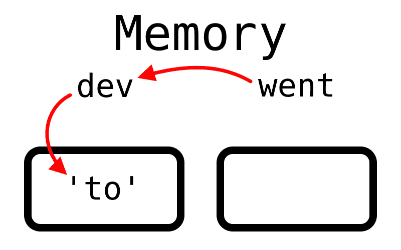

# “相同参考”与“相同值”

> 原文：<https://dev.to/somedood/same-reference-vs-same-value-5fjf>

在 JavaScript 和许多其他编程语言中，变量是对一个**值**的**引用**。根据逻辑和数学的[传递定律](https://www.britannica.com/topic/transitive-law)，引用和值是同一个东西。从表面上看，这在某种程度上是真实的。不幸的是，事情并没有引擎盖下那么简单。

# 原始和非原始数据类型

JavaScript 中的[数据类型分为*原语*和*非原语*。](https://developer.mozilla.org/en-US/docs/Web/JavaScript/Data_structures)

*   **原语**数据类型是两种分类中最简单的一种。其中包括布尔值、数字、字符串、`null`和`undefined`。如果使用[严格相等运算符(`===` )](https://developer.mozilla.org/en-US/docs/Web/JavaScript/Reference/Operators/Comparison_Operators#Identity_strict_equality_()) 比较两个原语，当且仅当这两个原语具有相同的类型并且*具有相同的值*时，结果为`true`。
*   另一方面，**非原语**数据类型由于其数据结构而增加了一层复杂性。这些包括对象、函数和数组。用严格相等操作符比较两个非原始数据类型，当且仅当这两个数据类型作为完全相同的实例存在时，才会得到`true`。换句话说，它们在内存中占据相同的位置。

**注意:** [符号](https://developer.mozilla.org/en-US/docs/Web/JavaScript/Reference/Global_Objects/Symbol)也是原始数据类型，但是对它们来说规则比较粗略。为了简单起见，我不会在本文中详细阐述它们。

# 上下文中的原始数据类型

```
// The variable dev is a reference to the value 'to'.
const dev = 'to';

// The variable going is a reference to the value 'to'.
const went = 'to'; 
```

Enter fullscreen mode Exit fullscreen mode

变量`dev`和`went`都具有相同的值。然而，`dev`和`went`不一定是同一个参照物。虽然它们都存储值`'to'`，但是它们不存储同一个`'to'`实例。它们在内存中占据两个不同的位置。`dev`在内存中存储不同的字符串，而`went`在内存中存储另一个字符串。这两个变量恰好存储具有相同值的字符串。下图说明了这一点。箭头表示每个变量引用/指向的值。

[T2】](https://res.cloudinary.com/practicaldev/image/fetch/s--FITytsG8--/c_limit%2Cf_auto%2Cfl_progressive%2Cq_auto%2Cw_880/https://thepracticaldev.s3.amazonaws.com/i/k94h9y480jtv53otq1av.png)

现在，你可能想知道如何实现两个变量具有相同的引用和相同的值。为此，我们只需将引用赋给另一个变量。

```
// The variable dev is a reference to the value 'to'.
const dev = 'to';

// The variable went is a reference to the variable dev.
// Therefore, the variable went is also a reference to the value 'to'.
const went = dev; 
```

Enter fullscreen mode Exit fullscreen mode

在这种情况下，`dev`和`went`都具有相同的值*和相同的参考值*。通过这样做，下面的图表被更新以反映在引擎盖下发生了什么变化。

[T2】](https://res.cloudinary.com/practicaldev/image/fetch/s--UDXtgxvS--/c_limit%2Cf_auto%2Cfl_progressive%2Cq_auto%2Cw_880/https://thepracticaldev.s3.amazonaws.com/i/vn8ejmk0rktmrg5bqbqc.png)

图表显示，运行代码现在占用了更少的内存，因为`dev`和`went`现在指向同一个字符串。不再需要在内存中存储同一字符串的两个单独的实例。在更大的范围内，这可以被证明在内存优化中是有用的。与前面的示例相比，内存使用量基本上减少了一半。

# 上下文中的对象和数组

指针和引用的概念被非原始数据类型进一步扩大。考虑下面的代码。

```
// The variable foo is a reference to an object.
let foo = {
  name: 'milk'
  price: 5000,
  stock: 10
};

// The variable bar is a reference to an object.
let bar = {
  name: 'milk',
  price: 5000,
  stock: 10
}; 
```

Enter fullscreen mode Exit fullscreen mode

正如我们在上一节中了解到的，两个变量可能存储相同的值，但不一定指向内存中的相同位置。我们可以通过改变它们的特性来证明这一点。

```
// Mutating the properties
foo.name = 'cereal';
bar.name = 'candy';

console.log(foo.name); // 'cereal'
console.log(bar.name); // 'candy'

// Proof that they are not the same object in memory
console.log(foo === bar); // false 
```

Enter fullscreen mode Exit fullscreen mode

现在，如果我们让两个变量指向同一个对象，会发生什么？

```
// The variable foo is a reference to an object.
let foo = {
  name: 'milk'
  price: 5000,
  stock: 10
};

// The variable bar is a reference to the variable foo.
// Therefore, the variable bar is also a reference to the same object.
let bar = foo; 
```

Enter fullscreen mode Exit fullscreen mode

事实上，这两个变量具有相同的参考值和相同的值。因此，改变一个变量的属性也会改变另一个变量的属性。

```
// Mutating the properties
bar.name = 'bread';
bar.price = 2.5;
bar.stock = 15;

// Since foo and bar refer to the same object,
// changes in the properties of one reflect on the other.
console.log(foo.name); // 'bread'
console.log(foo.price); // 2.5
console.log(foo.stock); // 15

// Proof that they are the same object in memory
console.log(foo === bar); // true 
```

Enter fullscreen mode Exit fullscreen mode

这种行为也适用于数组。我们改变的不是属性，而是数组的单个元素。

```
// Two variables with the same values
let someDogs = ['Lucky', 'Sparkles', 'Presto'];
let moreDogs = ['Lucky', 'Sparkles', 'Presto'];

// Mutating the corresponding elements
someDogs[0] = 'Fluffykins';
moreDogs[0] = 'Mittens';

console.log(someDogs[0]); // 'Fluffykins'
console.log(moreDogs[0]); // 'Mittens'

// Proof that they are not the same array in memory
console.log(someDogs === moreDogs); // false 
```

Enter fullscreen mode Exit fullscreen mode

我们现在要给`moreDogs`分配一个对`someDogs`的引用。

```
// Two variables with the same reference and the same value
let someDogs = ['Lucky', 'Sparkles', 'Presto'];
let moreDogs = someDogs;

// Mutating moreDogs
moreDogs[0] = 'Fluffykins';

// Mutations in moreDogs reflect in someDogs
console.log(someDogs[0]); // 'Fluffykins'
console.log(someDogs); // ['Fluffykins', 'Sparkles', 'Presto']

// Proof that they are the same array in memory
console.log(someDogs === moreDogs); // true 
```

Enter fullscreen mode Exit fullscreen mode

# 结论

变量仅仅是**引用**，*将*指向**值**。存储相同值的两个引用不一定意味着它们指向内存中的相同位置。

在大多数情况下，我们不必担心他们的差异。但是在绝对有必要关注性能和内存优化的情况下(比如服务器维护)，记住这些差异是值得的。例如，可以通过确保函数返回引用而不是相同值的全新实例来编写函数的实现。

“`document.getElement` API”是这种实现的一个很好的例子。让我们以 [`document.getElementById`](https://developer.mozilla.org/en-US/docs/Web/API/Document/getElementById) 法为例。给定一个唯一的`id`，该方法返回一个对具有该唯一`id`的 HTML 元素的*引用*。

```
// Example ID for HTML element
const id = 'someId';

// Passing in the same ID as an argument to both methods
const someElement1 = document.getElementById(id);
const someElement2 = document.getElementById(id);

// Testing if both variables point to the same place in memory
console.log(someElement1 === someElement2); // true 
```

Enter fullscreen mode Exit fullscreen mode

所以，如果有一天你需要*指出*他们的不同之处，就用这篇*有价值的*文章作为基本的*参考*。