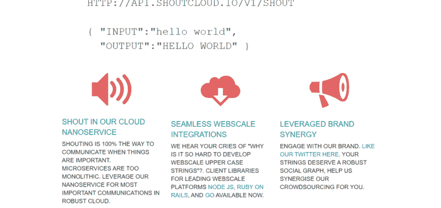

# 实际存在的讽刺性网络服务和网站😂

> 原文：<https://dev.to/codingislove/sarcastic-web-services-and-websites-that-actually-exist--4e62>

看看这个实际存在的讽刺性网络服务、网站和库的列表。这些网站是用来嘲笑不同技术的开发者的！😂

[T2】](https://res.cloudinary.com/practicaldev/image/fetch/s--aRiTh_U4--/c_limit%2Cf_auto%2Cfl_progressive%2Cq_auto%2Cw_880/https://codingislove.com/wp-content/uploads/2018/03/sarcastic-web-services.png)

### [1。滚蛋即服务(FOAAS)](https://foaas.com/)

> FOAAS(滚蛋即服务)为告诉人们滚蛋的常见问题提供了一个现代的、RESTful 的、可伸缩的解决方案。

[T2】](https://res.cloudinary.com/practicaldev/image/fetch/s--uoF0vHrP--/c_limit%2Cf_auto%2Cfl_progressive%2Cq_auto%2Cw_880/https://codingislove.com/wp-content/uploads/2018/03/61286266099466241-1024x484.png)

喜欢 API 文档人！该 API 支持 JSON、XML 和纯文本响应、过滤器以及国际支持 

这里有几个端点

| 小路 | 描述 |
| --- | --- |
| /版本 | 将返回带有当前 FOAAS 版本号的内容。 |
| /操作 | 将返回带有名称和字段的 JSON 操作列表。*注意:仅 JSON】* |
| /anyway/:company/:from | 将返回表单内容“你他妈的到底是谁，:公司，你为什么要挑起这么多麻烦，还有，谁付钱给你？”–:来自' |
| /屁眼/:从 | 将返回表单内容“去你的，混蛋。–:来自' |
| /awesome/:来自 | 将返回表单的内容‘这真他妈的太棒了。–:来自' |
| /back/:name/:from | '将返回表单内容':姓名，滚蛋。–:来自' |

他们也有路线图！😂

[T2】](https://res.cloudinary.com/practicaldev/image/fetch/s--rfdyBfao--/c_limit%2Cf_auto%2Cfl_progressive%2Cq_auto%2Cw_880/https://codingislove.com/wp-content/uploads/2018/03/foaas.jpeg)

* * *

### [2。讽刺 Javascript 库](https://github.com/komlev/sarcasm)

讽刺是简单的，包含电池的，非固执己见的，易于上手的，轻量级的，可靠的，方便的，非常简单的，用户友好的，超强的，超负荷的，超棒的 javascript 库。

[T2】](https://res.cloudinary.com/practicaldev/image/fetch/s--83_xN_Ai--/c_limit%2Cf_auto%2Cfl_progressive%2Cq_auto%2Cw_880/https://codingislove.com/wp-content/uploads/2018/03/sarcasm.png)

> 最近我对 javascript 社区中缺乏讽刺感到震惊，所以我冲向我的笔记本电脑创建了这个令人敬畏的库，供全世界见证和使用。<cite>–库的作者</cite>

#### 这是怎么回事

你需要添加这个库作为一个依赖，并调用讽刺功能，就这么简单！

#### 奖状

> 这是在年轻开发人员的教学课程中使用的最好的库，也是保持高级开发人员健康的最好工具。<cite>–埃利奥特·德雷森</cite>
> 
> 耶！终于我可以称之为基本的图书馆了！我们的社区需要更多这样的东西。爱它，爱它，爱它。<cite>–岳翎·杜楚尼</cite>
> 
> 这成就了我的人生！<cite>–Pidr Oleokka</cite>
> 
> 日积月累:“npm 我讽刺”和快乐，和平。<cite>–伯特·戈什</cite>

让我赶紧写个证明 

### [3。他妈的网站。](http://motherfuckingwebsite.com/)

[T2】](https://res.cloudinary.com/practicaldev/image/fetch/s--baeFh-f1--/c_limit%2Cf_auto%2Cfl_progressive%2Cq_auto%2Cw_880/https://codingislove.com/wp-content/uploads/2018/03/66960797023600641-1024x484.png)

这个网站是用来嘲笑那些用不必要的库、动画和过度设计来膨胀网站的前端开发者的！

看看该死的网站。可以看看刚开始用 jQuery 插件的自己！😂

* * *

### [4。香草-JS 库](http://vanilla-js.com/)

这个库是用来嘲笑开发者不必要的使用 Javascript 库和框架，以及 JS 疲劳的出现！

[T2】](https://res.cloudinary.com/practicaldev/image/fetch/s--yjsEjCLi--/c_limit%2Cf_auto%2Cfl_progressive%2Cq_auto%2Cw_880/https://codingislove.com/wp-content/uploads/2018/03/46546645667020801.png)

Vanilla-js 只不过是普通的 js，可以在所有浏览器中使用。这个网站讽刺地提到了普通 JS 的特性，以及它是多么的轻量级，只有 25 个字节(空文件)。

它还可以让你用模块化的方法下载一个空库 

### [5。呼啦云](http://shoutcloud.io/)

[T2】](https://res.cloudinary.com/practicaldev/image/fetch/s---vFdIoS3--/c_limit%2Cf_auto%2Cfl_progressive%2Cq_auto%2Cw_880/https://codingislove.com/wp-content/uploads/2018/03/5859058356322304-1024x484.png)

> 大喊的云

这是一个全大写的服务！你发送一些输入文本，API 用全部大写字母来响应！

#### 关键特性

1.  高度可扩展
2.  许多编程语言中的客户端库

FOAAS 已经与呼云进行了集成。我将在我的下一个项目中使用这个服务  

### 包装完毕

我只发现了一些服务。如果你知道任何其他讽刺的网站或网络服务，请在评论中告诉我！

真实存在的讽刺性网络服务和网站😂最早出现在[上的编码是爱情](https://codingislove.com)。