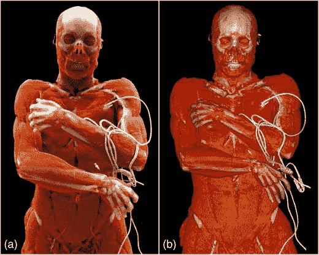

# 用 WebGL 拯救生命

> 原文：<https://dev.to/nicolasrannou/save-lives-with-webgl-4ka0>

*图片由 Evelyn DappaKai higashigaitojürgen for naro sebastian LeschkaSimon wildermuthatem Alkadhi 提供[1] -电影渲染-3D 计算机断层成像的体积渲染替代方案

我在寻找 WebGL / OpenGL /热情的人谁可以帮助我在 WebGL 实现电影体渲染。

这个项目旨在提供真实的生活，如医疗数据的可视化。

 
【左电影渲染/右体渲染-图片来自[1]】

我已经实现了一些经典的体绘制，我想让它更上一层楼。然而，我认为我的体绘制实现已经有点笨拙，所以电影渲染可能是一个太大的挑战。

目前在

任何方向，帮助，建议将是真棒！

参考文献:

[1] -电影渲染-3D 计算机断层成像体绘制的替代方法-[https://link.springer.com/article/10.1007/s13244-016-0518-1](https://link.springer.com/article/10.1007/s13244-016-0518-1)