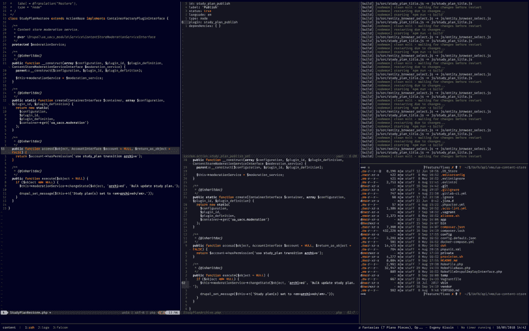

# 通过预设的 Tmux 设置节省时间

> 原文：<https://dev.to/fenetikm/saving-time-with-a-preset-tmux-setup-3j04>

编程就是做同样的事情...*一遍又一遍，令人作呕*。不，不是电脑，是可怜的程序员，他们在相似的项目中使用不同的工具。

例如，让我们以 Drupal 开发为例——通常一旦您处于开发过程中，您可能会访问:

*   一个编辑(Vim，*自然是*)
*   运行系统命令的终端，如`drush cr`、`drush cedit`、`drupal generate:module`等。
*   也许是待办事项清单/笔记
*   日志输出
*   观察输出，例如`npm run watch`
*   测试输出，例如`phpunit`、`codeception`等。
*   文件操作，例如`ranger`
*   参考材料
*   等等。

最终可能看起来有点像这样:

[T2】](https://res.cloudinary.com/practicaldev/image/fetch/s--iwcYs_rV--/c_limit%2Cf_auto%2Cfl_progressive%2Cq_auto%2Cw_880/https://thepracticaldev.s3.amazonaws.com/i/rz9x4gcowdk3vj1nlc3i.png)

注意左下角的 Tmux 状态，它显示我在三个窗口中的第一个。

由于这是典型的，如果，我不知道，你可以运行一个命令，如`tmd <name of session>`，它会设置好一切*，就像*。此外，随着时间的推移，我们可以完善这个设置，并获得完善它的所有好处——或者根据项目的类型拥有多个脚本。

## 脚本

没问题，看看这个脚本`drupal.sh` :

```
#!/bin/zsh

# Note that this assumes base index of 1

# check for existence of required things
# $1 is the name of the window
# we are in the directory of the drupal project

if [ $# -eq 0 ]
  then echo "No arguments supplied, requires name of window."
    exit 1
fi CWD=$(pwd)
SESSION_NAME="$1"

# detach from a tmux session if in one
tmux detach > /dev/null

# Create a new session, -d means detached itself
set -- $(stty size) # $1 = rows $2 = columns
tmux new-session -d -s $SESSION_NAME -x "$2" -y "$(($1 - 1))"

tmux new-window -t $SESSION_NAME:1 -n 'code'
tmux new-window -t $SESSION_NAME:2 -n 'logs'
tmux new-window -t $SESSION_NAME:3 -n 'zsh'

## Logs window
tmux select-window -t $SESSION_NAME:2

# Start up the logs listener
tmux send-keys "vbin/tail -f /var/log/apache2/error.log | clog drupal" C-m

## Zsh window
tmux select-window -t $SESSION_NAME:3
tmux rename-window 'Zsh'

## Main Window
tmux select-window -t $SESSION_NAME:1
tmux rename-window 'code'

# Split into left and right
tmux split-window -h -p30

# Right ready for taking commands / tests.
tmux select-pane -t 2
tmux send-keys "figlet -f roman Ready! | lolcat -t" C-m

# Left for neovim.
tmux select-pane -t 1
tmux send-keys "v" C-m

# Finally attach to it
tmux attach -t $SESSION_NAME 
```

Enter fullscreen mode Exit fullscreen mode

## 工作原理

该过程可细分如下:

*   创建新会话
*   创建窗口
*   创建窗格
*   向窗格/窗口发送命令

### 创建新会话

创建新会话就像`tmux new-session -s <name-of-session>`一样简单。在示例脚本中，我还做了更多:

```
# Create a new session, -d means detached itself
set -- $(stty size) # $1 = rows $2 = columns
tmux new-session -d -s $SESSION_NAME -x "$2" -y "$(($1 - 1))" 
```

Enter fullscreen mode Exit fullscreen mode

我在这里做的是获取当前的屏幕分辨率，然后创建一个该大小的分离会话——原因是如果你不使用`-x`参数指定大小，那么如果你试图指定窗口分割大小，它将*消失*,因为它没有“大小”的参考点。

### 创建窗口

创建窗口可以通过`tmux new-window -n <name-of-window>`完成。在这个例子中，我们有:

```
tmux new-window -t $SESSION_NAME:1 -n 'code'
tmux new-window -t $SESSION_NAME:2 -n 'logs'
tmux new-window -t $SESSION_NAME:3 -n 'zsh' 
```

Enter fullscreen mode Exit fullscreen mode

这里我们创建了三个窗口——`-t`标志是为了让我们可以指定窗口的目标，在本例中是我们刚刚创建的会话以及它们应该出现的索引。

然后我们可以用`tmux select-window -t <name-of-session>:<index>`来定位窗口，以获得更多的命令。

### 创建窗格

通常，您会希望将一个窗口分割成多个窗格。这可以用类似于`tmux split-window -h -p<percentage>`的东西来完成，其中`-h`表示水平分割(猜猜垂直分割是如何指定的？)和`-p`表示百分比分割。在这个例子中，我创建了一个 30%的分割，但你当然可以指定像素，如果这是你的果酱。

一旦你创建了一个或多个分割，你可以用`tmux select-pane -t <index-of-pane>`来定位更多的命令。

### 向窗格/窗口发送命令

最后，一旦我们准备好了窗口和窗格，我们就可以向它们发送进一步的命令来启动。以上是一些例子:

*   `tmux send-keys "vbin/tail -f /var/log/apache2/error.log | clog drupal" C-m`

(在监视模式下对 apache 错误日志运行`tail`命令，通过管道传输到[阻塞](https://taskwarrior.org/docs/clog/what.html)—`C-m`用于向窗格或窗口发送`<Enter>`)

*   `tmux send-keys "figlet -f roman Ready! | lolcat -t" C-m`

(运行`figlet`，字符串为“准备好！”在真彩色模式下通过管道传输到 lolcat)

## 整理完毕

完成脚本后，我们调用了`tmux attach -t <name-of-session>`使其可见。在脚本中，会话的名称作为参数传入。为了更加方便，我在我的`.zshrc`中使用了下面的别名来运行这个脚本:

```
alias tmd='~/.config/tmux/drupal.sh' 
```

Enter fullscreen mode Exit fullscreen mode

显然，你*不需要*连接到 Tmux 会话——如果你有需要，你的脚本可以启动各种进程，然后你可以只连接检查它，同时做其他事情(或者不！).Tmux 也支持多人连接到一个会话，发送命令到特定的会话，保存会话(通过插件)等。可能性*超过*。

* * *

*本文原载于[michaelwelford . blog](https://michaelwelford.blog/post/creating-preset-tmux-setup)T3】*