# 向你自己的亚马逊 Lex 聊天机器人问好

> 原文：<https://dev.to/samwsoftware/say-hello-to-your-own-amazon-lex-chat-bot-1n63>

#### 用亚马逊 Lex 打造自己的聊天机器人，教它说任何你想说的话。

本教程将指导您完成制作聊天机器人的整个过程。我们将从设置一些简单的响应开始，然后使用 AWS Lambda 进行更复杂的响应。

### 设置

因为所有这些都是建立在亚马逊网络服务上的，所以你需要有一个账户。如果你没有，你可以在这里设置一个[，点击**创建一个 AWS 账户**。](https://aws.amazon.com/)

一旦你有你的帐户设置，我们可以设置机器人。搜索 *Lex* 或在服务下拉列表中找到它。

[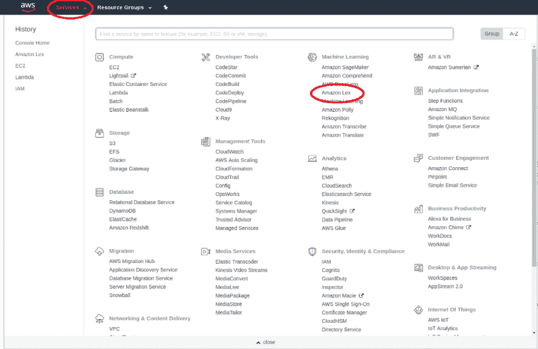](https://res.cloudinary.com/practicaldev/image/fetch/s--v5khWRTt--/c_limit%2Cf_auto%2Cfl_progressive%2Cq_auto%2Cw_880/https://cdn-images-1.medium.com/max/1024/1%2AGrZ1JfkXxInFf10AKXkSvA.png)

<figcaption>AWS 服务列表</figcaption>

一旦进入 Lex 页面，点击 ***开始*** 进入 bot 设置页面。这里是使用三个样本机器人之一或者创建一个*定制机器人的选项。*我们将创建一个完全自定义的机器人，因此请选择该选项。

现在你可以给你的机器人命名并选择一个输出声音。如果你想给你的机器人做一个语音聊天版本，这个声音将会被使用。我们还将默认设置会话超时为 5 分钟，并为 COPPA 选择**否**(除非您打算包含非 PG 回复！).

完成所有设置后，您可以点击**创建**。你将被带到一个像这样的新仪表板，我会在我们进行的过程中解释每件事的含义。

[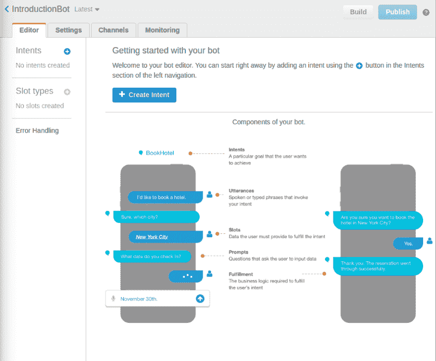T2】](https://res.cloudinary.com/practicaldev/image/fetch/s--HHbmItUh--/c_limit%2Cf_auto%2Cfl_progressive%2Cq_auto%2Cw_880/https://cdn-images-1.medium.com/max/915/1%2AbytzXWvlXP6iZPzryN82Lg.png)

### 意图

聊天机器人是它对特定消息的一组响应。这些存储在*意图*中，就像谈话要点一样。

#### 给你的机器人命名

我们将保持我们的第一个意图简单，如果有人问我们的机器人叫什么，我们将回答一个名字。

点击 ***创建意图*** 或点击左侧意图旁边的 **+** 创建一个新意图。将弹出一个菜单，我们想再次选择 ***创建意图*** 。我们必须给意图命名，所以把它叫做类似 ***的东西。*T13】**

这将我们带到目的屏幕。现在重要的部分是*样本话语*和*回应。*其余的设置我们将在后面介绍。

[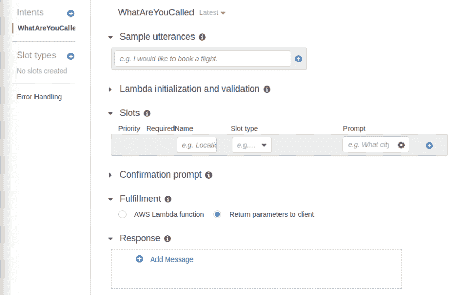T2】](https://res.cloudinary.com/practicaldev/image/fetch/s--x2F4rKBE--/c_limit%2Cf_auto%2Cfl_progressive%2Cq_auto%2Cw_880/https://cdn-images-1.medium.com/max/903/1%2AWZ1wjkHeDo-5ne6p8U5jXA.png)

#### 示例话语

话语是你想要这个意图回复的短语。对我们来说，这些是像“你叫什么名字”和“你叫什么名字”这样的短语。将每个短语添加到样本话语中；还加了“你喜欢别人叫你什么”和“我该怎么称呼你”。

[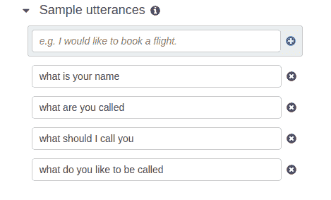T2】](https://res.cloudinary.com/practicaldev/image/fetch/s--DawCiqqk--/c_limit%2Cf_auto%2Cfl_progressive%2Cq_auto%2Cw_880/https://cdn-images-1.medium.com/max/469/1%2AWg-tdra9fS_Xu1OZ6Rr4rA.png)

Amazon Lex 的聪明之处在于它使用自然语言理解(NLU)来理解用户想要表达的意思。如果他们说“你叫什么名字”而不是“你叫什么名字”，Lex 仍然会匹配这些短语。相当聪明！

#### 响应

不，我们需要回复这条消息。点击响应框中的 ***添加消息*** 按钮。这将创建一个新的消息框供我们填写。

[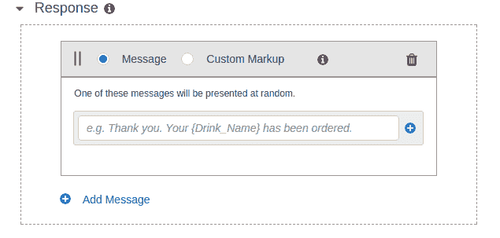T2】](https://res.cloudinary.com/practicaldev/image/fetch/s--yesC7_0F--/c_limit%2Cf_auto%2Cfl_progressive%2Cq_auto%2Cw_880/https://cdn-images-1.medium.com/max/635/1%2AC6BMDFckK9qbV3E5Yb-lLA.png)

在这里你可以输入任何你想回复的内容。你可以输入多个答案，这样用户可以得到不同的、更自然的回答。

现在点击页面底部的 ***保存意图*** ，你已经创建了你的第一个意图。

### 构建和测试机器人

为了让你的新聊天机器人工作，我们首先需要建立它。这使得 Lex 可以将你的话语样本放在一起。点击页面右上角的*构建*按钮，完成构建可能需要一分钟左右的时间，请耐心等待。

完成后，你会在右边得到一个新的区域，叫做*测试机器人(最新)*。在这里你可以试着和你的机器人聊天并测试它。试着问问你的新机器人它的名字。

[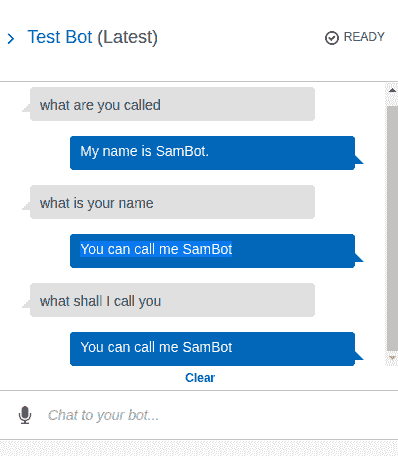T2】](https://res.cloudinary.com/practicaldev/image/fetch/s--Wai4eTYK--/c_limit%2Cf_auto%2Cfl_progressive%2Cq_auto%2Cw_880/https://cdn-images-1.medium.com/max/398/1%2Ahyhj5biPiXiBBXuKqrhwiQ.png)

### 添加更多意图

能够告诉你它的名字很酷，但我们希望它能做得更多。你可以为很多事情添加意图，只需用不同的话语和回应重复你所做的过程。

如果用户说嗨或你好，你的机器人会说什么。我们稍后将对此进行扩展，因此请确保您能让它正常工作！

你也可以试着让你的机器人回答这些问题:

谁创造了你？

你最喜欢什么颜色？

做机器人是什么感觉？

你还能想到什么问题让你的机器人回答？

#### 快速提示

当你在创造你的话语时，用小写字母输入，不要用标点符号。NLU 程序去掉了标点符号和大写字母，所以使用它们可以打破系统。

### 提高招呼意向

让你的机器人回复“你好”或“你好，T2”是非常酷的，但这不算是一个对话。我们要改变这种状况。

#### 新增你好意向

这是新意图的设计

顾客—嗨

机器人—嗨，你叫什么名字？

顾客——我叫戴夫

机器人——你好，戴夫，很高兴见到你。今天有什么我能帮你的吗？

#### 插槽

在 Lex 中，变量存储在*槽中。*这些包含属性名称、插槽类型和提示。

有几种不同的方法来创建新的插槽，我将通过它们进行讨论。

第一种方法是最期待的方法。在*插槽*部分，输入变量的名称，选择插槽类型并编写提示。在这个例子中，我调用我的变量*名*选择*亚马逊。GB_FIRST_NAME* 说*嗨，你叫什么名字？*如提示。

[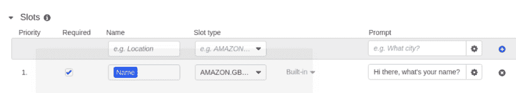T2】](https://res.cloudinary.com/practicaldev/image/fetch/s--NOpajr4J--/c_limit%2Cf_auto%2Cfl_progressive%2Cq_auto%2Cw_880/https://cdn-images-1.medium.com/max/1024/1%2A3K9mmmFMGNqkqc4kqRS26g.png)

如果勾选了*必填*框，并且 intent 不知道变量值，则发送提示。点击设置按钮打开一个新的菜单，你可以设置多个提示信息并列出一些回复。

用户可以只回答问题的答案，但是如果他们说*我的名字是大卫*呢？Lex 需要知道回复的哪一部分是变量，哪一部分只是填充词。您可以用花括号将变量括起来。

[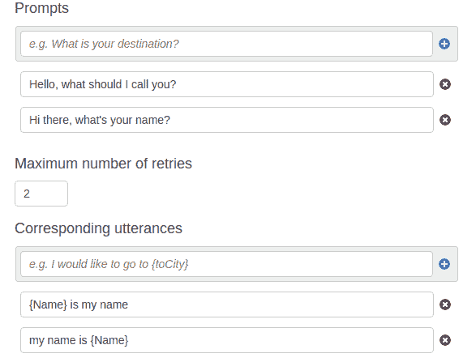T2】](https://res.cloudinary.com/practicaldev/image/fetch/s--PFvufZ8_--/c_limit%2Cf_auto%2Cfl_progressive%2Cq_auto%2Cw_880/https://cdn-images-1.medium.com/max/587/1%2Aj9Ig6l7QiE9aDfParU0hkg.png)

最后一点是改变最后的回应。您可以使用与提示语句中相同的{variableName}语法在最终消息中包含任何变量。

[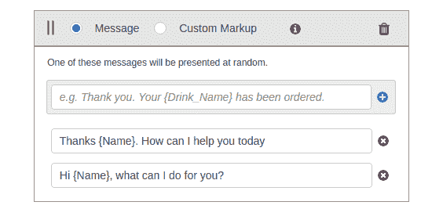T2】](https://res.cloudinary.com/practicaldev/image/fetch/s--LfM2J1hr--/c_limit%2Cf_auto%2Cfl_progressive%2Cq_auto%2Cw_880/https://cdn-images-1.medium.com/max/564/1%2ALO3KHaJqaaVOyHWwMbN1kQ.png)

所有这些都更新了，是时候重新构建并尝试一下了！

[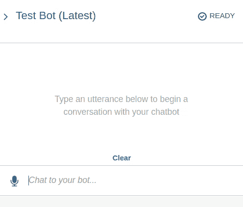T2】](https://res.cloudinary.com/practicaldev/image/fetch/s--ubbxhXXq--/c_limit%2Cf_auto%2Cfl_progressive%2Cq_66%2Cw_880/https://cdn-images-1.medium.com/max/496/1%2A6YXcz3DooqcYzTXeosnsNg.gif)

### 其他方式来填充插槽

到目前为止，用户说出一个短语，让机器人回复一个槽值的提示。这很好，但还有另一种方法。如果用户说“*你好，我是克莱尔”*会怎么样？

[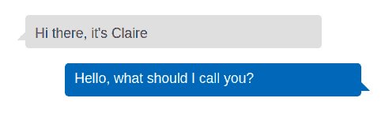T2】](https://res.cloudinary.com/practicaldev/image/fetch/s--xobwFM8D--/c_limit%2Cf_auto%2Cfl_progressive%2Cq_auto%2Cw_880/https://cdn-images-1.medium.com/max/487/1%2AbMDo2ioK0MuGMqycsM6WQw.png)

这是不对的。他们告诉你他们的名字，然后你问他们的名字。幸运的是，我们可以解决这个问题。

我们可以添加包括槽名的新话语。这与编写提示话语，包括话语中的{SlotName}是一样的。

[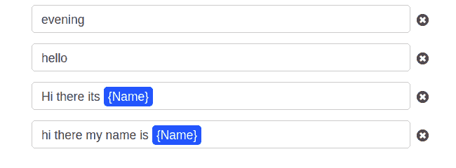T2】](https://res.cloudinary.com/practicaldev/image/fetch/s--Y0QYoJIp--/c_limit%2Cf_auto%2Cfl_progressive%2Cq_auto%2Cw_880/https://cdn-images-1.medium.com/max/650/1%2AGcooD5h4Qv-N5Yo3lUgktA.png)

这就用第一条消息中他们的名字填充了这个槽。该槽被填满，所以提示永远不会被触发，最后的消息被发送。

[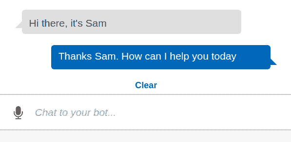T2】](https://res.cloudinary.com/practicaldev/image/fetch/s--hfrx7drf--/c_limit%2Cf_auto%2Cfl_progressive%2Cq_auto%2Cw_880/https://cdn-images-1.medium.com/max/597/1%2AG4FXISqnYwEpSentmhc-dg.png)

### 书写自己的意图

利用你目前所学的知识，你可以创造出与你的用户进行非常独特的对话的意图。您可以使用多个槽来创建非常定制的消息。

试着创造一个这样的意图:

[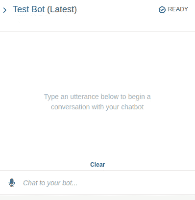T2】](https://res.cloudinary.com/practicaldev/image/fetch/s--PfjkVOiE--/c_limit%2Cf_auto%2Cfl_progressive%2Cq_66%2Cw_880/https://cdn-images-1.medium.com/max/398/1%2Aj2Lb-EfPzLDC2waiHtDFbg.gif)

感谢你阅读本教程，希望你喜欢。如果你有，那么请作出反应，跟随我获取更多的机器人教程和 JavaScript 内容。

你也可以在这里看看我最受欢迎的文章[！](https://medium.com/free-code-camp/@samwsoftware)

* * *