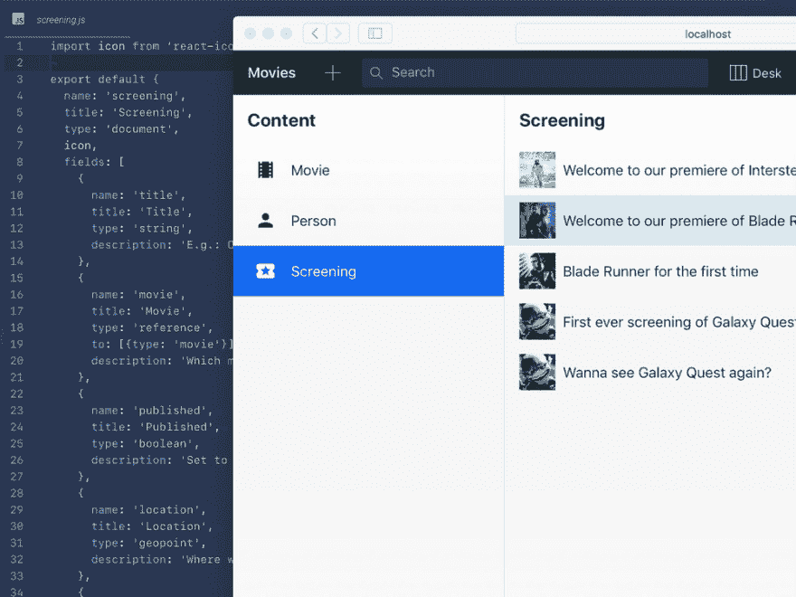

# 打招呼👋到新的令人愉快的理智工作室

> 原文：<https://dev.to/sanity-io/say-hi--to-the-new-delightful-sanity-studio-7ec>

自从我们公开发布 Sanity 以来已经一年了。从那时起，我们一直忙于不断开发和改进——从后端改进，如 GROQ 中的[算法，到 Sanity Studio 中的新功能，如](https://www.sanity.io/docs/groq-operators)[结构生成器](https://www.sanity.io/docs/structure-builder)，它为开发人员提供了在 CMS 中组织内容的无与伦比的灵活性。在这个过程中，我们有时被迫偷工减料——其中包括视觉技巧。现在是时候解决这个问题了。

我们很高兴发布一个完整的工作室设计修订版。我们小心翼翼地不破坏现有的工作流程，同时为未来打下更好的基础。这个新的工作室是为了适应新特性的出现，并更好地适应即将到来的插件、工具和扩展。它仍然内置在 React 中，它仍然有一个实时的用户界面，它仍然是开源的，仍然可以作为一个静态捆绑包进行部署，可以在任何可以提供文件的地方托管。有了这个版本，我们非常有信心为开发者和内容编辑者提供世界上最好的内容管理系统。

```
 npm i -g @sanity/cli && sanity upgrade 
```

## 新设计师入职

我们感到非常荣幸有[Marius Lund grd](https://twitter.com/mariuslundgard)作为产品设计师加入我们的团队。事实证明，对他进行目视检查是一个很好的方法。Marius 在挪威广播公司(NRK)担任产品/编辑设计师后加入了我们，他在 React 中设计了 long read 纪录片 experiences，并开发了挪威最受欢迎的应用程序之一:天气应用程序 [Yr](https://www.yr.no/) 。他在 Rietveld 学习平面设计，在美国和荷兰工作过，之前曾和我们的朋友在 [NODE Oslo/Berlin](http://nodeberlin.com/) 工作过。他目前和女友安娜住在奥斯陆。

*马吕斯·伦德花园*

## 提升用户体验

开发者体验(DX)是理智的生命线。我们已经花了很多心思来思考如何才能做出一款让开发者喜欢使用的产品——不管他们是谁。这就是为什么你用简单的 JavaScript 来配置它，在方便性和定制性之间找到了中间点。它可以对内容模型进行版本控制，轻松地在 CI 工作流中包含多个工作室，或者只是为周末项目制作一个快速的一次性 CMS。

[](https://res.cloudinary.com/practicaldev/image/fetch/s--FweakCUt--/c_limit%2Cf_auto%2Cfl_progressive%2Cq_auto%2Cw_880/https://cdn.sanity.img/3do82whm/production/0f1838a6f4abc541d8de0b7745602b3bf273db77-3200x2400.png%3Fw%3D1000) 
*对于开发者和编辑来说都很熟悉和简单。*

用户体验(UX)当然是一个更广泛的连续统一体，这个版本被高度激励以更好地满足作者和编辑的目标。我们希望让人们能够真正轻松地建立内容管理和编辑——体验高效、友好和……愉快。

## 可以在所有屏幕尺寸上使用的 CMS

内容管理系统几乎都是专为台式机构建的。但是我们发现自己经常在移动设备上编辑内容，所以我们不仅要适应这种环境，还要确保你可以在手持设备上使用 Sanity。

[](https://res.cloudinary.com/practicaldev/image/fetch/s--zMgwrDTP--/c_limit%2Cf_auto%2Cfl_progressive%2Cq_auto%2Cw_880/https://cdn.sanity.img/3do82whm/production/90efa44168fb53b70724d70f2ba203003399b00f-3200x1684.png%3Fw%3D2000%26h%3D2000%26fit%3Dmax) 
*编辑手持设备上的内容*

发布按钮被移到了屏幕的底部，现在它是屏幕上唯一的主按钮。

## 全球导航即比例尺

我们已经将全球导航从左侧栏移出，并将其与屏幕顶部的搜索合并在一起。这是一种常见的模式，我们希望通过仅使用一个轴来简化事情。

[T2】](https://res.cloudinary.com/practicaldev/image/fetch/s--9cO9C6eI--/c_limit%2Cf_auto%2Cfl_progressive%2Cq_auto%2Cw_880/https://cdn.sanity.img/3do82whm/production/326cea358c0eb8212930c6315f849208f3c2c1aa-3200x1686.png%3Fw%3D1000)

新的导航栏集工具和搜索于一体。它占用更少的屏幕空间，并且响应速度很快。在小屏幕上，工具和其他启示可以很容易地在侧边抽屉中访问，除了我们已经确定的首要任务:文档创建和搜索。

## 更少的代码，更多的性能

我们一直有一个目标，让工作室运行更顺畅、更快捷。它应该能够在保持实时性的同时托管数百万份文件，因此几乎没有泄露和黑客攻击的空间。这就是为什么我们对在这个版本中删除了大量代码感到满意。

## 人人内容管理

我们希望工作室可以被所有人使用。仍有工作要做，但作为一个重要的开始，我们已经引入了一个新的调色板作为默认主题，至少遵循 [AA WCAG 规范](https://www.w3.org/WAI/WCAG21/quickref/#contrast-minimum)进行对比。您会注意到所选项目和填充的按钮有了新的颜色。通过覆盖默认颜色，可以轻松实现更高的对比度。我们已经为键盘用户做了改进(更多即将推出)。

[](https://res.cloudinary.com/practicaldev/image/fetch/s--vHZoLtZw--/c_limit%2Cf_auto%2Cfl_progressive%2Cq_auto%2Cw_880/https://cdn.sanity.img/3do82whm/production/725b0e2606368880a088e1ff01408821f5654919-2454x837.png%3Fw%3D2000%26h%3D2000%26fit%3Dmax) 
*改进的色彩系统，具有可及的对比度*

## 细节决定成败

[](https://res.cloudinary.com/practicaldev/image/fetch/s--c9OBB241--/c_limit%2Cf_auto%2Cfl_progressive%2Cq_auto%2Cw_880/https://cdn.sanity.img/3do82whm/production/862ad9d80d72ecda9386c4828da859e7ce6da05f-1374x882.png%3Fw%3D1000) 内部设计的新定制图标集

我们已经修复了一堆小的视觉不一致和错误。我们现在使用系统字体，已经开始创建我们自己的图标集，并开始创建一个紧密的、视觉上有凝聚力的设计系统。我们已经删除了默认的理智标志(你应该添加自己的`sanity init plugin`，选择**工作室标志**)。那些特别好奇的人可以[探索 GitHub](https://github.com/sanity-io/sanity/pull/1049) 上的提交，因为 Sanity Studio 是开源的。

## 令人兴奋的一年即将到来

对于理智来说，这是有趣又有趣的一年。我们永远感谢所有决定试用我们、回复我们的电子邮件和问题、在我们的 [Slack 社区](https://slack.sanity.io)闲逛、在会议上遇见我们、向朋友、同事和社交媒体推荐我们的人。我们迫不及待地想与您分享更强大的功能、激动人心的使用案例和令人愉快的升级！

[T2】](https://res.cloudinary.com/practicaldev/image/fetch/s--c6bdmdHH--/c_limit%2Cf_auto%2Cfl_progressive%2Cq_auto%2Cw_880/https://cdn.sanity.img/3do82whm/production/c5ad67a813fbd37509f1d8742b27dabb3923d366-4240x2832.jpg%3Fw%3D2000%26h%3D2000%26fit%3Dmax)