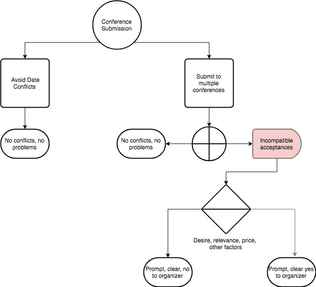

# 说不，或者如果这不是那

> 原文：<https://dev.to/wiredferret/saying-no-or-if-this-then-not-that-2ak2>

今天，我不得不拒绝一个我很想在上面发言的会议。今年，我不得不拒绝几个会议演讲邀请，因为事实证明，时间、空间和时区只能在一定程度上被操纵。

我考虑过不写这方面的博客，因为这是特权问题——“我的钻石拖鞋不合脚”。但这仍然是个问题，而且我不是唯一遇到的人。我与一些会议组织者和其他演讲者交谈过，我试图整理出一套处理这种情况最不尴尬的指导方针。

下面是该过程的快速流程图:

[T2】](https://res.cloudinary.com/practicaldev/image/fetch/s--BmbcPw0J--/c_limit%2Cf_auto%2Cfl_progressive%2Cq_auto%2Cw_880/http://www.heidiwaterhouse.com/wp-content/uploads/2018/08/Conference_no.jpg)

把它分解成指导方针，它是这样的:

1.  如果你不能忍受告诉组织者你不能演讲的想法，就不要申请重叠的或者有非常紧的启示的会议。
2.  如果你确实申请了重叠会议，你可能最终不会有问题，因为没有人被每个会议接受。没有人。所以你很有可能会没事。
3.  如果你有矛盾，你有责任去解决它，并尽可能快地告诉人们你的反应。每个人都有一套不同的评估标准，但它们可能包括参加的价格、曝光价值、谁先问的、你更愿意参加哪个等等。你可以向组织者提问来帮助澄清这一点，但是把他们晾在一边或者试图开始某种奇怪的竞标战是不好的。这就是演讲者的困境。
4.  您*必须*尽可能迅速地接受或拒绝会议发言邀请。组织者正在摆弄燃烧的电锯，试图制定一个平衡的时间表，他们只需要知道。

可能对你有帮助的事情:

*   组织者总是有一个刚好错过截止时间的发言者名单。
*   如果你能早点拒绝，那当然很好，但是有时候会发生一些糟糕的事情，比如说，你的肩膀脱臼了，或者被困在暴风雪中了。尽快给组织者打电话，给他们尽可能多的时间。
*   如果你能在宣布演讲者之前就把这些都解决了，那就好得多了，但有时你做不到。越快越好。
*   如果你必须拒绝，那就向组织者道歉。他们职业上失望，你可以职业上后悔。
*   如果你和我一样，是一个口袋里总有一份可以随时提供的演讲稿的人，那么告诉组织者这一点是很好的。不要讨厌它，但是我已经为最后一分钟的问题结束了几次填补。

* * *

这一整套行动的前提是你信任会议组织者，并希望在会议上发言。正如 Coraline 在关于 OSCON 的文章中所描述的，如果会议本身就是问题的话，那就有一系列不同的、更复杂的问题。我仍在努力解决这个问题，Worldcon 2018 尝试的愚蠢的编程动作然后又走了回来。