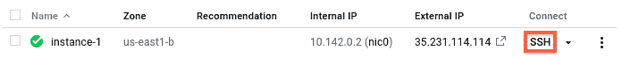

# 缩小谷歌计算引擎的周期性任务。

> 原文：<https://dev.to/drbearhands/scaling-down-periodic-tasks-on-google-compute-engine-4jh2>

在本教程中，我将解释如何在谷歌云平台上运行任何周期性或事件驱动的任务，而不必在任务不运行时支付资源。正如标题所言，我已经决定使用计算引擎。本教程也可以作为计算引擎和谷歌云平台的一般介绍。

### 动机(可选)

我正在建立一个网站( [jobsort](https://jobsort.eu) )，它从一堆招聘栏中抓取软件工程职位空缺，并使用人工智能从这些空缺中提取符号信息。虽然 web 服务器需要始终在线，但 scraper 和 AI 系统只是定期使用。出于经济和道德方面的考虑，我想避免浪费，所以我想在不使用这项服务时将它缩减到 0。

我发现当一个任务没有运行时减少资源比我想象的要困难和费时，所以我决定写这篇教程来分享我的发现。

### 可用工具(可选)

在深入细节之前，我想列出谷歌云平台上可用的相关工具。如果你熟悉 GCP，你可以跳过这一节。

*   [App Engine Standard](https://cloud.google.com/appengine/docs/standard/) :一个轻量级运行时，让你的规模急剧扩大和缩小。它甚至可以缩小到 0，在收到请求时重新启动你的应用程序。App Engine Standard 本身对我的需求限制太多(没有本地库，内存使用率高被错误地认为是内存泄漏，受限的编程语言支持...)
*   [App Engine Flexible](https://cloud.google.com/appengine/docs/flexible/) :本质上是在永久运行单个容器的基础上生活质量的一些改善。遗憾的是，它不能缩减到超过 1 个实例。
*   Kubernetes :运行容器。Kubernetes 可以自动伸缩，但至少需要一个活动节点来运行自动缩放器。也就是说，如果你已经在使用 Kubernetes 并支付了一个活动节点的价格，带自动伸缩功能的 Kubernetes*应该*对你来说很好。
*   [计算引擎](https://cloud.google.com/compute/):运行虚拟机。Compute Engine 本身无法真正扩展，但它有一个不错的 API，允许您直接控制实例。
*   [云功能](https://cloud.google.com/functions/):让你运行特定的功能，而不是整个网络服务器。云函数对我的需求来说太有限了，我希望对其他人来说也是如此。

此外，我们可以创建按计划调用 URL 的 Cron 作业。要使用它们，我们需要一个应用程序，它可以侦听 http 流量，同时规模缩小到 0(某种程度上，我们只是让谷歌为我们处理)。

我将假设您希望运行的任务不是微不足道的，并且需要比 App Engine 标准或云功能本身所能提供的更多一些。如果没有，就选一个吧。

### 概述

为了避开前面提到的限制，我们将创建一个系统来完成以下任务:

1.  使用 Cron 作业调用 App Engine Standard 上的*任务启动器*。你也可以使用一些其他的启动触发器，但这不会在本教程中讨论。
2.  让*任务启动器*在计算引擎中启动一个新的虚拟机实例
3.  在启动时，VM 实例将执行所需的任务，然后关闭自己

这就是它的简短部分，在接下来的部分中，我将详细介绍您可能遇到的一些问题的解决方案。

我将链接到谷歌自己的文档，以便进一步参考，以防这些信息在我没有意识到的情况下变得过时。

### 第一步:创建虚拟机实例

首先，我们将[创建运行我们任务的虚拟机实例](https://cloud.google.com/compute/docs/quickstarts)。

假设您已经选择了正确的项目，启用了计费并启用了计算引擎 API(如果不是这样，请参见[快速入门](https://cloud.google.com/compute/docs/quickstarts)，转到[虚拟机实例页面](https://console.cloud.google.com/compute/instances)并创建一个新实例。

根据您的情况选择合适的名称、地区、区域、机器类型和启动盘。在本教程中，我将使用 Linux VM (Debian GNU/Linux 9)。你可以选择任何你想要的操作系统，但是本教程的某些部分是特定于操作系统的，你必须根据你选择的操作系统来调整它们。在本教程中，如果您的任务不需要传入的 http(s)流量，您就不需要它。

### 第二步:设置您的虚拟机

Google 的 quickstart 现在建议 SSH-ing 进入虚拟机。然而，在你这么做之前，有一个警告你应该知道，在这个 [stackoverflow 问题](https://stackoverflow.com/questions/26775492/gcloud-compute-copy-files-instance-destination)中有详细说明。本质上，通过 GCP 控制台连接将创建一个使用您的 GCP 帐户名称的用户，而通过您机器的终端连接(例如使用`gcloud compute ssh`)将使用您机器的用户名。这是有意义的，因为每个进程都使用它可以获得的任何信息，但是没有意识到这是如何工作的会导致以后令人困惑的错误。

[T2】](https://res.cloudinary.com/practicaldev/image/fetch/s--RaaLg7k_--/c_limit%2Cf_auto%2Cfl_progressive%2Cq_auto%2Cw_880/https://cloud.google.com/doimg/establish-ssh-connection-1.png)

也就是说，在本教程中，我们还是要在 GCP 控制台上点击漂亮闪亮的 SSH 按钮。在弹出的窗口中，您可以像在终端上一样发出命令，右上角的图标允许您将文件/目录上传到您的主目录。要了解更多选项，请参见关于文件传输到虚拟机的页面和文档[`gcloud compute ssh`](https://cloud.google.com/sdk/gcloud/reference/compute/ssh)。

现在，您应该设置您的系统，以便它可以运行您需要的任务。在 ssh-ed 到您的虚拟机时进行一次测试运行，以确保一切正常。

### 第三步:开机关机

既然你的 VM 实例已经设置好了，现在是时候创建启动脚本[了](https://cloud.google.com/compute/docs/startupscript)，它将在启动时执行你的任务。从控制台的实例列表中单击您的实例，然后单击顶部附近的`EDIT`。在**自定义元数据**部分下，添加一个名为*启动脚本*的**键**(无引号)。在**值**文本区域中，编写一个将运行您的任务的脚本。对于 Debian，您的启动脚本可能看起来像这样:

```
#! /bin/bash
sudo su <USERNAME> <<EOF set -e
cd ~/<PROJECT DIRECTORY>
./<RUN_TASK.sh> EOF sudo shutdown now -h 
```

当然，`<>`中的所有大写名称都被替换为项目的详细信息。

启动脚本将以 root 用户身份执行，而不是以您通过 ssh 登录到虚拟机的用户身份执行。因此，我们使用`sudo su <USERNAME> <<EOF ... EOF`作为另一个用户执行脚本。关于那个特定命令的更多信息，请看这个[栈溢出问题](https://superuser.com/questions/468161/howto-switch-chage-user-id-witin-a-bash-script-to-execute-commands-in-the-same/468163#468163)。

任务完成后，`sudo shutdown now -h`线将关闭机器。

如果您以前选择了不同的操作系统，您可能需要使用不同的命令来关闭实例，列出它们超出了本教程的范围。

### 第四步:按计划启动任务

虚拟机现在将执行任务，并在任务启动时自动关闭。我们现在将使用 App Engine Standard 来启动基于 Cron 作业 http 请求的 VM。

App Engine 标准应用程序只需复制 2 个文件，替换名称和消息，使其更适合您的项目。您可以随意更改文件名，只要它们位于同一个目录中。请注意，在同一个目录中不应该有其他文件，或者您应该使用一个 [`.cloudignore`文件](https://cloud.google.com/sdk/gcloud/reference/topic/gcloudignore)。否则你可能会不小心上传你不想上传的东西。

文件`runner.go`的代码如下:

```
package main

import (
  "fmt"
  "net/http"
  "google.golang.org/appengine"
  "google.golang.org/api/compute/v1"
  "golang.org/x/oauth2/google"
)

func main() {
  http.HandleFunc("/", start_task)
  appengine.Main()
}

func start_task(w http.ResponseWriter, r *http.Request) {
  if r.Header.Get("X-Appengine-Cron") == "true" {
    ctx := appengine.NewContext(r)

    c, err := google.DefaultClient(ctx, compute.CloudPlatformScope)
    if err != nil {
      http.Error(w, fmt.Sprintf("Could not create OAuth2 client: %s", err), 500)
      return
    }

    computeService, err := compute.New(c)
    if err != nil {
      http.Error(w, fmt.Sprintf("Could not create compute service: %s", err), 500)
      return
    }

    project := <PROJECT_ID>
    zone := <PROJECT_ZONE>
    instance := <VM_INSTANCE_NAME>

    if _, err := computeService.Instances.Start(project, zone, instance).Context(ctx).Do(); err != nil {
      http.Error(w, fmt.Sprintf("Failed to start instance: %s", err), 500)
      return
    }

    w.Write([]byte("Task started!"))
  }
} 
```

用相应的值替换`<PROJECT ID>`、`<PROJECT_ZONE>`和`<VM_INSTANCE_NAME>`。
这个文件创建了一个服务器，它监听来自 Cron 作业的 http 请求，并在收到请求时启动 VM。作为背景知识，有关于一般的[计算 API](https://cloud.google.com/compute/docs/reference/rest/v1/) 的参考资料——我不建议从头到尾阅读——和具体的[启动实例](https://cloud.google.com/compute/docs/reference/rest/v1/instances/start)(向下滚动上面代码中使用的库)。

`runner.yaml`包含以下内容:

```
runtime: go
api_version: go1
service: <MY SERVICE NAME>

handlers:
  - url: .*
    script: _go_app 
```

将`<MY SERVICE NAME>`替换成你想称之为这个服务的任何东西，但是记住这个服务不是你的任务，它仅仅是你任务的开始。

这个文件只是告诉 gcloud 这是一个要在 App Engine 标准中部署的 Go 服务，以及应该如何处理对此服务的请求。如果你需要更多关于 app.yaml 文件作用的信息，这里有一个 app . YAML 文件的参考。

前提是你已经安装了[所需的开发工具](https://cloud.google.com/appengine/docs/standard/go/download)。你可以通过暂时注释掉`if r.Header.Get("X-Appengine-Cron") == "true"`条件，运行`dev_appserver.py runner.yaml`并浏览到`localhost:8080`来测试服务。这应该会启动您的 VM 实例。记住取消条件的注释，因为如果不这样做，任何旧的巨魔都可以随时启动你的虚拟机(Google 从你的项目之外剥离请求的头)。如果一切正常，部署跑步者:

```
gcloud app deploy runner.yaml 
```

### 步骤 5:创建 Cron 作业

还有一件事要做:[创建 Cron 作业](https://cloud.google.com/appengine/docs/standard/go/config/cron)，它将您刚刚部署的应用程序调用到 App Engine Standard。
创建一个类似于
的`cron.yaml`文件

```
cron:
- description: "<JOB  DESCRIPTION>"
  url: /
  target: <MY SERVICE NAME>
  schedule: every 24 hours 
```

目标应该是您在`runner.yaml`中为服务指定的名称。

请注意，您的整个项目只有一个`cron.yaml`文件，所以请确保您附加到任何已经存在的文件，而不是创建一个新文件，否则您可能会删除所有正在运行的 Cron 作业。

现在您只需要部署 cron 文件。

```
gcloud app deploy cron.yaml 
```

部署完成后，[在控制台](https://console.cloud.google.com/appengine/taskqueues/cron)中找到您的 Cron 作业并测试它。

就是这样！您的任务现在将定期执行，不会不必要地消耗资源。

### 结论

在不消耗不必要的资源的情况下，在 GCP 上运行任务可能需要一些努力。我个人认为这应该变得更容易。我花了近 3 天的时间才弄清楚一切，这是在 Kubernetes 和 App Engine Standard/Flexible 的各种死胡同之后。希望这篇教程能让你更容易理解。