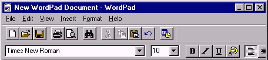

# 缩放无处不在，像素完美已成过去

> 原文：<https://dev.to/reg__/scaling-is-everywhere-pixel-perfect-is-the-past-42ch>

很久以前，当计算机速度很慢，屏幕分辨率很低时，一切都必须是像素级的。例如，Atari 2600 游戏机只能显示 160x192 像素。在那段时间里，游戏角色和所有图形都必须一个像素一个像素地绘制，以包括所有预期的细节，比如马里奥的小胡子。这就是所谓的像素艺术。

 

*来源:[马里奥的进化](http://www.superluigibros.com/evolution-of-mario)*

几年后，随着更高的屏幕分辨率，游戏精灵可以用不同的方法绘制，甚至可以从 3D 模型中渲染，但图标和其他 GUI 元素仍然准备好逐像素显示。同样适用于网页。

[T2】](https://res.cloudinary.com/practicaldev/image/fetch/s--q5uZ0ivp--/c_limit%2Cf_auto%2Cfl_progressive%2Cq_auto%2Cw_880/http://asawicki.info/files/Scaling_is_everywhere/WordPad.png)

现在，甚至 GUI 图标都是按比例缩放的。它们可以平滑地放大，并可以在各种显示器上显示，其中 4K 显示器的像素是全高清显示器的 4 倍。将桌面 DPI 缩放比例设置为 100%以外的值会缩放 Windows 中的所有应用程序。根据“响应式设计”原则创建的现代网页必须在各种设备上都好看，从小智能手机到大显示器。结垢无处不在。

[T2】](http://asawicki.info/files/Scaling_is_everywhere/Windows_folders.png)

当可编程手机首次出现时，为它们制作应用程序和游戏就像回到了过去。就像在复古平台和第一台个人电脑上一样，屏幕分辨率非常低，像素艺术是绘制游戏角色的方式。现在，手机游戏必须在各种智能手机上运行，其中许多手机的分辨率就像我们的电脑显示器一样——全高清甚至更高。

像素完美的最后遗迹似乎是 3D 场景的渲染。自从引入 3D 图形以来，我们倾向于以与屏幕上显示的图像相同的分辨率对三角形进行光栅化和着色，这在理想情况下等于显示器的原始分辨率。否则，每个关心图像质量的游戏玩家都会说它看起来很糟糕。他不会吗？

有些东西可以用较低的分辨率渲染。有一些游戏会将带有 alpha 混合的半透明对象(尤其是火、烟、云等粒子效果)的层渲染为 4 倍小的纹理，然后在与主要的不透明几何体合成时将其放大。这种元素往往没有太多的高频(小)细节，因此由于分辨率较低而导致的质量下降不是很明显，而需要着色和混合的像素数量较少，可以节省大量渲染时间。

但这还不是故事的全部。无论分辨率如何，抗锯齿都是模糊锯齿边缘所必需的，而且永远都是如此。它的理想解决方案被称为超级采样抗锯齿(SSAA)，它只是以更高的分辨率渲染场景，然后将其缩小到例如平均 2×2 渲染像素到单个输出像素。它可以由游戏来完成，或者由图形驱动程序来引入。AMD 在驱动中有这个特性，名字叫“虚拟超分辨率”。

这当然是一个缓慢的方法，因为渲染 4 倍多的像素需要大量的计算和内存带宽。存在各种方法来提供更有效的抗锯齿。多采样抗锯齿(MSAA)由硬件中的 GPU 支持，允许您仅对像素着色一次(在像素着色器中计算 RGB 颜色)，但根据渲染的边缘形状，将其存储在多个逐像素采样中。存在许多屏幕空间后处理算法，其智能地模糊已经渲染的图像以平滑边缘，例如 FXAA、MLAA。

这种高分辨率渲染和高质量抗锯齿之间的可互换性，以及对渲染图像进行一些过滤的可能性，可能是《使命召唤》背后的引擎最好的利用。乔治·吉梅内兹(动视暴雪的图形 R&D 技术总监)在他的演讲中解释道:《使命召唤中的动态时间抗锯齿和上采样》(Digital Dragons 2017)、《使命召唤中的动态时间抗锯齿:无限战争》(SIGGRAPH 2017)。它们根据当前游戏负载动态调整渲染分辨率，以保持足够的帧速率。然后将场景缩放到屏幕分辨率。他们的技术*“结合了动态分辨率和时间上采样”*。这种技术在高 FPS 和流畅游戏非常重要的情况下尤其有用，即使以牺牲图形质量为代价——在快节奏游戏、专业电子竞技和 VR 中。

屏幕分辨率变得更高，但 GPU 的性能不一定以同样的速度增长。单像素细节更难注意到。这就是为什么以比输出分辨率更小的分辨率进行渲染，然后对丢失的像素进行插值是有意义的。当然，没有一种插值算法是完美的，仅仅使用双线性过滤器看起来很糟糕。这就是为什么正在开发一些技术，试图将此过程中的质量损失降至最低，例如时间方法(使用前一帧的图像)、棋盘渲染或 NVIDIA 的新深度学习超级采样(DLSS)。

在难以注意到细节的图像的某些部分，以较低的速率对像素进行着色也是有意义的，例如，玩家没有在看(VR 中的外围视觉，尤其是在眼球跟踪可用的情况下)，对象正在快速移动(基于屏幕空间运动向量)，或者没有很多高频细节的地方(基于对前一帧的分析)。每个像素或每个样本的阴影只是一种选择。NVIDIA 卡支持多分辨率着色或其最新发明-可变速率着色(VFR)等技术，其中辅助纹理可以局部控制着色速率，从每 16 像素一次到每像素 8 次。

最后，着色速率(光照计算)可以与最终图像的渲染速率(光栅化)完全分离，并在不同的空间、以不同的帧速率甚至完全异步地完成。这被称为对象空间着色/纹理空间着色。它已经成功地被氧化物游戏在他们的奇点灰烬中使用，并可能很快变得更加广泛。

我想我们可以说**缩放无处不在，像素完美已经成为过去**。这不一定是一件坏事。如果游戏中 3D 渲染技术进步的目标是看起来像电影一样逼真，那么我们应该意识到电影从来都不是像素完美的——在各个阶段总是会涉及缩放和过滤。即使在最开始，相机传感器也有一些 R、G、B 像素的模式，必须对其进行插值以适应(RGB)三元组。

[T2】](https://res.cloudinary.com/practicaldev/image/fetch/s--tnfxEYbr--/c_limit%2Cf_auto%2Cfl_progressive%2Cq_auto%2Cw_880/http://asawicki.info/files/Scaling_is_everywhere/Camera%2520sensor%2520pixels.png)

然后，它们通常使用色度子采样(如 4:2:2)进行编码，并使用一些视频压缩编解码器进行压缩。插值和滤波可能会涉及到许多处理阶段，例如帧速率转换、去隔行、降噪，或者最后是现代智能电视常用的锐化(我对此非常过敏，但背后肯定有某种原因)。录制的视频从来都不是像素完美的。渲染的 3D 游戏就不一定了。