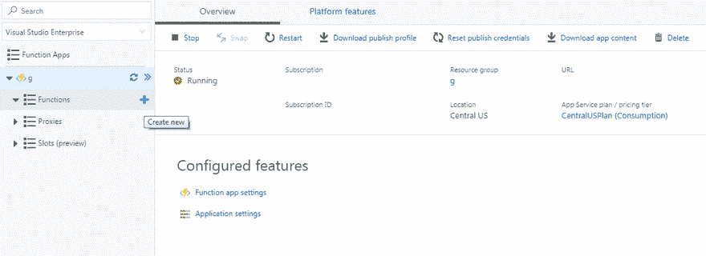
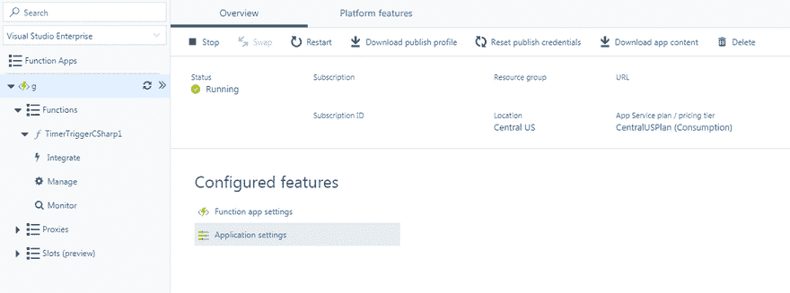

# 用 Azure 功能抓取网站并发送电子邮件

> 原文：<https://dev.to/mattferderer/scrape-a-website--send-an-e-mail-with-azure-functions-1bo7>

无服务器功能是一种很棒的方式，通过点击一个按钮或使用你的声音来创建可以按计划运行的小任务。我们将创建一个功能，访问一个网站，收集重要数据，并通过电子邮件按计划发送给我们。

这个项目将使用 Azure 函数。它们非常便宜，尤其是对这个项目来说。像大多数无服务器架构一样，您只需为运行您的功能所需的服务器时间付费。

如果你没有 Azure 帐户，快速搜索“免费 Azure 帐户”应该会带你到微软的最新产品。

## 创建 Azure 函数

登录 Azure，点击*创建资源*。在这里可以搜索*功能*，添加一个*功能 App* 。

在下一个屏幕上，为应用程序命名，选择一个资源组，等等。如果你是新手，请在评论中给我留言&我可以带你完成这些步骤。完成后，点击*创建*。

一旦 Azure 准备好新资源，你可以点击出现的弹出窗口，或者前往*所有资源*并在那里找到功能应用。功能应用有一个闪电图标。

在下一个屏幕上，将鼠标悬停在左侧菜单上的*功能*上。单击出现的+号创建我们的函数。

[T2】](https://res.cloudinary.com/practicaldev/image/fetch/s--HCLJ8aNm--/c_limit%2Cf_auto%2Cfl_progressive%2Cq_66%2Cw_880/https://mattferderer.com/scrape-a-website-and-send-an-email-with-azure-functions-1-a5fcd4a6fa8df3255c01472832f3aef8.gif)

如果您想按计划完成，请选择*计时器*;如果您想通过 URL 发送请求，请选择 *Webhook+API* ,这样您就可以按需完成。还要确保选择 C#作为下面的语言。

在右侧，单击查看文件。

[T2】](https://res.cloudinary.com/practicaldev/image/fetch/s--vPnv_-6y--/c_limit%2Cf_auto%2Cfl_progressive%2Cq_66%2Cw_880/https://mattferderer.com/scrape-a-website-and-send-an-email-with-azure-functions-2-48c8a11a31647280d9436a0e12eab44f.gif)

添加一个新的`project.json`文件，并添加以下文本。然后点击保存按钮:

```
{
  "frameworks": {
    "net46":{
      "dependencies": {
        "HtmlAgilityPack": "1.8.2"
      }
    }
  }
} 
```

*注:目前只有[。Azure 函数](https://docs.microsoft.com/en-us/azure/azure-functions/functions-reference-csharp#using-nuget-packages)支持. NET Framework 4.6。。Net Core 在预览版中可用。如果以后你想用。Net Core 代替，调整上面的框架片段。下面的代码应该只需要很少的改动。*

为了这个演示&为了合法性的目的，我们将抓取[我的博客主页](https://mattferderer.com)。这是我写的代码。如果您希望进行多个异步请求，GetLatestArticles 函数中的注释解释了如何操作。

```
#r "SendGrid"
using System.Net;
using HtmlAgilityPack;
using SendGrid.Helpers.Mail;

// This is our main method that's called when the function runs. Azure passes the TimerInfo object and a TraceWriter object to output logs. We use C#'s out parameter modifier to work with Azure's Sendgrid e-mail integration using the Mail class.
public static void Run(TimerInfo myTimer, TraceWriter log, out Mail message)
{
    try{
        var latestArticle = GetLatestArticles().Result;
        log.Info(latestArticle);
        message = SendEmail(latestArticle);
    } catch (Exception e) {
        log.Info(e.ToString());
        message = SendEmail(e.ToString());
    }

}

public static async Task<string> GetLatestArticles() {
    var mattsLatestArticle = await GetMattsLatestArticle();
    /**
     * If you want to scrape additional resources with async, 
     * add more functions like above.
     *
     * Then return them like this:
     * return mattsLatestArticle + otherLatestArticle;
     */
    return mattsLatestArticle;
}

public static async Task<string> GetMattsLatestArticle() {
    string website = "https://mattferderer.com";

    HttpClient client = new HttpClient();
    string html = await client.GetStringAsync(website);

    HtmlDocument doc = new HtmlDocument();
    doc.LoadHtml(html); 

    var article = doc.DocumentNode
        .SelectNodes("//a")
        .FirstOrDefault(x => x.Attributes.Contains("class") && x.Attributes["class"].Value.Contains("article-link"));

    var url = article
        .Attributes
        .FirstOrDefault(x => x.Name == "href")
        .Value;

    var title = article
        .SelectSingleNode("//h2")
        .InnerHtml;

    return $"<p><a href=\"{website}{url}\">{title}</a></p>";
}

public static Mail SendEmail(string input) {
        var message = new Mail
    {
        Subject = "Latest Article"
    };

    var personalization = new Personalization();
    personalization.AddTo(new Email("yourEmail@example.com"));

    var content = new Content
    {
        Type = "text/html",
        Value = input
    };
    message.AddContent(content);
    message.AddPersonalization(personalization);
    return message;
} 
```

## 添加 SendGrid 集成

在发送电子邮件之前，它需要一个与 Azure 帐户集成的电子邮件服务。我推荐 [SendGrid](https://sendgrid.com) 。

[SendGrid](https://sendgrid.com) 易于与 Azure 整合& a 有一个免费的开发者计划。总的来说，他们也是很好的供应商。出于这些原因，它们是我的娱乐应用&产品应用。

创建一个 [SendGrid](https://sendgrid.com) 账户，然后进入设置> API 密匙。单击创建 API 密钥。给它起个名字。使用`Mail Send`限制访问是我们获得权限所需要的。把你的 API 密匙拷贝到一个安全的地方。

回到 Azure，通过在左侧菜单中单击应用程序的名称来打开功能应用程序设置。然后在“配置的功能”下，单击靠近底部的“应用程序设置”。(参见下面突出显示的链接)

[T2】](https://res.cloudinary.com/practicaldev/image/fetch/s--4LmvcHcW--/c_limit%2Cf_auto%2Cfl_progressive%2Cq_66%2Cw_880/https://mattferderer.com/scrape-a-website-and-send-an-email-with-azure-functions-3-b415cb520c04975e6c3f28dbef8b5f47.gif)

向下滚动到连接字符串上方的应用程序设置，然后单击添加新设置。

添加键`SendGridKey`。对于该值，添加 Sendgrid 给你的 API 键。单击保存。

在左侧的函数名称下，单击 Integrate & add a new Output。

从输出选项列表中选择 SendGrid。

在下一个屏幕的 SendGrid API Key 下拉菜单中，选择 SendGridKey。

如果您需要该功能的默认值，请填写发件人地址和主题。一定要保存。

如果你做了一个定时器触发应用，输出设置现在将被添加到 Azure 为你创建的 function.json 文件中。您还可以在那里找到使用 Cron 模式的时间表。

此时，您应该能够运行 Azure 函数了&让它给你发送一封电子邮件。如果没有，请在评论中告诉我。

## 附加注释

如果你在电子邮件中发送链接，就像上面的例子一样，你会发现[关闭 SendGrid 的“跟踪设置”](https://sendgrid.com/docs/User_Guide/Settings/tracking.html)功能很有用。这个功能会改变你的链接&如果你没有正确设置，有时会打断它们。您可以在 Sendgrid 的管理屏幕上通过进入设置>跟踪来禁用它。

你可以使用 [VS Code](https://marketplace.visualstudio.com/items?itemName=ms-azuretools.vscode-azurefunctions) 或者 [Visual Studio](https://docs.microsoft.com/en-us/azure/azure-functions/functions-develop-vs) 在本地调试你的代码。