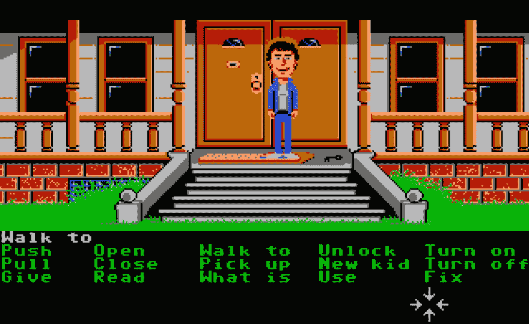
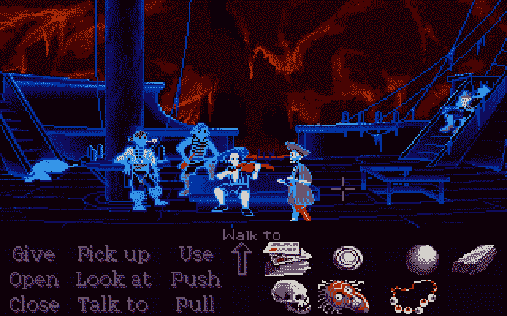

# SCUMM 内部和语法为了怀旧

> 原文：<https://dev.to/roperzh/scumm-internals-and-syntax-for-the-sake-of-nostalgia-384j>

大约在 1999 年，我花了令人难以置信的时间在英特尔 486 上玩卢卡斯艺术公司的游戏。当时已经是老电脑了，但是玩《狂人公馆》《猴岛》之类的游戏还是绰绰有余的。

随着我的成长和对计算机的了解越来越多，我发现“SCUMM”不仅仅是猴岛上一家酒吧的名字，它还是一个平台，我小时候最喜欢的游戏都是在这个平台上编写的。

这篇文章基于一系列来源，从演讲到采访和各种帖子，探索 SCUMM 脚本语言。

## 简史

SCUMM 代表“Maniac Mansion 的脚本创建工具”，顾名思义，它是作为开发 Maniac Mansion 的工具集而创建的。

该游戏必须在 [Commodore 64](https://en.wikipedia.org/wiki/Commodore_64) 中运行，因此正如当时其他游戏一样，该游戏最初是用汇编语言开发的，但为了处理游戏的复杂性(它有七个不同的角色和大量的组合)，朗·吉尔伯特决定创建一个更高级别的语法。

> 我开始用汇编语言手工编写代码，[……]很明显，如果没有某种语言来抽象游戏性，这将是一项非常困难的任务。
> 
> — *朗·吉尔伯特，[IGN](http://www.ign.com/articles/2007/04/26/interview-scumm-of-the-earth)面试 T3】*

一旦 Maniac Mansion 完成，他们意识到 SCUMM 可以作为一个通用工具来创建冒险游戏。

值得注意的是，SCUMM 不仅是一种脚本语言，它还包括其他以体液命名的实用程序，如 SPIT(字体编辑器)和 FLEM(图形界面)。)

## 概念和语法

SCUMM 脚本的语法是非常高级的，并且与用它构建的冒险游戏的特征图形界面密切相关:

<figure>[](https://res.cloudinary.com/practicaldev/image/fetch/s--gFOHMa94--/c_limit%2Cf_auto%2Cfl_progressive%2Cq_auto%2Cw_880/https://user-images.githubusercontent.com/4419992/38932439-8d028ea0-42ec-11e8-9512-b8736cafa401.jpg) 

<figcaption>
 *狂魔府游戏的一个场景截图，描绘了一个典型的 SCUMM 界面:一个角色，与之交互的对象和动作。* 
</figcaption>

</figure>

如果你没有玩过任何老式的卢卡斯艺术冒险游戏(我真的鼓励你[去做](https://en.wikipedia.org/wiki/Commodore_64))，它们由一个你必须解决的故事/谜题组成:你控制着一个角色，这个角色能够通过放置在屏幕底部的一组预定义的动作与物体互动。

脚本语言本身是一个非常好的抽象:它有一个关于你在屏幕上看到的和你编码的几乎 1:1 的映射，并且基于简单的概念/关键字，比如:

*   `room`:用户看到的每一个屏幕都是一个`room`，它只不过是一组`object`定义。
*   `actor`:游戏中的人物，演员可以穿`costumes`和`object` s 互动
*   `object`:`room`中的元素，对象可以有`verbs`，与你可以对其应用的动作相关。
*   `costumes`:球员服装的定义。
*   `sounds`:声音的定义。

对语法做更详细的总结是没有意义的，但是如果你感兴趣的话， [SCUMM 教程](https://web.archive.org/web/20160721004826/http://www.wilmunder.com/Arics_World/Games_files/SCUMM%20Tutorial%200.1.pdf)是一个深入的资源。你甚至可以使用像 [SCUMMC](https://github.com/AlbanBedel/scummc) 和 [SCUMM-8](https://github.com/Liquidream/scumm-8) 这样的编译器来编写自己的游戏。

为了让你体验一下一点代码可能是什么样子，让我们试着编码上图中的场景(戴夫在门阶上)

```
room "doorstep" doorstep {
  sounds {
    "SFX/doorclos" door-close
    "SFX/dooropen" door-open
  }

  costumes {
    "costumes\dave" dave-skin
  }

  enter {
    ; Code to set up the room lives here,
    ; you can trigger sounds, animations, etc.
  }

  exit {
    ; Things to do when exiting the room,
    ; cleaning states, stopping sounds, etc
  }

  object Key {
    name is "key"

    verb look-at {
      say-line "it is a key"
    }

    verb pick-up {
      pick-up-object key
    }
  }
} 
```

Enter fullscreen mode Exit fullscreen mode

## 一心多用

> SCUMM 最与众不同的部分可能是它是多任务的。这意味着多个脚本可以有效地同时运行。您可以在 Zak McKracken 办公室的墙上创建一个时钟，并让它具有动画效果。将会有一个非常简单的时钟脚本，告诉动画引擎从时钟的一个图像切换到下一个图像，告诉声音引擎播放“滴答”的声音，然后告诉脚本“睡眠-1 秒钟”，然后重复。
> 
> ——*王高·威明，[伽马苏采访](https://www.gamasutra.com/view/feature/196009/the_scumm_diary_stories_behind_.php?print=1)*

SCUMM 的另一个突出之处是，开发人员可以轻松地将协作式多任务处理添加到系统中。你可以用关键字`do`触发一个任务，这个任务将保持每帧运行一次*，直到它遇到一个`break-here`，然后它运行下一个任务。*

例如，在下一个图像中，我们可以认为每个幽灵海盗和在背景中移动的影子都是独立运行的单独脚本:

[T2】](https://res.cloudinary.com/practicaldev/image/fetch/s--9Pk2ft8o--/c_limit%2Cf_auto%2Cfl_progressive%2Cq_66%2Cw_880/https://user-images.githubusercontent.com/4419992/38961725-39f60436-4340-11e8-856f-0c0f0f0e91bc.gif)

这里有一个从 [Gilbert 的演讲](https://www.youtube.com/watch?v=wNpjGvJwyL8)中摘录的脚本，它详细描述了如何让一个时钟滴答作响:

```
script clock-tick {
  do {
    clock-state = not clock-state
    object living-room-clock state clock-state
    play-sound clock-tick
    break-here 60
  }
} 
```

Enter fullscreen mode Exit fullscreen mode

## 其他有趣的比特

最后，这里有一些有趣的信息:

*   SCUMM 编译器是用 Yacc 和 Lex 编写的。
*   SCUMM 要求行尾有回车符，但如何制表符并不重要。不能将左大括号、指令和右大括号放在同一行。
*   SCUMM 系统有全局和局部变量。一个全局变量可以在整个游戏中使用。局部变量特定于脚本。

## 资源

*   [scum 教程](https://web.archive.org/web/20160721004826/http://www.wilmunder.com/Arics_World/Games_files/SCUMM%20Tutorial%200.1.pdf)
*   [采访:地球的 SCUMM】](http://www.ign.com/articles/2007/04/26/interview-scumm-of-the-earth)
*   [脚本测试](https://blog.thimbleweedpark.com/scripting_test)
*   游戏新势力，第三部:人渣
*   [scum 日记](https://www.gamasutra.com/view/feature/196009/the_scumm_diary_stories_behind_.php?print=1)
*   [戴维·福克斯谈](https://youtu.be/1SLVyjUCOIo)
*   [罗恩吉尔伯特怎么在 scum](https://www.pagetable.com/?p=614)上
*   [朗·吉尔伯特——狂魔大厦事后谈](https://www.youtube.com/watch?v=wNpjGvJwyL8)