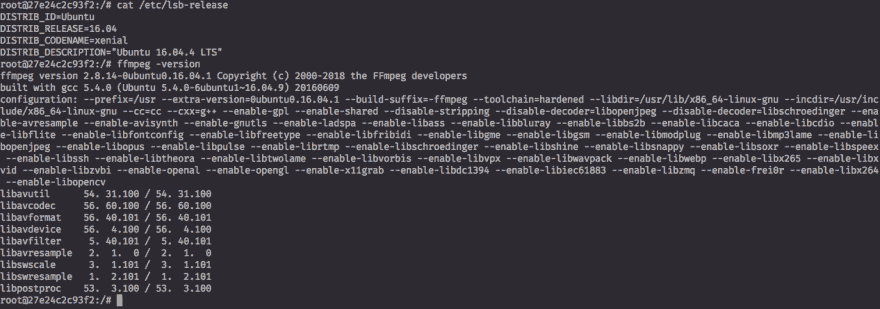
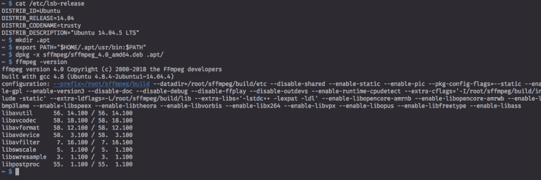
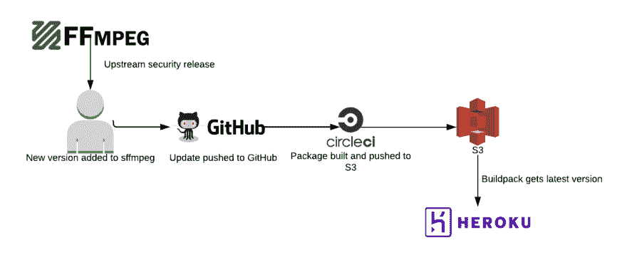

# 保护 Rails 5.2 活动存储的依赖性

> 原文：<https://dev.to/heroku/securing-dependencies-for-rails-52-active-storage-3fg6>

Salesforce 的公共云安全(PCS)团队与 Heroku engineering 紧密合作，对从基础设施到应用程序的整个平台的新产品功能进行审查并提出建议。对我来说，这种合作关系和在这个团队中工作最有收获的一个方面是，我们不仅发现了安全问题，而且在构建安全解决方案方面发挥了积极作用。

Heroku [最近宣布](https://dev.to/heroku/rails-52-active-storage-previews-poppler-and-solving-licensing-pitfalls-2b80)在 Rails 5.2 中支持活动存储，引入了生成 pdf 和视频预览的能力。作为一名安全工程师，听说一款产品有自动解析媒体文件的新功能，这无疑吸引了我的注意力。这篇文章从安全角度探讨了在 Heroku 上支持活动存储的挑战，以及工程团队和 PC 如何合作为我们的客户构建安全的解决方案。

## FFmpeg 的历史

FFmpeg 是一个工具，通过许多库和插件来处理各种各样的视频和音频文件，扩展了对不同格式的支持。FFmpeg 的强大功能和灵活性使它成为许多不同项目的流行选择，所以 Rails 团队选择它来处理从视频文件生成预览图像也就不足为奇了。

FFmpeg 在公开披露漏洞方面有很长的历史[、许多](https://www.ffmpeg.org/security.html)导致代码执行的[。这是](https://www.cvedetails.com/vulnerability-list/vendor_id-3611/product_id-6315/opec-1/Ffmpeg-Ffmpeg.html) [fuzzers](https://bugs.chromium.org/p/oss-fuzz/issues/list?can=1&q=status%3AFixed%2CVerified+Type%3ABug-Security+-component%3AInfra+ffmpeg&colspec=ID+Type+Component+Status+Proj+Reported+Owner+Summary&cells=ids) 的一个受欢迎的目标，这些 fuzzers 是许多这些漏洞发现的来源。

原始 CVE 计数并不是一个确定一个软件是否安全的很好的指标，但它确实向我们展示了这是一个对研究人员有吸引力的目标，并让我们知道我们需要多频繁地关注为安全问题部署补丁。

也许更准确的衡量标准是 FFmpeg 团队对安全问题的响应速度。在 2015 年一篇关于 Debian 重新使用 FFmpeg 的文章中，安全研究员 mate usz“j00ru”Jurczyk 对 FFmpeg 团队的漏洞响应给予了精彩的赞扬。

<figure>

> “在过去大约 3.5 年的时间里，我们在 FFmpeg 的上述工作上非常成功:我们发现的每一个问题(即使是最不严重的问题)都得到了及时的解决。”

<figcaption>Source: [Why Debian returned to FFmpeg by Jonathan Corbet](https://lwn.net/Articles/650816/)</figcaption>

</figure>

上游项目致力于解决大大小小的安全问题，这给了我们前进的信心，包括对 FFmpeg 的支持。在 Heroku 堆栈映像和 buildpacks 中及时分类和应用应用程序补丁是 Heroku 经过充分测试的流程，因此我们很放心地知道我们可以快速为使用活动存储的客户提供漏洞补丁。

## 紧跟上游

支持活动存储的工程挑战之一是 [cedar-14 栈](https://devcenter.heroku.com/articles/cedar-14-stack)基于 Ubuntu Trusty 14.04，该版本移除了对 FFmpeg 的支持，转而支持 [libav](https://libav.org/) 。这意味着它不像在堆栈映像中直接包含 Ubuntu 的 FFmpeg 包那么简单。虽然可以尝试使用 libav，但是请考虑 Jurczyk 在上面链接的同一篇文章中对该项目的描述。

> “Libav 的情况完全不同，它仍然受到数百个这样的 bug 的影响，尽管我们在过去已经为开发人员提供了多次重现的测试用例。”

从安全角度来看，另一个问题是 Ubuntu Xenial 16.04 的 FFmpeg 包(heroku-16 基于该包)是社区维护的 Universe 库的一部分，并且缺少几个漏洞的反向端口。我们非常感谢社区为创建和维护复杂包(如 FFmpeg)的反向端口所做的努力，但我们不愿意向有如此多已知漏洞的客户应用程序发布新功能。

没有资源来贡献我们自己的 backports，这给我们留下了一个新的挑战——开发我们自己的 FFmpeg 二进制文件。

## 一种静解

在寻找为客户提供最新和最安全的 ffmpeg 的最佳方式时，我遇到了一个名为 [sffmpeg](https://github.com/pyke369/sffmpeg) 的优秀项目，它使用 [CMake](https://cmake.org/) 来创建静态 FFmpeg 二进制文件。构建一个静态二进制文件允许我们创建一个 Debian 包，这个包将包含任何必要的依赖项，并且可以跨 Heroku 支持的所有堆栈映像工作。

FFmpeg 4.0 刚刚发布，sffmpeg 落后几个版本。然而，已经有来自 Jan Spitalnik 的 pull 请求将 sffmpeg 升级到 4.0，我们可以用它来启动 T2 的 fork T3。

早先的帖子提到了一些关于 PDF 依赖的许可问题，我们在 FFMpeg 上也面临类似的问题。幸运的是，对于静态构建，我们能够轻松地修改`CMakeLists.txt`文件来改变构建配置选项和外部项目添加，以删除非自由软件。

这有一个额外的好处，即通过删除不必要的库和依赖项来最小化 FFMpeg 的攻击面，这些库和依赖项默认包含在 sffmpeg 中，但对于活动存储支持来说并不需要。FFmpeg 为支持其他媒体格式而包含的每一个额外的依赖项都是一个额外的库或工具，可能会给客户应用程序带来漏洞，我们需要监控这些漏洞以获取安全补丁。通过删除活动存储不使用的东西，如 [RTMP](https://en.wikipedia.org/wiki/Real-Time_Messaging_Protocol) 流支持或 [xvid](https://labs.xvid.com/source/) ，我们最大限度地减少了应用程序易受不必要的依赖关系问题的影响。

<figure> 

<figcaption>默认 Ubuntu 安装 ffmpeg 并依赖</figcaption>

</figure>

<figure> 

<figcaption>我们的 sffmpeg fork 的降级攻击面</figcaption>

</figure>

考虑到包括 FFmpeg 和默认依赖项会给应用程序 [slug](https://devcenter.heroku.com/articles/how-heroku-works#building-applications) 增加大约 200MB，而最终的静态构建只有大约 30MB，攻击面的减少是显而易见的。这种方法有助于防止客户应用程序达到 [500MB 段大小限制](https://devcenter.heroku.com/articles/slug-compiler#slug-size)，加速客户构建，并降低我们对 Rails 应用程序的存储需求。结合明显的性能优势以及改进的安全性，这是一个简单的选择。

有了 static build helper 生成最新的、打了补丁的 FFmpeg 版本，并将其分解为最小的依赖项以创建可用的 Debian 包，剩下要做的就是用 CI 自动化构建，并将其包含在新的 Active Storage Preview buildpack 中。

自动化对于确保我们能够在发布任何新的安全版本时快速做出反应并推出更新版本至关重要。我们使用 CircleCI 的 [Docker 来运行我们分叉的 sffmpeg 构建助手。构建脚本编译带有所有依赖项的静态 FFmpeg 二进制文件，将其添加到 Debian 包(。deb)，然后将包上传到 AWS S3。一旦上传，使用](https://github.com/heroku/sffmpeg/blob/master/.circleci/config.yml)[活动存储预览构建包](https://github.com/heroku/heroku-buildpack-activestorage-preview)的任何人都可以立即使用它。buildpack 通过使用`-x`选项将 Debian 包安装到您的应用程序 dyno 中，在本地提取它，因为 dyno 不作为`root`运行，并且将它添加到您的 dyno 的`PATH`环境变量中，使它可以被 Rails 访问。CI 构建和推送至 S3 大约需要 20 分钟，这使我们能够在上游版本发布后很快向客户发布补丁。

[T2】](https://res.cloudinary.com/practicaldev/image/fetch/s--oRJ8jP2A--/c_limit%2Cf_auto%2Cfl_progressive%2Cq_auto%2Cw_880/https://heroku-blog-files.s3.amazonaws.com/posts/1526946609-sffmpeg%2520-%2520Page%25201%2520%25281%2529.png)

## 结论

这一努力的结果是为我们提供了一个包含最新安全补丁的 FFmpeg 版本，它具有更小的攻击面和包大小，支持所有 Heroku 的堆栈映像，以及一个自动更新未来安全版本的过程。

Heroku 工程文化的一个重要组成部分是，安全性不是阻碍因素，而是促进因素，因此我们的团队努力寻找安全的解决方案来支持产品和功能，使 Heroku 成为运行代码的最佳场所。