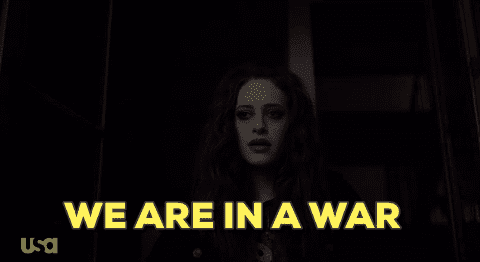

# 安全冲刺:我从 CTF 中学到了什么

> 原文：<https://dev.to/terceranexus6/security-sprint-what-i-learnt-in-a-ctf-2nf3>

对于那些不了解安全相关俚语的人来说， **Catch The Flag** 是一个在线黑客游戏，它包括入侵 stego、web、network 等，以便获得密码(flags)并在其他参赛者之前抓住它们。因此，在三天的时间里，我和一个主要致力于网络和法医学研究的团队玩了一次由我的大学组织的游戏。我不会在这里解释所有的过程，但我想指出我使用的所有工具(其中大部分对我来说是全新的)来解决问题。

[T2】](https://res.cloudinary.com/practicaldev/image/fetch/s--P0sd_Bes--/c_limit%2Cf_auto%2Cfl_progressive%2Cq_66%2Cw_880/https://images.duckduckgo.com/iu/%3Fu%3Dhttps%253A%252F%252Fmedia.giphy.com%252Fmedia%252F3o72F1tCu4fOqwMUk8%252Fgiphy.gif%26f%3D1)

*   我已经[写过关于这个工具的文章](https://dev.to/terceranexus6/security-sprint-week-2---choosing-a-nice-point-to-sniff-and-using-tcpdump-for-packet-analysis--e9)，但是我发现这次它也非常有用。这是一个网络扫描和处理工具，它允许我在网络中找到一个奇怪的文件，它实际上包含了*标志*。当其他工具被系统屏蔽时，这个工具保留了下来。耶！它也是 linux 中的命令行工具，灵活且为数不多。

*   **Nikto** :这是一个非常有用的网络扫描工具，不幸的是被 CTF 系统屏蔽了，但是在现实生活或者其他的 CTF 中可能会有用。它有很多选项，包括寻找奇怪文件的-e。主机扫描的一个例子是`nikto -host {host}`

*   **nmap** :经典的网络扫描工具。例如`nmap -v -sn {host}`

*   **识别**:使用`identify -verbose image.jpg`这样的命令，帮助我给我关于和图像的信息

*   **stegosolve** :顾名思义，这是一款专门用于隐写术的工具。实际上这个程序所做的可以直接使用 **Gimp** 来完成。但是这样更快。它玩图像的甘马颜色以及饱和度。这是一个 java 程序，所以一个例子是`java -jar stegosolve.jar image.png`

*   **Binwalk** :这也是用于隐写术的，这个工具可以在一个图像里面找到二进制文件，比如 zip 文件或者 txt 或者其他图像。我实际上先用了 **ghex** ，看到在翻译的十六进制中有一个“PK”，这意味着里面有一个 ZIP。但是如果没有宾沃克，要抓住它会更加困难。像`dd if=image.png bs=1 skip=the_line_in_decimal_where_PK_is of=foo.zip`一样使用 **dd** 是可能的，但是 Binwalk 是更好的选择。`binwalk -e image.png`大功告成。

*   **波动**:最后但并非最不重要的一点，波动就像纯粹的魔法。是一个强大的取证工具，允许在转储文件中寻找线索。

根据谜题和黑客的不同，其他一些工具可能会有用。在我的情况下，这些都是在 Debian jessie linux 框架，并采取了终端的进步，在其中我感到更舒服。不管怎么说，CTF 是学习的好选择，网上有很多，但是要小心！它们很容易上瘾。