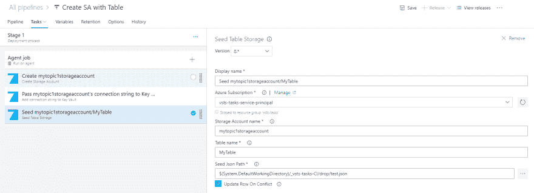
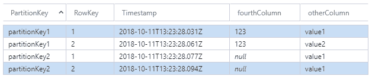

# 种子台存储

> 原文：<https://dev.to/meanin/seed-table-storage-10an>

# 简介

我在这里写了几个关于一朵蔚蓝色的云的句子。当您部署应用程序时，有时您需要一些已经放在数据库中的基本数据。一些先决条件，没有这些条件，应用程序将无法正常工作。在. net 世界中播种和迁移 SQL 数据库是一个很好的主题。如果你了解实体框架或者 Hibernate，你就知道从哪里开始。当你想在 Azure 表存储中存储数据时，该怎么做呢？

# 安装扩展

若要安装此扩展，您需要 Azure DevOps 门户上的组织。可以从这里开始[。在此门户上，您必须拥有安装扩展的权限。然后导航](https://azure.microsoft.com/en-us/services/devops/?nav=min)[到这里](https://marketplace.visualstudio.com/items?itemName=meanin.storage-account-managment)。

# 配置任务

[T2】](https://res.cloudinary.com/practicaldev/image/fetch/s--9WNRid2E--/c_limit%2Cf_auto%2Cfl_progressive%2Cq_auto%2Cw_880/https://raw.githubusercontent.com/meanin/vsts-tasks/master/screenshots/seedtablestorage.png)

要使用此任务，您必须拥有一个配置了服务主体的[Azure 资源管理器连接。设置要植入的存储帐户名和表名。选择 JSON 文件位置。该文件必须是一个平面对象的 JArray，每个对象至少包含两个属性:PrimaryKey 和 RowKey。
这里有一个小例子:](https://docs.microsoft.com/en-us/azure/devops/pipelines/library/service-endpoints?view=vsts#sep-azure-rm) 

```
[
    {
        "partitionKey": "partitionKey1",
        "rowKey": "1",
        "otherColumn": "value1",
        "fourthColumn": "123"
    },
    {
        "partitionKey": "partitionKey1",
        "rowKey": "2",
        "otherColumn": "value2",
        "fourthColumn": "123"
    },
    {
        "partitionKey": "partitionKey2",
        "rowKey": "1",
        "otherColumn": "value1"
    },
    {
        "partitionKey": "partitionKey2",
        "rowKey": "2",
        "otherColumn": "value1"
    }
] 
```

发布后，带有数据的表格如下:
[](https://res.cloudinary.com/practicaldev/image/fetch/s--jw0N_LpM--/c_limit%2Cf_auto%2Cfl_progressive%2Cq_auto%2Cw_880/https://raw.githubusercontent.com/meanin/dev-to-articles/master/img/2018-mm-dd-seed-table-storage/seed-table.png)

这是该任务的第一个发布版本。我将感谢所有的反馈:)