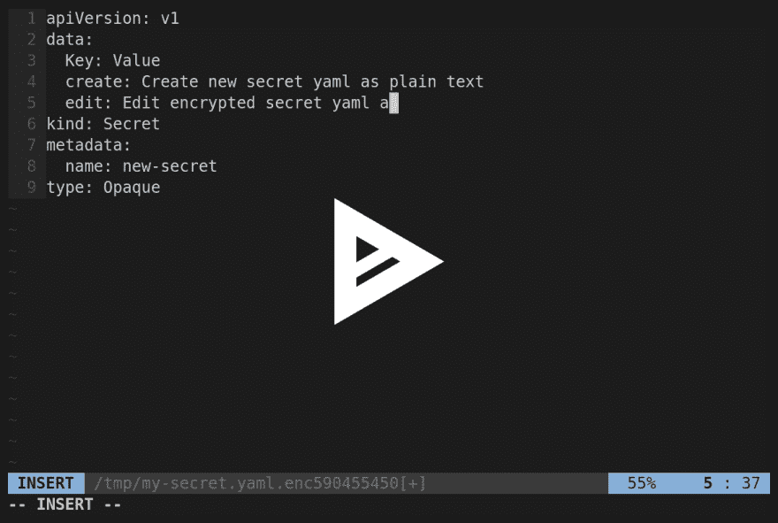

# SEK ret:Kubernetes 秘密的加密工具

> 原文：<https://dev.to/nownabe/sekret-encryption-tool-for-kubernetes-secrets-4dip>

Sekret 是一个加密和编辑 Kubernetes 秘密的 CLI 工具。Sekret 使 Secret 的管理和部署既安全又简单。

# 动机

*   想要像其他资源(例如，部署)一样受版本控制的机密
*   想要提交加密的秘密 YAMLs
*   想要轻松编辑加密的秘密 YAMLs
*   想要轻松应用解密的机密 YAMLs 吗

# 功能性

*   加密普通 YAMLs
*   解密加密的 YAMLs
*   创建新的加密秘密 YAMLs
*   将加密的机密 YAMLs 编辑为纯文本

# 演示

[T2】](https://asciinema.org/a/MyvxqcN0oMbmGc8xAaJh4U2Fz)

# 安装

用`go get`可以得到 Sekret。

```
go get github.com/nownabe/sekret 
```

Enter fullscreen mode Exit fullscreen mode

此外，你可以从 GitHub 的发布版本下载二进制文件。

```
curl -sSL -o /path/to/sekret https://github.com/nownabe/sekret/releases/download/v1.1.0/sekret_linux_amd64
chmod +x /path/to/sekret 
```

Enter fullscreen mode Exit fullscreen mode

# 用法

`sekret`命令在`enc` / `dec` / `new` / `edit`子命令之后使用。

```
sekret subcommand [options] filename 
```

Enter fullscreen mode Exit fullscreen mode

环境变量`ENCRYPTION_KEY`用作所有子命令的加密密钥。加密密钥必须是 16 或 32 字节。`EDITOR`变量指定了`new`和`edit`子命令的编辑器。命令选项也可以指定它们。

## 加密

下面的命令加密`secret.yaml`,然后提交到 Git 上。

```
$ export ENCRYPTION_KEY=$(cat /dev/urandom | base64 | fold -32 | head -1)
$ sekret enc secret.yaml > secret.yaml.enc
$ git add secret.yaml.enc
$ git commit 
```

Enter fullscreen mode Exit fullscreen mode

## 解密

易于解密和应用秘密。

```
$ sekret dec secret.yaml.enc | kubectl apply -f - 
```

Enter fullscreen mode Exit fullscreen mode

## 创建新的加密秘密

子命令创建一个新的加密秘密 YAMLs。

```
$ export EDITOR=vim
$ sekret new secret.yaml.enc 
```

Enter fullscreen mode Exit fullscreen mode

使用秘密模板打开指定的编辑器，就像跟随 YAML 一样。

```
apiVersion: v1
data:
  Key: Value
kind: Secret
metadata:
  creationTimestamp: null
  name: new-secret
type: Opaque 
```

Enter fullscreen mode Exit fullscreen mode

在 Kubernetes Secrets 中，`data`的值必须编码为 base64，但是 sekret 在打开和保存它们时会自动编码和解码。所以你可以把 YAML 写成纯文本。如果您想编辑为 base64，请使用`--decode-base64=false`选项。

Sekret 在保存 YAML 之前会进行验证，所以当无效时不会保存 YAML。

## 编辑加密的秘密

你可以用`edit`子命令像编辑明文一样编辑加密的秘密 YAML。

```
$ sekret edit secret.yaml.enc 
```

Enter fullscreen mode Exit fullscreen mode

在指定的编辑器中打开解密的和 base64 解码的 YAML。当编辑器关闭时，它会保存加密的和 base64 编码的 YAML。当然，它会在保存之前验证 YAML。

# 结论

Sekret 使得 Sekret 的生命周期非常简单和安全。管理和部署秘密 YAML 是毫不费力的。