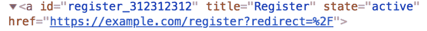

# Selenium WebDriver 和动态定位器

> 原文：<https://dev.to/razgandeanu/selenium-webdriver-and-dynamic-locators-40b1>

众所周知，通过 UI 运行的功能测试脚本需要稳定的定位器来定位元素。

Selenium 使用以下定位器策略:
ID
名称
类名
XPath
CSS 选择器
标签名称
链接文本
部分链接文本

但是如果这些定位器都不稳定会发生什么呢？
如果连 ID 都是动态的，随着页面的每次渲染而变化，会发生什么？

假设您想要单击注册按钮，该按钮具有 **register_312312312** ID。

[T2】](https://res.cloudinary.com/practicaldev/image/fetch/s--HJe8DA_s--/c_limit%2Cf_auto%2Cfl_progressive%2Cq_auto%2Cw_880/https://i.imgur.com/6SyB3KR.png)

编写 Selenium 代码的经典方式是这样的: