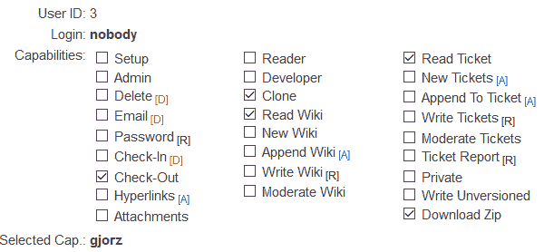
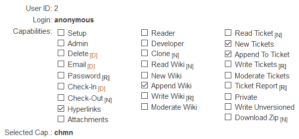

# fossil 的自托管，git 的替代方案

> 原文：<https://dev.to/schollz/self-hosting-with-fossil-an-alternative-to-git-33bk>

[T2】](https://res.cloudinary.com/practicaldev/image/fetch/s--3rAD-VdQ--/c_limit%2Cf_auto%2Cfl_progressive%2Cq_auto%2Cw_880/https://thepracticaldev.s3.amazonaws.com/i/jqvg27jnatwn4gc1rrar.png)

Github，Gitlab，Bitbucket 都是 *git* 的 web 接口。它们都做类似的事情，增加了 *git* 中没有的特性，比如问题和维基等等。

一些人不知道的是， *fossil* 是 *git* 的替代品，它实际上有内置的问题、wiki 和容易自托管。这是托管和克隆*化石*回购的快速入门。官方快速入门非常好，虽然我在让 fossil 托管反向代理后的 HTTPS 上工作以及让 fossil 与 Go 一起工作时发现了一些技巧。

## 开始之前

首先，下载 fossil。已经有适用于 Windows、OS X 和 Linux 的二进制文件。你可以在 fossil-scm.org 的找到它们[。](https://www.fossil-scm.org/xfer/uv/download.html)

## 新化石

制作一个新化石很容易——你可以用`init`子命令制作一个新化石。

```
$ fossil init -A schollz 3.fossil
project-id: 7165366dc9d0d3c827573c8ef12cb760f2caa236
server-id:  56adcebbf59b06eb4b621d3daca59f5aa87a9a08
admin-user: schollz (initial password is "35a6g1") 
```

这将创建一个新的存储库`3.fossil`，用户为`schollz`，默认密码为`35a6g1`。确保保存每个化石回购与扩展`.fossil` -这是非常重要的，如果你想做主机。

然后您可以更改`schollz`的默认密码。在这里，您必须在命令行上输入密码，但是我喜欢将它添加到一个文件中，以防止它出现在 bash 历史中。

```
$ vim pass # enter your password in this file
$ fossil user password schollz `cat pass` -R 3.fossil
$ rm pass # this ensures your password doesn't enter the bash history 
```

想要添加另一个用户吗？这也很容易:

```
$ fossil user new user2 user2@somewhere.com -R 3.fossil 
```

当你克隆化石时(见下文),你将能够输入用户名和密码来验证传输。

## 托管化石

假设你在同一个文件夹里有几块化石。确保每个都有`.fossil`后缀——这非常重要。

```
$ ls fossils
1.fossil 2.fossil 3.fossil 
```

然后，您可以启动使用 HTTPS 的服务器:

```
$ fossil server . --https --port 8079 --repolist 
```

`--https`标志意味着 HTTPS，所以您必须拥有一个使用 SSL 的反向代理。如果你使用[球童](https://caddyserver.com/download)作为反向代理(这很容易加上 HTTPS)，那么做到这一点非常容易。在这种情况下，您的 [Caddyfile](https://caddyserver.com/tutorial/caddyfile) 将看起来像:

```
fossil.schollz.com {
        proxy / 127.0.0.1:8079 {
                transparent
        }
        gzip
        log logs/fossil.schollz.com.log
} 
```

你只需要用`yourdomain.com`代替`fossil.schollz.com`。

## 克隆化石

克隆很容易，只要确保包含您的用户名，这样您就有权利推送更改(除非您只想拥有自己的副本)。如果你像上面一样使用`fossil server .`，那么你需要添加`/repo`来告诉它你想要克隆`repo.fossil`。例如，克隆`3.fossil`

```
$ fossil clone https://schollz@fossil.schollz.com/3 3.fossil 
```

系统将提示您输入密码，该密码与您在顶部设置的密码相同。现在你可以打开回购了。

```
$ fossil open 3.fossil 
```

事情与 *git* 非常相似。您可以添加和提交文件:

```
$ touch README.md
$ fossil add README.md
$ fossil commit README.md # this will automatically push 
```

您可以轻松地创建拉动(获取最新更改):

```
$ fossil sync 
```

## 私人和公共回购

### 私人回购

让你的化石成为私人的很容易。只需转到管理-$安全审计，然后点击“把它变成私人”。

### 公开回购

这是默认值。然而，有时如果你私下回购，你会希望再次公开。让您的存储库再次公开稍微复杂一些。

基本上有两种类型的用户:“无名”和“匿名”用户。“匿名”是指授予*任何登录*的人的权限。“任何人”是指授予*任何访问*站点的人的权限。要使回购再次公开，您必须通过转到 Admin -$ Users 为这两种类型的用户重新定义权限。

“nobody”对公共访问的典型权限是“gjozr”:

[T2】](https://res.cloudinary.com/practicaldev/image/fetch/s--pYH6wjfT--/c_limit%2Cf_auto%2Cfl_progressive%2Cq_auto%2Cw_880/https://thepracticaldev.s3.amazonaws.com/i/f7wqhci9bodxsyxn6n1c.PNG)

“匿名”公共访问的典型权限是“chmn”:

[T2】](https://res.cloudinary.com/practicaldev/image/fetch/s--3XRhmtAV--/c_limit%2Cf_auto%2Cfl_progressive%2Cq_auto%2Cw_880/https://thepracticaldev.s3.amazonaws.com/i/q4auarfmy0djv40ghwf6.PNG)

## 为`Go`配置

为了将*化石*与`go get`一起使用，你需要确保在`meta`标签中指定了正确的[远程导入路径](https://golang.org/cmd/go/#hdr-Remote_import_paths)。

基本上，如果你遵循上面的，你有一个化石回购托管在`https://yourdomain.com/hello-world`然后你需要包括元标签:

```
<meta name="go-import" content="yourdomain.com/hello-world fossil https://yourdomain.com/hello-world"> 
```

您可以通过更改默认的 fossil 皮肤(Admin -$ Skins)来实现这一点。有一个非常好的谷歌代码皮肤。为了方便起见，我已经有了 [CSS](https://cowyo.com/fossil_css/raw) 、[页眉](https://cowyo.com/fossil_header2/raw)和[页脚](https://cowyo.com/fossil_footer/raw)。只需编辑每个组件(皮肤下的步骤 4)，然后选中步骤 7 中的两个框，点击“发布草稿 1”。

## 一般

我喜欢让主回购中的`README.md`成为你在 web UI 上看到的第一个东西——就像 Github/Gitlab/Bitbucket 一样。为此，创建一个`README.md`文件，然后转到 Admin -$ Configuration，查找**索引页面**，并将其更改为`/doc/tip/README.md`。确保点击顶部的“应用更改”。

另一个技巧——如果
正在使用 *oh-my-zsh* ，你可以将`fossil`作为参数添加到`~/.zshrc`中(如果你没有使用它，为什么？).只要确保
你有这条线:

```
plugins=(git history fossil) 
```