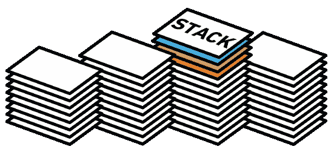

# 把你的筹码卖给我！

> 原文：<https://dev.to/alchermd/sell-me-your-stack-4noa>

[T2】](https://res.cloudinary.com/practicaldev/image/fetch/s--QE7zwNtY--/c_limit%2Cf_auto%2Cfl_progressive%2Cq_auto%2Cw_880/https://blog.hypem.com/wp-content/uploads/2014/06/stack1.png)

你好，伙计们，在电脑上操控比特的智人！

我让`r/webdev`到[的好心人把他们现在的栈](https://www.reddit.com/r/webdev/comments/6wj570/hello_devs_of_rwebdev_would_you_please_sell_me/?utm_content=title&utm_medium=front&utm_source=reddit&utm_name=webdev)卖给我已经快一年了。我个人最喜欢的是`u/CaptainIncredible`卖给我他的[。NET](https://www.reddit.com/r/webdev/comments/6wj570/hello_devs_of_rwebdev_would_you_please_sell_me/dm91mhn/) 栈。这是一次很棒的经历，实际上也是我选择 PHP 和 Laravel 的原因！当然，许多人会发现他们的同龄人的经验在选择他们的下一个开发堆栈时是有价值的——无论是为了工作，一个附带项目，还是仅仅为了学习新事物的兴奋感！

以下是原文:

> 我正在经历一个阶段，我知道我们大多数人在职业生涯中都曾经历过这个阶段。你知道，“我不知道该关注什么技术/语言”的阶段。现在，我已经知道解决方法了:选择我觉得舒服的，对吗？问题是，我觉得我已经掌握了大多数语言(与 webdev 相关)的感觉和基础，到了我真的需要专注于一个堆栈并精通它的地步。否则，我会把自己分散得太开，成为所有这些语言的高级初学者。
> 
> *那么，您能否介绍一下您当前的产品组合(如有可能，客户端+服务器)以及促使您选择该产品组合的卖点是什么？或者你讨厌它的哪些部分？你有什么想分享的建议吗？*

所以开发者们，把你们现在的栈:D 卖给我吧