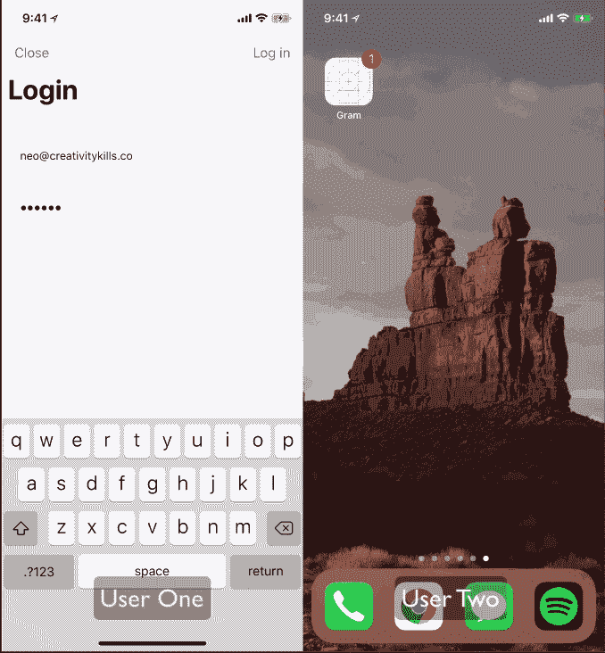
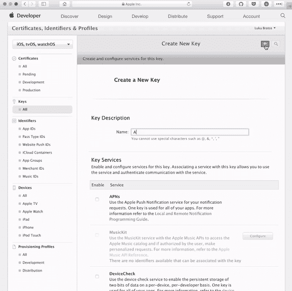
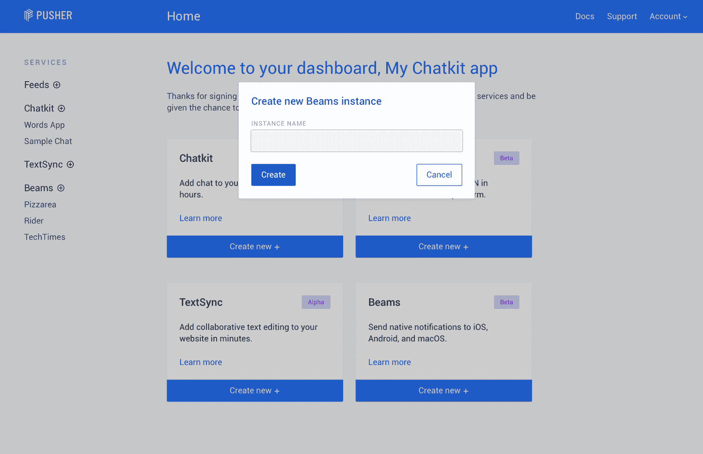
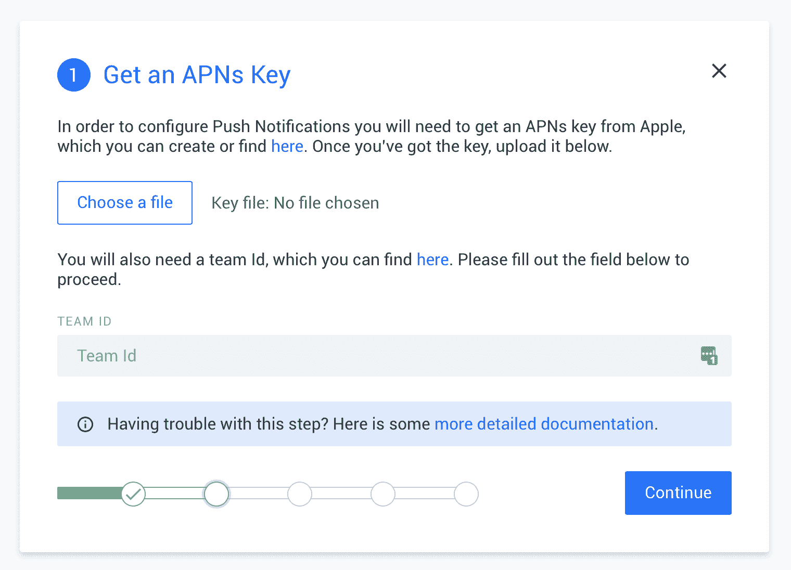
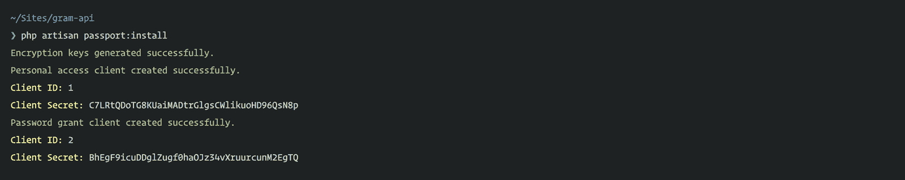
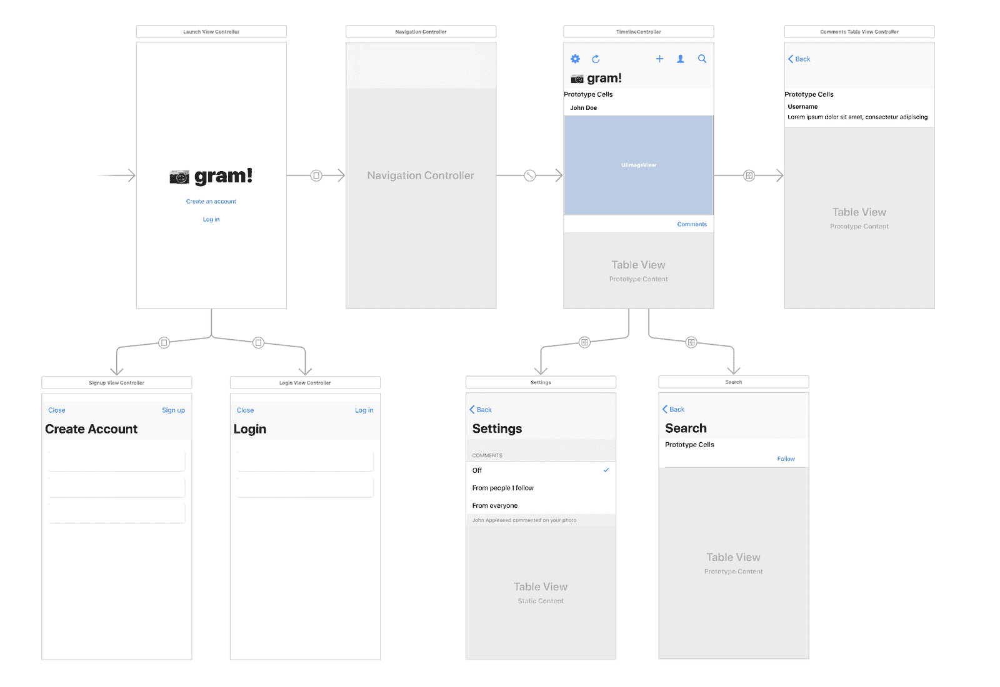

# 在社交网络 iOS 应用中发送推送通知——第 1 部分:构建后端

> 原文：<https://dev.to/neo/send-push-notifications-in-a-social-network-ios-app---part-1-build-the-backend-ld5>

> 要学习本教程，您需要一台安装了 Xcode 的 Mac，并了解 Xcode 和 Swift。您还需要 PHP 的基础知识(包括 Laravel 框架)、Pusher 帐户和安装在您机器上的 Cocoapods。

推送通知是吸引应用程序用户的好方法。它允许您在服务中发生某些事件时发送通知。这可能会导致重新参与。

构建社交网络应用时，你需要向用户发送推送通知。这些通知将有助于用户了解应用程序中何时发生了某些事件。例如，当有人评论他们的照片时，你可以向用户发送推送通知。

尽管推送通知功能强大，但它也是一把双刃剑。大多数用户会卸载你的应用程序，如果他们觉得他们被垃圾邮件。

在两篇文章中，我们将了解如何构建一个社交网络 iOS 应用程序。当有人评论他们上传的照片时，我们会向用户添加推送通知。然后，我们将添加设置，以便用户可以指定何时接收通知。

[T2】](//images.ctfassets.net/1es3ne0caaid/51GgQzYiqQEMAQWOK8AMgS/fd0d5bb1bbaa7f1f198fed340d25cd53/ios-push-notifications-social-network-demo.gif)

## 先决条件

要跟随本教程，您需要具备以下条件:

*   安装了 [Xcode](https://developer.apple.com/xcode/) 的 Mac。
*   Xcode 使用知识。
*   了解 Swift 编程语言。
*   PHP 和 [Laravel](https://laravel.com/docs/) 的知识。
*   安装在您机器上的 Laravel CLI 。
*   安装在您机器上的 SQLite。[参见安装指南](http://www.sqlitetutorial.net/download-install-sqlite/)。
*   推杆梁 API 键。在这里创建一个。
*   Cocoapods 安装在你的机器上。[参见安装指南](https://guides.cocoapods.org/using/getting-started.html)。

## 创建我们的 Pusher 应用程序

> ⚠️要使用推送通知，你必须[成为苹果开发者计划](https://developer.apple.com/programs/enroll/)的一员。此外，推送通知在模拟器上不起作用，所以您需要一个实际的 iOS 设备来测试。

Pusher [Beams](https://pusher.com/beams) 对原生 iOS 应用有一流的支持。你的 iOS 应用实例订阅**兴趣**；然后，您的服务器向这些兴趣发送推送通知。订阅该兴趣的每个应用实例都将收到通知，即使该应用当时未在设备上打开。

本节描述了如何设置 iOS 应用程序，以通过 Pusher 接收有关新闻更新的事务推送通知。

### 配置 APN

Pusher 依靠 Apple 推送通知服务(APNs)代表您向 iOS 应用程序用户发送推送通知。当我们发送推送通知时，我们使用您启用了 APNs 服务的密钥。本页将指导您完成获取密钥的过程，以及如何将密钥提供给 Pusher。

点击[这里](https://developer.apple.com/account)进入苹果开发者仪表板，然后创建一个新的密钥，如下所示:

[T2】](//images.ctfassets.net/1es3ne0caaid/3XWdqEhwo8AuGKIywEsC6s/b260c8ac1052beceb634e1dcbeb99c6f/ios-push-notifications-social-network-create-APN.gif)

创建密钥后，下载它。请妥善保管，因为我们将在下一节用到它。

> ⚠️:你必须妥善保管生成的密钥，因为一旦丢失就无法找回。

### 创建 Pusher 应用程序

你需要做的下一件事是从[推杆仪表板](https://dash.pusher.com)创建一个新的推杆梁应用程序。

[T2】](//images.ctfassets.net/1es3ne0caaid/2Af98mjyDGqUA8wMkgYyaU/9497179efc4643ae5c48e844b8644011/ios-push-notifications-social-network-create-beams.png)

当您创建了应用程序后，您应该会看到一个快速入门，它将帮助您设置应用程序。

为了配置您的 Beams 实例，您需要通过 Apple 启用的 APNs 服务获取密钥。这与我们在上一节中下载的密钥相同。一旦你得到了密钥，上传它。

[T2】](//images.ctfassets.net/1es3ne0caaid/1OvPaR9NrieciOQuWYuCCE/4059623254d3571bf71f5069a32904ad/ios-push-notifications-social-network-add-APN-to-beams.png)

输入您的 Apple 团队 ID。你可以从[这里](https://developer.apple.com/account/#/membership)获取团队 ID。然后，您可以继续安装向导，并为您的 Pusher 应用程序复制实例 ID 和密钥。

## 构建后端

在我们开始构建 iOS 应用程序之前，让我们使用 Laravel 构建后端 API。首先，我们需要设置我们的 Laravel 应用程序。使用您的终端运行以下命令:

```
 $ Laravel new gram 
```

这将在`gram`目录中创建一个新的 Laravel 应用程序。

### 配置数据库

我们的应用程序需要连接到一个数据库，我们将使用 SQLite 作为我们的数据库选择，因为它最容易设置。

首先，在`database`目录中创建一个新的`database.sqlite`文件。接下来打开 Laravel 项目附带的`.env`文件，替换下面的行:

```
 DB_CONNECTION=mysql
    DB_HOST=127.0.0.1
    DB_PORT=3306
    DB_DATABASE=homestead
    DB_USERNAME=homestead
    DB_PASSWORD=secret 
```

同:

```
 DB_CONNECTION=sqlite
    DB_DATABASE=/full/path/to/database.sqlite 
```

现在我们已经连接到数据库。

### 创建我们的迁移、模型和控制器

当您想要创建一个迁移、模型和控制器时，您应该使用下面的命令:

```
 $ php artisan make:model ModelName -mc 
```

使用上述命令作为模板，创建以下模型、迁移和控制器:

*   `Photo`
*   `PhotoComment`
*   `UserFollow`
*   `UserSetting`

按照这个顺序。

运行命令后，我们应该在`database/migrations`目录中有迁移，在`app`目录中有模型，在`app/Http/Controllers`目录中有控制器。

让我们更新迁移。打开`*_create_photos_table.php`迁移，并用以下内容替换`up`方法:

```
 <span class="hljs-keyword">public</span> <span class="hljs-function"><span class="hljs-keyword">function</span> <span class="hljs-title">up</span><span class="hljs-params">()</span>
    </span>{
        Schema::create(<span class="hljs-string">'photos'</span>, <span class="hljs-function"><span class="hljs-keyword">function</span> <span class="hljs-params">(Blueprint $table)</span> </span>{
            $table->increments(<span class="hljs-string">'id'</span>);
            $table->unsignedInteger(<span class="hljs-string">'user_id'</span>);
            $table->foreign(<span class="hljs-string">'user_id'</span>)->references(<span class="hljs-string">'id'</span>)->on(<span class="hljs-string">'users'</span>);
            $table->string(<span class="hljs-string">'image'</span>);
            $table->string(<span class="hljs-string">'image_path'</span>);
            $table->string(<span class="hljs-string">'caption'</span>)->nullable();
            $table->timestamps();
        });
    } 
```

打开`*_create_photo_comments_table.php`迁移，并用以下内容替换`up`方法:

```
 <span class="hljs-keyword">public</span> <span class="hljs-function"><span class="hljs-keyword">function</span> <span class="hljs-title">up</span><span class="hljs-params">()</span>
    </span>{
        Schema::create(<span class="hljs-string">'photo_comments'</span>, <span class="hljs-function"><span class="hljs-keyword">function</span> <span class="hljs-params">(Blueprint $table)</span> </span>{
            $table->increments(<span class="hljs-string">'id'</span>);
            $table->unsignedInteger(<span class="hljs-string">'photo_id'</span>);
            $table->foreign(<span class="hljs-string">'photo_id'</span>)->references(<span class="hljs-string">'id'</span>)->on(<span class="hljs-string">'photos'</span>);
            $table->unsignedInteger(<span class="hljs-string">'user_id'</span>);
            $table->foreign(<span class="hljs-string">'user_id'</span>)->references(<span class="hljs-string">'id'</span>)->on(<span class="hljs-string">'users'</span>);
            $table->text(<span class="hljs-string">'comment'</span>);
            $table->timestamps();
        });
    } 
```

打开`*_create_user_follows_table.php`迁移，并用以下内容替换`up`方法:

```
 <span class="hljs-keyword">public</span> <span class="hljs-function"><span class="hljs-keyword">function</span> <span class="hljs-title">up</span><span class="hljs-params">()</span>
    </span>{
        Schema::create(<span class="hljs-string">'user_follows'</span>, <span class="hljs-function"><span class="hljs-keyword">function</span> <span class="hljs-params">(Blueprint $table)</span> </span>{
            $table->increments(<span class="hljs-string">'id'</span>);
            $table->unsignedInteger(<span class="hljs-string">'follower_id'</span>);
            $table->foreign(<span class="hljs-string">'follower_id'</span>)->references(<span class="hljs-string">'id'</span>)->on(<span class="hljs-string">'users'</span>);
            $table->unsignedInteger(<span class="hljs-string">'following_id'</span>);
            $table->foreign(<span class="hljs-string">'following_id'</span>)->references(<span class="hljs-string">'id'</span>)->on(<span class="hljs-string">'users'</span>);
            $table->timestamps();
        });
    } 
```

打开`*_create_user_settings_table.php`迁移，并用以下内容替换`up`方法:

```
 <span class="hljs-keyword">public</span> <span class="hljs-function"><span class="hljs-keyword">function</span> <span class="hljs-title">up</span><span class="hljs-params">()</span>
    </span>{
        Schema::create(<span class="hljs-string">'user_settings'</span>, <span class="hljs-function"><span class="hljs-keyword">function</span> <span class="hljs-params">(Blueprint $table)</span> </span>{
            $table->increments(<span class="hljs-string">'id'</span>);
            $table->unsignedInteger(<span class="hljs-string">'user_id'</span>);
            $table->foreign(<span class="hljs-string">'user_id'</span>)->references(<span class="hljs-string">'id'</span>)->on(<span class="hljs-string">'users'</span>);
            $table->enum(<span class="hljs-string">'notification_comments'</span>, [<span class="hljs-string">'Off'</span>, <span class="hljs-string">'Following'</span>, <span class="hljs-string">'Everyone'</span>])
                  ->default(<span class="hljs-string">'Following'</span>);
        });
    } 
```

这就是迁移的全部内容。通过运行以下命令执行迁移:

```
 $ php artisan migrate 
```

完成后，我们可以更新我们的模型。打开`app`目录下的`Photo`模型，将内容替换为:

```
 <span class="hljs-meta"><?php</span>

    <span class="hljs-keyword">namespace</span> <span class="hljs-title">App</span>;

    <span class="hljs-keyword">use</span> <span class="hljs-title">Illuminate</span>\<span class="hljs-title">Database</span>\<span class="hljs-title">Eloquent</span>\<span class="hljs-title">Model</span>;

    <span class="hljs-class"><span class="hljs-keyword">class</span> <span class="hljs-title">Photo</span> <span class="hljs-keyword">extends</span> <span class="hljs-title">Model</span>
    </span>{
        <span class="hljs-keyword">protected</span> $hidden = [<span class="hljs-string">'image_path'</span>];

        <span class="hljs-keyword">protected</span> $with = [<span class="hljs-string">'user'</span>, <span class="hljs-string">'comments'</span>];

        <span class="hljs-keyword">protected</span> $fillable = [<span class="hljs-string">'user_id'</span>, <span class="hljs-string">'caption'</span>, <span class="hljs-string">'image'</span>, <span class="hljs-string">'image_path'</span>];

        <span class="hljs-keyword">public</span> <span class="hljs-function"><span class="hljs-keyword">function</span> <span class="hljs-title">user</span><span class="hljs-params">()</span>
        </span>{
            <span class="hljs-keyword">return</span> <span class="hljs-keyword">$this</span>->belongsTo(User::class);
        }

        <span class="hljs-keyword">public</span> <span class="hljs-function"><span class="hljs-keyword">function</span> <span class="hljs-title">comments</span><span class="hljs-params">()</span>
        </span>{
            <span class="hljs-keyword">return</span> <span class="hljs-keyword">$this</span>->hasMany(PhotoComment::class)->orderBy(<span class="hljs-string">'id'</span>, <span class="hljs-string">'desc'</span>);
        }
    } 
```

在上面的模型中，我们有`user`和`comments`方法，它们是`User`模型和`PhotoComment`模型的关系。

打开`app`目录中的`PhotoComment`类，将内容替换为:

```
 <span class="hljs-meta"><?php</span>

    <span class="hljs-keyword">namespace</span> <span class="hljs-title">App</span>;

    <span class="hljs-keyword">use</span> <span class="hljs-title">Illuminate</span>\<span class="hljs-title">Database</span>\<span class="hljs-title">Eloquent</span>\<span class="hljs-title">Model</span>;
    <span class="hljs-keyword">use</span> <span class="hljs-title">Illuminate</span>\<span class="hljs-title">Notifications</span>\<span class="hljs-title">Notifiable</span>;

    <span class="hljs-class"><span class="hljs-keyword">class</span> <span class="hljs-title">PhotoComment</span> <span class="hljs-keyword">extends</span> <span class="hljs-title">Model</span>
    </span>{
        <span class="hljs-keyword">use</span> <span class="hljs-title">Notifiable</span>;

        <span class="hljs-keyword">protected</span> $with = [<span class="hljs-string">'user'</span>];

        <span class="hljs-keyword">protected</span> $fillable = [<span class="hljs-string">'photo_id'</span>, <span class="hljs-string">'user_id'</span>, <span class="hljs-string">'comment'</span>];

        <span class="hljs-keyword">protected</span> $casts = [<span class="hljs-string">'photo_id'</span> => <span class="hljs-string">'int'</span>, <span class="hljs-string">'user_id'</span> => <span class="hljs-string">'int'</span>];

        <span class="hljs-keyword">public</span> <span class="hljs-function"><span class="hljs-keyword">function</span> <span class="hljs-title">scopeForPhoto</span><span class="hljs-params">($query, int $id)</span>
        </span>{
            <span class="hljs-keyword">return</span> $query->where(<span class="hljs-string">'photo_id'</span>, $id);
        }

        <span class="hljs-keyword">public</span> <span class="hljs-function"><span class="hljs-keyword">function</span> <span class="hljs-title">user</span><span class="hljs-params">()</span>
        </span>{
            <span class="hljs-keyword">return</span> <span class="hljs-keyword">$this</span>->belongsTo(User::class);
        }
    } 
```

在上面的模型中，我们使用了`Notifiable`特征，因为我们希望能够在文章后面对照片进行新的评论时发送推送通知。我们还有一个`scopeForPhoto`方法，这是一个[雄辩的查询范围](https://laravel.com/docs/5.6/eloquent#query-scopes)。我们还有一个`user`方法，它与`User`模型有关系。

打开`app`目录下的`User`模型，将内容替换为:

```
 <span class="hljs-meta"><?php</span>

    <span class="hljs-keyword">namespace</span> <span class="hljs-title">App</span>;

    <span class="hljs-keyword">use</span> <span class="hljs-title">Illuminate</span>\<span class="hljs-title">Notifications</span>\<span class="hljs-title">Notifiable</span>;
    <span class="hljs-keyword">use</span> <span class="hljs-title">Illuminate</span>\<span class="hljs-title">Foundation</span>\<span class="hljs-title">Auth</span>\<span class="hljs-title">User</span> <span class="hljs-title">as</span> <span class="hljs-title">Authenticatable</span>;

    <span class="hljs-class"><span class="hljs-keyword">class</span> <span class="hljs-title">User</span> <span class="hljs-keyword">extends</span> <span class="hljs-title">Authenticatable</span>
    </span>{
        <span class="hljs-keyword">use</span> <span class="hljs-title">Notifiable</span>;

        <span class="hljs-keyword">protected</span> $fillable = [<span class="hljs-string">'name'</span>, <span class="hljs-string">'email'</span>, <span class="hljs-string">'password'</span>];

        <span class="hljs-keyword">protected</span> $hidden = [<span class="hljs-string">'password'</span>, <span class="hljs-string">'remember_token'</span>];

        <span class="hljs-keyword">public</span> <span class="hljs-function"><span class="hljs-keyword">function</span> <span class="hljs-title">allowsCommentsNotifications</span><span class="hljs-params">(User $actor)</span>
        </span>{
            $status = strtolower(<span class="hljs-keyword">$this</span>->settings->notification_comments);

            <span class="hljs-keyword">switch</span> ($status) {
                <span class="hljs-keyword">case</span> <span class="hljs-string">'everyone'</span>: <span class="hljs-keyword">return</span> <span class="hljs-keyword">true</span>;
                <span class="hljs-keyword">case</span> <span class="hljs-string">'following'</span>: <span class="hljs-keyword">return</span> <span class="hljs-keyword">$this</span>->isFollowing($actor);
                <span class="hljs-keyword">default</span>: <span class="hljs-keyword">return</span> <span class="hljs-keyword">false</span>;
            }
        }

        <span class="hljs-keyword">public</span> <span class="hljs-function"><span class="hljs-keyword">function</span> <span class="hljs-title">isFollowing</span><span class="hljs-params">(User $user)</span>: <span class="hljs-title">bool</span>
        </span>{
            <span class="hljs-keyword">return</span> <span class="hljs-keyword">$this</span>->following->where(<span class="hljs-string">'following_id'</span>, $user->id)->count() > <span class="hljs-number">0</span>;
        }

        <span class="hljs-keyword">public</span> <span class="hljs-function"><span class="hljs-keyword">function</span> <span class="hljs-title">scopeOtherUsers</span><span class="hljs-params">($query)</span>
        </span>{
            <span class="hljs-keyword">return</span> $query->where(<span class="hljs-string">'id'</span>, <span class="hljs-string">'!='</span>, auth()->user()->id);
        }

        <span class="hljs-keyword">public</span> <span class="hljs-function"><span class="hljs-keyword">function</span> <span class="hljs-title">following</span><span class="hljs-params">()</span>
        </span>{
            <span class="hljs-keyword">return</span> <span class="hljs-keyword">$this</span>->hasMany(UserFollow::class, <span class="hljs-string">'follower_id'</span>);
        }

        <span class="hljs-keyword">public</span> <span class="hljs-function"><span class="hljs-keyword">function</span> <span class="hljs-title">followers</span><span class="hljs-params">()</span>
        </span>{
            <span class="hljs-keyword">return</span> <span class="hljs-keyword">$this</span>->hasMany(UserFollow::class, <span class="hljs-string">'following_id'</span>);
        }

        <span class="hljs-keyword">public</span> <span class="hljs-function"><span class="hljs-keyword">function</span> <span class="hljs-title">settings</span><span class="hljs-params">()</span>
        </span>{
            <span class="hljs-keyword">return</span> <span class="hljs-keyword">$this</span>->hasOne(UserSetting::class);
        }
    } 
```

在上面的模型中，我们有六种方法:

*   `allowsCommentsNotifications`检查照片的所有者是否设置了允许在有新评论时向他们发送通知。
*   `isFollowing`检查一个用户是否在关注另一个用户。
*   `scopeOtherUsers`是雄辩的查询范围。
*   `following`、`followers`和`settings`是定义与其他模型关系的方法。

打开`app`目录下的`UserFollow`模型，将内容替换为:

```
 <span class="hljs-meta"><?php</span>

    <span class="hljs-keyword">namespace</span> <span class="hljs-title">App</span>;

    <span class="hljs-keyword">use</span> <span class="hljs-title">Illuminate</span>\<span class="hljs-title">Database</span>\<span class="hljs-title">Eloquent</span>\<span class="hljs-title">Model</span>;

    <span class="hljs-class"><span class="hljs-keyword">class</span> <span class="hljs-title">UserFollow</span> <span class="hljs-keyword">extends</span> <span class="hljs-title">Model</span>
    </span>{
        <span class="hljs-keyword">protected</span> $fillable = [<span class="hljs-string">'follower_id'</span>, <span class="hljs-string">'following_id'</span>];
    } 
```

最后，打开`app`目录下的`UserSetting`模型，将内容替换为:

```
 <span class="hljs-meta"><?php</span>

    <span class="hljs-keyword">namespace</span> <span class="hljs-title">App</span>;

    <span class="hljs-keyword">use</span> <span class="hljs-title">Illuminate</span>\<span class="hljs-title">Database</span>\<span class="hljs-title">Eloquent</span>\<span class="hljs-title">Model</span>;

    <span class="hljs-class"><span class="hljs-keyword">class</span> <span class="hljs-title">UserSetting</span> <span class="hljs-keyword">extends</span> <span class="hljs-title">Model</span>
    </span>{
        <span class="hljs-keyword">protected</span> $fillable = [<span class="hljs-string">'notification_comments'</span>];

        <span class="hljs-keyword">protected</span> $hidden = [<span class="hljs-string">'id'</span>, <span class="hljs-string">'user_id'</span>];

        <span class="hljs-keyword">public</span> $timestamps = <span class="hljs-keyword">false</span>;

        <span class="hljs-keyword">public</span> <span class="hljs-function"><span class="hljs-keyword">function</span> <span class="hljs-title">scopeForCurrentUser</span><span class="hljs-params">($query)</span>
        </span>{
            <span class="hljs-keyword">return</span> $query->where(<span class="hljs-string">'user_id'</span>, auth()->user()->id);
        }
    } 
```

上面我们有`scopeForCurrentUser`方法，这是一个有说服力的查询范围。

> 我们将`$timestamps`属性设置为 false，以指示口才不要试图自动管理`created_at`和`updated_at`字段，因为我们在用户设置表中没有它们。

我们要做的最后一件事是，在创建用户时自动创建一个新设置。为此，我们将使用一个[雄辩事件](https://laravel.com/docs/5.6/eloquent#events)。打开`app/Providers`目录中的`AppServiceProvider`类，将引导方法替换为以下内容:

```
 public function boot()
    {
        \App\User::created(function ($user) {
            $user->settings()->save(new \App\UserSetting);
        });
    } 
```

如上所述，当创建新用户时，新用户设置被保存到用户。

接下来，让我们更新控制器的逻辑。打开`app/Http/Controllers`目录下的`PhotoController.php`，将内容替换为

```
 <span class="hljs-meta"><?php</span>

    <span class="hljs-keyword">namespace</span> <span class="hljs-title">App</span>\<span class="hljs-title">Http</span>\<span class="hljs-title">Controllers</span>;

    <span class="hljs-keyword">use</span> <span class="hljs-title">App</span>\<span class="hljs-title">Photo</span>;
    <span class="hljs-keyword">use</span> <span class="hljs-title">Illuminate</span>\<span class="hljs-title">Http</span>\<span class="hljs-title">Request</span>;
    <span class="hljs-keyword">use</span> <span class="hljs-title">Illuminate</span>\<span class="hljs-title">Support</span>\<span class="hljs-title">Facades</span>\<span class="hljs-title">Storage</span>;

    <span class="hljs-class"><span class="hljs-keyword">class</span> <span class="hljs-title">PhotoController</span> <span class="hljs-keyword">extends</span> <span class="hljs-title">Controller</span>
    </span>{
        <span class="hljs-keyword">public</span> <span class="hljs-function"><span class="hljs-keyword">function</span> <span class="hljs-title">index</span><span class="hljs-params">()</span>
        </span>{
            $photos = Photo::orderBy(<span class="hljs-string">'id'</span>, <span class="hljs-string">'desc'</span>)->paginate(<span class="hljs-number">20</span>);

            <span class="hljs-keyword">return</span> response()->json($photos->toArray());
        }

        <span class="hljs-keyword">public</span> <span class="hljs-function"><span class="hljs-keyword">function</span> <span class="hljs-title">store</span><span class="hljs-params">(Request $request)</span>
        </span>{
            $data = $request->validate([
                <span class="hljs-string">'caption'</span> => <span class="hljs-string">'required|between:1,1000'</span>,
                <span class="hljs-string">'image'</span> => <span class="hljs-string">'required|image|mimes:jpeg,gif,png'</span>,
            ]);

            $path = Storage::disk(<span class="hljs-string">'public'</span>)->putFile(<span class="hljs-string">'photos'</span>, $request->file(<span class="hljs-string">'image'</span>));

            $data = array_merge($data, [
                <span class="hljs-string">'user_id'</span> => $request->user()->id,
                <span class="hljs-string">'image'</span> => asset(<span class="hljs-string">"storage/{$path}"</span>),
                <span class="hljs-string">'image_path'</span> => storage_path(<span class="hljs-string">'app/public'</span>) . <span class="hljs-string">"/{$path}"</span>,
            ]);

            $photo = Photo::create($data);

            <span class="hljs-keyword">return</span> response()->json([
                <span class="hljs-string">'status'</span> => <span class="hljs-string">'success'</span>,
                <span class="hljs-string">'data'</span> => $photo->load([<span class="hljs-string">'user'</span>, <span class="hljs-string">'comments'</span>])
            ]);
        }
    } 
```

在上面的`PhotoController`中，我们有两种方法。`index`显示所有可用的照片，`store`将新照片保存到磁盘和数据库中。

为了使保存的`photos`对公众可用，我们需要将`storage`目录链接到公共目录。为此，运行下面的命令:

```
 $ php artisan storage:link 
```

[T2】](//images.ctfassets.net/1es3ne0caaid/6jnvC8UIg0s4EOiU6wIEWg/3323c85e9a4f733865cd0efef1e44d0e/ios-push-notifications-social-network-storage-dir.png)

上面的命令将创建一个从`public/storage`目录到`storage/app/public`目录的符号链接，我们的照片将被上传到这个目录。

打开`app/Http/Controllers`目录下的`PhotoCommentController.php`，将内容替换为

```
 <span class="hljs-meta"><?php</span>

    <span class="hljs-keyword">namespace</span> <span class="hljs-title">App</span>\<span class="hljs-title">Http</span>\<span class="hljs-title">Controllers</span>;

    <span class="hljs-keyword">use</span> <span class="hljs-title">App</span>\<span class="hljs-title">Photo</span>;
    <span class="hljs-keyword">use</span> <span class="hljs-title">App</span>\<span class="hljs-title">PhotoComment</span>;
    <span class="hljs-keyword">use</span> <span class="hljs-title">Illuminate</span>\<span class="hljs-title">Http</span>\<span class="hljs-title">Request</span>;
    <span class="hljs-keyword">use</span> <span class="hljs-title">App</span>\<span class="hljs-title">Notifications</span>\<span class="hljs-title">UserCommented</span>;

    <span class="hljs-class"><span class="hljs-keyword">class</span> <span class="hljs-title">PhotoCommentController</span> <span class="hljs-keyword">extends</span> <span class="hljs-title">Controller</span>
    </span>{
        <span class="hljs-keyword">public</span> <span class="hljs-function"><span class="hljs-keyword">function</span> <span class="hljs-title">index</span><span class="hljs-params">(Request $request)</span>
        </span>{
            $photo = Photo::with(<span class="hljs-string">'comments'</span>)->findOrFail($request->route(<span class="hljs-string">'photo'</span>));

            <span class="hljs-keyword">return</span> response()->json([<span class="hljs-string">'data'</span> => $photo->comments]);
        }

        <span class="hljs-keyword">public</span> <span class="hljs-function"><span class="hljs-keyword">function</span> <span class="hljs-title">store</span><span class="hljs-params">(Request $request, Photo $photo)</span>
        </span>{
            $data = $request->validate([<span class="hljs-string">'comment'</span> => <span class="hljs-string">'required|string|between:2,500'</span>]);

            $comment = PhotoComment::create([
                <span class="hljs-string">'photo_id'</span> => $photo->id,
                <span class="hljs-string">'comment'</span> => $data[<span class="hljs-string">'comment'</span>],
                <span class="hljs-string">'user_id'</span> => $request->user()->id,
            ]);

            <span class="hljs-keyword">if</span> ($photo->user->allowsCommentsNotifications($request->user())) {
                $comment->notify(<span class="hljs-keyword">new</span> UserCommented($request->user(), $photo, $comment));
            }

            <span class="hljs-keyword">return</span> response()->json([
                <span class="hljs-string">'status'</span> => <span class="hljs-string">'success'</span>, 
                <span class="hljs-string">'data'</span> => $comment->load(<span class="hljs-string">'user'</span>)
            ]);
        }
    } 
```

在`PhotoCommentController`中我们有两种方法。方法`index`显示一张照片的所有评论，方法`store`创建一个新的评论。

在第 30 行的`store`方法中，我们调用了一个`notify`方法并传递了一个不存在的`UserCommented`类。这个类是一个 [Laravel 通知](https://laravel.com/docs/5.6/notifications)类。我们将在本文的后面创建这个类。它需要在用户发表评论时向用户发送通知。

通过运行下面的命令创建一个`UserController`:

```
 $ php artisan make:controller UserController 
```

接下来打开`app/Http/Controllers`目录中的`UserController.php`，将内容替换为:

```
 <span class="hljs-meta"><?php</span>

    <span class="hljs-keyword">namespace</span> <span class="hljs-title">App</span>\<span class="hljs-title">Http</span>\<span class="hljs-title">Controllers</span>;

    <span class="hljs-keyword">use</span> <span class="hljs-title">App</span>\<span class="hljs-title">User</span>;
    <span class="hljs-keyword">use</span> <span class="hljs-title">Illuminate</span>\<span class="hljs-title">Support</span>\<span class="hljs-title">Facades</span>\<span class="hljs-title">Hash</span>;

    <span class="hljs-class"><span class="hljs-keyword">class</span> <span class="hljs-title">UserController</span> <span class="hljs-keyword">extends</span> <span class="hljs-title">Controller</span>
    </span>{
        <span class="hljs-keyword">public</span> <span class="hljs-function"><span class="hljs-keyword">function</span> <span class="hljs-title">index</span><span class="hljs-params">()</span>
        </span>{
            $users = [];

            User::with(<span class="hljs-string">'followers'</span>)->otherUsers()->get()->each(<span class="hljs-function"><span class="hljs-keyword">function</span> <span class="hljs-params">($user, $index)</span> <span class="hljs-title">use</span> <span class="hljs-params">(&$users)</span> </span>{
                $users[$index] = $user;
                $users[$index][<span class="hljs-string">'follows'</span>] = auth()->user()->isFollowing($user);
            });

            <span class="hljs-keyword">return</span> response()->json([<span class="hljs-string">'data'</span> => $users]);
        }

        <span class="hljs-keyword">public</span> <span class="hljs-function"><span class="hljs-keyword">function</span> <span class="hljs-title">create</span><span class="hljs-params">(Request $request)</span>
        </span>{
            $credentials = $request->validate([
                <span class="hljs-string">'name'</span> => <span class="hljs-string">'required|string|max:255'</span>,
                <span class="hljs-string">'email'</span> => <span class="hljs-string">'required|string|email|max:255|unique:users'</span>,
                <span class="hljs-string">'password'</span> => <span class="hljs-string">'required|string|min:6'</span>,
            ]);

            $credentials[<span class="hljs-string">'password'</span>] = Hash::make($credentials[<span class="hljs-string">'password'</span>]);

            $user = User::create($credentials);

            $token = $user->createToken(config(<span class="hljs-string">'app.name'</span>));

            $data = [<span class="hljs-string">'user'</span> => $user, <span class="hljs-string">'access_token'</span> => $token->accessToken];

            <span class="hljs-keyword">return</span> response()->json([<span class="hljs-string">'data'</span> => $data, <span class="hljs-string">'status'</span> => <span class="hljs-string">'success'</span>]);
        }
    } 
```

`UserController`有两个方法，一个是返回服务上所有用户的`index`方法，另一个是注册新用户并返回访问令牌的`create`方法，该令牌将用于代表用户发出授权请求。

打开`app/Http/Controllers`目录下的`UserFollowController.php`，将内容替换为

```
 <span class="hljs-meta"><?php</span>

    <span class="hljs-keyword">namespace</span> <span class="hljs-title">App</span>\<span class="hljs-title">Http</span>\<span class="hljs-title">Controllers</span>;

    <span class="hljs-keyword">use</span> <span class="hljs-title">App</span>\<span class="hljs-title">User</span>;
    <span class="hljs-keyword">use</span> <span class="hljs-title">App</span>\<span class="hljs-title">UserFollow</span>;
    <span class="hljs-keyword">use</span> <span class="hljs-title">Illuminate</span>\<span class="hljs-title">Http</span>\<span class="hljs-title">Request</span>;

    <span class="hljs-class"><span class="hljs-keyword">class</span> <span class="hljs-title">UserFollowController</span> <span class="hljs-keyword">extends</span> <span class="hljs-title">Controller</span>
    </span>{
        <span class="hljs-keyword">public</span> <span class="hljs-function"><span class="hljs-keyword">function</span> <span class="hljs-title">follow</span><span class="hljs-params">(Request $request)</span>
        </span>{
            $user = User::findOrFail($request->get(<span class="hljs-string">'following_id'</span>));

            <span class="hljs-keyword">if</span> ($request->user()->isFollowing($user) == <span class="hljs-keyword">false</span>) {
                $request->user()->following()->save(
                    <span class="hljs-keyword">new</span> UserFollow($request->only(<span class="hljs-string">'following_id'</span>)
                ));
            }

            <span class="hljs-keyword">return</span> response()->json([<span class="hljs-string">'status'</span> => <span class="hljs-string">'success'</span>]);
        }

        <span class="hljs-keyword">public</span> <span class="hljs-function"><span class="hljs-keyword">function</span> <span class="hljs-title">unfollow</span><span class="hljs-params">(Request $request)</span>
        </span>{
            $user = User::findOrFail($request->get(<span class="hljs-string">'following_id'</span>));

            $request->user()->following()->whereFollowingId($user->id)->delete();

            <span class="hljs-keyword">return</span> response()->json([<span class="hljs-string">'status'</span> => <span class="hljs-string">'success'</span>]);
        }
    } 
```

上面的控制器简单地跟随或不跟随用户。

打开`app/Http/Controllers`目录下的`UserSettingController.php`，将内容替换为

```
 <span class="hljs-meta"><?php</span>

    <span class="hljs-keyword">namespace</span> <span class="hljs-title">App</span>\<span class="hljs-title">Http</span>\<span class="hljs-title">Controllers</span>;

    <span class="hljs-keyword">use</span> <span class="hljs-title">App</span>\<span class="hljs-title">UserSetting</span>;
    <span class="hljs-keyword">use</span> <span class="hljs-title">Illuminate</span>\<span class="hljs-title">Http</span>\<span class="hljs-title">Request</span>;

    <span class="hljs-class"><span class="hljs-keyword">class</span> <span class="hljs-title">UserSettingController</span> <span class="hljs-keyword">extends</span> <span class="hljs-title">Controller</span>
    </span>{
        <span class="hljs-keyword">public</span> <span class="hljs-function"><span class="hljs-keyword">function</span> <span class="hljs-title">index</span><span class="hljs-params">()</span>
        </span>{
            <span class="hljs-keyword">return</span> response()->json(UserSetting::forCurrentUser()->first());
        }

        <span class="hljs-keyword">public</span> <span class="hljs-function"><span class="hljs-keyword">function</span> <span class="hljs-title">update</span><span class="hljs-params">(Request $request)</span>
        </span>{
            $settings = $request->validate([
                <span class="hljs-string">'notification_comments'</span> => <span class="hljs-string">'in:Off,Following,Everyone'</span>,
            ]);

            $updated = $request->user()->settings()->update($settings);

            <span class="hljs-keyword">return</span> response()->json([<span class="hljs-string">'status'</span> => $updated ? <span class="hljs-string">'success'</span> : <span class="hljs-string">'error'</span>]);
        }
    } 
```

在上面的控制器中，我们在`index`方法中返回用户可用的所有设置，然后在`update`方法中更新用户的设置。

### 创建我们应用程序的路线

既然我们已经创建了控制器，那么让我们创建将 URL 链接到控制器的路由。打开`routes/api.php`文件，将内容替换为以下内容:

```
 <span class="hljs-meta"><?php</span>

    Route::post(<span class="hljs-string">'/register'</span>, <span class="hljs-string">'UserController@create'</span>);

    Route::group([<span class="hljs-string">'middleware'</span> => <span class="hljs-string">'auth:api'</span>], <span class="hljs-function"><span class="hljs-keyword">function</span> <span class="hljs-params">()</span> </span>{
        Route::get(<span class="hljs-string">'/users/settings'</span>, <span class="hljs-string">'UserSettingController@index'</span>);
        Route::put(<span class="hljs-string">'/users/settings'</span>, <span class="hljs-string">'UserSettingController@update'</span>);
        Route::post(<span class="hljs-string">'/users/follow'</span>, <span class="hljs-string">'UserFollowController@follow'</span>);
        Route::post(<span class="hljs-string">'/users/unfollow'</span>, <span class="hljs-string">'UserFollowController@unfollow'</span>);
        Route::get(<span class="hljs-string">'/users'</span>, <span class="hljs-string">'UserController@index'</span>);
        Route::get(<span class="hljs-string">'/photos/{photo}/comments'</span>, <span class="hljs-string">'PhotoCommentController@index'</span>);
        Route::post(<span class="hljs-string">'/photos/{photo}/comments'</span>, <span class="hljs-string">'PhotoCommentController@store'</span>);
        Route::resource(<span class="hljs-string">'/photos'</span>, <span class="hljs-string">'PhotoController'</span>)->only([<span class="hljs-string">'store'</span>, <span class="hljs-string">'index'</span>]);
    }); 
```

上面我们已经为我们的应用程序定义了路由。每个路由都指向一个控制器和该控制器中处理该路由的方法。上面的路由组应用了一个中间件`auth:api`，这将确保对组内路由的每个请求都必须得到授权。

为了管理授权，让我们安装 Laravel passport。

### 安装护照

因为我们有许多请求需要授权，所以让我们安装 Laravel Passport。在你的项目的根目录下运行下面的命令:

```
 $ composer require laravel/passport 
```

这将把 Laravel Passport 安装到项目中。打开`app`目录下的`User`模型和`use`的`HasApiTokens`特征:

```
 <span class="hljs-meta"><?php</span>

    <span class="hljs-comment">// [...]</span>

    <span class="hljs-keyword">use</span> <span class="hljs-title">Laravel</span>\<span class="hljs-title">Passport</span>\<span class="hljs-title">HasApiTokens</span>;

    <span class="hljs-class"><span class="hljs-keyword">class</span> <span class="hljs-title">User</span> <span class="hljs-keyword">extends</span> <span class="hljs-title">Authenticatable</span>
    </span>{
        <span class="hljs-keyword">use</span> <span class="hljs-title">HasApiTokens</span>, <span class="hljs-title">Notifiable</span>;

        <span class="hljs-comment">// [...]</span>
    } 
```

接下来打开`app/Providers`目录中的`AuthServiceProvider`类，并将其更新为:

```
 <span class="hljs-meta"><?php</span>

    <span class="hljs-comment">// [...]</span>

    <span class="hljs-keyword">use</span> <span class="hljs-title">Laravel</span>\<span class="hljs-title">Passport</span>\<span class="hljs-title">Passport</span>;

    <span class="hljs-class"><span class="hljs-keyword">class</span> <span class="hljs-title">AuthServiceProvider</span> <span class="hljs-keyword">extends</span> <span class="hljs-title">ServiceProvider</span>
    </span>{
        <span class="hljs-comment">// [...]</span>

        <span class="hljs-keyword">public</span> <span class="hljs-function"><span class="hljs-keyword">function</span> <span class="hljs-title">boot</span><span class="hljs-params">()</span>
        </span>{
            <span class="hljs-comment">// [...]</span>

            Passport::routes();
        }
    } 
```

打开`config/auth.php`配置文件，将`api`认证守卫的`driver`选项设置为`passport`。这将指示您的应用程序在认证传入的 API 请求时使用 Passport 的`TokenGuard`:

```
 <span class="hljs-string">'guards'</span> => [
        <span class="hljs-comment">// [...]</span>

        <span class="hljs-string">'api'</span> => [
            <span class="hljs-string">'driver'</span> => <span class="hljs-string">'passport'</span>,
            <span class="hljs-string">'provider'</span> => <span class="hljs-string">'users'</span>,
        ],
    ], 
```

要完成安装，运行下面的命令，这将执行一个迁移并将 Laravel Passport 安装到您的应用程序:

```
 $ php artisan migrate
    $ php artisan passport:install 
```

[T2】](//images.ctfassets.net/1es3ne0caaid/3W31pKCdfW6Y8Eg4CYWqeO/6bca50e55ca38843ac3e82e0879797e0/ios-push-notifications-social-network-passport.png)

命令执行完毕后，Passport 安装成功。`passport:install`命令将在`storage`目录下创建两个文件:`oauth-public.key`和`oauth-private.key`。这些密钥将用于签署和验证访问令牌。

> ⚠️复制并保存第二个客户端的客户端 ID 和密码，因为在本文后面会用到。

### 增加推送通知支持

接下来我们要做的是添加推送通知支持。为此，我们将使用[推杆](https://pusher.com/beams)。为了方便起见，我们将使用一个 PHP 库，它是一个 Laravel 支持的包装器，用于 [Pusher Beams PHP 库](https://packagist.org/packages/pusher/pusher-push-notifications)。

在你的终端运行以下命令:

```
 $ composer require neo/pusher-beams 
```

安装完成后，打开`.env`文件，并将以下键添加到文件中:

```
 PUSHER_BEAMS_SECRET_KEY="PUSHER_BEAMS_SECRET_KEY"
    PUSHER_BEAMS_INSTANCE_ID="PUSHER_BEAMS_INSTANCE_ID" 
```

> 💡您需要将`PUSHER_BEAMS_SECRET_KEY`和`PUSHER_BEAMS_INSTANCE_ID`键替换为从推杆仪表板上获得的键。

打开`config`目录下的`broadcasting.php`文件，将以下按键添加到 pusher connection 数组中:

```
 <span class="hljs-string">'connections'</span> => [
        <span class="hljs-string">'pusher'</span> => [
            <span class="hljs-comment">// [...]</span>

            <span class="hljs-string">'beams'</span> => [
                <span class="hljs-string">'secret_key'</span> => env(<span class="hljs-string">'PUSHER_BEAMS_SECRET_KEY'</span>),
                <span class="hljs-string">'instance_id'</span> => env(<span class="hljs-string">'PUSHER_BEAMS_INSTANCE_ID'</span>),
            ],

            <span class="hljs-comment">// [...]</span>
        ],
    ], 
```

接下来，创建一个新的通知类，我们将在其中添加推送通知。在您的终端中运行下面的命令来创建类:

```
 $ php artisan make:notification UserCommented 
```

这将在`app/Notifications`目录中创建一个新的`UserCommented`类。打开文件，将内容替换为以下内容:

```
 <span class="hljs-meta"><?php</span>

    <span class="hljs-keyword">namespace</span> <span class="hljs-title">App</span>\<span class="hljs-title">Notifications</span>;

    <span class="hljs-keyword">use</span> <span class="hljs-title">Illuminate</span>\<span class="hljs-title">Bus</span>\<span class="hljs-title">Queueable</span>;
    <span class="hljs-keyword">use</span> <span class="hljs-title">Illuminate</span>\<span class="hljs-title">Notifications</span>\<span class="hljs-title">Notification</span>;
    <span class="hljs-keyword">use</span> <span class="hljs-title">Neo</span>\<span class="hljs-title">PusherBeams</span>\<span class="hljs-title">PusherBeams</span>;
    <span class="hljs-keyword">use</span> <span class="hljs-title">Neo</span>\<span class="hljs-title">PusherBeams</span>\<span class="hljs-title">PusherMessage</span>;
    <span class="hljs-keyword">use</span> <span class="hljs-title">App</span>\<span class="hljs-title">User</span>;
    <span class="hljs-keyword">use</span> <span class="hljs-title">App</span>\<span class="hljs-title">PhotoComment</span>;
    <span class="hljs-keyword">use</span> <span class="hljs-title">App</span>\<span class="hljs-title">Photo</span>;

    <span class="hljs-class"><span class="hljs-keyword">class</span> <span class="hljs-title">UserCommented</span> <span class="hljs-keyword">extends</span> <span class="hljs-title">Notification</span>
    </span>{
        <span class="hljs-keyword">use</span> <span class="hljs-title">Queueable</span>;

        <span class="hljs-keyword">public</span> $user;

        <span class="hljs-keyword">public</span> $comment;

        <span class="hljs-keyword">public</span> $photo;

        <span class="hljs-keyword">public</span> <span class="hljs-function"><span class="hljs-keyword">function</span> <span class="hljs-title">__construct</span><span class="hljs-params">(User $user, Photo $photo, PhotoComment $comment)</span>
        </span>{
            <span class="hljs-keyword">$this</span>->user = $user;
            <span class="hljs-keyword">$this</span>->photo = $photo;
            <span class="hljs-keyword">$this</span>->comment = $comment;
        }

        <span class="hljs-keyword">public</span> <span class="hljs-function"><span class="hljs-keyword">function</span> <span class="hljs-title">via</span><span class="hljs-params">($notifiable)</span>
        </span>{
            <span class="hljs-keyword">return</span> [PusherBeams::class];
        }

        <span class="hljs-keyword">public</span> <span class="hljs-function"><span class="hljs-keyword">function</span> <span class="hljs-title">toPushNotification</span><span class="hljs-params">($notifiable)</span>
        </span>{
            <span class="hljs-keyword">return</span> PusherMessage::create()
                ->iOS()
                ->sound(<span class="hljs-string">'success'</span>)
                ->title(<span class="hljs-string">'New Comment'</span>)
                ->body(<span class="hljs-string">"{$this->user->name} commented on your photo: {$this->comment->comment}"</span>)
                ->setOption(<span class="hljs-string">'apns.aps.mutable-content'</span>, <span class="hljs-number">1</span>)
                ->setOption(<span class="hljs-string">'apns.data.attachment-url'</span>, <span class="hljs-keyword">$this</span>->photo->image);
        }

        <span class="hljs-keyword">public</span> <span class="hljs-function"><span class="hljs-keyword">function</span> <span class="hljs-title">pushNotificationInterest</span><span class="hljs-params">()</span>
        </span>{
            $id = <span class="hljs-keyword">$this</span>->photo->id;

            $audience = strtolower(<span class="hljs-keyword">$this</span>->user->settings->notification_comments);

            <span class="hljs-keyword">return</span> <span class="hljs-string">"photo_{$id}-comment_{$audience}"</span>;
        }
    } 
```

在上面的类中，我们扩展了一个`Notification`类，并实现了`toPushNotification`方法，该方法将用于在需要时发送推送通知。在`via`方法中，我们指定我们希望通过什么渠道发送通知，在`pushNotificationInterest`方法中，我们指定我们希望向其发布推送通知的兴趣。

如果您还记得，我们在`PhotoCommentController`的第 30 行调用了通知。

> 💡阅读更多关于 [Laravel 通知](https://laravel.com/docs/5.6/notifications)及其工作原理的信息。

就是这样。后端应用程序已完成。要开始服务应用程序，请运行以下命令:

```
 $ php artisan serve 
```

这将启动一个运行在端口 8000 上的 PHP 服务器。

## 使用 Swift 构建我们的 iOS 应用

现在我们有了一个后端服务器，它可以为我们提供我们想要的所有信息，还可以发送推送通知，让我们创建我们的 iOS 应用程序，它将是客户端应用程序。

启动 Xcode 并创建一个新的“单页应用”项目。姑且称之为**克**。创建项目后，使用终端退出 Xcode 并`cd`到项目的根目录。在项目的根目录下创建一个`Podfile`并将以下内容粘贴到文件中:

```
 platform :ios, '11.0'

    target 'Gram' do
      use_frameworks!

      pod 'Alamofire', '~> 4.7.1'
      pod 'PushNotifications', '~> 0.10.6'
      pod 'NotificationBannerSwift'
    end 
```

然后运行下面的命令开始安装我们上面定义的依赖项:

```
 $ pod install 
```

当安装完成时，我们将在项目的根目录下有一个新的`.xcworkspace`文件。双击工作区文件以重新启动 Xcode。

### 创建我们的故事板

接下来，让我们创建我们的故事板。打开您的`Main.storyboard`文件。我们希望它看起来像这样:

[T2】](//images.ctfassets.net/1es3ne0caaid/3Q8zckYGGk8GaacuGWqS8a/dcb1a02957daf499b62218111bf2e12e/ios-push-notifications-social-network-main-storyboard.png)

### 故事板场景是如何连接的

第一个场景我们有一个启动视图控制器。该控制器根据用户的登录状态连接到登录场景、注册场景或主导航控制器。登录和注册场景是基本的，它们只是验证用户。

主导航控制器连接到显示时间线的主控制器。从该场景，存在到设置场景、搜索场景和查看评论场景的连接。每个 segue 连接都有一个标识符，因此我们可以从控制器代码中显示它们。

当您完成创建故事板时，让我们为每个故事板场景创建定制类。

### 创建我们的模型

为了帮助我们管理 API 的 JSON 响应，我们将在 Swift 4 中使用 [Codable。这将使我们非常容易管理来自 API 的响应。](https://paper.dropbox.com/doc/Swift-4-decoding-JSON-using-Codable-o9T8RFPWqR3nhodGEt0d1)

创建一个名为`Models.swift`的新文件，并将其粘贴到文件:

```
 <span class="hljs-keyword">import</span> Foundation

    <span class="hljs-keyword">typealias</span> <span class="hljs-type">Users</span> = [<span class="hljs-type">User</span>]
    <span class="hljs-keyword">typealias</span> <span class="hljs-type">Photos</span> = [<span class="hljs-type">Photo</span>]
    <span class="hljs-keyword">typealias</span> <span class="hljs-type">PhotoComments</span> = [<span class="hljs-type">PhotoComment</span>]

    <span class="hljs-class"><span class="hljs-keyword">struct</span> <span class="hljs-title">User</span>: <span class="hljs-title">Codable</span> </span>{
        <span class="hljs-keyword">var</span> id: <span class="hljs-type">Int</span>
        <span class="hljs-keyword">var</span> name: <span class="hljs-type">String</span>
        <span class="hljs-keyword">var</span> email: <span class="hljs-type">String</span>
        <span class="hljs-keyword">var</span> follows: <span class="hljs-type">Bool</span>?
    }

    <span class="hljs-class"><span class="hljs-keyword">struct</span> <span class="hljs-title">Photo</span>: <span class="hljs-title">Codable</span> </span>{
        <span class="hljs-keyword">var</span> id: <span class="hljs-type">Int</span>
        <span class="hljs-keyword">var</span> user: <span class="hljs-type">User</span>
        <span class="hljs-keyword">var</span> image: <span class="hljs-type">String</span>
        <span class="hljs-keyword">var</span> caption: <span class="hljs-type">String</span>
        <span class="hljs-keyword">var</span> comments: <span class="hljs-type">PhotoComments</span>    
    }

    <span class="hljs-class"><span class="hljs-keyword">struct</span> <span class="hljs-title">PhotoComment</span>: <span class="hljs-title">Codable</span> </span>{
        <span class="hljs-keyword">var</span> id: <span class="hljs-type">Int</span>
        <span class="hljs-keyword">var</span> user: <span class="hljs-type">User</span>
        <span class="hljs-keyword">var</span> photo_id: <span class="hljs-type">Int</span>
        <span class="hljs-keyword">var</span> user_id: <span class="hljs-type">Int</span>
        <span class="hljs-keyword">var</span> comment: <span class="hljs-type">String</span>
    } 
```

### 创建我们的服务

我们的服务将包含调用 API 以及与应用程序视图交互的其他功能所需的代码。

创建一个新的类`SettingsService`，并将下面的代码粘贴到文件中:

```
 <span class="hljs-keyword">import</span> Foundation

    <span class="hljs-class"><span class="hljs-keyword">class</span> <span class="hljs-title">SettingsService</span>: <span class="hljs-title">NSObject</span> </span>{

        <span class="hljs-keyword">static</span> <span class="hljs-keyword">let</span> shared = <span class="hljs-type">SettingsService</span>()    
        <span class="hljs-keyword">static</span> <span class="hljs-keyword">let</span> key = <span class="hljs-string">"gram.settings.notifications"</span>
        <span class="hljs-keyword">var</span> settings: [<span class="hljs-type">String</span>: <span class="hljs-type">String</span>] = [:];

        <span class="hljs-keyword">private</span> <span class="hljs-keyword">var</span> allSettings: [<span class="hljs-type">String</span>: <span class="hljs-type">String</span>] {
            <span class="hljs-keyword">set</span> {
                <span class="hljs-keyword">self</span>.settings = newValue
            }
            <span class="hljs-keyword">get</span> {
                <span class="hljs-keyword">if</span> <span class="hljs-keyword">let</span> settings = loadFromDefaults(), settings[<span class="hljs-string">"notification_comments"</span>] != <span class="hljs-literal">nil</span> {
                    <span class="hljs-keyword">return</span> settings
                }

                <span class="hljs-keyword">return</span> [
                    <span class="hljs-string">"notification_comments"</span>: <span class="hljs-type">Setting</span>.<span class="hljs-type">Notification</span>.<span class="hljs-type">Comments</span>.following.<span class="hljs-built_in">toString</span>()
                ];
            }
        }

        <span class="hljs-keyword">override</span> <span class="hljs-keyword">private</span> <span class="hljs-keyword">init</span>() {
            <span class="hljs-keyword">super</span>.<span class="hljs-keyword">init</span>()
            <span class="hljs-keyword">self</span>.settings = <span class="hljs-keyword">self</span>.allSettings
        }

        <span class="hljs-function"><span class="hljs-keyword">func</span> <span class="hljs-title">loadFromDefaults</span><span class="hljs-params">()</span></span> -> [<span class="hljs-type">String</span>: <span class="hljs-type">String</span>]? {
            <span class="hljs-keyword">return</span> <span class="hljs-type">UserDefaults</span>.standard.dictionary(forKey: <span class="hljs-type">SettingsService</span>.key) <span class="hljs-keyword">as</span>? [<span class="hljs-type">String</span>: <span class="hljs-type">String</span>]
        }

        <span class="hljs-function"><span class="hljs-keyword">func</span> <span class="hljs-title">loadFromApi</span><span class="hljs-params">()</span></span> {
            <span class="hljs-type">ApiService</span>.shared.loadSettings { settings <span class="hljs-keyword">in</span>
                <span class="hljs-keyword">if</span> <span class="hljs-keyword">let</span> settings = settings {
                    <span class="hljs-keyword">self</span>.allSettings = settings
                    <span class="hljs-keyword">self</span>.saveSettings(saveRemotely: <span class="hljs-literal">false</span>)
                }
            }
        }

        <span class="hljs-function"><span class="hljs-keyword">func</span> <span class="hljs-title">updateCommentsNotificationSetting</span><span class="hljs-params">(<span class="hljs-number">_</span> status: Setting.Notification.Comments)</span></span> {
            <span class="hljs-keyword">self</span>.allSettings[<span class="hljs-string">"notification_comments"</span>] = status.<span class="hljs-built_in">toString</span>()
            saveSettings()
        }

        <span class="hljs-function"><span class="hljs-keyword">func</span> <span class="hljs-title">saveSettings</span><span class="hljs-params">(saveRemotely: Bool = <span class="hljs-literal">true</span>)</span></span> {
            <span class="hljs-type">UserDefaults</span>.standard.<span class="hljs-keyword">set</span>(settings, forKey: <span class="hljs-type">SettingsService</span>.key)

            <span class="hljs-keyword">if</span> saveRemotely == <span class="hljs-literal">true</span> {
                <span class="hljs-type">ApiService</span>.shared.saveSettings(settings: settings) { <span class="hljs-number">_</span> <span class="hljs-keyword">in</span> }
            }
        }
    } 
```

在上面的类中，我们已经定义了设置服务。类是我们管理应用程序设置的方式。在`allSettings` setter 中，我们试图从本地存储中获取设置，如果不能，我们返回一些合理的默认值。

我们有从`UserDefaults`本地加载设置的`loadFromDefaults`方法，使用`ApiService`从 API 加载设置的`loadFromApi`类，更新评论通知设置的`updateCommentsNotificationSetting`。最后，我们有了在本地和远程保存注释的`saveSettings`方法。

在同一个文件中，将下面的`enum`添加到底部:

```
 <span class="hljs-class"><span class="hljs-keyword">enum</span> <span class="hljs-title">Setting</span> </span>{ 
        <span class="hljs-class"><span class="hljs-keyword">enum</span> <span class="hljs-title">Notification</span> </span>{            
            <span class="hljs-class"><span class="hljs-keyword">enum</span> <span class="hljs-title">Comments</span>: <span class="hljs-title">String</span> </span>{
                <span class="hljs-keyword">case</span> off = <span class="hljs-string">"Off"</span>
                <span class="hljs-keyword">case</span> everyone = <span class="hljs-string">"Everyone"</span>
                <span class="hljs-keyword">case</span> following = <span class="hljs-string">"Following"</span>

                <span class="hljs-function"><span class="hljs-keyword">func</span> <span class="hljs-title">toString</span><span class="hljs-params">()</span></span> -> <span class="hljs-type">String</span> {
                    <span class="hljs-keyword">return</span> <span class="hljs-keyword">self</span>.rawValue
                }
            }
        }    
    } 
```

枚举基本上是注释通知的可用设置的表示。

我们要定义的下一个服务是`AuthService`。此服务用于对我们服务的用户进行身份验证。创建一个新的`AuthService`类，并将下面的代码粘贴到其中:

```
 <span class="hljs-keyword">import</span> Foundation

    <span class="hljs-class"><span class="hljs-keyword">class</span> <span class="hljs-title">AuthService</span>: <span class="hljs-title">NSObject</span> </span>{
        <span class="hljs-keyword">static</span> <span class="hljs-keyword">let</span> key = <span class="hljs-string">"gram-token"</span>
        <span class="hljs-keyword">static</span> <span class="hljs-keyword">let</span> shared = <span class="hljs-type">AuthService</span>()

        <span class="hljs-keyword">typealias</span> <span class="hljs-type">AccessToken</span> = <span class="hljs-type">String</span>    
        <span class="hljs-keyword">typealias</span> <span class="hljs-type">LoginCredentials</span> = (email: <span class="hljs-type">String</span>, password: <span class="hljs-type">String</span>)
        <span class="hljs-keyword">typealias</span> <span class="hljs-type">SignupCredentials</span> = (name: <span class="hljs-type">String</span>, email: <span class="hljs-type">String</span>, password: <span class="hljs-type">String</span>)

        <span class="hljs-keyword">override</span> <span class="hljs-keyword">private</span> <span class="hljs-keyword">init</span>() {
            <span class="hljs-keyword">super</span>.<span class="hljs-keyword">init</span>()
        }

        <span class="hljs-function"><span class="hljs-keyword">func</span> <span class="hljs-title">loggedIn</span><span class="hljs-params">()</span></span> -> <span class="hljs-type">Bool</span> {
            <span class="hljs-keyword">return</span> getToken() != <span class="hljs-literal">nil</span>
        }

        <span class="hljs-function"><span class="hljs-keyword">func</span> <span class="hljs-title">logout</span><span class="hljs-params">()</span></span> {
            <span class="hljs-type">UserDefaults</span>.standard.removeObject(forKey: <span class="hljs-type">AuthService</span>.key)
        }

        <span class="hljs-function"><span class="hljs-keyword">func</span> <span class="hljs-title">getToken</span><span class="hljs-params">()</span></span> -> <span class="hljs-type">AccessToken</span>? {
            <span class="hljs-keyword">return</span> <span class="hljs-type">UserDefaults</span>.standard.string(forKey: <span class="hljs-type">AuthService</span>.key)
        }

        <span class="hljs-function"><span class="hljs-keyword">func</span> <span class="hljs-title">saveToken</span><span class="hljs-params">(<span class="hljs-number">_</span> token: AccessToken)</span></span> -> <span class="hljs-type">AuthService</span> {
            <span class="hljs-type">UserDefaults</span>.standard.<span class="hljs-keyword">set</span>(token, forKey: <span class="hljs-type">AuthService</span>.key)
            <span class="hljs-keyword">return</span> <span class="hljs-keyword">self</span>
        }

        <span class="hljs-function"><span class="hljs-keyword">func</span> <span class="hljs-title">deleteToken</span><span class="hljs-params">()</span></span> -> <span class="hljs-type">AuthService</span> {
            <span class="hljs-type">UserDefaults</span>.standard.removeObject(forKey: <span class="hljs-type">AuthService</span>.key)
            <span class="hljs-keyword">return</span> <span class="hljs-keyword">self</span>
        }

        <span class="hljs-function"><span class="hljs-keyword">func</span> <span class="hljs-title">then</span><span class="hljs-params">(completion: @escaping<span class="hljs-params">()</span></span></span> -> <span class="hljs-type">Void</span>) {
            completion()
        }
    } 
```

上面的类相当简单，它提供了身份验证的方法。它有`getToken`和`saveToken`，这实际上是检索和保存在认证用户之后获得的访问令牌。

接下来，让我们创建最后一个服务`ApiService`。创建一个新的类`ApiService`，并将以下内容粘贴到文件中:

```
 <span class="hljs-keyword">import</span> Foundation
    <span class="hljs-keyword">import</span> Alamofire

    <span class="hljs-class"><span class="hljs-keyword">class</span> <span class="hljs-title">ApiService</span>: <span class="hljs-title">NSObject</span> </span>{

        <span class="hljs-keyword">static</span> <span class="hljs-keyword">let</span> shared = <span class="hljs-type">ApiService</span>()

        <span class="hljs-keyword">override</span> <span class="hljs-keyword">private</span> <span class="hljs-keyword">init</span>() {
            <span class="hljs-keyword">super</span>.<span class="hljs-keyword">init</span>()
        }
    } 
```

现在我们有了类的基础，让我们开始向类中添加方法。因为这是一个大类，我们将在几个段落中添加方法。

在类中，让我们添加我们的第一组方法，它们将处理认证:

```
 <span class="hljs-function"><span class="hljs-keyword">func</span> <span class="hljs-title">login</span><span class="hljs-params">(credentials: AuthService.LoginCredentials, completion: @escaping<span class="hljs-params">(AuthService.AccessToken?, ApiError?)</span></span></span> -> <span class="hljs-type">Void</span>) {
        <span class="hljs-keyword">let</span> params = [
            <span class="hljs-string">"username"</span>: credentials.email,
            <span class="hljs-string">"password"</span>: credentials.password,
            <span class="hljs-string">"grant_type"</span>: <span class="hljs-string">"password"</span>,
            <span class="hljs-string">"client_id"</span>: <span class="hljs-type">AppConstants</span>.<span class="hljs-type">API_CLIENT_ID</span>,
            <span class="hljs-string">"client_secret"</span>: <span class="hljs-type">AppConstants</span>.<span class="hljs-type">API_CLIENT_SECRET</span>
        ]

        request(.post, url: <span class="hljs-string">"/oauth/token"</span>, params: params, auth: <span class="hljs-literal">false</span>) { data <span class="hljs-keyword">in</span>
            <span class="hljs-keyword">guard</span> <span class="hljs-keyword">let</span> data = data <span class="hljs-keyword">else</span> { <span class="hljs-keyword">return</span> completion(<span class="hljs-literal">nil</span>, .badCredentials) }
            <span class="hljs-keyword">guard</span> <span class="hljs-keyword">let</span> token = data[<span class="hljs-string">"access_token"</span>] <span class="hljs-keyword">as</span>? <span class="hljs-type">String</span> <span class="hljs-keyword">else</span> { <span class="hljs-keyword">return</span> completion(<span class="hljs-literal">nil</span>, .badResponse) }

            completion(token, <span class="hljs-literal">nil</span>)
        }
    }

    <span class="hljs-function"><span class="hljs-keyword">func</span> <span class="hljs-title">signup</span><span class="hljs-params">(credentials: AuthService.SignupCredentials, completion: @escaping<span class="hljs-params">(AuthService.AccessToken?, ApiError?)</span></span></span> -> <span class="hljs-type">Void</span>) {
        <span class="hljs-keyword">let</span> params = [
            <span class="hljs-string">"name"</span>: credentials.name,
            <span class="hljs-string">"email"</span>: credentials.email,
            <span class="hljs-string">"password"</span>: credentials.password
        ]

        request(.post, url: <span class="hljs-string">"/api/register"</span>, params: params, auth: <span class="hljs-literal">false</span>) { data <span class="hljs-keyword">in</span>
            <span class="hljs-keyword">guard</span> <span class="hljs-keyword">let</span> res = data, <span class="hljs-keyword">let</span> data = res[<span class="hljs-string">"data"</span>] <span class="hljs-keyword">as</span>? [<span class="hljs-type">String</span>:<span class="hljs-type">AnyObject</span>] <span class="hljs-keyword">else</span> {
                <span class="hljs-keyword">return</span> completion(<span class="hljs-literal">nil</span>, .badCredentials)
            }

            <span class="hljs-keyword">guard</span> <span class="hljs-keyword">let</span> token = data[<span class="hljs-string">"access_token"</span>] <span class="hljs-keyword">as</span>? <span class="hljs-type">String</span> <span class="hljs-keyword">else</span> {
                <span class="hljs-keyword">return</span> completion(<span class="hljs-literal">nil</span>, .badResponse)
            }

            completion(token, <span class="hljs-literal">nil</span>)
        }
    } 
```

接下来让我们将加载用户、加载文章、加载评论和添加评论的方法添加到`ApiService`类:

```
 <span class="hljs-function"><span class="hljs-keyword">func</span> <span class="hljs-title">fetchUsers</span><span class="hljs-params">(completion: @escaping<span class="hljs-params">(Users?)</span></span></span> -> <span class="hljs-type">Void</span>) {
        request(.<span class="hljs-keyword">get</span>, url: <span class="hljs-string">"/api/users"</span>) { data <span class="hljs-keyword">in</span>
            <span class="hljs-keyword">if</span> <span class="hljs-keyword">let</span> data = <span class="hljs-keyword">self</span>.responseToJsonStringData(response: data) {
                <span class="hljs-keyword">if</span> <span class="hljs-keyword">let</span> obj = <span class="hljs-keyword">try</span>? <span class="hljs-type">JSONDecoder</span>().decode(<span class="hljs-type">Users</span>.<span class="hljs-keyword">self</span>, from: data) {
                    <span class="hljs-keyword">return</span> completion(obj)
                }
            }

            completion(<span class="hljs-literal">nil</span>)
        }
    }

    <span class="hljs-function"><span class="hljs-keyword">func</span> <span class="hljs-title">fetchPosts</span><span class="hljs-params">(completion: @escaping<span class="hljs-params">(Photos?)</span></span></span> -> <span class="hljs-type">Void</span>) {
        request(.<span class="hljs-keyword">get</span>, url: <span class="hljs-string">"/api/photos"</span>) { data <span class="hljs-keyword">in</span>
            <span class="hljs-keyword">if</span> <span class="hljs-keyword">let</span> data = <span class="hljs-keyword">self</span>.responseToJsonStringData(response: data) {
                <span class="hljs-keyword">if</span> <span class="hljs-keyword">let</span> obj = <span class="hljs-keyword">try</span>? <span class="hljs-type">JSONDecoder</span>().decode(<span class="hljs-type">Photos</span>.<span class="hljs-keyword">self</span>, from: data) {
                    <span class="hljs-keyword">return</span> completion(obj)
                }
            }

            completion(<span class="hljs-literal">nil</span>)
        }
    }

    <span class="hljs-function"><span class="hljs-keyword">func</span> <span class="hljs-title">fetchComments</span><span class="hljs-params">(forPhoto id: Int, completion: @escaping<span class="hljs-params">(PhotoComments?)</span></span></span> -> <span class="hljs-type">Void</span>) {
        request(.<span class="hljs-keyword">get</span>, url: <span class="hljs-string">"/api/photos/\(id)/comments"</span>) { data <span class="hljs-keyword">in</span>
            <span class="hljs-keyword">if</span> <span class="hljs-keyword">let</span> data = <span class="hljs-keyword">self</span>.responseToJsonStringData(response: data) {
                <span class="hljs-keyword">if</span> <span class="hljs-keyword">let</span> obj = <span class="hljs-keyword">try</span>? <span class="hljs-type">JSONDecoder</span>().decode(<span class="hljs-type">PhotoComments</span>.<span class="hljs-keyword">self</span>, from: data) {
                    <span class="hljs-keyword">return</span> completion(obj)
                }
            }

            completion(<span class="hljs-literal">nil</span>)
        }
    }

    <span class="hljs-function"><span class="hljs-keyword">func</span> <span class="hljs-title">leaveComment</span><span class="hljs-params">(forId id: Int, comment: String, completion: @escaping<span class="hljs-params">(PhotoComment?)</span></span></span> -> <span class="hljs-type">Void</span>) {
        request(.post, url: <span class="hljs-string">"/api/photos/\(id)/comments"</span>, params: [<span class="hljs-string">"comment"</span>: comment]) { data <span class="hljs-keyword">in</span>
            <span class="hljs-keyword">if</span> <span class="hljs-keyword">let</span> res = data, <span class="hljs-keyword">let</span> data = res[<span class="hljs-string">"data"</span>] <span class="hljs-keyword">as</span>? [<span class="hljs-type">String</span>: <span class="hljs-type">AnyObject</span>],
                <span class="hljs-keyword">let</span> json = <span class="hljs-keyword">try</span>? <span class="hljs-type">JSONSerialization</span>.data(withJSONObject: data, options: []),
                <span class="hljs-keyword">let</span> jsonString = <span class="hljs-type">String</span>(data: json, encoding: .utf8),
                <span class="hljs-keyword">let</span> jsonData = jsonString.data(using: .utf8),
                <span class="hljs-keyword">let</span> obj = <span class="hljs-keyword">try</span>? <span class="hljs-type">JSONDecoder</span>().decode(<span class="hljs-type">PhotoComment</span>.<span class="hljs-keyword">self</span>, from: jsonData) {
                    <span class="hljs-keyword">return</span> completion(obj)
            }

            completion(<span class="hljs-literal">nil</span>)
        }
    } 
```

在上面的方法中，您会注意到我们将来自 API 的 JSON 响应解码成适当的模型对象。这使得在我们的控制器中工作更容易。

我们将添加的下一个方法是关注或取消关注用户、加载用户设置和更新用户设置。将以下方法添加到`ApiService` :

```
 <span class="hljs-function"><span class="hljs-keyword">func</span> <span class="hljs-title">toggleFollowStatus</span><span class="hljs-params">(forUserId id: Int, following: Bool, completion: @escaping<span class="hljs-params">(Bool?)</span></span></span> -> <span class="hljs-type">Void</span>) {
        <span class="hljs-keyword">let</span> status = following ? <span class="hljs-string">"unfollow"</span> : <span class="hljs-string">"follow"</span>

        request(.post, url: <span class="hljs-string">"/api/users/\((status))"</span>, params: [<span class="hljs-string">"following_id"</span>: id]) { data <span class="hljs-keyword">in</span>
            <span class="hljs-keyword">guard</span> <span class="hljs-keyword">let</span> res = data <span class="hljs-keyword">as</span>? [<span class="hljs-type">String</span>: <span class="hljs-type">String</span>], res[<span class="hljs-string">"status"</span>] == <span class="hljs-string">"success"</span> <span class="hljs-keyword">else</span> {
                <span class="hljs-keyword">return</span> completion(<span class="hljs-literal">false</span>)
            }

            completion(<span class="hljs-literal">true</span>)
        }
    }

    <span class="hljs-function"><span class="hljs-keyword">func</span> <span class="hljs-title">loadSettings</span><span class="hljs-params">(completion: @escaping<span class="hljs-params">([String: String]?)</span></span></span> -> <span class="hljs-type">Void</span>) {
        request(.<span class="hljs-keyword">get</span>, url: <span class="hljs-string">"/api/users/settings"</span>) { data <span class="hljs-keyword">in</span>
            <span class="hljs-keyword">guard</span> <span class="hljs-keyword">let</span> settings = data <span class="hljs-keyword">as</span>? [<span class="hljs-type">String</span>: <span class="hljs-type">String</span>] <span class="hljs-keyword">else</span> {
                <span class="hljs-keyword">return</span> completion(<span class="hljs-literal">nil</span>)
            }

            completion(settings)
        }
    }

    <span class="hljs-function"><span class="hljs-keyword">func</span> <span class="hljs-title">saveSettings</span><span class="hljs-params">(settings: [String: String], completion: @escaping<span class="hljs-params">(Bool)</span></span></span> -> <span class="hljs-type">Void</span>) {
        request(.put, url: <span class="hljs-string">"/api/users/settings"</span>, params: settings) { data <span class="hljs-keyword">in</span>
            <span class="hljs-keyword">guard</span> <span class="hljs-keyword">let</span> res = data <span class="hljs-keyword">as</span>? [<span class="hljs-type">String</span>: <span class="hljs-type">String</span>], res[<span class="hljs-string">"status"</span>] == <span class="hljs-string">"success"</span> <span class="hljs-keyword">else</span> {
                <span class="hljs-keyword">return</span> completion(<span class="hljs-literal">false</span>)
            }

            completion(<span class="hljs-literal">true</span>)
        }
    } 
```

我们要添加的下一个方法是`uploadImage`方法。该方法负责获取选定的图像和标题，并将其发送到 API 进行上传。将下面的方法添加到`ApiService`类:

```
 <span class="hljs-function"><span class="hljs-keyword">func</span> <span class="hljs-title">uploadImage</span><span class="hljs-params">(<span class="hljs-number">_</span> image: Data, caption: String, name: String, completion: @escaping<span class="hljs-params">(Photo?, ApiError?)</span></span></span> -> <span class="hljs-type">Void</span>) {
        <span class="hljs-keyword">let</span> url = <span class="hljs-keyword">self</span>.url(appending: <span class="hljs-string">"/api/photos"</span>)

        <span class="hljs-comment">// Handles multipart data</span>
        <span class="hljs-keyword">let</span> multipartHandler: (<span class="hljs-type">MultipartFormData</span>) -> <span class="hljs-type">Void</span> = { multipartFormData <span class="hljs-keyword">in</span>
            multipartFormData.append(caption.data(using: .utf8)!, withName: <span class="hljs-string">"caption"</span>)
            multipartFormData.append(image, withName: <span class="hljs-string">"image"</span>, fileName: name, mimeType: <span class="hljs-string">"image/jpeg"</span>)
        }

        <span class="hljs-type">Alamofire</span>.upload(
            multipartFormData: multipartHandler,
            usingThreshold: <span class="hljs-type">UInt64</span>.<span class="hljs-keyword">init</span>(),
            to: url,
            method: .post,
            headers: requestHeaders(),
            encodingCompletion: { encodingResult <span class="hljs-keyword">in</span>
                <span class="hljs-keyword">let</span> uploadedHandler: (<span class="hljs-type">DataResponse</span><<span class="hljs-type">Any</span>>) -> <span class="hljs-type">Void</span> = { response <span class="hljs-keyword">in</span>
                    <span class="hljs-keyword">if</span> response.result.isSuccess,
                        <span class="hljs-keyword">let</span> resp = response.result.value <span class="hljs-keyword">as</span>? [<span class="hljs-type">String</span>: <span class="hljs-type">AnyObject</span>],
                        <span class="hljs-keyword">let</span> data = resp[<span class="hljs-string">"data"</span>] <span class="hljs-keyword">as</span>? [<span class="hljs-type">String</span>: <span class="hljs-type">AnyObject</span>],
                        <span class="hljs-keyword">let</span> json = <span class="hljs-keyword">try</span>? <span class="hljs-type">JSONSerialization</span>.data(withJSONObject: data, options: []),
                        <span class="hljs-keyword">let</span> jsonString = <span class="hljs-type">String</span>(data: json, encoding: .utf8),
                        <span class="hljs-keyword">let</span> jsonData = jsonString.data(using: .utf8),
                        <span class="hljs-keyword">let</span> obj = <span class="hljs-keyword">try</span>? <span class="hljs-type">JSONDecoder</span>().decode(<span class="hljs-type">Photo</span>.<span class="hljs-keyword">self</span>, from: jsonData) {
                            <span class="hljs-keyword">return</span> completion(obj, <span class="hljs-literal">nil</span>)
                    }

                    completion(<span class="hljs-literal">nil</span>, .uploadError(<span class="hljs-literal">nil</span>))
                }

                <span class="hljs-keyword">switch</span> encodingResult {
                <span class="hljs-keyword">case</span> .failure(<span class="hljs-number">_</span>): completion(<span class="hljs-literal">nil</span>, .uploadError(<span class="hljs-literal">nil</span>))
                <span class="hljs-keyword">case</span> .success(<span class="hljs-keyword">let</span> upload, <span class="hljs-number">_</span>, <span class="hljs-number">_</span>): upload.responseJSON(completionHandler: uploadedHandler)
                }
            }
        )
    } 
```

接下来让我们添加类的助手方法。

```
 <span class="hljs-keyword">private</span> <span class="hljs-function"><span class="hljs-keyword">func</span> <span class="hljs-title">url</span><span class="hljs-params">(appending: URLConvertible)</span></span> -> <span class="hljs-type">URLConvertible</span> {
        <span class="hljs-keyword">return</span> <span class="hljs-string">"\(AppConstants.API_URL)\(appending)"</span>
    }

    <span class="hljs-keyword">private</span> <span class="hljs-function"><span class="hljs-keyword">func</span> <span class="hljs-title">requestHeaders</span><span class="hljs-params">(auth: Bool = <span class="hljs-literal">true</span>)</span></span> -> <span class="hljs-type">HTTPHeaders</span> {
        <span class="hljs-keyword">var</span> headers: <span class="hljs-type">HTTPHeaders</span> = [<span class="hljs-string">"Accept"</span>: <span class="hljs-string">"application/json"</span>]

        <span class="hljs-keyword">if</span> auth && <span class="hljs-type">AuthService</span>.shared.loggedIn() {
            headers[<span class="hljs-string">"Authorization"</span>] = <span class="hljs-string">"Bearer \(AuthService.shared.getToken()!)"</span>
        }

        <span class="hljs-keyword">return</span> headers
    }

    <span class="hljs-keyword">private</span> <span class="hljs-function"><span class="hljs-keyword">func</span> <span class="hljs-title">request</span><span class="hljs-params">(<span class="hljs-number">_</span> method: HTTPMethod, url: URLConvertible, params: Parameters? = <span class="hljs-literal">nil</span>, auth: Bool = <span class="hljs-literal">true</span>, handler: @escaping <span class="hljs-params">([String: AnyObject]?)</span></span></span> -> <span class="hljs-type">Void</span>) {
        <span class="hljs-keyword">let</span> url = <span class="hljs-keyword">self</span>.url(appending: url)

        <span class="hljs-type">Alamofire</span>
            .request(url, method: method, parameters: params, encoding: <span class="hljs-type">JSONEncoding</span>.<span class="hljs-keyword">default</span>, headers: requestHeaders(auth: auth))
            .validate()
            .responseJSON { resp <span class="hljs-keyword">in</span>
                <span class="hljs-keyword">guard</span> resp.result.isSuccess, <span class="hljs-keyword">let</span> data = resp.result.value <span class="hljs-keyword">as</span>? [<span class="hljs-type">String</span>: <span class="hljs-type">AnyObject</span>] <span class="hljs-keyword">else</span> {
                    <span class="hljs-keyword">return</span> handler(<span class="hljs-literal">nil</span>)
                }

                handler(data)
            }
    } 

    <span class="hljs-function"><span class="hljs-keyword">func</span> <span class="hljs-title">responseToJsonStringData</span><span class="hljs-params">(response data: [String: AnyObject]?)</span></span> -> <span class="hljs-type">Data</span>? {
        <span class="hljs-keyword">if</span> <span class="hljs-keyword">let</span> res = data, <span class="hljs-keyword">let</span> data = res[<span class="hljs-string">"data"</span>] <span class="hljs-keyword">as</span>? [[<span class="hljs-type">String</span>: <span class="hljs-type">AnyObject</span>]] {
            <span class="hljs-keyword">if</span> <span class="hljs-keyword">let</span> json = <span class="hljs-keyword">try</span>? <span class="hljs-type">JSONSerialization</span>.data(withJSONObject: data, options: []) {
                <span class="hljs-keyword">if</span> <span class="hljs-keyword">let</span> jsonString = <span class="hljs-type">String</span>(data: json, encoding: .utf8), <span class="hljs-keyword">let</span> data = jsonString.data(using: .utf8) {
                    <span class="hljs-keyword">return</span> data
                }
            }
        }

        <span class="hljs-keyword">return</span> <span class="hljs-literal">nil</span>
    } 
```

`url`方法获取一个 URL 路径，并将基本 API URL 附加到该路径上。`requestHeaders`方法将适当的头附加到 Alamofire 发送的请求上。`request`方法是 Alamofire 的包装器，它为我们向 API 发送请求。`responseToJsonStringData`将数据从我们的 JSON 文件转换成 JSON 字符串，然后可以解码成我们的`Codable`模型。

我们想要添加到`ApiService`类底部的最后一件事是`ApiError` s 的`enum`。在底部的同一个文件中，添加下面的代码:

```
 <span class="hljs-class"><span class="hljs-keyword">enum</span> <span class="hljs-title">ApiError</span>: <span class="hljs-title">Error</span> </span>{
        <span class="hljs-keyword">case</span> badResponse
        <span class="hljs-keyword">case</span> badCredentials
        <span class="hljs-keyword">case</span> uploadError([<span class="hljs-type">String</span>: [<span class="hljs-type">String</span>]]?)
    } 
```

这就是所有的应用服务。在下一部分中，我们将继续构建我们的 iOS 应用程序。

## 结论

在本文的第一部分中，我们看到了如何使用 Laravel 为我们的社交网络应用程序创建 API。我们还使用推送光束在服务器端集成了推送通知。

在下一部分的[中，我们将使用 Swift 构建客户端 IOS 应用程序。我们还将使用 Pusher Beams 将推送通知集成到我们的社交网络应用中。](https://dev.to/neo/send-push-notifications-in-a-social-network-ios-app---part-2-build-the-app-3d8p)

应用程序的源代码在 [GitHub](https://github.com/neoighodaro-articles/pusher-beams-ios-social-network) 上。

这篇文章最初出现在 [Pusher 博客](https://pusher.com/tutorials/social-notifications-ios-part-1)上。