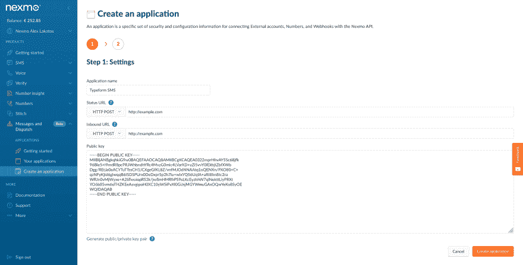
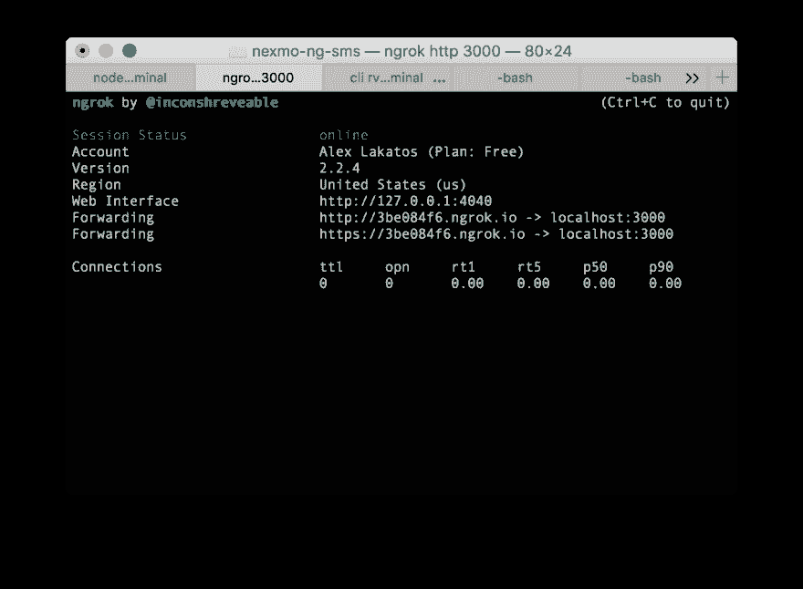
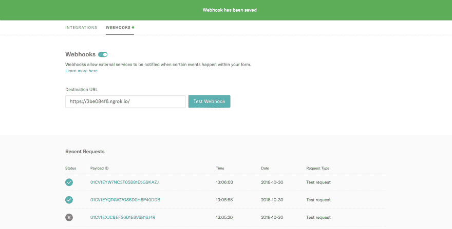

# 使用 Node.js、哈比神和 Messages API 提交类型表单时发送短信

> 原文：<https://dev.to/vonagedev/send-sms-when-your-typeform-is-submitted-using-nodejs-hapi-and-the-messages-api-3b8>

在本教程中，我们将学习如何在使用 [Nexmo 消息 API](https://developer.nexmo.com/messages/overview) 和 Node.js 框架[哈比神](https://hapijs.com/)提交[类型表单](http://typeform.com/)时发送短信。

这个示例将创建一个 webhook，您可以将它连接到您的 Typeform，当有人完成表单时，它会通知您。我们将使用 Nexmo Messages API 发送一条带有日期和链接的 SMS 消息来查看响应。

您可以从 GitHub 上的[NEX mo-community/NEX mo-type form-SMS](https://github.com/nexmo-community/nexmo-typeform-sms)库下载并运行这段代码。

## 先决条件

您需要创建帐户来为自己运行此操作，因此请确保您进行了以下设置:

*   一个 [Nexmo 账户](https://nexmo.com)
*   一个[类型的表格](https://www.typeform.com/)账户
*   [Ngrok](https://www.nexmo.com/blog/2017/07/04/local-development-nexmo-ngrok-tunnel-dr/) (这样外界就可以访问你本地机器上的应用程序)
*   [Nexmo 命令行界面](https://github.com/Nexmo/nexmo-cli)

这个例子的代码是使用 [Node.js](https://nodejs.org) 和 [hapi 框架](https://hapijs.com/)构建的。它将在 Node.js 版本 8.9.0 或更高版本上工作。

您可以通过在命令行上运行`node -v`来检查您的 Node 版本。如果数字是 8.9.0 或更高，那么你就可以开始了。如果不是，请使用旧版本的 hapi。

## 创建骨架应用程序

为了从 Typeform 接收一个传入的 webhook，您需要用至少一个`POST`路由设置一个应用程序。我们将从构建一个带有`POST`路由的基本应用程序开始。

在一个新文件夹中，通过运行
初始化一个新的 Node.js 应用程序

```
npm init -y 
```

Enter fullscreen mode Exit fullscreen mode

接下来，安装项目的依赖项:

```
npm i hapi nexmo@beta 
```

Enter fullscreen mode Exit fullscreen mode

### 创建 hapi 服务器

哈比神是一个简单易用的以配置为中心的框架。它使开发人员能够专注于编写可重用的应用程序逻辑，而不是花费时间构建基础架构。我喜欢它，因为它内置了对输入验证、缓存、身份验证和其他构建 web 和服务应用程序的基本工具的支持。

我们将通过在根目录中添加一个名为`index.js`的新文件来创建应用程序的主文件。这将是我们的 webhook 服务器。

在这个新文件中，添加以下代码:

```
const Hapi = require('hapi');

// create the hapi server and listen on port 3000
const server = Hapi.server({
  port: 3000,
  host: 'localhost'
});

// create a POST route for http://localhost:3000/
server.route({
  method: 'POST',
  path: '/',
  handler: (request, h) => {

    // return a 200 OK HTTP status code
    return h.response().code(200)
  }
});

// initialize the server using async/await
const init = async () => {
  await server.start();
  console.log(`Server running at: ${server.info.uri}`);
};

// log any error and exit
process.on('unhandledRejection', (err) => {
  console.log(err);
  process.exit(1);
});

// run the server
init(); 
```

Enter fullscreen mode Exit fullscreen mode

## 创建消息&调度申请

通过 [Nexmo 仪表板](https://dashboard.nexmo.com/messages/create-application)设置一个新的消息和调度应用程序。

对于这篇博文，您不需要入站或状态 webhook，所以您可以在这些字段中使用`http://example.com`。

[T2】](https://res.cloudinary.com/practicaldev/image/fetch/s--pf3yoetl--/c_limit%2Cf_auto%2Cfl_progressive%2Cq_auto%2Cw_880/https://www.nexmo.com/wp-content/uploads/2018/10/create-messages-application.png)

记住还要点击*生成公钥/私钥对*链接。这将下载一个名为`private.key`的文件。

在系统上找到`private.key`文件，并将其移动到应用程序的根文件夹中。

点击*创建应用程序*按钮，完成应用程序设置，完成配置。

记下您的应用程序 ID，您将在下一步中用到它。

## 使用消息 API 发送短信

这篇博文的最后一部分是接受 Typeform 发出的请求，并发送一条包含数据的 SMS 消息。

Nexmo 消息 API 将为我们处理这一切。我们将使用 [Nexmo 节点 JS 客户端库](https://github.com/Nexmo/nexmo-node/tree/beta)来发送 SMS。

如果您一直跟着我们，当我们创建框架应用程序时，您已经安装了库，现在您必须在`index.js`文件中需要它，并使用您的 API 密钥和秘密、前面步骤中的应用程序 ID 以及创建 Messages & Dispatch 应用程序时下载的`private.key`的路径来初始化`Nexmo`实例。

在`index.js`的顶部添加以下代码，确保用您自己的凭证替换`NEXMO_API_KEY`、`NEXMO_API_SECRET`、`NEXMO_APPLICATION_ID`和【T4:

```
const Nexmo = require('nexmo')

const nexmo = new Nexmo({
  apiKey: "NEXMO_API_KEY",
  apiSecret: "NEXMO_API_SECRET",
  applicationId: "NEXMO_APPLICATION_ID",
  privateKey: "NEXMO_APPLICATION_PRIVATE_KEY_PATH"
}) 
```

Enter fullscreen mode Exit fullscreen mode

我们还需要更新我们创建的路由处理程序，这样当提交类型表单时，它会向您发送一条 SMS 消息。别忘了把`YOUR_NUMBER`换成你的电话号码。输入电话号码时，不要使用开头的`+`或`00`，以国家代码开头，例如 447700900000。:

```
server.route({
  method: 'POST',
  path: '/',
  handler: (request, h) => {
    nexmo.channel.send(
      { "type": "sms", "number": "YOUR_NUMBER" },
      { "type": "sms", "number": "NEXMO" },
      {
        "content": {
          "type": "text",
          "text": `New submission in Typeform ${request.payload.form_response.definition.title} on ${new Date(request.payload.form_response.submitted_at).toDateString()}. You can view it at https://admin.typeform.com/form/${request.payload.form_response.form_id}/results#responses`
        }
      },
      (err, data) => { console.log(data.message_uuid); }
    );

    return h.response().code(200)
  }
}); 
```

Enter fullscreen mode Exit fullscreen mode

准备就绪后，运行以下命令启动服务器:

```
node index.js 
```

Enter fullscreen mode Exit fullscreen mode

该应用将在端口`3000`启动。

使用 Ngrok 向外界开放这个端口，并记下它为您生成的 URL。

[T2】](https://res.cloudinary.com/practicaldev/image/fetch/s--O3lzWGrr--/c_limit%2Cf_auto%2Cfl_progressive%2Cq_auto%2Cw_880/https://www.nexmo.com/wp-content/uploads/2018/07/start-ngrok.png%23no-border)

如果你以前没有使用过 Ngrok ，这里有一个方便的指南。

TLDR？您可以通过运行以下命令启动 Ngrok(如果安装了的话):

```
ngrok http 3000 
```

Enter fullscreen mode Exit fullscreen mode

## 将 webhook 连接到 Typeform

我们已经完成了 webhook，现在是时候将它连接到一个类型表单了。如果你需要帮助，在他们的帮助部分有一篇非常好的文章，告诉你如何将 webhook 连接到你的类型表单上。在 typeform guide 中，使用刚刚从上面的命令中获得的 ngrok URL，而不是 pastebin 作为目标 URL。

只要你点击`Test Webhook`查看它的工作情况，你就会收到一条包含详细信息的短信。

[T2】](https://res.cloudinary.com/practicaldev/image/fetch/s--Ud9-5DWY--/c_limit%2Cf_auto%2Cfl_progressive%2Cq_auto%2Cw_880/https://www.nexmo.com/wp-content/uploads/2018/10/webhook-typeform.png)

## 结论

我们使用了一个 hapi 服务器来设置一个 webhook，它连接到一个 Typeform，每当用户完成表单时，它就使用 Nexmo Messages API 发送一条 SMS 消息。你甚至可以做得更多，例如通过短信发送表格中的每个回复，或者甚至使用 [Facebook Messenger](https://developer.nexmo.com/messages/building-blocks/send-with-facebook-messenger) 来完成表格。

如果你想用 Nexmo APIs 做更多的事情，这里有一些基本的阅读材料可以帮助你:

*   开发者门户上的[消息 API](https://developer.nexmo.com/messages/overview) 和[调度 API](https://developer.nexmo.com/dispatch/overview) 的文档
*   关于[使用消息 API 发送和接收脸书消息的深入教程](https://www.nexmo.com/blog/2018/10/16/build-a-facebook-messenger-bot-with-messages-api-and-dialogflow-dr/)
*   如果你需要我们，试试 [Nexmo 社区 Slack 频道](https://developer.nexmo.com/community/slack)