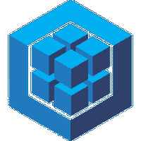

# Sequelize:类似于 Mongoose，但用于 SQL

> 原文：<https://dev.to/paigen11/sequelize-like-mongoose-but-for-sql-4nbm>

[T2】](///static/5390b874f7b1f0f3202e068cd1ce4848/772e8/sequelize.png)

## 简介

每个曾经构建过 MEAN 或 MERN 堆栈应用程序的人可能都熟悉**[mongose](https://mongoosejs.com/)**，这是一个非常有用的对象数据建模库，它使得使用 MongoDB 变得非常非常容易。由于这个应用程序堆栈非常受欢迎，所以有大约一千个教程(有些比其他的好得多)说明了如何一起使用 MongoDB、Express、React(或 Angular)和 Node.js。

想象一下，当我决定使用 MySQL(或 SQLite 或 PostgreSQL 或任何类型的 SQL 数据库)构建一个简单的全栈应用程序时，我有多惊讶，因为我几乎没有发现任何关于如何使用 Express 和 Node 来实现这一点的有意义的东西。真的吗？最近没有吗？没有经过深思熟虑的模块化架构？似乎没有人有好的方法来做到这一点——除了在`server.js`文件中写出实际的 SQL 查询来对数据库执行创建、读取、更新和删除(CRUD)操作之外，什么也没有。

然后，我发现 **[序列化](https://sequelize.org/)** ，一切都变了。

我想分享我在这里学到的东西，希望能把其他人从大量过时的教程中拯救出来，他们不知道 Sequelize 可以让在自己的节点应用中实现 SQL 数据库变得多么容易。

## 什么是 Sequelize？

Sequelize 的主页最好地总结了它到底是什么:

> Sequelize 是 Node.js v4 及更高版本的基于 promise 的 ORM。它支持方言 PostgreSQL、MySQL、SQLite 和 MSSQL，并具有可靠的事务支持、关系、读取复制等功能。- *序列化*

这是我发现的在 JavaScript 应用程序中用 SQL 处理数据库的最简单、最直接的工具。还有其他提供类似功能的选项。 **[Knex.js](https://knexjs.org/)** 是我想到的一个，但在比较了他们的 GitHub 统计数据后，我选择用 Sequelize 前进。

### 为什么要特别顺序化？

以下是一些帮助我做出决定的数据:

*   Sequelize 有超过 8000 个提交(Knex 只有不到 2000 个)，
*   它有 **375 个释放** (Knex 有 119 个)，
*   **694 贡献者** (Knex 有 237)，
*   它最近发布了 **beta 版本 5** (Knex 在 v0.15 上)，
*   而且它有一个 **CLI，TypeScript 和 GraphQL 集成** (Knex 没有)，
*   加上来自 NPM 的每月 883，000 次下载(Knex 每月不到 600，000 次)。

几乎在每一个方面(从数字上看)，Sequelize 都优于 Knex，所以我决定使用这个看起来非常稳定、文档良好、维护时间长且经常更新的库。

我会说 Knex 提供了原生的 Oracle 和 Amazon 红移支持，但是因为我不打算使用 Oracle DB，所以这不是我的主要卖点。

### 同獴相比

因此，当您使用 Sequelize 时，您可以获得 Mongoose 提供给 MongoDB 用户的许多相同类型的好处，外加一些好处:

*   能够通过很少的代码更改连接到多个不同类型的 SQL 数据库，
*   **对象模型**(类似于 Mongoose schemas)被类型化，映射到表，可以被需要，
*   基本的和更高级的**查询选项**，如`findAll/findOne`、`destroy`、`update`等。加上诸如分页、嵌套对象和关联之类的东西，
*   **连接池**，
*   **原始查询**，
*   还有更多我没时间讲了。

**[文档](https://sequelize.org/v6/)** 非常全面，显示了 Sequelize 相对于自己管理它能提供多少好处。

我还想指出的是，通过使用 Sequelize，您可以省去为适应数据库方言的细微变化而重写 SQL 查询的麻烦——无论您连接到哪种类型的数据库，您的`find`和`create`语句都不需要修改。我不知道你怎么想，但我是一个不那么努力的人。

Sequelize 还使用 promises via**[blue bird](http://bluebirdjs.com/docs/getting-started.html)**来控制它的异步控制流。所有这些意味着当你通过 Sequelize 查询数据库时，它会返回一个像这样的承诺。

```
User.findOne().then(user => {   
    console.log(user.get('firstName')); 
});

// returns user object's first name, like 'John' 
```

Enter fullscreen mode Exit fullscreen mode

这也意味着 Sequelize 可以很好地与 ES6 `async/await`功能协同工作，就像这样。

```
user = await User.findOne();  

console.log(user.get('firstName'));

// also returns user object's first name, like 'John' 
```

Enter fullscreen mode Exit fullscreen mode

## 如何在 Express.js 中实现 Sequelize

很好，现在你可以看到使用 Sequelize 的一些原因，你如何在你的项目中使用它？

每当看到样片或者教程，这总是我最大的疑问。我如何使用它？我该如何组织我的文件和程序结构，以便我只需做最少的修改就能轻松地交换功能？

下面是我想到的源文件结构(只包括服务器(API)文件夹)。这很简单，因为我试图做的项目并不特别复杂。但是它提供了足够的组织，使得通过 routes 文件夹添加 CRUD 功能变得容易，并且由于 models 文件夹，还可以定义一个或多个数据库模型。

```
root/
├── api/ 
| ├── server.js 
| ├── sequelize.js 
| ├── package.json
| ├── models/ 
| | ├── user.js
| ├── routes/ 
| | ├── deleteUser.js 
| | ├── findUser.js 
| | ├── loginUser.js 
| | ├── registerUser.js
| | ├── updateUser.js
| ├── data/ (optional depending on storage choice - like SQLite) 
| | ├── db/ 
| | | ├── storage.sqlite
| ├── node-modules/ 
```

Enter fullscreen mode Exit fullscreen mode

现在，您已经看到了文件结构，让我向您展示您的文件将包含什么。我将从 **`user.js`** 文件开始，因为它被导入到 **`sequlize.js`** 和 **`routes`** 文件中。

### 定义车型

下面是一个用户模型的代码。

**`user.js`**T3】

```
module.exports = (sequelize, type) => {
  return sequelize.define('user', {
    id: {
      type: type.INTEGER,
      primaryKey: true,
      autoIncrement: true
    },
    first_name: type.STRING,
    last_name: type.STRING,
    email: type.STRING,
    username: {
      type: type.STRING,
      allowNull: false
    }, 
    password: {
      type: type: STRING,
      allowNull: false
    }
  })
}; 
```

Enter fullscreen mode Exit fullscreen mode

因为我正在构建一个 **[用户注册应用程序](https://github.com/paigen11/mySqlRegistration)** ，所以我的用户模型文件非常简单。只是一个被设置为主键的 ID，将自动递增，名，姓，电子邮件，用户名和密码(两者都是必需的)。这很容易理解。

### 设置数据库连接

接下来是 **`sequelize.js`** 文件，这是我保存大部分数据库设置的地方，如果你想从 MySQL 数据库迁移到 SQLite 数据库，可以很容易地切换数据库。以下是 MySQL 连接的样子:

**`sequelize.js`**T3】

```
import Sequelize from 'sequelize';
import UserModel from './modes/user';

const sequelize = new Sequelize('dbname', 'admin', 'password', {
  host: 'db',
  dialect: 'mysql'
});

const User = UserModel(sequelize, Sequelize);

sequelize.sync()
  .then(() => {
    console.log('Users db and user table have been created');
  });

module.exports = User; 
```

Enter fullscreen mode Exit fullscreen mode

如您所见，首先，我用`sequelize`变量启动了到 MySQL 数据库的连接，给它一个数据库名称、用户名、密码，然后指定主机和方言。这就是全部了。

然后我添加了前面定义的`user`模型，`sequelize.sync()`函数将所有定义的模型同步到数据库中。这样，它会根据您提供的信息和传递给它的模型创建数据库和表。

最后，我导出前面定义的`User`常量，用于项目的其他部分，比如路线。

下面是 SQLite 连接的另一个示例，您可以从中看出区别:

**`sqliteSequelize.js`**T3】

```
import Sequelize from 'sequelize';
import UserModel from './modes/user';

const sequelizeSqlite = new Sequelize('dbname', 'admin', 'password', {
  host: 'sqlite',
  dialect: 'data/db/storage.sqlite'
});

const UserSqlite = UserModel(sequelizeSqlite, Sequelize);

sequelizeSqlite.sync()
  .then(() => {
    console.log('Users db and user table have been created with Sqlite');
  });

module.exports = UserSqlite; 
```

Enter fullscreen mode Exit fullscreen mode

一个到 SQLite 数据库的简单连接，存储在项目本身中。

除了对数据库设置的细微更改之外，文件中的其他内容保持不变。

### 定义路线

好了，我差不多完成设置了。

为了保持代码的模块化(并使我更容易从应用程序中添加或删除功能)，我将 CRUD 功能的每一部分作为一个单独的文件添加到数据库中。您可以将它们都添加到同一个文件中，并按型号或任何最容易组织的方式进行划分。

这是我的用户注册途径的一个例子(创建功能)。我通过使用 **[`bcrypt`](https://www.npmjs.com/package/bcrypt)** 在密码哈希中添加了，但现在那不重要。

**`registerUser.js`**T3】

```
import User from '../sequelize';
import bcrypt from 'bcrypt';

const BCRYPT_SALT_ROUNDS = 12;

module.exports = (app) => {
  app.post('/registerUser', (req, res) => {
    const data = {
      fist_name: req.body.first_name,
      last_name: req.body.last_name,
      email: req.body.email,
      username: req.body.username,
      password: req.body.password
    };

    if(data.password === '' || data.username === ''){
      res.json('username and password required');
    }
    User.findOne({
      where: {
        username: data.username
      }
    })
    .then(user => {
      if (user !== null) {
        console.log('username already taken');
        res.json('username already taken');
      } else {
        bcrypt.hash(data.password, BCRYPT_SALT_ROUNDS)
        .then((hashedPassword) => {
          User.create({
            first_name: data.first_name,
            last_name: data.last_name,
            email: data.email,
            username: data.username,
            password: hashedPassword
          })
        })
        .then(() => {
          console.log('user created');
          res.json('user created');
        })
      }
    })
    .catch(err => {
      console.log('problem communicating with db');
      res.status(500).json(err);
    })
  })
}; 
```

Enter fullscreen mode Exit fullscreen mode

从上面的代码中可以看出，用户模型是从`sequelize.js`文件导入的，用户输入数据是通过`req.body.xyz`字段从应用程序的客户端传递的，然后在添加新用户之前，我在 Sequelize 的帮助下对数据库进行了多次检查。

第一个检查是当我检查以确保用户提供了用户名和密码(如模型所要求的)，如果他们不在那里，服务器发送回错误消息`'username and password required'`。

检查之后，我查询数据库，看看这个用户名是否已经被使用，如果是，服务器再次将`'username is already taken'`发送回客户端。

如果通过检查，密码将被散列，用户信息将被保存到数据库中。一旦成功保存，它会向客户端`'user created'`发回一条成功消息。

整个创建操作都被打包，以防与服务器的通信出现问题(如服务器关闭、网络问题等)。)，它仍然可以向客户端发送消息，让它知道有问题。

### 向服务器添加路由

现在，我准备将这些路由添加到服务器中。这是最容易的部分。

**`server.js`**T3】

```
import express from 'express';
import Cors from 'cors';
import bodyParser from 'body-parser';
import logger from 'morgan';

const app = express();

app.use(Cors());
app.use(bodyParser.urlencoded({ extended: true }));
app.use(bodyParser.json());
app.use(logger('dev'));

require('./routes/loginUser')(app);
require('./routes/registerUser')(app);
require('./routes/findUsers')(app);
require('./routes/deleteUser')(app);
require('./routes/updateUser')(app);

app.listen(API_PORT, () => console.log(`Listening on port ${API_PORT}`));

module.exports = app; 
```

Enter fullscreen mode Exit fullscreen mode

你所要做的就是像我一样在你的`server.js`文件中要求路线，并让它们包含在你的 Express 应用程序中，这样你就完成了。没有比这更简单的了。

现在，您应该能够在 node . js Express 项目中随心所欲地使用任何类型的 SQL 数据库。

如果你想看一个完整的使用 Sequelize 的 MERN 堆栈示例，你可以在这里看到我的 repo。从主分支你可以运行 **`docker-compose build`** ，然后是 **`docker-compose up`** ，从`sqlite`特征分支你可以用`api/`和`client/`文件夹中的 **`npm start`** 分别启动客户端和服务器文件。

## 结论

Sequelize 为在 JavaScript 应用程序中使用 SQL 数据库带来了秩序和灵活性。它减少了编写原始查询、管理连接、防范有害的 SQL 攻击等等的需要。通过一些相当基本的设置，您也可以在自己的 JS 项目中使用 Sequelize 并有望加快您的开发时间。我肯定会继续使用这个工具。

过几周再来看看——我会写更多关于 JavaScript、React、IoT 或其他与 web 开发相关的东西。

如果你想确保你不会错过任何一篇文章，在这里注册我的时事通讯:[https://paigeniedringhaus.substack.com](https://paigeniedringhaus.substack.com)

感谢您的阅读，我希望这对您未来的数据库驱动项目有所帮助。

## 参考文献&进一步资源

*   [蒙古文](http://mongoosejs.com/)
*   测序
*   [Knex.js](https://knexjs.org/)
*   [bcrypt](https://www.npmjs.com/package/bcrypt)
*   使用 Sequelize 的 GitHub 回购 [MERN 应用](https://github.com/paigen11/mySqlRegistration)