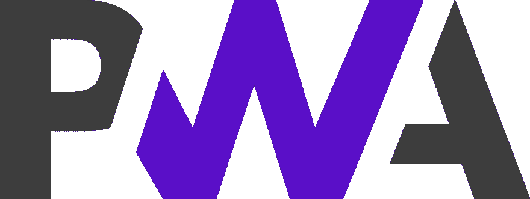

# 不过说真的。什么是渐进式网络应用？

> 原文：<https://dev.to/amberleyjohanna/seriously-though-what-is-a-progressive-web-app-56fi>

 

<figcaption>[【非官方】社区标识为 PWA](https://medium.com/samsung-internet-dev/we-now-have-a-community-approved-progressive-web-apps-logo-823f212f57c9)</figcaption>

我对“渐进式网络应用程序”(PWA)的概念已经很熟悉了。但我内心深处一直有一种渴望。

我参加过关于这个主题的会议和集会。我已经阅读了主要文档和顶级的“什么是 PWA”文章。我读过亚历克斯·罗素的帖子，“ [Progressive Web Apps:逃离标签而不失去我们的灵魂](https://infrequently.org/2015/06/progressive-apps-escaping-tabs-without-losing-our-soul/)”[*2015 年 6 月 15 日发布]* ，关于他自己和弗朗西斯·贝里曼之间的讨论，这是这个术语的起源，还有弗朗西斯的帖子，“[命名 Progressive Web Apps](https://fberriman.com/2017/06/26/naming-progressive-web-apps/)”[*2017 年 6 月 26 日发布* ]，关于围绕“progressive web app”这个术语本身的语义闹剧。

尽管如此，我还是发现很难确切、准确、简明地定义它(也就是说，基于具体的引用)。我在互联网上看到了类似的困惑。

一个这样的例子——[dev . to](https://dev.to/)的 [Ben Halpern](https://twitter.com/bendhalpern) ，在一篇名为“[的帖子中，到底什么是“渐进式网络应用”？说真的。](https://dev.to/ben/what-the-heck-is-a-progressive-web-app-seriously-923) " [ *发布于 2017 年 11 月 6 日，更新于 2018 年 04 月 21 日*:

> 今天早上，我写了一篇文章，概述了实现渐进式网络应用(PWA)的一些技巧。但当我开始介绍这个话题时，我再次遇到了整个话题中最难的部分:我真的很难描述一个进步的 web 应用程序 ***实际上是*** *。*

他捕捉了很多我的“这只是我吗？”感觉太:

> 也许 PWA 意味着包含许多技术方法，所以它们需要是模糊的。如果只是源文档是这样的话，这可能没问题，但我觉得分散在网络上的替代介绍和操作方法已经抓住了这种模糊的语言，混乱已经扩散。
> 
> 在社交场合很难说“等等，我一点都不明白”，因为你不知道其他人是不是都明白了，而你才是那个愚蠢的人。在 PWA 领域，我真的觉得有很多人在点头附和，认为其他人都明白 PWA 是什么，他们肯定遗漏了什么。你知道，冒名顶替综合症。 *【重点添加】*

另一个这样的例子是微软[*于 2018 年 2 月 6 日发布的这篇博客文章中承认的不确定性——当谷歌搜索“什么是渐进式网络”时，这是一个热门话题:*

> *开发者社区对 PWAs 的兴奋几乎是显而易见的——但是* ***在所有的兴奋中，很难确定一个单一、简洁、权威的“渐进式网络应用”的定义*** *【重点添加】*

就我个人而言，让我特别困惑的是，互联网的各个部分似乎都围绕着构成一个进步的网络应用的三个基本要求——但没有一个提到它来自哪里。在零引用的情况下，达到这种非官方的、广泛的一致对我来说是令人印象深刻的——它只是在互联网上回响。(而最糟糕的是？我有罪；我在“[一个基于浏览器的开源替代交流工具](https://css-tricks.com/a-browser-based-open-source-tool-for-alternative-communication/#article-header-id-7)”【*2018 年 3 月 14 日*发帖】中做了同样的事情。我记得当时对此感到矛盾)。

因为这一次我无法让自己从这个精神上的兔子洞转移开，我开始寻找:

1.  文档和帖子中通常引用的构成 PWA 的属性列表的来源，
2.  文件和帖子中通常引用的 PWA 的三个基线要求的来源，
3.  “渐进式网络应用”顶级搜索结果中的定义差异

最后，我将发布我对 PWA 定义的结论(不管它有什么价值)。

### 构成 PWA 的一般属性

这部分是结论性的。2015 年，亚历克斯·罗素[在网上推出了术语“渐进式网络应用”](https://infrequently.org/2015/06/progressive-apps-escaping-tabs-without-losing-our-soul/)。他讲述了自己和[弗朗西斯·贝里曼](http://fberriman.com/)的一次对话，在对话中，他们“列举了一类新的应用程序的属性”,这些属性是基于现代浏览器逐渐而强大的演变。这些属性是，逐字逐句:

*   响应迅速:适合任何外形规格
*   独立连接:逐步增强服务人员，让他们离线工作
*   类似应用程序的交互:采用外壳+内容应用程序模型来创建应用程序导航和交互
*   新鲜:由于服务人员的更新过程，始终保持透明的最新状态
*   安全:通过 TLS(服务人员的要求)提供服务，以防止窥探
*   可发现的:由于 W3C 清单和服务工作者注册范围允许搜索引擎找到它们，它们可以被识别为“应用程序”
*   可重新参与:可以访问操作系统的重新参与 ui；例如推送通知
*   可安装:通过浏览器提供的提示显示在主屏幕上，允许用户“保留”他们认为最有用的应用程序，而无需麻烦的应用商店
*   可链接:意味着它们零摩擦，零安装，易于共享。URL 的社会力量很重要。

### PWA 的三个基线标准

一个网站必须满足三个基本标准，才能成为网上的 PWA 回应。它们是:

> *   You need to work under HTTPS.
>     
>     
> *   You need a list of Web applications.
>     
>     
> *   You need a service person.

这尤其是从 Aaron Gustafson 的“[是的，那个 Web 项目应该是 PWA](https://alistapart.com/article/yes-that-web-project-should-be-a-pwa)”[*2017 年 8 月 30 日发布* ]一字不差地复制来的。我问亚伦，具体来说，这份明显规范的三人名单是从哪里来的(超越了模糊的、普遍的互联网伪共识)。

他让我去找杰里米·基思(Jeremy Keith)，在那里我重读了他的帖子，“HTTPS +服务人员+ web 应用清单= progressive web app ”。在这篇文章中，他引用了自己以前的一篇文章，“T2 在发展网络，他说:

> 实际上，任何网站都可以成为进步的网络应用:
> 
> *   切换到 HTTPS，
>     
>     
> *   用元捕获添加一个 JSON 清单文件，并
>     
>     
> *   添加服务人员。

后来，Jason Grigsby 发了一条推文，他问了我现在正在问的同样的问题——“我同意你关于构成 PWA 的三件事，但据我所知，你是第一个这样宣布的人。我错了吗？”他回应道:

> 我对此感到非常惊讶。我总是假设我在重复一个进步的 web 应用程序的三个组成部分，而不是定义它们。但是看看所有的文件，杰森可能是对的。这很令人惊讶，因为我认为这三样东西组成一个进步的 web 应用是显而易见的——因为它们是可测试的。

所以，没有确凿的来源。(目前为止。)

### “渐进式网络应用”顶级搜索结果中定义的变化

在这次聚会上，我想我应该回顾一下谷歌搜索结果中关于“渐进式网络应用”的五个不同定义。感谢上帝，我做到了，因为我发现了一个宝石(排队悬念)。

### 1。[谷歌开发者:渐进式网络应用](https://developers.google.com/web/fundamentals/codelabs/your-first-pwapp/)

> *渐进式网络应用是具有网络影响力的用户体验，并且是:*
> 
> [可靠](https://developers.google.com/web/progressive-web-apps/#reliable) —即时加载，即使在不确定的网络条件下也不会出现宕机。
> 
> [快速](https://developers.google.com/web/progressive-web-apps/#fast) —以丝滑流畅的动画快速响应用户交互，没有笨拙的滚动。
> 
> [引人入胜](https://developers.google.com/web/progressive-web-apps/#engaging) —感觉就像设备上的一个自然应用程序，具有身临其境的用户体验。

### 2。[谷歌开发者:你的第一个渐进式网络应用](https://developers.google.com/web/fundamentals/codelabs/your-first-pwapp/)

> [*渐进式网络应用*](https://developers.google.com/web/progressive-web-apps) *是结合了最好的网络和最好的应用的体验。从用户第一次访问浏览器选项卡开始，它们就非常有用，不需要安装。随着时间的推移，用户逐渐与应用程序建立关系，它会变得越来越强大。它加载速度很快，甚至在脆弱的网络上，发送相关的推送通知，在主屏幕上有一个图标，加载时是顶级的全屏体验。*

该参考资料还列出了规范的属性列表，但是增加了第十项:

> *渐进式——适用于所有用户，无论他们选择何种浏览器，因为它以渐进式改进为核心原则。*

### 3。[维基百科:渐进式网络应用](https://en.wikipedia.org/wiki/Progressive_Web_Apps)

> 渐进式网络应用程序(PWAs)是网络应用程序，它们是常规的网页或网站，但在用户看来却像传统应用程序或本地移动应用程序。应用程序类型试图将大多数现代浏览器提供的功能与移动体验的优势结合起来。

维基百科条目将 web 清单和服务工作者列为“常用技术”，以支持 PWA 的定义特征(它确实引用了 Berriman 和 Russell 的话)。

然后，瞧，在一个脚注中，维基百科条目将 PWA 的技术基线标准归功于(🥁)亚历克斯·拉塞尔，来自他的帖子:“[到底是什么让一个东西成为进步的网络应用？](https://infrequently.org/2016/09/what-exactly-makes-something-a-progressive-web-app/)"[*2016 年 09/12*发帖。(顺便说一下，这是宝石💎).

这让我很惊讶，原因有几个。第一，我以前怎么没在任何地方看到过这种引用？第二，具有讽刺意味的是，他在谷歌工作，据我所知，谷歌资源是没有具体引用这些基线要求的资源之一。

### 4。 [MDN:渐进式网络应用](https://developer.mozilla.org/en-US/docs/Web/Apps/Progressive)

> 渐进式 web 应用使用现代 web APIs 和传统的渐进式增强策略来创建跨平台的 web 应用。这些应用程序在任何地方都可以工作，并提供了几个功能，使它们具有与原生应用程序相同的用户体验优势。
> 
> pwa 应该是可发现的、可安装的、可链接的、独立于网络的、进步的、可重复使用的、响应迅速的和安全的。

就像 [Google Developers:你的第一个渐进式网络应用](https://developers.google.com/web/fundamentals/codelabs/your-first-pwapp/)页面一样，这个列表增加了“渐进式”，并且包含了来自 Russell/Berriman 列表的所有其他属性，出于某种原因，除了“新鲜”和“类似应用”之外？

### 5。[粉碎杂志:渐进式网络应用初学者指南](https://www.smashingmagazine.com/2016/08/a-beginners-guide-to-progressive-web-apps/)

> *一个进步的网络应用利用最新的技术* ***结合了最好的网络和移动应用*** *。把它想象成一个使用网络技术构建的网站，但是它的行为和感觉就像一个应用程序。浏览器、服务人员可用性以及缓存和推送 API 方面的最新进展使 web 开发人员能够允许用户在主屏幕上安装 web 应用程序，接收推送通知，甚至离线工作。*

它也列举了相同的特征，链接回谷歌开发者资源。它还提到 PWAs 是“谷歌最初提出的”。

### 结束这段不必要的旅程

现在，最后，我将提出我个人对 PWA 的定义:

“渐进式 web 应用程序”(PWA)既是一个关于构建网站的新理念的通用术语，也是一个包含三个明确的、可测试的基线要求的特定术语。

作为一个通用术语，PWA 方法的特点是努力满足以下一组属性:

1.  应答的
2.  连通性独立
3.  类似应用的互动
4.  新鲜的
5.  安全的
6.  发现的
7.  重新参与
8.  可安装
9.  可链接

具体来说，网站可以根据以下三个基准标准进行测试，以符合 PWA 的资格:

1.  它必须由 HTTPS 掌管。
2.  它必须包含 Web 应用程序清单。
3.  它必须实现一个服务工作者。

通用属性集首先由[亚历克斯·罗素和弗朗西斯·贝里曼](https://infrequently.org/2015/06/progressive-apps-escaping-tabs-without-losing-our-soul/)明确列举，三个需求集也可以归因于[亚历克斯·罗素](https://infrequently.org/2016/09/what-exactly-makes-something-a-progressive-web-app/)。

pwa 是通过 web 交付的应用程序(与通过商店打包和部署的原生应用程序相反)。正如[亚历克斯·罗素所说](https://infrequently.org/2015/06/progressive-apps-escaping-tabs-without-losing-our-soul/):

> 他们只是服用了所有正确维生素的网站。

### 引用帖子时间线:

*   "[进步的网络应用:逃离标签而不失灵魂](https://infrequently.org/2015/06/progressive-apps-escaping-tabs-without-losing-our-soul/)"[*2015 年 6 月 15 日发布*
*   "[到底是什么让一个东西成为一个进步的网络应用？](https://infrequently.org/2016/09/what-exactly-makes-something-a-progressive-web-app/)"[*2016 年 09 月 12 日发布*
*   "[命名渐进式网络应用](https://fberriman.com/2017/06/26/naming-progressive-web-apps/)"[*2017 年 6 月 26 日发布*
*   [“进展网](https://adactio.com/journal/12461)”【*2017 年 6 月 27 日发布*
*   "[是的，那个 Web 项目应该是 PWA](https://alistapart.com/article/yes-that-web-project-should-be-a-pwa)"[*2017 年 8 月 30 日发布* ]
*   “渐进式网络应用”到底是什么？说真的。 " [ *发布于 2017 年 11 月 6 日，更新于 2018 年 4 月 21 日* ]
*   [“欢迎渐进式网络应用进入微软 Edge 和 Windows 10](https://blogs.windows.com/msedgedev/2018/02/06/welcoming-progressive-web-apps-edge-windows-10/)”[*于 2018 年 2 月 6 日发布*
*   [“HTTPS+服务人员+ web app 清单= progressive web app](https://adactio.com/journal/13884)”【*2018 年 5 月 16 日发布*

附注:我大部分时间是在飞机上起草这篇文章的，没有无线网络。我意识到我忘了重新打开杰里米·基思的一个帖子，我本打算引用的。我点击了它，它就在那里，被缓存起来，准备供我离线阅读🙃