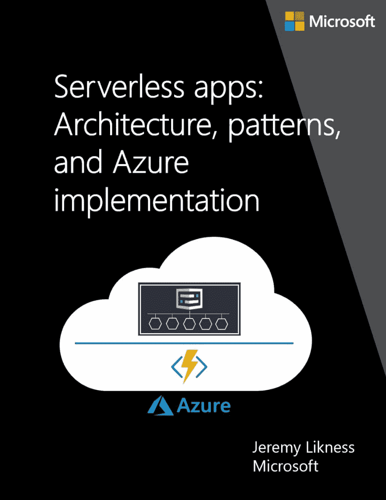

# 无服务器应用程序架构、模式和实现

> 原文：<https://dev.to/jeremylikness/serverless-application-architecture-patterns-and-implementation-4l5o>

#### 使用 Azure 功能、逻辑应用和事件网格实现的无服务器概述。

一年多前，我第一次在博客和推特上谈论无服务器。

> 使用#Azure 函数和#Blob 存储[https://t.co/nVc7wkiPzu](https://t.co/nVc7wkiPzu)创建并托管一个#无服务器 n 层#Angular 应用
> 
> — [@jeremylikness](https://twitter.com/jeremylikness/status/850433555830276096)

随着时间的推移，serverless 获得了如此大的发展势头，这让我感到很惊讶，我对 Azure 中可用于实现 serverless 的高级工具感到非常高兴。关于什么是无服务器，何时选择它，如何实现它，以及存在哪些适合无服务器的场景，仍然有很多困惑。为了填补这一知识空白，在过去的几个月里，我一直在从事一个项目，我很高兴地宣布这个项目昨晚刚刚发布:一本名为“[无服务器应用:架构、模式和 Azure 实现”的*免费*在线电子书。](https://jlik.me/duy)

[T2】](https://jlik.me/duy)

这本书首先概述了传统的架构模式和部署应用程序的方法。概述用于与无服务器进行比较/对比。然后，这本书涵盖了无服务器架构，包括需要考虑的挑战和各种设计方法。我展示了如何使用 Azure 无服务器平台实现无服务器，该平台包括 [Azure 功能](https://jlik.me/duz)、[逻辑应用](https://jlik.me/du0)和[事件网格](https://jlik.me/du1)。最后，我列出了一些业务案例和场景，这些案例和场景都链接到了示例和动手实验。

这本书可以在线浏览或下载 PDF 格式，它将为您提供一个了解无服务器计算能力的起点。

问候，

[T2】](https://res.cloudinary.com/practicaldev/image/fetch/s--u6zXBAsP--/c_limit%2Cf_auto%2Cfl_progressive%2Cq_66%2Cw_880/https://cdn-images-1.medium.com/max/197/1%2AKwXn3ElS7vnWIk8lNVhBsA.gif)

* * *