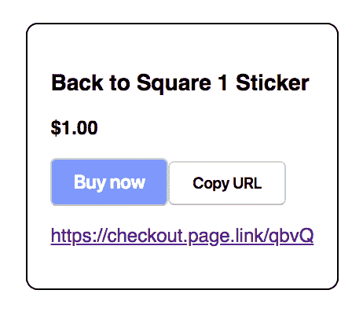

# 无服务器即时结账链接

> 原文：<https://dev.to/squaredev/serverless-instant-checkout-links-59mn>

服务器当心！小心集装箱！我们的无服务器领主来了！有很多关于无服务器的宣传，说它是容器的终结，但我们仍然没有看到该技术的大量采用(至少没有看到许多公司对此直言不讳)。我的希望是通过展示除了图像处理、ETL 或一般异步任务之外使用无服务器的不同方式，激发人们对这一领域的可能性的兴趣(但是对于这些事情来说，它真的很棒！).尽管如此，我们仍然坚持电子商务。

在之前的帖子中，我谈到了如何创建一个[超级简单的无服务器电子商务](https://developer.squareup.com/blog/super-simple-serverless-ecommerce)网站，使用 AWS Lambda 和 S3 进行无服务器结账支付。这让我想到创建一个稍微高级一点的东西——几乎任何 Square 卖家都可以使用它，让客户只需使用一个链接就可以立即购买产品。我们将通过 Firebase 查看我仅使用四个 Google Cloud 函数构建的应用程序的简单版本。从 AWS Lambda 切换到 Firebase 的想法是为了展示无服务器领域的不同平台产品，但也因为 Firebase 上有更多工具支持这种服务。这里还有一些不需要使用无服务器框架的例子。

该应用程序包括:

*   [OAuth 到 Square](https://developer.squareup.com/docs/basics/oauth/overview)

*   [通过 Firebase 进行用户管理](https://firebase.google.com/products/auth/)

*   [Firebase 上的静态托管](https://firebase.google.com/products/hosting/)

*   [云函数](https://firebase.google.com/products/functions/)(咄)

*   通过 [Firebase 动态链接](https://firebase.google.com/docs/dynamic-links/)的快捷链接

*   [方形目录 API](https://developer.squareup.com/docs/products/catalog/overview)

*   [方形结账 API](https://developer.squareup.com/docs/payments/checkout/overview)

[ ](//images.ctfassets.net/1wryd5vd9xez/4nzU7BHOVNBhzx4moUdQzf/3be5b70b7901dadb6d7f91b14c11f1c7/https___cdn-images-1.medium.com_max_2968_1_L8gYudVwq0gRP3SJFkgSwA.png) *警告！点击此图片实际上不会连接到您的 Square 帐户。*

应用程序的前端最初只是静态页面，但后来被重构为一个相当简单的 React 应用程序。这里主要关注的是使用无服务器函数来完成我们的处理。创建即时结账链接的第一步需要设置 OAuth，以获取用户的访问令牌。为此，我们将创建前两个函数，名为“authorize”和“code”。谷歌在解释如何在他们的网站上使用 Firebase CLI [方面做得很好，所以我们将跳过这一点。](https://firebase.google.com/docs/functions/get-started)

如果你不熟悉 OAuth，或者想通过 Square 了解更多关于 OAuth 的信息，请查看我之前的博客文章" [OAuth，你在哪里？](https://developer.squareup.com/blog/oauth-wherefore-art-thou)”。

现在，让我们深入了解一些非常非常棒的代码示例。

```
 const functions = require('firebase-functions');
const crypto = require('crypto');

exports.authorize = functions.https.onRequest((request, response) => {
  const squareAuthURL = "https://connect.squareup.com/oauth2/authorize?";
  const state = (crypto.randomBytes(32)).toString('hex');
  response.set('Set-Cookie', `__session=${state}; Secure`);

  response.send(
    squareAuthURL +
    `client_id=${functions.config().square.prod.app_id}&` +
    `response_type=code&` +
    `scope=MERCHANT_PROFILE_READ PAYMENTS_WRITE ORDERS_WRITE ITEMS_READ&` +
    `session=false&` +
    `locale=en-US&` +
    `state=${state}`
  );
}); 
```

在这里，我们只是创建一个字符串发送到客户端重定向我们的用户。这里的主要目的是生成我们的状态，创建 cookie，并在我们从 Square 获得将用户重定向回我们的回调时传递给我们进行验证。

```
exports.code = functions.https.onRequest((request, response) => {
  const tokenURL = "https://connect.squareup.com/oauth2/token";
  const redirectURI = "https://checkout-now.firebaseapp.com/callback";
  const cookieState = getSessionCookie(request.get('cookie'))
  const { code, state } = request.body;

  if (cookieState === state) {
    const { app_id, secret } = functions.config().square.prod;
    let access_token, id, email, name;
    return axios.post(tokenURL, {
        client_id: app_id,
        client_secret: secret,
        code: decodeURIComponent(code),
        redirect_uri: redirectURI
      })
      .then(token => {
        ({ access_token } = token.data);
        return axios.get("https://connect.squareup.com/v1/me", {
            "headers": {
              "Authorization": `Bearer ${access_token}`
            }
      }).then(user => {
        ({ id, email, name } = user.data);
        return createFirebaseAccount(id, email, name, access_token)
      }).then(firebaseToken => {
        return response.json({
          "email": email,
          "token": firebaseToken
        });
      }).catch(error => {
        console.log(error);
        return response.send(error);
      });
    });
  } else {
    console.log(`INVALID STATE: ${cookieState} === ${state}`);
    return response.send(`INVALID STATE: ${cookieState} === ${state}`);
  }
}); 
```

我们在这里做的不仅仅是从回调中获取访问令牌。我们使用用户的访问令牌查找用户的信息，然后在 Firebase 中为该用户的电子邮件创建一个帐户。这里的意图是不允许用户使用他们想要的任何电子邮件创建帐户，并严格地将它绑定到为他们的 Square 帐户设置的电子邮件。我们已经省略了`createFirebaseAccount()`函数的定义，因为这只是 Firebase 创建账户的另一个细节。

我们在一个非常好的地方！我们已经授权了我们的用户，收到了一个访问令牌，在 Firebase 中设置了用户，存储了他们的令牌，现在我们可以开始使用 Square 的 API 来生成我们的即时结账链接。

在我们的用户在他们的电子邮件中获得他们的登录链接并被重定向回我们的应用程序进行登录后，我们需要生成我们的链接发送给用户。这就是我们需要`catalog`函数的地方。

```
exports.catalog = functions.https.onRequest((request, response) => {
  let uid;
  admin.auth().verifyIdToken(request.body.idToken)
    .then(decodedToken => {
      ({
        uid
      } = decodedToken);
      return admin.database()
        .ref(`/squareAccessToken/${uid}`)
        .once('value')
    }).then(userToken => {
      (SquareConnect.ApiClient.instance).authentications["oauth2"]
        .accessToken = userToken.val();
      const catalogApi = new SquareConnect.CatalogApi();
      return catalogApi.listCatalog()
    }).then(catalog => {
      let formattedResponse = catalog.objects.map((elem) => {
        return axios.post(`https://firebasedynamiclinks.googleapis.com/v1/shortLinks?` +
          `key=${functions.config().web.key}`, {
            "longDynamicLink": `https://checkout.page.link/?` +
              `link=https://checkout-now.firebaseapp.com/checkout/` +
              `${(uid.split(":"))[1]}/${elem.item_data.variations[0].id}`,
            "suffix": {
              "option": "SHORT"
            }
          }).then(resp => {
          return {
            name: elem.item_data.name,
            catalogId: elem.id,
            varId: elem.item_data.variations[0].id,
            price: elem.item_data.variations[0].item_variation_data.price_money,
            checkoutUrl: resp.data.shortLink
          }
        }).catch(err => console.log(err))
      });
      return Promise.all(formattedResponse)
    }).then(values => {
      return response.json(values);
    }).catch(error => {
      console.log(error);
      response.send(error);
    });
}); 
```

这个函数有点复杂。我们接收发送给我们的令牌，解码 Firebase 令牌，查找我们的用户，获取他们的 Square 访问令牌，查询目录 API，遍历目录条目，创建条目对象列表，并创建短 url 链接以便使用。

深呼吸，单子上有很多。

[ ](//images.ctfassets.net/1wryd5vd9xez/2VfbSezW8iDOvHk7iBZEjo/51b86c4139f2a5bc7ab8e26b495fcec8/https___cdn-images-1.medium.com_max_2000_1_FAlgA0IPTybwJKnrSEXkcw.png) *这是我们结账链接的一个不太漂亮的例子。*

好了，休息结束。回去工作。

在目录链接中，我们正在构建一个遵循格式`/merchantId/catalogVariantId/`的 URL，它允许我们查找我们的 Square 商家，然后查找正在购买的商品。这可能有点令人困惑，因为我们还没有看到最终的函数。我们还有一个函数要复习:函数`checkout`。我们的`checkout`函数将处理查找商家、查找目录项目、创建方形结账 url，然后将用户重定向到该结账 URL 的过程。我们来看看这个函数是什么样子的。

```
const app = express();
app.get('/checkout/:userId/:variantId', (request, response) => {
  admin.database()
       .ref(`/squareAccessToken/square:${request.params.userId}`)
       .once('value')
    .then( userToken => {
      (SquareConnect.ApiClient.instance).authentications["oauth2"].accessToken = userToken.val();
      const catalogApi = new SquareConnect.CatalogApi();
      return catalogApi.retrieveCatalogObject(request.params.variantId)
    }).then( item => {
      const checkoutApi = new SquareConnect.CheckoutApi();
      const idempotencyKey = crypto.randomBytes(48).toString('base64');
      const locationId = item.object.present_at_location_ids[0];
      const checkoutReq = {
        idempotency_key: idempotencyKey,
        order: {
          idempotency_key: idempotencyKey,
          reference_id: Date.now().toString(),
          line_items: [
            {
              catalog_object_id: request.params.variantId,
              quantity: "1"
            }
          ],
        }
      }
      return checkoutApi.createCheckout(locationId, checkoutReq)
    }).then( returnedCheckout => {
      return response.redirect(returnedCheckout.checkout.checkout_page_url);
    }).catch( error => response.send(error));
});
exports.checkout = functions.https.onRequest(app); 
```

我们在这里通过将我们的函数包装成一个 Express 应用程序来改变事情。这使得解析路由变量变得更加容易，因此我们可以查找我们的商家和目录 id。因为我们的价格已经在 Square 中设定，所以我们需要做的就是将该项目作为订单中的行项目，生成我们的结帐链接，然后重定向！

坦率地说:这个例子遗漏了很多。这意味着作为一个概念的证明(这就是为什么我省略了应用程序的实际 URL ),因为有一些场景我们在这里没有真正处理，实际的商人可能会想要。首先，用于生成链接的`catalog`功能完全不考虑其他[项目变量](https://developer.squareup.com/docs/products/catalog/overview#catalog-items-versus-variations)(即 t 恤尺寸的大、中、小)。该函数只获取第一个变量。显然，这里可以做更多的事情来适应这一点，但重点是展示我们可以多么容易地获得即时结账链接。

除此之外，我们最好支持数字商品或具有统一运费的商品(我们需要捕获送货地址并添加运费的行项目，但 checkout API 支持这一点)。这很简单，但是如果我们想要动态运费，我们可能需要在流程的早期获取他们的地址，以创建包含运费的行项目。

在我上一篇关于[超级简单无服务器电子商务](https://developer.squareup.com/blog/super-simple-serverless-ecommerce)的文章中，我提到了冷启动真的会损害像结账体验这样的事情，因为功能有一段时间没有运行可能意味着启动缓慢。我们必须监控对那个`checkout`功能的影响，因为一个社交媒体帖子可能会大幅增加流量，并导致我们的功能的许多实例被旋转起来处理所有这些。希望如此多的人会使用这个特殊的功能，它可以合理地处理所有的流量。更令人担忧的问题可能是有这么多针对这个函数的调用的成本。您必须权衡大量函数调用的成本与仅让您自己的服务器处理这些请求的成本。尝试完全无服务器之前要考虑的所有事情！

我们希望这有助于激发一些关于你可以用无服务器做什么的想法，但更重要的是，我们希望它让你想尝试 Square 的 API！如果你有一个你正在做的项目，你想谈谈，支付的烦恼，或者只是想和一些开发者聊天，请查看下面的链接与我们联系！

*想要更多？[注册](https://www.workwithsquare.com/developer-newsletter.html?channel=Online%20Social&sqmethod=Blog)获得我们每月的开发者简讯，或者来 Square dev [Slack 频道](https://squ.re/slack)打招呼！*