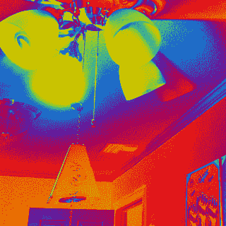

# 面向企业灯泡演示的无服务器物联网

> 原文：<https://dev.to/raymondcamden/serverless-iot-for-enterprise-light-bulb-demos-2lap>

在我开始之前，让我提出一个简短的警告。不，这不是企业演示。是的，它确实涉及到一个灯泡。这个帖子的灵感来自于 Burke Holland 昨天的帖子，关于他自己的灯泡/无服务器演示([用无服务器和颜色显示天气](https://css-tricks.com/displaying-the-weather-with-serverless-and-colors/))。不，我的帖子没有他的酷，但是是的，我会分享我办公室的一张照片，我*知道这张照片*酷得多。

几个月前，我收到了一个 [LB100](https://www.tp-link.com/us/products/details/cat-5609_LB100.html) “智能 Wi-Fi LED 灯泡”作为扬声器礼物。开箱即用，它有很大的 Alexa 集成。虽然听起来很蹩脚，但走进我的办公室，说一句“电脑，开着办公室灯”，每天都是一种小小的刺激。是的，我用这个人的声音说:

[T2】](https://res.cloudinary.com/practicaldev/image/fetch/s--GMnfW_PA--/c_limit%2Cf_auto%2Cfl_progressive%2Cq_auto%2Cw_880/https://static.raymondcamden.cimg/2018/04/makeitso.jpg)

虽然 Alexa 集成很好，但我很好奇是否有适合该设备的 API。虽然似乎没有官方的、有文档记录的 API(在我看来是对它的一个打击)，但我发现了不止一个，而是两个 npm 包:

*   [TP link-灯泡](https://www.npmjs.com/package/tplink-lightbulb)
*   [tplink-smarthome-api](https://www.npmjs.com/package/tplink-smarthome-api)

我发现第一个更容易一些，所以我坚持了下来。它既是一个 CLI，也是一个可以在代码中使用的包。为了使用它，你需要找出你的灯泡的 IP 地址。你用来设置设备的移动应用程序报告了 MAC 地址，所以我必须检查我的路由器以获得 IP: 10.0.1.5。

我自己的灯泡没有太多特点。例如，它不支持颜色。但是它可以变暗。所以在我的第一次测试中，我写了这个小脚本。

```
const TPLSmartDevice = require('tplink-lightbulb');

const light = new TPLSmartDevice('10.0.1.5')
light.power(true, 5000, {
    'brightness':100
})
.then(status => {
console.log(status);
})
.catch(e => console.error(e)); 
```

Enter fullscreen mode Exit fullscreen mode

第二个参数，`5000`，简单来说就是指灯泡应该用多长时间来改变亮度。我跑过去-瞧-天黑了。我对此有点兴奋。就一点点。但是，当然，如果没有服务器，这将会酷得多，对吗？

我跳到 [Webtask.io](https://webtask.io) 并创建了一个新的空函数。我添加了我的原始脚本使用的 npm 模块，并产生了这个小美人:

```
'use strict';

const TPLSmartDevice = require('tplink-lightbulb');

/**
* @param context {WebtaskContext}
*/
module.exports = function(context, cb) {

  const light = new TPLSmartDevice(context.secrets.ipaddress)

  light.power(true, 2000, { 'brightness':0});
  setTimeout(() => {
    light.power(true, 2000, { 'brightness':100})
    .then(status => {
      cb(null, {status:status});
    });
  },2100);

}; 
```

Enter fullscreen mode Exit fullscreen mode

那么嵌套和超时等等是怎么回事呢？虽然 light API 有一个回调，但它表示对硬件的成功调用。它并不代表操作的结束，在本例中是 2000 毫秒，还有其他网络延迟。因此，我使用了“调暗”操作的回调(将`brightness`设置为 0)来为*设置一个比我的第一个持续时间多一点的*，以启动另一个调用来再次点亮灯泡。

是的——这可以写得更好。我从 tplink-lightbulb 包的创作者( [David Konsumer](https://github.com/konsumer) )那里得到了很大的支持，他用一种更性感的方式写了这个包(虽然颠倒了):

```
import TPLSmartDevice from 'tplink-lightbulb'

// wait delay ms to resolve
const later = delay => new Promise(resolve => setTimeout(resolve, delay))

const light = new TPLSmartDevice('10.0.0.200')

const main = async () => {
  await light.power(true, 1000, {brightness: 100})
  await delay(1000)
  await light.power(true, 1000, {brightness: 0})
}
main() 
```

Enter fullscreen mode Exit fullscreen mode

伙计们，这就是为什么我不能通过谷歌面试！我的版本几乎准备好了，除了我必须打开一个端口。是的，我在我的网络上打开了一个端口。

[T2】](https://res.cloudinary.com/practicaldev/image/fetch/s--XcjWtPbt--/c_limit%2Cf_auto%2Cfl_progressive%2Cq_auto%2Cw_880/https://static.raymondcamden.cimg/2018/04/jb.jpg)

信不信由你，这实际上是如此的戏剧性，因为我不得不为他们的路由器找出端口和苹果的笨重接口。

但这很值得。我从 webtask 编辑器中复制了 URL，并将其设置为我的一个 GitHub repos 的 webhook。更糟糕的是，我还将它设置为一个 Netlify 钩子(我的主机),在构建完成时运行。现在，每当这些事件中的一个发生时，我的灯就会变暗，然后又变亮，这是一个很好的被动通知。

我试着拍了一段视频，但是虽然它在现实生活中看起来非常好，但视频并没有很好地表现它。因此我用它制作了一个非常恐怖的动画 gif:

[T2】](https://res.cloudinary.com/practicaldev/image/fetch/s--sTRbuOEi--/c_limit%2Cf_auto%2Cfl_progressive%2Cq_66%2Cw_880/https://static.raymondcamden.cimg/2018/04/badvid.gif)

我为此道歉。