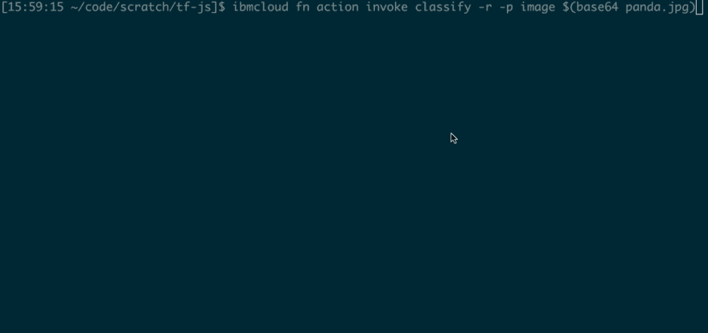
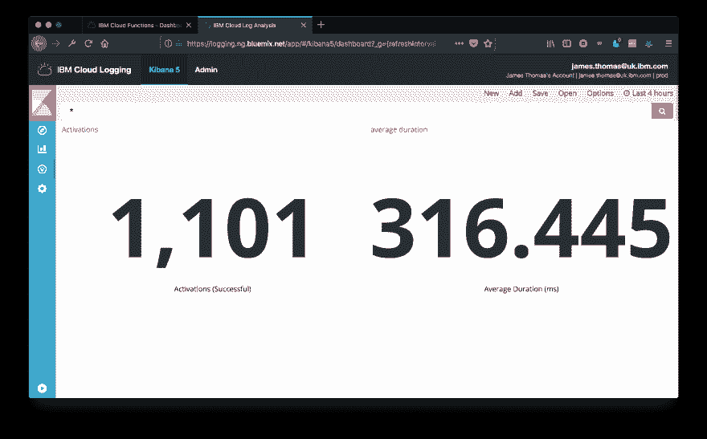
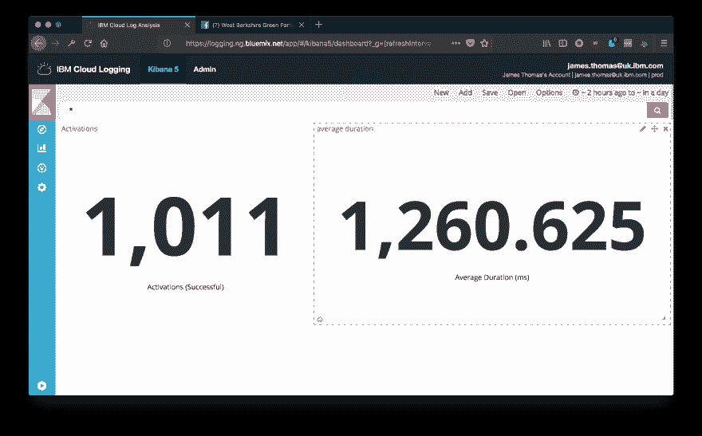

# 使用 TensorFlow.js 的无服务器机器学习

> 原文：<https://dev.to/jthomas/serverless-machine-learning-with-tensorflowjs-36eb>

在[之前的一篇博文](http://jamesthom.as/blog/2018/08/07/machine-learning-in-node-dot-js-with-tensorflow-dot-js/)中，我展示了如何在 Node.js 上使用 [TensorFlow.js](https://js.tensorflow.org/) 对来自本地文件系统的图像运行[视觉识别。TensorFlow.js 是 Google 开源机器学习库的 JavaScript 版本。](https://gist.github.com/jthomas/145610bdeda2638d94fab9a397eb1f1d#file-script-js)

一旦我用一个本地 Node.js 脚本完成了这个工作，我的下一个想法就是把它转换成一个无服务器的函数。在[IBM Cloud Functions](https://console.bluemix.net/openwhisk/)([Apache open whish](https://openwhisk.incubator.apache.org/))上运行这个函数会把这个脚本变成我自己的视觉识别微服务。

[T2】](https://res.cloudinary.com/practicaldev/image/fetch/s--YRF-ImjK--/c_limit%2Cf_auto%2Cfl_progressive%2Cq_66%2Cw_880/https://thepracticaldev.s3.amazonaws.com/i/jrugj4ot0kofa6drt609.gif)

听起来很简单，对吧？只是一个 JavaScript 库？所以，拉上拉链，我们走吧... ***咳咳*** 👊

*转换图像分类脚本以在无服务器环境中运行面临以下挑战...*

*   **TensorFlow.js 库需要在运行时可用。**
*   必须根据平台架构编译库的本地绑定。
*   需要从文件系统加载模型文件。

其中一些问题比其他问题更难解决！让我们先看看每个问题的细节，然后解释如何使用 Apache OpenWhisk 中的 [Docker 支持](http://jamesthom.as/blog/2017/01/16/openwhisk-docker-actions/)来解决所有问题。

## 挑战

### TensorFlow.js 库

Apache OpenWhisk 提供的 [Node.js 运行时](https://github.com/apache/incubator-openwhisk-runtime-nodejs)中不包含 TensorFlow.js 库。

通过从 zip 文件部署应用程序，可以将外部库[导入](http://jamesthom.as/blog/2016/11/28/npm-modules-in-openwhisk/)到运行时。zip 文件中包含的自定义`node_modules`文件夹将在运行时提取。Zip 文件被限制在最大 48MB 的。

#### 库大小

对所使用的 TensorFlow.js 库运行`npm install`揭示了第一个问题...产生的`node_modules`目录是 175MB。😱

看这个文件夹的内容，`tfjs-node`模块编译了一个[原生共享库](https://github.com/tensorflow/tfjs-node/tree/master/src)(`libtensorflow.so`)135m。这意味着再小的 JavaScript 代码也无法在神奇的 48 MB 限制下获得这些外部依赖。👎

#### 原生依赖

必须使用平台运行时编译`libtensorflow.so`本地共享库。在本地运行`npm install`会自动编译针对主机平台的本机依赖项。本地环境可能使用不同的 CPU 架构(Mac 与 Linux ),或者链接无服务器运行时中不可用的共享库。

### MobileNet 模型文件

TensorFlow 模型文件[需要从 Node.js 中的文件系统](https://js.tensorflow.org/tutorials/model-save-load.html)加载。无服务器运行时在运行时环境中提供了一个临时文件系统。在调用之前，部署 zip 文件中的文件会自动提取到这个环境中。在无服务器功能的生命周期之外，没有对该文件系统的外部访问。

MobileNet 模型的模型文件为 16MB。如果这些文件包含在部署包中，它将为应用程序源代码的其余部分留出 32MB。虽然模型文件足够小，可以包含在 zip 文件中，但是 TensorFlow.js 库呢？博文到此结束了吗？没那么快....

Apache OpenWhisk 对定制运行时的支持为所有这些问题提供了一个简单的解决方案！

## 自定义运行时

Apache OpenWhisk 使用 Docker 容器作为无服务器功能(动作)的运行时环境。所有平台运行时映像都[发布在 Docker Hub](https://hub.docker.com/r/openwhisk/) 上，允许开发者在本地启动这些环境。

开发者还可以在创建动作时指定定制的运行时图像。这些图片必须在 Docker Hub 上公开。定制运行时必须公开平台调用动作所使用的[相同的 HTTP API](https://github.com/apache/incubator-openwhisk/blob/master/docs/actions-new.md#action-interface) 。

使用平台运行时映像作为父映像使构建定制运行时变得简单。用户可以在 Docker 构建期间运行命令来安装额外的库和其他依赖项。父映像已经包含带有处理平台请求的 HTTP API 服务的源文件。

### TensorFlow.js Runtime

下面是 Node.js 动作运行时的 Docker 构建文件，带有额外的 TensorFlow.js 依赖项。

```
FROM openwhisk/action-nodejs-v8:latest

RUN npm install @tensorflow/tfjs @tensorflow-models/mobilenet @tensorflow/tfjs-node jpeg-js

COPY mobilenet mobilenet 
```

`openwhisk/action-nodejs-v8:latest`是 OpenWhisk 发布的 Node.js 动作运行时镜像[。](https://hub.docker.com/r/openwhisk/action-nodejs-v8/)

在构建过程中使用`npm install`安装 TensorFlow 库和其他依赖项。通过在构建过程中进行安装，`@tensorflow/tfjs-node`库的本机依赖项会针对正确的平台自动编译。

因为我正在构建一个新的运行时，所以我还将 [MobileNet 模型文件](https://github.com/tensorflow/tfjs-models/tree/master/mobilenet)添加到了映像中。虽然不是绝对必要的，但是从 action zip 文件中删除它们可以减少部署时间。

***想跳过下一步？使用这个图像 [`jamesthomas/action-nodejs-v8:tfjs`](https://hub.docker.com/r/jamesthomas/action-nodejs-v8/) 而不是构建你自己的。***

### 构建运行时

在[之前的博文](http://jamesthom.as/blog/2018/08/07/machine-learning-in-node-dot-js-with-tensorflow-dot-js/)中，我展示了如何从公共存储桶下载模型文件。

*   下载 MobileNet 模型的一个版本，并将所有文件放在`mobilenet`目录中。
*   将上面的 Docker 构建文件复制到名为`Dockerfile`的本地文件中。
*   运行 Docker [build 命令](https://docs.docker.com/engine/reference/commandline/build/)生成一个本地映像。

```
docker build -t tfjs . 
```

*   [用远程用户名和存储库标记本地映像](https://docs.docker.com/engine/reference/commandline/tag/)。

```
docker tag tfjs <USERNAME>/action-nodejs-v8:tfjs 
```

*用您的 Docker Hub 用户名替换`<USERNAME>`。*

*   [将本地图像](https://docs.docker.com/engine/reference/commandline/push/)推送到 Docker Hub

```
 docker push <USERNAME>/action-nodejs-v8:tfjs 
```

一旦 Docker Hub 上的映像[可用](https://hub.docker.com/r/jamesthomas/action-nodejs-v8/)，就可以使用该运行时映像创建动作。😎

## 示例代码

这个源代码将图像分类实现为一个 OpenWhisk 动作。使用事件参数上的`image`属性，图像文件作为 Base64 编码的字符串提供。分类结果作为响应中的`results`属性返回。

### 缓存加载的模型

无服务器平台按需初始化运行时环境以处理调用。一旦创建了一个运行时环境，它将被[重用，以进行进一步的调用](https://medium.com/openwhisk/squeezing-the-milliseconds-how-to-make-serverless-platforms-blazing-fast-aea0e9951bd0),但有一些限制。这通过从请求处理中消除初始化延迟(“冷启动”)来提高性能。

应用程序可以利用这种行为，通过使用全局变量来维护跨请求的状态。这通常用于[缓存打开数据库连接](https://blog.rowanudell.com/database-connections-in-lambda/)或存储从外部系统加载的初始化数据。

我已经使用这个模式[缓存了用于分类的 MobileNet 模型](https://gist.github.com/jthomas/e7c78bbfe4091ed6ace93d1b53cbf6e5#file-index-js-L80-L82)。在冷调用期间，模型从文件系统加载并存储在一个全局变量中。然后，热调用使用该全局变量的存在来跳过进一步请求的模型加载过程。

缓存模型减少了热调用分类的时间(从而减少了成本)。

### 内存泄漏

从 IBM Cloud Functions 上的 blog post 中运行 Node.js 脚本只需很少的修改。不幸的是，性能测试揭示了处理函数中的内存泄漏。😢

*阅读更多关于[tensor flow . js 如何工作的信息](https://js.tensorflow.org/tutorials/core-concepts.html)在 Node.js 上发现了这个问题...*

TensorFlow.js 的 Node.js 扩展使用原生 C++库在 CPU 或 GPU 引擎上执行张量。本机库中为张量对象分配的内存将一直保留，直到应用程序显式释放它或进程退出。TensorFlow.js 在单个对象上提供了一个`dispose`方法来释放分配的内存。还有一个`tf.tidy`方法可以自动清理一个帧内所有分配的对象。

回顾代码，张量被创建为来自图像的[模型输入。这些对象在从请求处理程序返回之前没有被释放。这意味着本地内存变得无限。添加一个显式的`dispose`调用，在返回](https://gist.github.com/jthomas/e7c78bbfe4091ed6ace93d1b53cbf6e5#file-index-js-L51-L59)[之前释放这些对象，修复了问题](https://gist.github.com/jthomas/e7c78bbfe4091ed6ace93d1b53cbf6e5#file-index-js-L91)。

### 剖析&表现

动作代码记录分类过程中不同阶段的内存使用情况和运行时间。

记录[内存使用情况](https://gist.github.com/jthomas/e7c78bbfe4091ed6ace93d1b53cbf6e5#file-index-js-L12-L20)允许我修改分配给该函数的最大内存，以获得最佳性能和成本。Node.js 提供了一个[标准库 API](https://nodejs.org/docs/v0.4.11/api/all.html#process.memoryUsage) 来检索当前进程的内存使用情况。记录这些值允许我检查不同阶段的内存使用情况。

定时[分类过程中的不同任务](https://gist.github.com/jthomas/e7c78bbfe4091ed6ace93d1b53cbf6e5#file-index-js-L71)，即模型加载、图像分类，让我深入了解分类与其他方法相比有多高效。Node.js 有一个[标准库 API](https://nodejs.org/api/console.html#console_console_time_label) ，用于计时器记录运行时间并打印到控制台。

## 演示

### 部署行动

*   使用 [IBM Cloud CLI](https://console.bluemix.net/openwhisk/learn/cli) 运行以下命令来创建操作。

```
ibmcloud fn action create classify --docker <IMAGE_NAME> index.js 
```

*将`<IMAGE_NAME>`替换为自定义运行时的公共 Docker Hub 映像标识符。如果您没有手动构建，请使用`jamesthomas/action-nodejs-v8:tfjs`。*

### 试探一下

*   从维基百科下载这张熊猫的图片。

[T2】](https://res.cloudinary.com/practicaldev/image/fetch/s--J9LVA8k8--/c_limit%2Cf_auto%2Cfl_progressive%2Cq_auto%2Cw_880/https://thepracticaldev.s3.amazonaws.com/i/su9xscczsrjvwgcjlpyx.jpg)

```
wget http://bit.ly/2JYSal9 -O panda.jpg 
```

*   使用 Base64 编码的图像作为输入参数调用动作。

```
 ibmcloud fn action invoke classify -r -p image $(base64 panda.jpg) 
```

*   返回的 JSON 消息包含分类概率。🐼🐼🐼

```
{  "results":  [{  className:  'giant  panda,  panda,  panda  bear,  coon  bear',  probability:  0.9993536472320557  }]  } 
```

### 激活详情

*   检索上次激活的日志记录输出，以显示性能数据。

```
ibmcloud fn activation logs --last 
```

***分析和内存使用详细信息被记录到 stdout***

```
prediction function called.
memory used: rss=150.46 MB, heapTotal=32.83 MB, heapUsed=20.29 MB, external=67.6 MB
loading image and model...
decodeImage: 74.233ms
memory used: rss=141.8 MB, heapTotal=24.33 MB, heapUsed=19.05 MB, external=40.63 MB
imageByteArray: 5.676ms
memory used: rss=141.8 MB, heapTotal=24.33 MB, heapUsed=19.05 MB, external=45.51 MB
imageToInput: 5.952ms
memory used: rss=141.8 MB, heapTotal=24.33 MB, heapUsed=19.06 MB, external=45.51 MB
mn_model.classify: 274.805ms
memory used: rss=149.83 MB, heapTotal=24.33 MB, heapUsed=20.57 MB, external=45.51 MB
classification results: [...]
main: 356.639ms
memory used: rss=144.37 MB, heapTotal=24.33 MB, heapUsed=20.58 MB, external=45.51 MB 
```

`main`是动作处理程序的总运行时间。`mn_model.classify`是图像分类所用的时间。冷启动请求打印一条额外的日志信息，包括模型加载时间，`loadModel: 394.547ms`。

## 性能结果

针对冷激活和热激活调用`classify`动作 1000 次(使用 256MB 内存)会产生以下性能结果。

### 温暖的祈愿

[T2】](https://res.cloudinary.com/practicaldev/image/fetch/s--7RTJoDm9--/c_limit%2Cf_auto%2Cfl_progressive%2Cq_auto%2Cw_880/https://thepracticaldev.s3.amazonaws.com/i/4i7ii902of646eww8vrq.png)

当使用温暖的环境时，分类平均需要 **316 毫秒来处理。查看计时数据，将 Base64 编码的 JPEG 转换为输入张量大约需要 100 毫秒。运行模型分类任务需要 200 - 250 毫秒。**

### 寒引素

[T2】](https://res.cloudinary.com/practicaldev/image/fetch/s--O17w9TOH--/c_limit%2Cf_auto%2Cfl_progressive%2Cq_auto%2Cw_880/https://thepracticaldev.s3.amazonaws.com/i/23h2f07sm3pm5fvq887r.png)

使用冷环境时，处理分类平均需要 **1260 毫秒。这些请求会导致初始化新的运行时容器和从文件系统加载模型的代价。这两项任务都花费了大约 400 毫秒。**

在 Apache OpenWhisk 中使用定制运行时映像的一个缺点是缺少预热的容器。预热通过在需要运行时容器之前启动它们来减少冷启动时间。非标准运行时映像不支持这一点。

### 分类成本

IBM Cloud Functions [提供每月 400，000 GB/s 的免费层](https://console.bluemix.net/openwhisk/learn/pricing)。每多执行一秒钟，每分配一 GB 内存收取 0.000017 美元的费用。执行时间四舍五入到最接近的 100 毫秒。

如果所有激活都是热激活，用户可以使用一个 256MB 的操作在自由层中每月执行**超过 4，000，000 个分类。一旦超出免费层，大约 600，000 次进一步调用的成本将超过 1 美元。**

如果所有激活都是冷激活，用户可以使用一个 256MB 的操作在自由层中每月执行**超过 1，200，000 个分类。一旦超出免费层，大约 180，000 次进一步调用的成本将超过 1 美元。**

## 结论

TensorFlow.js 为 JavaScript 开发者带来了深度学习的力量。通过 TensorFlow.js 库使用预先训练的模型，可以用最少的工作和代码轻松扩展 JavaScript 应用程序，完成复杂的机器学习任务。

获得一个本地脚本来运行图像分类相对简单，但是转换成无服务器功能带来了更多的挑战！Apache OpenWhisk 将最大应用程序大小限制为 50MB，而本地库依赖项远远超过了这个限制。

幸运的是，Apache OpenWhisk 的自定义运行时支持允许我们解决所有这些问题。通过使用本机依赖项和模型文件构建自定义运行时，这些库可以在平台上使用，而无需将它们包含在部署包中。