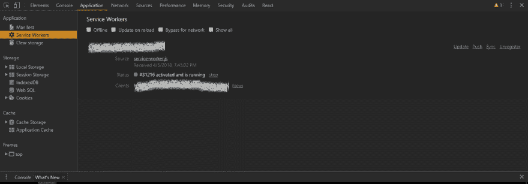
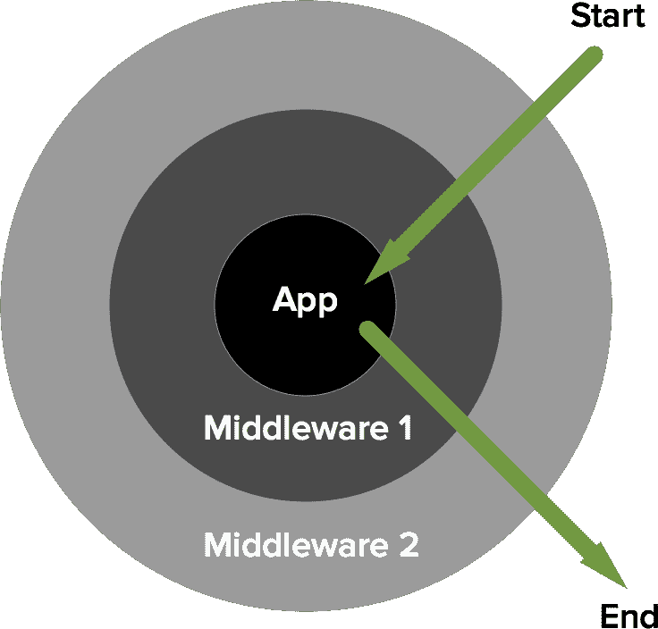
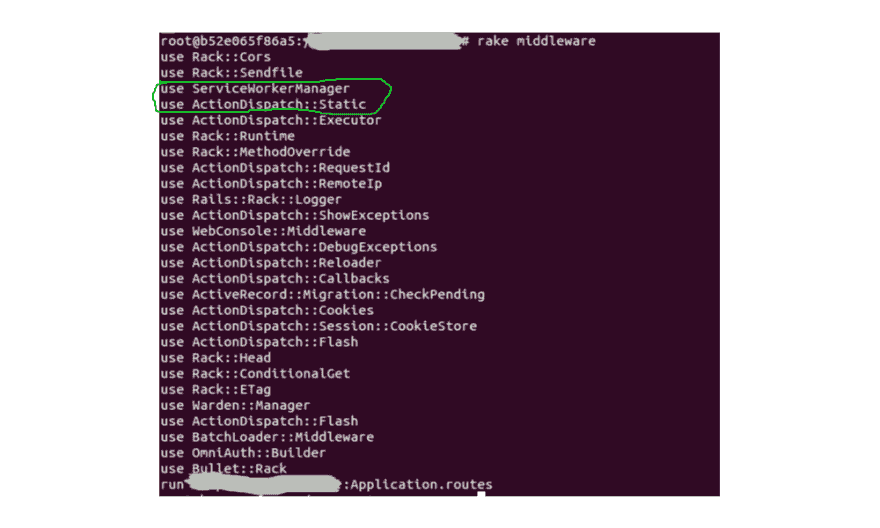

# 服务人员和 Rails 中间件

> 原文：<https://dev.to/usamaashraf/service-workers--rails-middleware-3im3>

HTML5 API 最有前途的特性之一是 [Web Workers](https://developer.mozilla.org/en-US/docs/Web/API/Web_Workers_API/Using_web_workers) 。JavaScript 当然是单线程的，因此会在等待任何长时间运行的同步操作时阻塞其事件循环。在浏览器上，这可能意味着界面冻结或更糟。但是当使用 Web Workers 时，这并不适用，因为它们完全是在后台运行的**隔离的浏览器线程**，与 Web 页面的上下文完全不同，因此不能访问 DOM、`window`或`document`对象。

[服务工作者](https://developer.mozilla.org/en-US/docs/Web/API/Service_Worker_API)是简单的特殊类型的网络工作者，由原始服务器安装，在后台运行，并且**允许对该服务器的请求被拦截**。所以它们有点像是在浏览器和服务器之间。服务工作者是现代渐进式网络应用(PWAs)的核心部分。

现在，比方说，你的网络中断了。由于有一个正在运行的进程可以拦截对你的站点的请求，我们可以编写这个进程来显示一个定制的、先前缓存的页面，而不是一个悲惨的、灰色的死亡页面。是化妆品。当然可以。但是相信我，你的终端用户会注意到的。不相信我？关闭您的 Wifi 并重新加载此页面。看起来很酷。

不可否认，这篇文章更像是对两个相对高级的主题的一次悠闲的游览，而不是对一个关键问题的完美解决方案(事实并非如此)。原因是...为什么不呢？

## 将我们的服务人员添加到浏览器

在 Rails 端，我将遵循这个目录结构来存储服务工作者脚本和离线资产:

```
app/
   ...
   public/
       ...
       service-worker.js
       offline/
               offline.html
               offline.css
               offline.jpg 
```

因此，相关的 URIs 将是`/service-worker.js`、`/offline/offline.html`等等。

以下脚本将在您的浏览器中注册给定的服务人员。在 Rails 上，只需将其转储到清单`application.js`(或者另一个位置的自定义清单文件)中就可以了。尽管使用单独的文件会好得多:

```
// app/assets/javascripts/application.js
navigator.serviceWorker.register('/service-worker.js')
        .then(function(reg) {
            console.log('Service worker registration succeeded!');
        }).catch(function(error) {
            console.log('Service worker registration failed: ' + error);
        }); 
```

之后，您可以在 Chrome DevTools 中看到以下内容:

[T2】](https://res.cloudinary.com/practicaldev/image/fetch/s--cufkOEZp--/c_limit%2Cf_auto%2Cfl_progressive%2Cq_auto%2Cw_880/https://thepracticaldev.s3.amazonaws.com/i/z8nv2e8vohm4ieosd36l.png)

注册可能由于以下原因而失败:

*   你的网站没有运行在 HTTPS 上(安全问题)。`localhost`也可以工作，因为它被认为是安全的，但是如果你在本地开发而不是在`localhost`上，比如说，一个无固定供应的虚拟机，只需将`localhost`上的流量转发到虚拟机 IP。如果我们的 dev 站点运行在`192.168.99.100:3000`上，下面是如何在 Windows 上创建代理的方法:

```
netsh interface portproxy add v4tov4 listenport=80 listenaddress=localhost connectport=3000 connectaddress=192.168.99.100 
```

*   服务人员文件与您的应用程序文件的来源不同(出于安全考虑，不能让服务人员处理向其他站点发出的请求！).

*   服务人员文件的路径不正确。它必须相对于原点。

一些过时的浏览器不支持服务人员，因为我将使用 ES6 和[缓存 API](https://developer.mozilla.org/en-US/docs/Web/API/CacheStorage) (用于存储离线页面)，让我们先检查它们的可用性:

```
// application.js

// Use feature-detection to check for ES6 support.
function browserSupportsES6() {
    try { eval("var foo = (x)=>x+1"); }
    catch (e) { return false; }
    return true;
}

// Use service workers only if the browser supports ES6, 
// the Cache API and of course Service Workers themselves.
if (browserSupportsES6() && ('caches' in window) && ('serviceWorker' in navigator)) {
    navigator.serviceWorker.register('/service-worker.js')
        .then(function(reg) {
            console.log('Service worker registration succeeded!');
        }).catch(function(error) {
            console.log('Service worker registration failed: ' + error);
        });
} 
```

好了，让我们进入故事的核心:服务人员本身。
注册后，浏览器会尝试**安装**，然后**激活**服务人员。这两者之间的区别很快就会变得清楚。现在，只要知道`install`事件只发生一次(对于同一个服务工作者脚本)就足够了，它是一个很好的地方来挂钩和获取&缓存我们的离线页面。
正如我前面提到的，服务人员可以拦截对服务器的请求。这是通过挂钩到`fetch`事件来实现的。

```
// service-worker.js

// Path is relative to the origin.
const OFFLINE_PAGE_URL = 'offline/offline.html';
// We'll add more URIs to this array later.
const ASSETS_TO_BE_CACHED = [OFFLINE_PAGE_URL];

self.addEventListener('install', event => {
    event.waitUntil(
        // The Cache API is domain specific and allows an app to create & name 
        // various caches it'll use. This allows for better data organization.
        // Under each named cache, we'll add our key-value pairs.
        caches.open('my-service-worker-cache-name').then((cache) => {
            // addAll() hits (GET request) all the URIs in the array and caches 
            // the results, with the URIs as the keys.
            cache.addAll(ASSETS_TO_BE_CACHED)
                .then(() => console.log('Assets added to cache.'))
                .catch(err => console.log('Error while fetching assets', err));
            })
    );
});

self.addEventListener('fetch', (e) => {
    // All requests made to the server will pass through here.
    let response = fetch(e.request)
        .then((response) => response)
        // If one fails, return the offline page from the cache.
        // caches.match doesn't require the name of the specific
        // cache in which the key is located. It just traverses all created
        // by the current domain and fetches the first one.
        .catch(() => caches.match(OFFLINE_PAGE_URL));

    e.respondWith(response);
}); 
```

传递给`event.waitUntil()`的承诺让浏览器知道你的安装何时完成，以及是否成功。
*与其他 AJAX 实现不同，使用[获取 API](https://developer.mozilla.org/en-US/docs/Web/API/Fetch_API) 通过`fetch`处理程序传递的请求“失败”并不意味着 4xx 或 5xx 响应，知道这一点很重要。这个承诺[只有在网络错误或者服务器](https://developer.mozilla.org/en-US/docs/Web/API/Fetch_API/Using_Fetch#Checking_that_the_fetch_was_successful)上的错误 CORS 配置的情况下才会失效。这正是我们想要的。*

因此我们的服务人员在其当前状态下可以工作。除...之外...

1.  我们的离线页面使用的资产(CSS，JS，图片等)怎么样？难道它们不应该像离线页面的 HTML 一样被缓存吗？

2.  如果我们想改变任何缓存的资产或页面本身，该怎么办？我们如何相应地更新浏览器上的缓存？

3.  如果我们改变我们的服务人员脚本呢？浏览器将如何进行更新？

所有有效的问题。让我们一个一个来对付他们。

1.  是的。只需将资产 URIs 添加到`ASSETS_TO_BE_CACHED`数组中，它们就会被缓存。在`fetch`处理程序中为这些资产添加一个简单的检查，从缓存中取出它们，只有在缓存中找不到它们时才命中服务器(理想情况下这永远不会发生)。

2.  缓存版本。每当您更改脱机页或其资产时，请重命名由服务人员创建的缓存，并删除所有其他具有不同名称的缓存(包括以前存储的缓存)。

3.  每次刷新页面时，浏览器都会与已安装的服务人员脚本进行逐字节比较，如果有差异，它会立即重新安装。这种比较也每隔 24 小时左右进行一次自动更新检查。当然，正如您可能已经猜到的，**浏览器将通过`Cache-Control`头缓存您的 Rails 应用程序提供的任何资产。如果我们的服务人员长时间保持缓存状态，那就糟了。我们需要即时更新。**在这里，我们将使用一个定制的 Rails 中间件来为我们的服务人员跳过报头。

*注意:新工人不会进入`activated`，即处于运行状态，直到上一个工人被移除。这需要一个新的会话(新标签)或手动更新(按钮在上面的 Chrome 控制台图片中可见)。大部分情况下我们不需要担心这个。*

```
// service-worker.js

// Changing the cache version will cause existing cached resources to be
// deleted the next time the service worker is re-installed and re-activated.
const CACHE_VERSION = 1;
const CURRENT_CACHE = `your-app-name-cache-v-${CACHE_VERSION}`;
const OFFLINE_PAGE_URL = 'offline/offline.html';
const ASSETS_TO_BE_CACHED = ['offline/offline.css', 'offline/offline.jpg', OFFLINE_PAGE_URL];

self.addEventListener('install', event => {
    event.waitUntil(
        caches.open(CURRENT_CACHE).then((cache) => {
            // addAll() hits all the URIs in the array and caches 
            // the results, with the URIs as the keys.
            cache.addAll(ASSETS_TO_BE_CACHED)
                .then(() => console.log('Assets added to cache'))
                .catch(err => console.log('Error while fetching assets', err));
            })
    );
});

self.addEventListener('activate', event => {
    // Delete all caches except for CURRENT_CACHE, thus deleting the previous cache
    event.waitUntil(
        caches.keys().then(cacheNames => {
            return Promise.all(
                cacheNames.map(cacheName => {
                    if (cacheName !== CURRENT_CACHE) {
                        console.log('Deleting out of date cache:', cacheName);
                        return caches.delete(cacheName);
                    }
                })
            );
        })
    );
});

self.addEventListener('fetch', (e) => {
    const request = e.request;
    // If it's a request for an asset of the offline page.
    if (ASSETS_TO_BE_CACHED.some(uri => request.url.includes(uri))) {
        return e.respondWith(
            caches.match(request).then((response) => {
                // Pull from cache, otherwise fetch from the server.
                return response || fetch(request);
            })
        );
    }

    let response = fetch(request)
        .then((response) => response)
        .catch(() => caches.match(OFFLINE_PAGE_URL));

    e.respondWith(response);
}); 
```

您可能会问为什么我们清除了之前缓存在`activate`中的资产，而不是`install`。**这样做是因为如果我们要清除`install`中过期的缓存，那么当时正在运行的 worker(因为新的 worker 还没有成为`activated`，所以仍然是旧的 worker)可能会因为对先前缓存的任何依赖而崩溃。**现在，在我们的案例中没有如此强烈的依赖性。但是这通常是一个好的实践，所以我选择遵循它。

## 好的，但是 Rails 中间件在哪里呢？还有对了，WTF 是中间件？

正如我在上面第 3 点中提到的，理想情况下，服务人员不应该被缓存，因为我们可能需要客户的浏览器尽快更新他们。这是我们的最终目标，而中间件只是实现这一目标的手段。可能有更好的方法来做这件事。比方说，通过 Nginx 提供资产，并将其配置为不使服务工作者可缓存。但是让我们这样做:

**中间件基本上是任何一段代码，它封装了 HTTP 请求和从服务器**接收的响应。这与《快递中的[概念非常相似。当一个请求通过整个中间件堆栈时，它会到达应用程序，然后作为完整的 HTTP 响应返回堆栈。
就我们而言，这是一些由我们的 Rails 应用程序生成的响应在返回到浏览器之前必须经过的代码。Rails 是一个基于](https://expressjs.com/en/guide/using-middleware.html)[机架的](https://rack.github.io/)框架，这就是允许我们使用这种结构的原因。不过，在这里进入 Rack 的细节可能有点矫枉过正。

[](https://res.cloudinary.com/practicaldev/image/fetch/s--Gdjxpwnr--/c_limit%2Cf_auto%2Cfl_progressive%2Cq_auto%2Cw_880/https://thepracticaldev.s3.amazonaws.com/i/ds47ctkp8hj8pw89pm2q.png) 
*来源:[https://philsturgeon . uk](https://philsturgeon.uk)*

Rails 中间件规范非常简单:它只需要实现一个`call`方法。让我们创建一个新目录`app/middleware`并放入一个新类:

```
# app/middleware/service_worker_manager.rb
class ServiceWorkerManager
  # We'll pass 'service_workers' when we register this middleware.
  def initialize(app, service_workers)
    @app = app
    @service_workers = service_workers
  end

  def call(env)
    # Let the next middleware classes & app do their thing first...
    status, headers, response = @app.call(env)

    dont_cache = @service_workers.any? { |worker_name| env['REQUEST_PATH'].include?(worker_name) }

    # ...and modify the response if a service worker was fetched.
    if dont_cache
      headers['Cache-Control'] = 'no-cache'
    end

    [status, headers, response]
  end
end 
```

我们需要注册我们的中间件:

```
# config/environments/development.rb

# ...

# Add our own middleware before the ActionDispatch::Static middleware
# and pass it an array of service worker URIs as a parameter.
config.middleware.insert_before ActionDispatch::Static, ServiceWorkerManager, ['service-worker.js'] 
```

如果你运行`rake middleware`，你会得到你的应用正在使用的所有中间件的列表:
[](https://res.cloudinary.com/practicaldev/image/fetch/s--eV7TahyL--/c_limit%2Cf_auto%2Cfl_progressive%2Cq_auto%2Cw_880/https://thepracticaldev.s3.amazonaws.com/i/lzt32p9ual9kn865xkw2.png)

正如我们所指定的，`ServiceWorkerManager`被添加到了`ActionDispatch::Static`之前。我们在这个特殊位置添加它的原因是因为`ActionDispatch::Static`是[用来服务来自`public`目录](http://api.rubyonrails.org/classes/ActionDispatch/Static.html)的静态文件，并且自动设置`Cache-Control`头。事实上，[静态文件请求甚至不经过中间件堆栈或应用程序的其余部分，而是立即返回](https://github.com/rails/rails/blob/efb935a5daf04cf3309453351f87faea4a3a2e6e/actionpack/lib/action_dispatch/middleware/static.rb#L121)。因此，通过将我们的中间件*放在*之前，传出的*响应将必须通过我们的中间件。*

下面是使用您自己的中间件类的两种替代方法:

```
# Add our middleware after another one in the stack.
config.middleware.insert_after SomeOtherMiddleware, MyMiddleware, params... 
```

```
# Appending our middleware to the end of the stack.
config.middleware.use MyMiddleware, params... 
```

我们完事了。加载你的站点，关闭你的本地服务器，尝试刷新页面查看`offline.html`。

*我有意省略了使用资产管道来传输、缩小我们的工作脚本和离线资产，因为这并不简单:指纹(总是随着资产内容变化的动态 URIs)&长期缓存头(我们刚刚摆脱了它)会给服务工作人员带来问题。这些都是[解释的&在这里解决得很好](https://github.com/rossta/serviceworker-rails):一个更好的方法来做我们刚刚做的一切 IMO :)*

离线页面缓存只是我使用的一个案例研究。服务人员可以用来实现更丰富的功能，如**后台同步、推送通知** &等。中间件也是如此:**定制请求日志、跟踪、节流**等。希望这是一次很好的学习经历，并激励你进一步探索这两个主题。