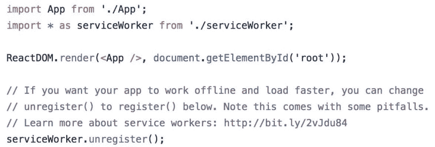

# 被认为有害的服务人员

> 原文：<https://dev.to/lgraubner/service-workers-considered-harmful-4fmm>

服务工作者是一项令人兴奋的新技术，它允许拦截网络流量。像保存内容供离线使用和高级缓存这样酷的事情是可能的。他们既强大又危险。

有很多事情可能会出错。用户可能再也得不到页面的新版本。从这种情况中恢复的唯一方法是移除本地服务工作者，这在页面重新加载和浏览器会话期间持续存在。不幸的是，这并不像清除浏览器缓存那样容易，普通用户会被糟糕的版本所困扰。

## 难以把握

而且这个问题不仅限于新手，即使是有经验的开发人员也恰好碰到那些问题。这项技术相当新，不太容易理解发生了什么(尽管不是不可能)。因此不同的抽象出现了，比如来自 Google 的[服务工作者预缓存](https://github.com/GoogleChromeLabs/sw-precache)。抽象使复杂的代码易于使用，但无助于理解它的含义。这很危险。

> 丹阿布拉莫夫[@丹 _ 阿布拉莫夫](https://dev.to/dan_abramov)服务人员在下一版本 Create React App 中是自愿加入的。它们是一项令人惊叹的技术，但今天的陷阱太大，不可能是一个好的默认。一两年后会重访！2018 年 1 月 19 日上午 00:22

最近, [Create React App](https://github.com/facebook/create-react-app) 的维护人员决定在 v2 中使用服务人员，而不是像以前那样默认启用。我认为这是向正确方向迈出的一步，因为只有在你仔细考虑和审查后才应该使用它。Kent C. Dodds 是 React 生态系统中的知名人士，他与一名服务人员发生了严重的问题，该服务人员阻止用户在更新的页面上看到购买按钮。这是可能发生的最坏情况。

> 肯特 c .多兹[@肯特多兹](https://dev.to/kentcdodds)[@ xwoody](https://twitter.com/xwoody)我们的服务人员很差😔很高兴你发现并购买了该课程！谢谢！2018 年 10 月 19 日上午 11:09

## 评估

不要误解我的意思:服务工作者是一项了不起的技术，对于进步的 web 应用和其他用例非常有用。但是在实现它们的时候，你必须非常小心。

出于上述原因，我决定从这个网站删除 [gatsby-plugin-offline](https://github.com/gatsbyjs/gatsby/tree/master/packages/gatsby-plugin-offline) 。这很简单，只需在 Gatsby.js 配置中添加一行就可以启用它，但代价是要相信其他人不会犯任何错误，这是不太可能的。挖掘它的努力和可能发生的斗争并不能满足这个网站的利益。

根据你自己和你的项目的需求来决定是否真的需要一个服务人员，并做出相应的行为。