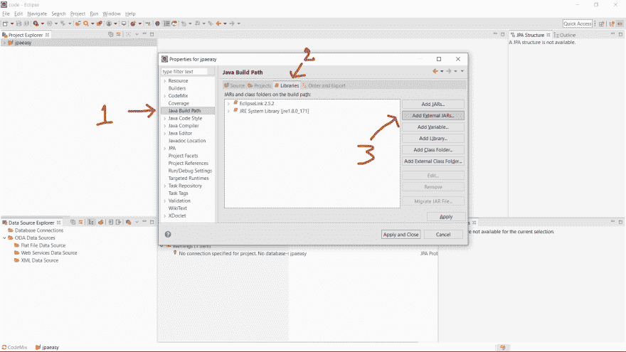

# jpa 环境集

> 原文：<https://dev.to/slumboy/set-enviroment-jpa--3i9d>

##### 开始足够了解

本章是一个资源的准备，以便我们开始了解您的 JPA 基础知识，以便更深入地联系您的 t1`ความจริง เราสามารถสร้างพร้อมกับ สร้างโปรเจคได้เลย ตามตัวอย่าง spring-boot + jpa ที่มีเยอะแยะตามเว็บครับ``ความจริง เราสามารถสร้างพร้อมกับ สร้างโปรเจคได้เลย ตามตัวอย่าง spring-boot + jpa ที่มีเยอะแยะตามเว็บครับ`。

* * *

#### 什么是设置好的

*   JAVA_HOME
*   [链接驱动连接 mysql](http://www.java2s.com/Code/Jar/c/Downloadcommysqljdbc515jar.htm)

* * *

##### 【1】创建一个新的项目，先生(应该不难。}

[T2】](https://res.cloudinary.com/practicaldev/image/fetch/s--bcErEghD--/c_limit%2Cf_auto%2Cfl_progressive%2Cq_auto%2Cw_880/https://thepracticaldev.s3.amazonaws.com/i/9dv7bn23a450l3j97tg0.png)

* * *

##### [t 1⾹2 照张相(如果有问题的话，请过来问)](#2-%E0%B8%97%E0%B8%B3%E0%B8%95%E0%B8%B2%E0%B8%A1%E0%B8%A3%E0%B8%B9%E0%B8%9B%E0%B8%A0%E0%B8%B2%E0%B8%9E%E0%B9%80%E0%B8%A5%E0%B8%A2%E0%B8%99%E0%B8%B0%E0%B8%84%E0%B8%A3%E0%B8%B1%E0%B8%9A-%E0%B8%96%E0%B9%89%E0%B8%B2%E0%B8%95%E0%B8%B4%E0%B8%94%E0%B8%9B%E0%B8%B1%E0%B8%8D%E0%B8%AB%E0%B8%B2-comment-%E0%B8%A1%E0%B8%B2%E0%B8%96%E0%B8%B2%E0%B8%A1%E0%B9%84%E0%B8%94%E0%B9%89%E0%B8%84%E0%B8%A3%E0%B8%B1%E0%B8%9A)

[T2】](https://res.cloudinary.com/practicaldev/image/fetch/s--k_k_ZuIg--/c_limit%2Cf_auto%2Cfl_progressive%2Cq_auto%2Cw_880/https://thepracticaldev.s3.amazonaws.com/i/1c59s63hu6cd4iizyh0w.jpg)

`*1 : ตั้งชื่อ project ครับ`
`*2 : เลือกตัวรันครับ ของผมใช้ jre1.8`
T2】

* * *

##### 【3】从第 2 步开始，如果没有问题，就可以得到这种类型的页面。

[T2】](https://res.cloudinary.com/practicaldev/image/fetch/s--s0FwqzkT--/c_limit%2Cf_auto%2Cfl_progressive%2Cq_auto%2Cw_880/https://thepracticaldev.s3.amazonaws.com/i/w7zyw7fsqwc6arhlurnk.png)

* * *

##### 【4】如果我们没有图书馆的身分，他不会让我们通过的，那就去装吧，先生，按下图中的小按钮。

[T2】](https://res.cloudinary.com/practicaldev/image/fetch/s--VkJ4XcuI--/c_limit%2Cf_auto%2Cfl_progressive%2Cq_auto%2Cw_880/https://thepracticaldev.s3.amazonaws.com/i/2yjz3ik9kmgzmnwcz6o2.jpg)

* * *

##### 【5】选择版本方便，我个人选择`ล่าสุด`，先生。

[T2】](https://res.cloudinary.com/practicaldev/image/fetch/s--nwormptM--/c_limit%2Cf_auto%2Cfl_progressive%2Cq_auto%2Cw_880/https://thepracticaldev.s3.amazonaws.com/i/a4w5ixb9mla8zp6efou7.png)

* * *

##### [t1¨6 就像正常程序的安装一样，先生，accept(说谎比读完并接受罪继续^_)](#6-%E0%B9%80%E0%B8%AB%E0%B8%A1%E0%B8%B7%E0%B8%AD%E0%B8%99%E0%B8%81%E0%B8%B1%E0%B8%9A%E0%B8%95%E0%B8%B4%E0%B8%94%E0%B8%95%E0%B8%B1%E0%B9%89%E0%B8%87%E0%B9%82%E0%B8%9B%E0%B8%A3%E0%B9%81%E0%B8%81%E0%B8%A3%E0%B8%A1%E0%B8%9B%E0%B8%81%E0%B8%95%E0%B8%B4%E0%B8%84%E0%B8%A3%E0%B8%B1%E0%B8%9A-%E0%B8%95%E0%B8%B4%E0%B8%81-accept-%E0%B9%82%E0%B8%81%E0%B8%AB%E0%B8%81%E0%B8%A7%E0%B9%88%E0%B8%B2%E0%B8%AD%E0%B9%88%E0%B8%B2%E0%B8%99%E0%B8%88%E0%B8%9A%E0%B9%81%E0%B8%A5%E0%B8%B0%E0%B8%A2%E0%B8%AD%E0%B8%A1%E0%B8%A3%E0%B8%B1%E0%B8%9A%E0%B8%9A%E0%B8%B2%E0%B8%9B-%E0%B9%80%E0%B8%9E%E0%B8%B7%E0%B9%88%E0%B8%AD%E0%B9%84%E0%B8%9B%E0%B8%95%E0%B9%88%E0%B8%AD-)

`*1 : ยอมรับบาปทุก กรณี`
T1】

* * *

##### 【7】可能还有纤维膜，但我们可以结束了，先生(开始在故事之外，请按照图来做)。

[T2】](https://res.cloudinary.com/practicaldev/image/fetch/s--N03twJef--/c_limit%2Cf_auto%2Cfl_progressive%2Cq_auto%2Cw_880/https://thepracticaldev.s3.amazonaws.com/i/f7cmtap9vb6tirmtkip0.jpg)

`*1 เราเลิกกัน ฉันดีเกินคน เชอะ~!`

* * *

##### 【8】如果已经到了此阶段，还有一个纤维组织{ \ t0 }没关系。

[T2】](https://res.cloudinary.com/practicaldev/image/fetch/s--T19UA3nv--/c_limit%2Cf_auto%2Cfl_progressive%2Cq_auto%2Cw_880/https://thepracticaldev.s3.amazonaws.com/i/pah1ktp7ro4ayn4f8cz5.jpg)

* * *

##### [t1⾹9 后来我们去了 add mysql 连接器，先生，要做一些关于 DB 的事情。](#9-%E0%B8%95%E0%B9%88%E0%B8%AD%E0%B8%A1%E0%B8%B2-%E0%B9%80%E0%B8%A3%E0%B8%B2%E0%B8%81%E0%B9%87%E0%B9%84%E0%B8%9B-add-mysql-connector-%E0%B9%80%E0%B8%82%E0%B9%89%E0%B8%B2%E0%B8%A1%E0%B8%B2%E0%B8%84%E0%B8%A3%E0%B8%B1%E0%B8%9A-%E0%B9%80%E0%B8%9E%E0%B8%B7%E0%B9%88%E0%B8%AD%E0%B8%88%E0%B8%B0%E0%B8%97%E0%B8%B3%E0%B8%AD%E0%B8%B0%E0%B9%84%E0%B8%A3%E0%B8%AA%E0%B8%B1%E0%B8%81%E0%B8%AD%E0%B8%A2%E0%B9%88%E0%B8%B2%E0%B8%87%E0%B9%80%E0%B8%81%E0%B8%B5%E0%B9%88%E0%B8%A2%E0%B8%A7%E0%B8%81%E0%B8%B1%E0%B8%9A-db)

[T2】](https://res.cloudinary.com/practicaldev/image/fetch/s--MsYW5FBU--/c_limit%2Cf_auto%2Cfl_progressive%2Cq_auto%2Cw_880/https://thepracticaldev.s3.amazonaws.com/i/v4c6y212twxh54kqwz63.png)

* * *

##### 10 提供一些工作图片

[T2】](https://res.cloudinary.com/practicaldev/image/fetch/s--9PessC0F--/c_limit%2Cf_auto%2Cfl_progressive%2Cq_auto%2Cw_880/https://thepracticaldev.s3.amazonaws.com/i/njjp7ph7mxn4c93n3tjn.jpg)

`*1 : เลือกแท็ป Java Build path`
`*2 : เลือกแท็ป library ดูให้ดีๆนะครับ หลายครั้งที่เรามักเข้าใจผิด เเล้วหาไม่เจอ`
`*3 : เลือก Add External JARs ที่เลือกตรงนี้ เพราะว่าเรา ไปโหลด mysql connector .jar มาเก็บไว้ที่เครื่องครับ`
`Add คือ เพิ่ม`
`External คือ จากเครื่องเราเอง`

* * *

##### 11 选择我们加载的 MySql 连接器文件

[T2】](https://res.cloudinary.com/practicaldev/image/fetch/s--6XijyM7L--/c_limit%2Cf_auto%2Cfl_progressive%2Cq_auto%2Cw_880/https://thepracticaldev.s3.amazonaws.com/i/qrvvhvn53n65nhvlc20l.jpg)

`*1 : ตอนโหลดมา เก็บไว้ที่ไหนก็ชี้ไปที่นั้นละครับ แตกไฟล์ก่อนด้วยนะ`
T1】

* * *