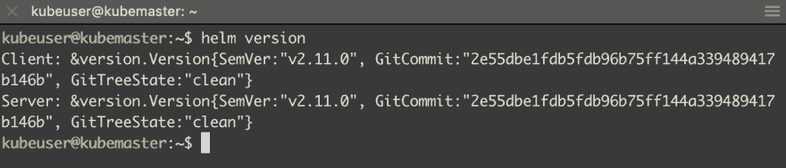

# 在虚拟机或裸机 kubernetes 集群上使用 letsencrypt 证书设置 nginx 入口

> 原文：<https://dev.to/pongsatt/set-up-nginx-ingress-with-letsencrypt-certificate-on-vms-or-bare-metal-kubernetes-cluster-j25>

这篇文章是在 kubernetes 集群(基于 VMs)上使用 cert-manager 设置 ingress 的指南，以便部署在集群上的应用程序可以自动申请 https 证书。

当我们通过云提供商使用 kubernetes 集群时，他们已经提供了基于其负载平衡器技术的入口机制。如果我们希望在基于虚拟机或裸机的集群上实现这一功能，我们需要自己进行设置。

这是系列文章[“在虚拟机上设置您自己的 kubernetes 集群”](https://dev.to/pongsatt/setup-your-own-kubernetes-cluster-on-vms-5ln)的一部分。

## 先决条件:

*   运行中的 kubernetes 集群
*   您拥有管理权限的域名

**注:**

> 对于那些跟随的人，您需要在主节点上运行一切

# 安装舵

首先，我们需要 helm，一个集群包管理器，它将帮助我们安装 ingress 和 cert-manager。

### 1.创建服务帐户及其权限

运行命令。

```
echo 'apiVersion: v1
kind: ServiceAccount
metadata:
  name: tiller
  namespace: kube-system
---
apiVersion: rbac.authorization.k8s.io/v1beta1
kind: ClusterRoleBinding
metadata:
  name: tiller
roleRef:
  apiGroup: rbac.authorization.k8s.io
  kind: ClusterRole
  name: cluster-admin
subjects:
  - kind: ServiceAccount
    name: tiller
    namespace: kube-system' | kubectl apply -f - 
```

### 2.安装舵

运行下面的命令从官方的 bash 脚本安装头盔。

*注意:您需要输入 root 密码。*

```
curl https://raw.githubusercontent.com/helm/helm/master/scripts/get | bash 
```

### 3.初始化舵

我们需要初始化 helm，以便在集群上安装服务器应用程序。

```
helm init --service-account tiller 
```

### 4.检查安装

运行`helm version`。

如果一切正常，你应该会看到。

[T2】](https://res.cloudinary.com/practicaldev/image/fetch/s--XbKHJbCm--/c_limit%2Cf_auto%2Cfl_progressive%2Cq_auto%2Cw_880/https://thepracticaldev.s3.amazonaws.com/i/4ukf0lo1qritsisdeyd5.png)

# 安装入口

我们将使用主机网络在所有工作节点(DaemonSet)上安装 nginx 入口。

参见本文档，了解有关 nginx 侵入的更多信息[裸机注意事项](https://kubernetes.github.io/ingress-nginx/deploy/baremetal)

### 1.安装入口舱

使用下面的舵命令安装。

```
helm install --name nginx-ingress --namespace nginx-ingress stable/nginx-ingress --set controller.hostNetwork=true --set controller.kind=DaemonSet 
```

在浏览器中打开您的一个工作节点 IP 地址。如果入口安装成功，您将看到。

[T2】](https://res.cloudinary.com/practicaldev/image/fetch/s--Y59FmJxE--/c_limit%2Cf_auto%2Cfl_progressive%2Cq_auto%2Cw_880/https://thepracticaldev.s3.amazonaws.com/i/aexnlwvy1jddsc96a2f8.png)

### 2.配置域名

配置您 dns，将您的测试域名指向您的一个工作节点。

在我的例子中，我将 route53 测试 dns 记录指向我的公共 IP。

[T2】](https://res.cloudinary.com/practicaldev/image/fetch/s--qeBSHEGT--/c_limit%2Cf_auto%2Cfl_progressive%2Cq_auto%2Cw_880/https://thepracticaldev.s3.amazonaws.com/i/mftgd7u72g64qgxhqfa2.png)

我还需要配置我的路由器，将端口 80 和 443 转发到我的一个工作节点。比如说 192.168.1.110。

[T2】](https://res.cloudinary.com/practicaldev/image/fetch/s--Stdqwnh2--/c_limit%2Cf_auto%2Cfl_progressive%2Cq_auto%2Cw_880/https://thepracticaldev.s3.amazonaws.com/i/brxpkrtzukdmtzp3762i.png)

### 3.部署测试应用程序

运行此命令将 hello world 应用程序部署到集群。

```
kubectl run hello-world --image=gcr.io/google-samples/node-hello:1.0  --port=8080
kubectl expose deployment hello-world --type=NodePort --name=example-service 
```

尝试使用节点端口`http://<master or worker ip>:<node port>`访问此应用程序。你应该看看。

[T2】](https://res.cloudinary.com/practicaldev/image/fetch/s--cd1JP1VL--/c_limit%2Cf_auto%2Cfl_progressive%2Cq_auto%2Cw_880/https://thepracticaldev.s3.amazonaws.com/i/j8fxoxk79wsikhu00q0u.png)

### 4.部署测试入口

运行以下命令安装测试应用程序的入口。

**注:**

> 请用您的真实域名替换**" testing RESS . your domain . com "**。

```
echo 'apiVersion: extensions/v1beta1
kind: Ingress
metadata:
  name: test-ingress
  namespace: default
  annotations:
    kubernetes.io/ingress.class: "nginx"
    kubernetes.io/tls-acme: "true"
    nginx.ingress.kubernetes.io/ssl-redirect: "false"
spec:
  tls:
  - hosts:
    - testingress.yourdomain.com
    secretName: testingress-tls
  rules:
  - host: testingress.yourdomain.com
    http:
      paths:
      - path: /
        backend:
          # The name of your service
          serviceName: example-service
          servicePort: 8080' | kubectl apply -f - 
```

如果一切正常，打开 url `http://testingress.yourdomain.com`你应该会看到。

[T2】](https://res.cloudinary.com/practicaldev/image/fetch/s--pnu36w0T--/c_limit%2Cf_auto%2Cfl_progressive%2Cq_auto%2Cw_880/https://thepracticaldev.s3.amazonaws.com/i/010n1txkx1i39g95i5ka.png)

# 安装证书管理器

我们将在群集中安装 cert-manager，然后为 letsencrypt 创建群集颁发者。集群发行者将自动检测我们的 tls 配置入口，然后尝试获取证书并将密钥存储在秘密名称“testingress-tls”中。

### 1.安装证书管理器

使用 helm 运行此命令。

```
helm install --name cert-manager --namespace kube-system stable/cert-manager 
```

### 2.创建集群颁发者(使用 http01 协议)

运行此命令创建群集颁发者。

**注:**

> 请将“[yourreal@email.com](mailto:yourreal@email.com)”替换为您的真实电子邮件

```
echo 'apiVersion: certmanager.k8s.io/v1alpha1
kind: ClusterIssuer
metadata:
  name: letsencrypt-prod
  namespace: default
spec:
  acme:
    email: yourreal@email.com
    server: https://acme-v02.api.letsencrypt.org/directory
    privateKeySecretRef:
      name: letsencrypt-prod
    http01: {}' | kubectl apply -f - 
```

运行以下命令以更新证书管理器，从而使用上面创建的群集颁发者。

```
helm upgrade cert-manager stable/cert-manager --namespace kube-system --set ingressShim.defaultIssuerName=letsencrypt-prod --set ingressShim.defaultIssuerKind=ClusterIssuer 
```

有时可能要等一个小时。然后运行`kubectl get secret`。如果你看到秘密名称“testingress-tls”，这意味着它工作。你应该可以成功访问`https://testingress.yourdomain.com`。

### 3.创建集群发布者(使用 dns01 协议)

如果使用 http02 协议的第 2 步不起作用，我们将需要一个更高级的协议“dns01”。

“dns01”协议支持许多云提供商，此示例将针对 route53。

#### 3.1 导入 IAM 策略

将此导入到您拥有访问密钥的 IAM 用户。

```
{
    "Version": "2012-10-17",
    "Statement": [
        {
            "Effect": "Allow",
            "Action": "route53:GetChange",
            "Resource": "arn:aws:route53:::change/*"
        },
        {
            "Effect": "Allow",
            "Action": "route53:ChangeResourceRecordSets",
            "Resource": "arn:aws:route53:::hostedzone/*"
        },
        {
            "Effect": "Allow",
            "Action": "route53:ListHostedZonesByName",
            "Resource": "*"
        }
    ]
} 
```

#### 3.2 创建 AWS 机密

创建 kubernetes 秘密使用下面。

**注:**

> 替换为您的真实密钥

```
kubectl create secret -n kube-system generic aws-secret --from-literal=secret-key=<IAM User Secret Key> 
```

#### 3.3 创建集群发布者(DNS01)

**注:**

> 用你真实的电子邮件代替 yourreal@email.com，用你真实的数据代替 T2

```
echo 'apiVersion: certmanager.k8s.io/v1alpha1
kind: ClusterIssuer
metadata:
  name: letsencrypt-prod
  namespace: default
spec:
  acme:
    email: yourreal@email.com
    server: https://acme-v02.api.letsencrypt.org/directory
    privateKeySecretRef:
      name: letsencrypt-prod
    dns01:
      providers:
      - name: aws-route53
        route53:
          hostedZoneID: <Route53 hosted zone ID>
          region: <Route53 region>
          accessKeyID: <IAM User Access key>
          secretAccessKeySecretRef:
            name: aws-secret
            key: secret-key' | kubectl apply -f - 
```

#### 3.4 更新测试入口以使用 DNS01

**注:**

> 将 yourdomain.com 替换到您的真实域中

```
echo 'apiVersion: extensions/v1beta1
kind: Ingress
metadata:
  name: test-ingress
  namespace: default
  annotations:
    kubernetes.io/ingress.class: "nginx"
    nginx.ingress.kubernetes.io/ssl-redirect: "false"
    certmanager.k8s.io/acme-challenge-type: "dns01"
    certmanager.k8s.io/acme-dns01-provider: "aws-route53"
spec:
  tls:
  - hosts:
    - testingress.yourdomain.com
    secretName: testingress-tls
  rules:
  - host: testingress.yourdomain.com
    http:
      paths:
      - path: /
        backend:
          # The name of your service
          serviceName: example-service
          servicePort: 8080' | kubectl apply -f - 
```

等到`kubectl get secret`返回秘密名“testingress-tls”，这表示它起作用了。你应该可以成功访问`https://testingress.yourdomain.com`。

[T2】](https://res.cloudinary.com/practicaldev/image/fetch/s--rDs8dCRw--/c_limit%2Cf_auto%2Cfl_progressive%2Cq_auto%2Cw_880/https://thepracticaldev.s3.amazonaws.com/i/lc7xmjk1ud212nr29pnd.png)

[T2】](https://res.cloudinary.com/practicaldev/image/fetch/s--oBZuF-KS--/c_limit%2Cf_auto%2Cfl_progressive%2Cq_auto%2Cw_880/https://thepracticaldev.s3.amazonaws.com/i/gb8f1ewrocwg91s3ro2f.png)

# 摘要

此时，我们有了一个 kubernete 集群，可以部署支持 https 应用程序。[接下来](https://dev.to/pongsatt/deploy-static-front-end-application-to-kubernetes-cluster-using-jenkins-cd-and-minio-with-automatic-https-cert-44gk)，我们将在 kubernetes 集群中设置一个静态前端应用程序。