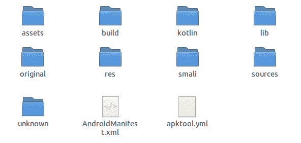

# 为攻击性安全设置您的 Android 应用程序

> 原文：<https://dev.to/shostarsson/set-up-your-android-app-for-offensive-security-24df>

正如我在之前一篇关于 Android 安全的文章中提到的，任何安全评估的第一部分都是收集关于应用程序的信息。

## 文章不再可用

* * *

当你知道合适的工具和如何使用它们时，在一个应用程序上完成它是非常容易的。

但是，如果你在各种应用程序上这样做，很快就会变得很困难。如果你是一名软件工程师(我敢肯定你是)，只要你做一件事超过 5 次，就可以让它自动化。🖥

这就是我在使用应用程序之前自动完成所有设置的原因。

* * *

> 那是什么设置？

这很简单。让我们考虑一下，你没有一个根化的 android 终端(此时你也不需要一个来进行安全测试)，你必须只是对应用程序进行一些更改。

使其可用于调试、允许备份、移除证书锁定。一旦完成，你就可以走了。

* * *

> 我该怎么做？

让我们从您的 android 手机中调出您想要使用的应用程序。

你想知道你想使用的应用程序的包名，所以列出所有的包并寻找你想使用的包。

```
> adb shell pm list packages 
```

Enter fullscreen mode Exit fullscreen mode

<center>

###### 列出您的 android 设备上的所有软件包

</center>

但这可能会导致大量的包裹需要检查。
让我们使用神奇的 grep 命令。

```
> adb shell pm list packages | grep insta 
```

Enter fullscreen mode Exit fullscreen mode

<center>

###### 假设您正在查找 instagram 包，并假设其中包含“insta”

</center>

现在我们需要 android 设备上的包的路径。

```
> adb shell pm path com.instagram.android 
```

Enter fullscreen mode Exit fullscreen mode

<center>

###### 让我们使用另一个流行的 adb 命令来检索 android 设备上的打包路径

</center>

并使用另一个 adb 命令从 android 设备下载到计算机。

```
> adb shell pull /pkg/path/on/device/pkg.apk /dest/on/computer 
```

Enter fullscreen mode Exit fullscreen mode

<center>

###### 将 apk 从 android 设备拖到计算机上

</center>

* * *

> 很好，现在我的电脑上有 apk 了。但是现在该怎么办呢？

拆解应用程序可能是个好主意。😉我假设您安装了 apktool，并把它放在您的路径中。

```
> apktool d /path/to/pkg.apk -f -o /path/to/disassemble/apk/ 
```

Enter fullscreen mode Exit fullscreen mode

<center>

###### 使用 apktool 拆开包装

</center>

你的文件夹里应该有这样的东西。

[](https://res.cloudinary.com/practicaldev/image/fetch/s--3Md8ZKrw--/c_limit%2Cf_auto%2Cfl_progressive%2Cq_auto%2Cw_880/https://cdn-images-1.medium.com/max/800/1%2AA2d4BApKHT0cI6KM_Coi2A.png)T3】

<center>

###### 经典的拆卸包文件夹

</center>

> 好的，我拆开了包装。我如何修改应用程序？

我们要修改的所有内容都位于应用程序上的 AndroidManifest.xml 文件中。

```
<?xml version="1.0" encoding="utf-8" standalone="no"?><manifest xmlns:android="http://schemas.android.com/apk/res/android" android:installLocation="auto" android:targetSandboxVersion="2" package="com.package">
    <uses-permission android:name="android.permission.CAMERA"/>
    ...
    <application android:icon="@mipmap/ic_launcher" android:label="@string/main_app_name" android:largeHeap="true" android:name="com.android.packagename" android:networkSecurityConfig="@xml/network_security_config" android:supportsRtl="false" android:theme="@style/Theme.App">
        <meta-data android:name="tapad.APP_ID" android:value="package-id-tracker"/>
        ...
    </application>
</manifest> 
```

Enter fullscreen mode Exit fullscreen mode

<center>

###### 反汇编包中的默认“AppManifest.xml”文件

</center>

要使应用程序可用于调试，您必须向清单添加 android:debuggable="true "属性。

```
<?xml version="1.0" encoding="utf-8" standalone="no"?><manifest xmlns:android="http://schemas.android.com/apk/res/android" android:installLocation="auto" android:targetSandboxVersion="2" package="com.package">
    <uses-permission android:name="android.permission.CAMERA"/>
    ...
    <application android:debuggable="true" android:icon="@mipmap/ic_launcher" android:label="@string/main_app_name" android:largeHeap="true" android:name="com.android.packagename" android:networkSecurityConfig="@xml/network_security_config" android:supportsRtl="false" android:theme="@style/Theme.App">
        <meta-data android:name="tapad.APP_ID" android:value="package-id-tracker"/>
        ...
    </application>
</manifest> 
```

Enter fullscreen mode Exit fullscreen mode

<center>

###### 可调试的应用程序清单

</center>

要允许该应用程序上的备份，您必须将 android:allowBackup="true "属性添加到清单中。

```
<?xml version="1.0" encoding="utf-8" standalone="no"?><manifest xmlns:android="http://schemas.android.com/apk/res/android" android:installLocation="auto" android:targetSandboxVersion="2" package="com.package">
    <uses-permission android:name="android.permission.CAMERA"/>
    ...
    <application android:allowBackup="true" android:debuggable="true" android:icon="@mipmap/ic_launcher" android:label="@string/main_app_name" android:largeHeap="true" android:name="com.android.packagename" android:networkSecurityConfig="@xml/network_security_config" android:supportsRtl="false" android:theme="@style/Theme.App">
        <meta-data android:name="tapad.APP_ID" android:value="package-id-tracker"/>
        ...
    </application>
</manifest> 
```

Enter fullscreen mode Exit fullscreen mode

<center>

###### 应用清单现在允许备份应用

</center>

* * *

> *我修改了一切，现在该怎么办？*

重建应用程序并安装在你的设备上看起来是一个很好的开始。😄Apktool 将成为我们重建应用的首选工具。

```
> apktool b /path/to/disassemble/apk/ -o  /path/to/disassemble/apk/dbg/pkg.b.apk 
```

Enter fullscreen mode Exit fullscreen mode

<center>

###### 使用 apktool 重新构建应用程序

</center>

你可以注意到我加了”。b”到新包的扩展。当我以后寻找这个包时，它将帮助我迅速知道这个包是这个包的“可调试”版本。

现在，我们必须对包进行签名，以便能够在设备上安装。

```
> keytool -genkey -v -keystore resign.keystore -alias alias_name -keyalg RSA -keysize 2048 -validity 10000
> cp /path/to/disassemble/apk/dbg/pkg.b.apk /path/to/disassemble/apk/dbg/pkg.b.s.apk
> jarsigner -verbose -sigalg SHA1withRSA -digestalg SHA1 -keystore resign.keystore /path/to/disassemble/apk/dbg/pkg.b.s.apk alias_name 
```

Enter fullscreen mode Exit fullscreen mode

<center>

###### 在包裹上签名

</center>

你可以注意到我加了”。s”到新包的扩展。这将有助于我快速确认这个包是该包的“可调试和已签名”版本，可以安装在我的设备上。

卸载应用程序，也就是现在在你的应用程序上的应用程序，然后重新安装你刚刚修改和重建的应用程序。它只需要两个 adb 命令。

```
> adb uninstall pkg.name.apk
> adb install /path/to/disassemble/apk/dbg/pkg.b.s.apk 
```

Enter fullscreen mode Exit fullscreen mode

<center>

###### 在设备上安装新应用程序

</center>

现在您已经在设备上安装了应用程序，您可以开始使用它了。

只需使用 adb shell 连接到您的设备，并在您使用该应用程序后开始查找设备上的文件泄漏。

```
> adb shell
$ run-as com.android.packagename
$ com.android.packagename 
```

Enter fullscreen mode Exit fullscreen mode

<center>

###### 连接到您的 android 设备，并开始探索本地存储

</center>

所以现在，一切都取决于你。您必须在设备本地存储中寻找相关的内容。

我将在另一篇文章中解释应该寻找什么，以及一些可以帮助您在应用程序上执行攻击性安全的工具。

* * *

正如你所看到的，在开始时做这样的事情来理解过程是很有趣的。但是几次之后，一次又一次地做同样的设置会让人精疲力尽。

这就是为什么我创建了下面的 Go 程序， [androSecTest](https://github.com/Shosta/androSecTest) ，它设置并开始执行一些攻击，如逆向工程、不安全的本地存储、不安全的日志记录和中间人攻击。

## [【shosta】](https://github.com/Shosta)/[【雄 sec test】](https://github.com/Shosta/androSecTest)

### 从这个应用程序，连接一部手机，从中提取任何应用程序，反编译，去泡沫，删除证书钉和重新打包。同时，对其进行静态和动态分析。

<article class="markdown-body entry-content container-lg" itemprop="text">

[](https://github.com/Shosta/androSecTest/stargazers)[](https://github.com/Shosta/androSecTest/stargazers)[](https://github.com/Shosta/androSecTest/stargazers)[](https://github.com/Shosta/androSecTest/network)[](https://github.com/Shosta/androSecTest/blob/master/LICENSE.md)[](https://github.com/Shosta/androSecTest/stargazers)

# Android-静态-安全-审计

这里有一个快速的备忘单来测试 Android 应用程序的安全性。

你可以在 Youtube 上快速浏览一下这个应用是如何测试一个安卓应用的:[https://youtu.be/zzyTFjnwolo](https://youtu.be/zzyTFjnwolo)

## 最简单的尝试方法

### 使用 docker 容器

1.  构建已经安装了所有依赖项和工具的 Docker 容器。

    > `docker build .`

2.  连接您的 Android 设备

    2.1.确保“adb 服务器”是运行在主机上的**而不是**，因为 android 手机在给定时间只能连接到一个 adb 服务器。

    2.2.MacOS 上主机设备到容器的 USB 连接不工作，所以暂时只在 Linux 主机上工作。

3.  运行 Docker 容器

    > `docker run -it --privileged -v /dev/bus/usb:/dev/bus/usb "The Container ID"`

    3.1 `-it`在这里，这样我们可以进行交互式会话。

    3.2.`--privileged` …

</article>

[View on GitHub](https://github.com/Shosta/androSecTest)

但最重要的是，它创建了一个可用于调试的应用程序，并将其自动安装在设备上(并在应用程序图标上添加一个漂亮的图标，以便您可以快速识别哪个应用程序可用于渗透测试)。所以它带来了这种设置的所有痛苦。此外，它为我提供了使用 Go 语言开发应用程序的机会，这对我来说是相当新的。

这里有一个应用程序运行的快速视频。

[https://www.youtube.com/embed/zzyTFjnwolo](https://www.youtube.com/embed/zzyTFjnwolo)

告诉我你是否觉得它有用，或者你是否需要其他功能。那对我来说意义重大。

* * *

感谢您花时间阅读本文。我希望您能够了解 Android 设备上攻击性安全的第一步以及自动化的好处。