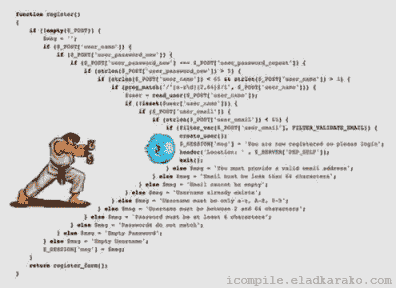

# setTimeout 是一个回调样式的函数。如果我们改变这种情况会发生什么？

> 原文：<https://dev.to/joelnet/settimeout-is-a-callback-style-function-what-would-happen-if-we-change-that-3fei>

[T2】](https://unsplash.com/photos/Ai7sV3SSMIQ)

如今，将节点风格的回调函数转换成承诺风格的函数是一种常见的做法。那么，为什么我们没有为`setTimeout`这样做呢？

比起节点式回调，更喜欢承诺式函数的主要原因是为了避免[回调地狱](http://callbackhell.com/)。

[T2】](https://res.cloudinary.com/practicaldev/image/fetch/s--1ppnEIAU--/c_limit%2Cf_auto%2Cfl_progressive%2Cq_66%2Cw_880/https://thepracticaldev.s3.amazonaws.com/i/a79vj0fvvdylajtcqz87.gif)

没人想看到这一幕。

看了一下`setTimeout`(而且是兄弟姐妹`setInterval`或者`setImmediate`，我可以清楚的看到这是一个回调式的函数。

```
setTimeout(callback, 1000);
//         --------
//                 \
//                   See that? Right there. A callback! 
```

然而，很少看到有人从回电变成承诺。`setTimeout`是如何在雷达下飞行的？`setTimeout`的与众不同足以获得通行证吗？

我说不。

# 节点样式回调函数

可能已经被忽略了，因为尽管它显然是一个回调样式的函数，但它不是一个节点样式的回调函数，这有一点不同。

首先，让我们看一下节点样式的回调，以便更好地了解区别。`fs.readFile`是一个很好的节点风格回调函数的例子。

```
fs.readFile(path[, options], callback)
//                           --------
//                          /
//    callback must be last 
```

而回调本身必须是这样的:

```
const callback = (err, data) => { /* ... */ }
//                ---  ----
//               /          \
//    error first             data last 
```

如果`setTimeout`是传统的节点风格回调函数，那么它可以很容易地用节点的`util.promisify`进行转换。这里有一个例子，说明使用`util.promisify`将`fs.readFile`转换成承诺式函数是多么容易。

```
import fs from 'fs'
import { promisify } from 'util'

const readFile = promisify(fs.readFile) 
```

可惜，`util.promisify`不行。第一，因为回调不是最后一个参数。第二，因为回调没有遵循`(err, data)`接口。

# 承诺超时

幸运的是，手动转换同样简单。我将调用新函数`sleep`。

```
const sleep = milliseconds => value => new Promise (resolve =>
  setTimeout(() => resolve(value), milliseconds)
) 
```

关于这段代码，我想指出几个关键点。

*   `sleep`是咖喱。稍后你会明白为什么。
*   `sleep`取一个`value`，然后解析出`value`。再说一遍，你稍后会明白为什么。

# 利用睡眠

现在，在代码中添加暂停就像使用承诺一样简单。

```
const log => msg => console.log(msg)

sleep(1000)('Hello World').then(log) 
```

这很好，但不是我写这篇文章的原因。

真正让我兴奋的是将它放入承诺链中间的能力。

在这个例子中，在 API 调用之间增加 1 秒钟的延迟是微不足道的。

```
import axios from 'axios'
import sleep from 'mojiscript/threading/sleep'

const fetchJson = url => axios.get(url).then(response => response.data)
const log = msg => (console.log(msg), msg)
//                                  -
//                                 /
//     comma operator. google it.

fetchJson('https://swapi.co/api/people/1')
  .then(log)
  .then(sleep(1000))
  .then(() => fetchJson('https://swapi.co/api/people/2'))
  .then(log)
  .then(sleep(1000))
  .then(() => fetchJson('https://swapi.co/api/people/3'))
  .then(log) 
```

因为`sleep`接受一个值作为输入，然后返回相同的值，所以它会将该值传递给下一个承诺。`sleep`基本成为无极链中间件。

让我们看看以异步/等待风格编写的代码:

```
import axios from 'axios'
import sleep from 'mojiscript/threading/sleep'

const fetchJson = url => axios.get(url).then(response => response.data)
const log = msg => (console.log(msg), msg)

const main = async () => {
  const people1 = await fetchJson('https://swapi.co/api/people/1')
  log(people1)
  await sleep(1000)
  const people2 = await fetchJson('https://swapi.co/api/people/2')
  log(people2)
  await sleep(1000)
  const people3 = await fetchJson('https://swapi.co/api/people/3')
  log(people3)
}

main() 
```

老实说，我喜欢`sleep`解决的问题，但是我不太喜欢我刚才演示的代码的语法。在这两个例子中，我实际上认为`async/await`语法是最差的。`await`到处都是，很容易出错。

# 异步功能组成

函数组合功能强大，可能需要阅读许多文章才能完全理解。不仅仅是方法，还有原因。如果要开始，我推荐从这里开始: [Functional JavaScript:日常使用的函数构成](https://hackernoon.com/javascript-functional-composition-for-every-day-use-22421ef65a10)。

我有意不在本文中解释函数组合。我相信我将要向您展示的语法非常简单，您根本不需要理解函数组合。

```
import axios from 'axios'
import pipe from 'mojiscript/core/pipe'
import sleep from 'mojiscript/threading/sleep'

const fetchJson = url => axios.get(url).then(response => response.data)
const log = msg => (console.log(msg), msg)

const main = pipe ([
  () => fetchJson('https://swapi.co/api/people/1'),
  log,
  sleep(1000),
  () => fetchJson('https://swapi.co/api/people/2'),
  log,
  sleep(1000),
  () => fetchJson('https://swapi.co/api/people/3'),
  log
])

main() 
```

该死的。这是一些好看的代码！

但是既然我们已经在讨论函数组合，那么将`fetchJson`、`log`、`sleep`提取到它自己的`pipe`中并使代码变得更加干巴巴是很容易的。

```
import axios from 'axios'
import pipe from 'mojiscript/core/pipe'
import sleep from 'mojiscript/threading/sleep'

const fetchJson = url => axios.get(url).then(response => response.data)
const log = msg => (console.log(msg), msg)

const fetchLogWait = pipe ([
  id => fetchJson (`https://swapi.co/api/people/${id}`),
  log,
  sleep(1000)
])

const main = pipe ([
  () => fetchLogWait (1),
  () => fetchLogWait (2),
  () => fetchLogWait (3)
])

main() 
```

# 异步映射

MojiScript 还具有独特的异步映射能力。(期待在不久的将来会有一整篇关于这方面的文章)。

异步映射是我决定使用 [MojiScript](https://github.com/joelnet/MojiScript) 的`pipe`而不是 [Ramda](https://ramdajs.com/) 的`pipeP`来编写这些例子的原因。到目前为止，这些例子在 Ramda 的`pipeP`中也能很好地工作。从现在开始，这些例子都是 MojiScript 专有的。

让我们看看一些代码！异步调用 ajax 有多容易？

```
const main = pipe ([
  ({ start, end }) => range (start) (end + 1),
  map (fetchLogWait),
])

main ({ start: 1, end: 3 }) 
```

相当简单！

[T2】](https://res.cloudinary.com/practicaldev/image/fetch/s--nG2-IALO--/c_limit%2Cf_auto%2Cfl_progressive%2Cq_auto%2Cw_880/https://thepracticaldev.s3.amazonaws.com/i/rfrzp33kbbj2u07hmsk3.jpeg)

都在一个可运行的代码块中:

```
import axios from 'axios'
import log from 'mojiscript/console/log'
import pipe from 'mojiscript/core/pipe'
import map from 'mojiscript/list/map'
import range from 'mojiscript/list/range'
import sleep from 'mojiscript/threading/sleep'

const fetchJson = pipe ([
  axios.get,
  response => response.data
]) 

const fetchLogWait = pipe ([
  id => fetchJson (`https://swapi.co/api/people/${id}`),
  log,
  sleep (1000)
])

const main = pipe ([
  ({ start, end }) => range (start) (end + 1),
  map(fetchLogWait),
])

main ({ start: 1, end: 3 }) 
```

现在这段代码已经尽可能的枯燥了！

# 在 for 循环中设置超时

现在，如果你还没有看到这个问题，它是在很多 JavaScript 采访中给出的。代码没有按预期运行。产量是多少？

```
for (var i = 1; i < 6; i++) {
  setTimeout(() => console.log(i), 1000)
} 
```

如果你没有猜到它会暂停 1 秒钟，然后一次打印 5 个`6`，那你就错了。

用`pipe`和 MojiScript 的`map`写的同一个程序。除了这个像预期的那样工作，打印数字 1 到 5，在每个输出之前有 1 秒钟的停顿。

```
const sleepThenLog = pipe ([
  sleep (1000),
  log
])

const main = pipe ([
  range (1) (6),
  map (sleepThenLog)
]) 
```

想多玩玩？[MojiScript:fizz buzz](https://dev.to/joelnet/getting-started-with-mojiscript-fizzbuzz-part-1-2fji)入门

# 事物谷歌

*   [回调地狱](http://www.google.com/search?q=JavaScript+Callback+Hell)
*   [逗号运算符](http://www.google.com/search?q=JavaScript+Comma+Operator)
*   [功能组成](http://www.google.com/search?q=JavaScript+Function+Composition)
*   [拉姆达](https://ramdajs.com)
*   [MojiScript](https://github.com/joelnet/MojiScript)

# 总结

将 sleep 转换成 promise 风格的函数为异步代码的运行方式提供了额外的选择。

Ramda 的`pipeP`或者 MojiScript 的`pipe`有时候会比`Promises`或者`async/await`更干净。

异步映射功能强大。

下面指出的一个警告是，这个实现不允许取消。所以如果需要`clearTimeout`，就需要修改这个函数。

我的文章是非常实用的 JavaScript，如果你需要更多，请在这里关注我，或者在 Twitter 上关注我！

**看我的其他文章:**

[为什么异步代码如此令人困惑(以及如何让它变得简单)](https://dev.to/joelnet/why-async-code-is-so-damn-confusing-and-a-how-to-make-it-easy-3441)

[在把 90%的 JavaScript 扔进垃圾桶后，我是如何重新发现自己对它的热爱的](https://hackernoon.com/how-i-rediscovered-my-love-for-javascript-after-throwing-90-of-it-in-the-trash-f1baed075d1b)

[T2】](https://res.cloudinary.com/practicaldev/image/fetch/s--PqqJmrxK--/c_limit%2Cf_auto%2Cfl_progressive%2Cq_auto%2Cw_880/https://thepracticaldev.s3.amazonaws.com/i/6jsy3a866frzp3u5oda0.jpg)