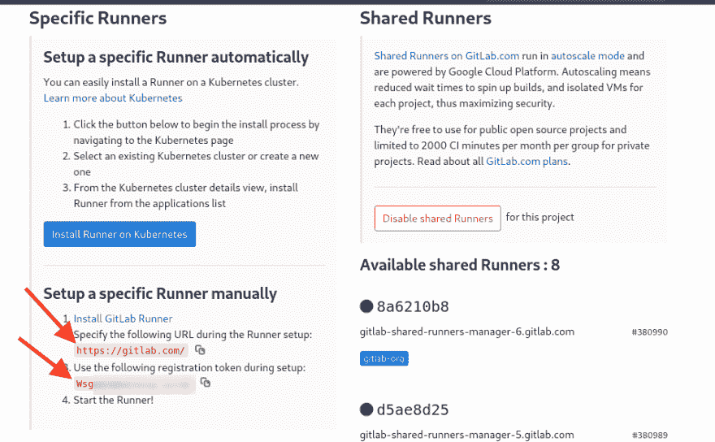

# 在阿里云 ECS 上设置基于 Docker 的 Gitlab Runner

> 原文：<https://dev.to/idoko/setting-up-a-docker-based-gitlab-runner-on-alibaba-cloud-ecs-1o8g>

Gitlab 提供了几个惊人的特性，其中之一是它使用 GitlabCI 的持续集成/交付工具。默认情况下，你的构建是在 gitlab 的服务器上免费运行的，在私人项目中最多 2000 分钟，之后你要么付费升级计划，要么使用自己的服务器。在本指南中，我们将在我们的阿里云 ECS 实例上设置一个私有 gitlab runner，同时在 gitlab 上托管我们的项目。

### 入门

首先，让我们创建一个阿里云 ECS 实例(如果还没有的话),它至少有 1GB 的内存，并使用 Debian、CentOS 或 Ubuntu 作为我们的基本操作系统。对于本指南，我们将使用 Ubuntu 版本 16.04。如果你完全是新手，阿里云文档为你创建第一个 ECS 实例提供了极好的指导。
本指南的其余部分将主要是基于命令行界面的，所以一个非常简单的命令行将会受到欢迎😄。

### 你好 Docker

我们的下一步是在 ECS 实例上安装 docker。由于我们使用 Ubuntu 作为指南，安装 docker 就像运行
`apt install docker.io`一样简单。
注意:我们安装的是`docker.io`而不是`docker`，因为后者只会在我们的系统上安装系统托盘包。
您可以通过运行`docker info`来确认安装，这会将您的容器信息打印到终端。

### 安装 Gitlab 转轮

一旦安装了 docker，我们将使用 Gitlab 提供的 runner 安装脚本。目前，它支持 Ubuntu、CentOS 和 Debian(看看为什么我们现在需要这些操作系统中的一个？).因此，继续输入:
`curl -L https://packages.gitlab.com/install/repositories/runner/gitlab-runner/script.deb.sh | sudo bash`来下载脚本，然后通过运行:
`sudo apt install gitlab-runner`
来继续安装。作为确认，您可以运行:`gitlab-runner --help`来在您的终端上显示帮助信息。

我们的 ECS 实例上安装了一个 runner，现在怎么办？

正如您可能知道的，运行程序用于从 gitlab 项目/存储库构建和部署我们的代码，这意味着，我们必须通过注册它将同一个运行程序绑定到我们在 gitlab 上的项目。

### 注册 Gitlab 跑步者

我们之前安装的`gitlab-runner`带有用于注册的交互式 CLI 工具，但是为了获得所需的信息，我们需要访问我们的目标 gitlab 项目，即我们希望在 ECS 实例上构建的项目。因此，请访问您项目的 CI 设置页面，它应该位于`https://gitlab.com/{gitlab-username}/{project-name}/settings/ci_cd`(我们假设它位于 gitlab.com)，并扩展“跑步者”部分。注意页面上的 URL 和注册令牌(显示在下面的扩展中),因为我们很快就会用到它们。

[T2】](https://res.cloudinary.com/practicaldev/image/fetch/s--Cl3HBrKN--/c_limit%2Cf_auto%2Cfl_progressive%2Cq_auto%2Cw_880/https://thepracticaldev.s3.amazonaws.com/i/0lcf7jbvewfm2ozfxzcw.png)

回到我们的 SSH 连接，运行:
`sudo gitlab-runner register`，您将看到几个提示，这里是每个提示的一个小分类:

**协调人 URL** :这是如图所示的 URL。它指的是我们的 gitlab 实例所在的位置，对于我们的例子，它是`https://gitlab.com/`。
**Runner Token** :页面上的注册令牌，用于唯一标识项目，因此您必须从页面上复制它并粘贴到您的终端上。
**runner 描述**:当我们有多个 Runner 一起工作时，帮助识别具体的 Runner，默认为我们的主机名。
**Runner 标签**:逗号分隔的值，我们可以使用这些值从我们的 CI 配置文件(即我们的`gitlab-ci.yml`)中委派作业。我们的留空白。
**执行者**:这是我们用来运行作业的方法，选项是为我们布置的。我们将在这里使用`docker`。
**Docker Image** :在我们的`gitlab-ci.yml`中没有指定时使用的默认图像。Gitlab 建议您使用一般图像，如果需要，在 CI 配置文件中获取更具体的图像。本着让我们的映像尽可能小的精神，我们将使用 Alpine Linux——一个真正的最小 Linux 发行版，它被设计得简单且资源高效，所以请在提示符下键入`alpine:latest`。

这里需要注意的重要一点是，我们的配置存储在`/etc/gitlab-runner/config.toml`中，因此您可以随时直接编辑文件并重新加载，以防您需要更新任何提供的信息。

回到我们项目的 CI/CD 设置页面，我们应该看到我们闪亮的新跑步者被添加，我们现在可以安全地禁用共享跑步者了。

### 结论

就这样！我们已经配置了阿里云 ECS 实例来处理 gitlab 项目的 CI 构建。您可能想要为不同的项目注册更多的跑步者，这和上面的步骤一样简单，或者您可能想要优化您刚刚创建的跑步者以提高您的构建时间。

*本文最初发表于[网站点](https://www.sitepoint.com/community/t/setting-up-a-docker-based-gitlab-runner-on-alibaba-cloud-ecs/307617)T3*