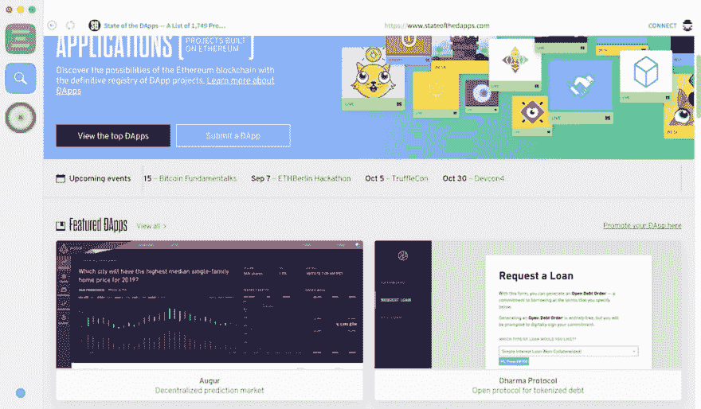

# 设置私有以太坊测试网络

> 原文：<https://dev.to/preslavrachev/setting-up-a-private-ethereum-test-network-b12>

我想玩几个以太坊智能合约，在最终版本准备好之前不花真金白银。令人欣慰的是，以太坊在某种程度上被设计成允许容易地建立新网络，尤其是与主网络没有连接的私有网络。我将尝试在这里解释第一步，为我自己，也为其他任何人寻找一种简单而安全的方式来玩以太坊智能合约。

注意:有一些项目允许一键设置私有以太网，比如 [Ganache](https://truffleframework.com/ganache) 。我不打算讨论这些，因为我想深入一点。

## 我们需要什么？

### GETH

[Geth](https://geth.ethereum.org/) 代表“Go 以太坊”，是一个全节点以太坊协议实现，用 Go 编写。它是三个原始实现之一(另外两个是 C++和 Python)。Geth 将允许我们从一个所谓的“起源文件”中建立测试网络。首先，让我们安装它。对于我这样的 macOS 用户，有一个方便的安装方式是通过家酿:

```
brew install geth 
```

Enter fullscreen mode Exit fullscreen mode

一旦安装了 Geth，我们需要设置我们的 genesis 文件。

### 创世纪文件

genesis 文件是一个 JSON 配置文件，Geth 用它来创建 [genesis 块](https://en.bitcoin.it/wiki/Genesis_block)。这个模块的目的是定义游戏规则，它看起来很像这样(谢谢， [pyethapp](https://github.com/ethereum/pyethapp/wiki/Custom-genesis) ):

```
{  "nonce":  "0x0000000000000042",  "difficulty":  "0x200",  "mixhash":  "0x0000000000000000000000000000000000000000000000000000000000000000",  "coinbase":  "0x0000000000000000000000000000000000000000",  "timestamp":  "0x00",  "parentHash":  "0x0000000000000000000000000000000000000000000000000000000000000000",  "extraData":  "0x11bbe8db4e347b4e8c937c1c8370e4b5ed33adb3db69cbdb7a38e1e50b1b82fa",  "gasLimit":  "0x1388",  "alloc":  {  "3282791d6fd713f1e94f4bfd565eaa78b3a0599d":  {  "balance":  "1337000000000000000000"  },  "17961d633bcf20a7b029a7d94b7df4da2ec5427f":  {  "balance":  "229427000000000000000"  }  }  } 
```

Enter fullscreen mode Exit fullscreen mode

它设置了一些非常重要的基本值，比如起始值`difficulty`和`gas limit`。在 PoW 意义上，这个困难决定了每个下一个散列的熵，或者更简单地说，需要多少计算能力，以便求解下一个块并猜测`mixhash`和`nonce`的组合。我们希望它在我们的测试网络上足够低，这样我们就可以只用一台笔记本电脑“开采”，而不用等待或熔化它。

另一方面，我们希望`gas limit`足够高，这样我们就可以允许任意复杂的操作，而不必重新初始化我们的 net form scratch。然而，在使用智能合同之前，要时刻关注运营中消耗的天然气量，因为在主网上，这意味着真正的实际资金。

对象是可选的，但是它允许设置初始数量的钱包，每个钱包都有自己的余额。不过，您可能希望不要这样做，因为稍后您将能够在 Mist 中轻松创建钱包。

其余的值要么是零，要么是一些你不必太在意的起始随机散列。就复制一个这样的样本，调整难度和气限，从那里开始。如果你想更深入地了解这些属性的含义，我发现这里的答案非常透彻。

### 的缺失

[T2】](https://res.cloudinary.com/practicaldev/image/fetch/s--DE0_ZdlG--/c_limit%2Cf_auto%2Cfl_progressive%2Cq_auto%2Cw_880/https://preslav.me/assets/img/2018/july/mist-dapps-store.jpg)

[Mist](https://github.com/ethereum/mist) 是一个 GUI 以太坊 Dapp 浏览器，包含自己集成的 Geth 节点，以及集成的 eth 钱包管理器。如果你到目前为止只用过 ETH 钱包，那么 Dapp 浏览器的概念一开始会让人望而生畏。除了管理钱包，Mist 还充当事实上的 Dapp 商店，允许用户发现和使用已经开发的 Dapp，如 CryptoKitties、Augur、Bancor 等。最重要的是，Mist 允许在智能契约上创建、部署和执行功能。这是我们将使用它的主要目的。

## 花押网

首先，让我们初始化我们的网络。我们需要一些初始的文件夹结构，可能是这样的:

```
mytestnet/
- chaindata/
- genesis.json 
```

Enter fullscreen mode Exit fullscreen mode

当然，如何命名目录和配置文件完全取决于您。重要的是把存放区块链的文件夹和创世纪文件分开。记住这一点，进入`mytestnet`目录，执行下面的命令:

```
geth --datadir=.chaindata init genesis.json 
```

Enter fullscreen mode Exit fullscreen mode

Geth 将初始化区块链，然后关闭自己。一旦链被初始化，你可以启动一个 Geth 实例并保持它运行:

```
geth --datadir=.chaindata 
```

Enter fullscreen mode Exit fullscreen mode

Geth 将连接并保持服务器运行。您需要注意的是连接过程的最后一行，应该是这样的:

```
INFO [07-29|09:53:20.327] IPC endpoint opened   url=/path/to/my/testnet/.chaindata/geth.ipc 
```

Enter fullscreen mode Exit fullscreen mode

在下一步中，我们将使用文件`.ipc`来连接 Mist。

### 开始起雾

关于薄雾需要注意的一点。它自带 Geth 版本，如果你的机器上没有运行其他版本，它会自动启动。这可能会导致 Mist 尝试连接到主网络，并开始下载真正的以太坊区块链的副本。我们想防止这种情况发生。相反，我们将从命令行启动 Mist，并将其指向 Geth 实例已经打开的`.ipc`文件:

```
/Applications/Mist.app/Contents/MacOS/Mist --rpc /path/to/my/testnet/.chaindata/geth.ipc 
```

Enter fullscreen mode Exit fullscreen mode

经过一点设置，薄雾将开始。不管你之前是否已经将 ETH 分配给了 genesis 文件中的一些地址，你都不能访问这些地址。你将需要创建一个新的钱包和我的一些 ETH。

[T2】](https://res.cloudinary.com/practicaldev/image/fetch/s--j7Vog3VQ--/c_limit%2Cf_auto%2Cfl_progressive%2Cq_auto%2Cw_880/https://preslav.me/assets/img/2018/july/mist-create-wallet.png)

一旦你有了第一个钱包，你为什么不也买一些呢？假设您将`difficulty`值设置得足够低，这应该是一个相当快速和简单的过程。打开一个新标签页，启动第二个 Geth 实例，如下所示:

```
geth attach /path/to/my/testnet/.chaindata/geth.ipc 
```

Enter fullscreen mode Exit fullscreen mode

它将启动一个控制台，您可以在其中编写以下命令集:

```
miner.setEtherbase("the_address_of_your_wallet");

miner.start(1); // # of parallel threads.
// To stop the miner, type miner.stop() 
```

Enter fullscreen mode Exit fullscreen mode

过一会儿，Mist 会开始显示你钱包里的 ETH 数量不断增加。

作为练习，试着通过 Mist 向你创建的另一个钱包发送一些 ETH。为了确认交易，您必须立即启动 miner 并保持其运行，直到所有确认都已完成。正常情况下，Mist 的响应应该足以实时显示这一点。但是，有时 Mist 可能会变得无响应或失去与插座的连接。如果发生这种情况，只需重新启动它，它应该可以再次运行。

暂时就这样了。在后续的帖子中，我将讨论在我们新的私有测试网上创建和部署一个简单的智能契约。敬请关注。

* * *

这篇文章最初出现在我的博客上。