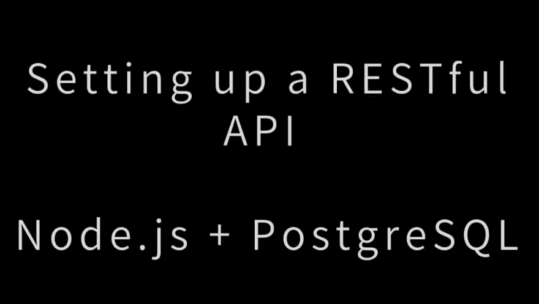

# 使用 Node.js 和 PostgreSQL 设置 RESTful API

> 原文：<https://dev.to/bnevilleoneill/setting-up-a-restful-api-with-node-js-and-postgresql-1jbf>

[T2】](https://res.cloudinary.com/practicaldev/image/fetch/s--OQaSAXpt--/c_limit%2Cf_auto%2Cfl_progressive%2Cq_auto%2Cw_880/https://cdn-images-1.medium.com/max/1024/1%2AdAw1_W3q-TaHrQZVmb9jPA.jpeg)

作为现代 web 开发人员的一个极其重要的方面是知道如何使用 API 来促进不同软件系统之间的通信。

在本教程中，您将学习如何在 Node.js 环境中创建自己的 RESTful API，该环境运行在 Express 服务器上并利用 PostgreSQL 数据库。

### 先决条件

为了充分利用本教程，有几个先决条件:

*   您应该熟悉 JavaScript 语法和基础知识
*   你应该具备使用[命令行](https://www.taniarascia.com/how-to-use-the-command-line-for-apple-macos-and-linux/)的基本知识
*   您应该已经安装了 [Node.js 和 npm](https://www.taniarascia.com/how-to-install-and-use-node-js-and-npm-mac-and-windows/)

### 目标

当您完成本文时，您应该已经拥有了一个运行在 Node.js 中的 Express 框架上的功能齐全的 API 服务器。API 应该能够处理与 API 从中获取数据的 PostgreSQL 数据库相对应的 HTTP 请求方法。您将学习如何安装 PostgreSQL 并通过命令行界面使用它。

[T2】](https://logrocket.com/signup/)

### 什么是 RESTful API？

REST 代表**Re**presentational**S**state**T**transfer，并定义了一套 web 服务的标准。API 是不同软件程序用来相互通信的接口。因此，RESTful API 是符合 REST 架构风格和约束的 API。REST 系统是无状态的、可伸缩的、可缓存的，并且具有统一的接口。

RESTful APIs 通常利用 HTTP 请求。四种最常见的 HTTP 方法是 GET、POST、PUT 和 DELETE，开发人员可以通过这些方法创建 CRUD 系统——创建、读取、更新和删除。

### PostgreSQL 数据库

[PostgreSQL](https://www.postgresql.org/) ，俗称 Postgres，是一个免费开源的关系数据库管理系统。您可能熟悉其他一些类似的数据库系统，如 MySQL、Microsoft SQL Server 或 MariaDB，它们与 PostgreSQL 竞争。

PostgreSQL 是一个健壮但稳定的关系数据库，自 1997 年就出现了，可用于所有主要的操作系统——Linux、Windows 和 macOS。由于 PostgreSQL 以稳定性、可扩展性和符合标准而闻名，因此它是开发人员和公司满足其数据库需求的流行选择。

我们将通过安装 PostgreSQL、创建一个新用户、创建一个数据库以及用模式和一些数据初始化一个表来开始本教程。

### 安装

如果你用的是 Windows，下载一个 PostgreSQL 的 [Windows 安装程序](https://www.postgresql.org/download/windows/)。

如果你使用的是 Mac，本教程假设你已经在电脑上安装了 [Homebrew](https://brew.sh/) 作为安装新程序的软件包管理器。如果你没有，只需点击链接，并按照指示安装家酿。

打开终端，用 brew 安装 postgresql。

```
brew install postgresql 
```

> *你可能会在网上看到说明，上面会说**brew install PostgreSQL 而不是* *postgresql。这两个选项都将在您的计算机上安装 PostgreSQL。*

安装完成后，我们需要启动并运行 postgresql，这可以通过启动服务来完成。

```
brew services start postgresql
==> Successfully started `postgresql` (label: homebrew.mxcl.postgresql) 
```

> *如果您想随时停止* *postgresql 服务，您可以运行**brew services stop PostgreSQL。*

PostgreSQL 现在已经安装好了，所以下一步是连接到 postgrescommand 行，在这里我们可以运行 SQL 命令。

### PostgreSQL 命令行提示

psql 是 PostgreSQL 交互式终端。运行 psql 会将您连接到 PostgreSQL 主机。运行 psql - help 将为您提供有关可用 psql 连接选项的更多信息。

*   `-h` — `--host=HOSTNAME` |数据库服务器主机或套接字目录(默认:“本地套接字”)
*   `-p` — `--port=PORT` |数据库服务器端口(默认为:“5432”)
*   `-U` — `--username=USERNAME` |数据库用户名(默认为:“您的用户名”)
*   `-w` — `--no-password` |从不提示输入密码
*   `-W` — `--password` |强制密码提示(应自动发生)

我们将用默认的登录信息连接到默认的 postgres 数据库——没有选项标志。

```
psql postgres 
```

你会发现我们建立了新的联系。我们现在在 postgres 数据库的 psql 中。提示符以#结尾，表示我们作为超级用户或 root 登录。

```
postgres=# 
```

psql 中的命令以反斜杠()开头。为了测试我们的第一个命令，我们可以通过使用\conninfo 命令来确保我们连接到了什么数据库、用户和端口。

```
postgres=# \conninfo
You are connected to database "postgres" as user "your_username" via socket in "/tmp" at port "5432". 
```

这是我们将在本教程中使用的一些常用命令的参考表。

*   `\q` |退出`psql`连接
*   `\c` |连接到新数据库
*   `\dt` |列出所有表格
*   `\du` |列出所有角色
*   `\list` |列出数据库

让我们创建一个新的数据库和用户，这样我们就不会使用默认帐户，这些帐户拥有超级用户权限。

### 创建用户

首先，我们将创建一个名为 me 的角色，并给它一个密码 password。一个角色可以作为一个用户或一个组，所以在这种情况下，我们将把它作为一个用户来使用。

```
postgres=# CREATE ROLE me WITH LOGIN PASSWORD 'password'; 
```

我们希望我能创建一个数据库。

```
postgres=# ALTER ROLE me CREATEDB; 
```

您可以运行\du 来列出所有角色/用户。

```
me          | Create DB                           | {}
postgres    | Superuser, Create role, Create DB   | {} 
```

现在我们想从 me 用户创建一个数据库。按下\q 退出默认会话。

```
postgres=# \q 
```

我们回到了电脑的默认终端连接。现在我们将 postgres 与我联系起来。

```
psql -d postgres -U me 
```

我们的提示符不是 postgres=#，而是显示 postgres=> now，这意味着我们不再以超级用户身份登录。

### 创建数据库

我们可以用 SQL 命令创建一个数据库。

```
postgres=> CREATE DATABASE api; 
```

使用\list 命令查看可用的数据库。

```
Name    |    Owner    | Encoding |   Collate   |    Ctype    |
api     | me          | UTF8     | en_US.UTF-8 | en_US.UTF-8 | 
```

让我们使用\c (connect)命令连接到新的 api 数据库。

```
postgres=> \c api
You are now connected to database "api" as user "me".
api=> 
```

我们的提示现在显示我们连接到 api。

### 创建表格

我们在 psql 命令提示符下要做的最后一件事是创建一个名为 users 的表，它有三个字段——两个 VARCHAR 类型和一个自动递增的主键 id。

```
api=>
CREATE TABLE users (
  ID SERIAL PRIMARY KEY,
  name VARCHAR(30),
  email VARCHAR(30)
); 
```

> 在 PostgreSQL 中创建和使用表格时，确保不要使用反勾字符。虽然在 MySQL 中允许使用反斜线，但在 PostgreSQL 中是无效的。另外，确保在 *创建表格命令中没有尾随逗号。*

我们将向`users`添加两个条目，以便处理一些数据。

```
INSERT INTO users (name, email)
  VALUES ('Jerry', 'jerry@example.com'), ('George', 'george@example.com'); 
```

让我们通过获取 users 中的所有条目来确保添加正确。

```
api=> SELECT * FROM users;
id |  name  |       email        
----+--------+--------------------
  1 | Jerry  | jerry@example.com
  2 | George | george@example.com 
```

现在我们有了一个用户、数据库、表和一些数据。我们可以开始构建 Node.js RESTful API 来连接存储在 PostgreSQL 数据库中的数据。

### 设置快递服务器

至此，我们已经完成了所有 PostgreSQL 任务，可以开始设置 Node.js 应用程序和 Express 服务器了。

为项目创建一个目录。

```
mkdir node-api-postgres
cd node-api-postgres 
```

您可以运行 npm init -y 来创建 package.json，或者将下面的代码复制到 package.json 文件中。

```
{
  "name": "node-api-postgres",
  "version": "1.0.0",
  "description": "RESTful API with Node.js, Express, and PostgreSQL",
  "main": "index.js",
  "license": "MIT"
} 
```

我们将希望为服务器安装 [Express](http://expressjs.com/) 和 [node-postgres (pg)](https://node-postgres.com/) ，以便能够连接到 PostgreSQL。

```
npm i express pg 
```

现在，我们已经将依赖项加载到 node_modules 和 package.json 中。

创建一个 index.js 文件，我们将用它作为服务器的入口点。在顶部，我们将需要 express 模块，内置在[body parser](https://www.npmjs.com/package/body-parser)middle ware 中，并设置我们的应用程序和端口变量。

```
const express = require('express')
const bodyParser = require('body-parser')
const app = express()
const port = 3000

app.use(bodyParser.json())
app.use(
  bodyParser.urlencoded({
    extended: true,
  })
) 
```

我们将告诉 route 在根(/) URL 上寻找 GET 请求，并返回一些 JSON。

```
app.get('/', (request, response) => {
  response.json({ info: 'Node.js, Express, and Postgres API' })
}) 
```

现在设置应用程序监听你设置的端口。

```
app.listen(port, () => {
  console.log(`App running on port ${port}.`)
}) 
```

从命令行，我们可以通过点击 index.js.
来启动服务器

```
node index.js
App running on port 3000. 
```

去浏览器的地址栏 [http://localhost:3000](http://localhost:3000) ，就会看到我们之前设置的 JSON。

```
{
  info: "Node.js, Express, and Postgres API"
} 
```

Express 服务器现在正在运行，但是它只发送一些我们创建的静态 JSON 数据。下一步是从 Node.js 连接到 PostgreSQL，以便能够进行动态查询。

### 从 Node.js 连接数据库

我们将使用 [node-postgres](https://node-postgres.com/) 模块来创建一个连接池。这样我们就不必在每次查询时都打开并关闭客户机。

> *生产池的一个流行选项是使用*[*pg bouncer*](https://pgbouncer.github.io/)*，一个 PostgreSQL 的轻量级连接池。*

创建一个名为 queries.js 的文件，并设置 PostgreSQL 连接的配置。

```
const Pool = require('pg').Pool
const pool = new Pool({
  user: 'me',
  host: 'localhost',
  database: 'api',
  password: 'password',
  port: 5432,
}) 
```

> *在生产环境中，您可能希望将您的配置详细信息放在一个单独的文件中，该文件具有从版本控制中无法访问的限制性权限，但是为了本教程的简单性，我们将它保存在与查询相同的文件中。*

本教程的目的是允许在运行相应数据库命令的 API 上进行 GET、POST、PUT 和 DELETE 操作。为此，我们将为每个端点设置一个路由，并为每个查询设置一个函数。

### 创建路线

我们将为六条路线创建六个函数，如下图所示。首先，我们将浏览并创建每条路线的所有函数，然后我们将导出这些函数，以便可以访问它们:

*   `GET` — `/` | `displayHome()`
*   `GET` — `/users` | `getUsers()`
*   `GET` — `/users/:id` | `getUserById()`
*   `POST` — `users` | `createUser()`
*   `PUT` — `/users/:id` | `updateUser()`
*   `DELETE` — `/users/:id` | `deleteUser()`

在 index.js 中，我们为根端点创建了一个 app.get()，其中包含一个函数。现在，在 queries.js 中，我们将创建显示所有用户、显示单个用户、创建新用户、更新现有用户和删除用户的端点。

### **获取所有用户**

我们的第一个端点将是一个 GET 请求。在 pool.query()中，我们可以放入将触及 api 数据库的原始 SQL。我们将选择所有用户并按 id 排序。

```
const getUsers = (request, response) => {
  pool.query('SELECT * FROM users ORDER BY id ASC', (error, results) => {
    if (error) {
      throw error
    }
    response.status(200).json(results.rows)
  })
} 
```

### **获取单个用户的 id**

对于我们的/users/:id 请求，我们将通过 URL 获取自定义 id 参数，并使用 WHERE 子句显示结果。

在 SQL 查询中，我们寻找 id=$1。在本例中，$1 是一个带编号的占位符，PostgreSQL 本身使用它来代替？占位符，您可能对 SQL 的其他风格很熟悉。

```
const getUserById = (request, response) => {
  const id = parseInt(request.params.id)

  pool.query('SELECT * FROM users WHERE id = $1', [id], (error, results) => {
    if (error) {
      throw error
    }
    response.status(200).json(results.rows)
  })
} 
```

### **发布新用户**

该 API 将向/users 端点发送一个 GET 和 POST 请求。在 POST 请求中，我们将添加一个新用户。在这个函数中，我们从请求体中提取 name 和 email 属性，并插入值。

```
const createUser = (request, response) => {
  const { name, email } = request.body

  pool.query('INSERT INTO users (name, email) VALUES ($1, $2)', [name, email], (error, results) => {
    if (error) {
      throw error
    }
    response.status(201).send(`User added with ID: ${result.insertId}`)
  })
} 
```

### **将更新的数据放入现有用户**

/users/:id 端点还将接受两个 HTTP 请求——我们为 getUserById 创建的 GET 和一个 PUT，以修改现有用户。对于这个查询，我们将结合我们在 GET 和 POST 中学到的知识来使用 UPDATE 子句。

值得注意的是，PUT 是**幂等的**，这意味着完全相同的调用可以反复进行，并将产生相同的结果。这与 POST 不同，在 POST 中，重复的完全相同的呼叫会不断地产生具有相同数据的新用户。

```
const updateUser = (request, response) => {
  const id = parseInt(request.params.id)
  const { name, email } = request.body

  pool.query(
    'UPDATE users SET name = $1, email = $2 WHERE id = $3',
    [name, email, id],
    (error, results) => {
      if (error) {
        throw error
      }
      response.status(200).send(`User modified with ID: ${id}`)
    }
  )
} 
```

### **删除用户**

最后，我们将使用/users/:id 上的 DELETE 子句来删除 id 指定的用户。这个调用非常类似于我们的 getUserById()函数。

```
const deleteUser = (request, response) => {
  const id = parseInt(request.params.id)

  pool.query('DELETE FROM users WHERE id = $1', [id], (error, results) => {
    if (error) {
      throw error
    }
    response.status(200).send(`User deleted with ID: ${id}`)
  })
} 
```

### **出口**

为了从 index.js 访问这些函数，我们需要导出它们。我们可以用 module.exports 来实现，创建一个函数对象。由于我们使用的是 ES6 语法，我们可以编写 getUsers 而不是 getUsers:getUsers，等等。

```
module.exports = {
  getUsers,
  getUserById,
  createUser,
  updateUser,
  deleteUser,
} 
```

这是我们完整的 queries.js 文件。

```
const Pool = require('pg').Pool
const pool = new Pool({
  user: 'me',
  host: 'localhost',
  database: 'api',
  password: 'password',
  port: 5432,
})
const getUsers = (request, response) => {
  pool.query('SELECT * FROM users ORDER BY id ASC', (error, results) => {
    if (error) {
      throw error
    }
    response.status(200).json(results.rows)
  })
}

const getUserById = (request, response) => {
  const id = parseInt(request.params.id)

  pool.query('SELECT * FROM users WHERE id = $1', [id], (error, results) => {
    if (error) {
      throw error
    }
    response.status(200).json(results.rows)
  })
}

const createUser = (request, response) => {
  const { name, email } = request.body

  pool.query('INSERT INTO users (name, email) VALUES ($1, $2)', [name, email], (error, results) => {
    if (error) {
      throw error
    }
    response.status(201).send(`User added with ID: ${result.insertId}`)
  })
}

const updateUser = (request, response) => {
  const id = parseInt(request.params.id)
  const { name, email } = request.body

  pool.query(
    'UPDATE users SET name = $1, email = $2 WHERE id = $3',
    [name, email, id],
    (error, results) => {
      if (error) {
        throw error
      }
      response.status(200).send(`User modified with ID: ${id}`)
    }
  )
}

const deleteUser = (request, response) => {
  const id = parseInt(request.params.id)

  pool.query('DELETE FROM users WHERE id = $1', [id], (error, results) => {
    if (error) {
      throw error
    }
    response.status(200).send(`User deleted with ID: ${id}`)
  })
}

module.exports = {
  getUsers,
  getUserById,
  createUser,
  updateUser,
  deleteUser,
} 
```

### **完成设置**

现在我们已经有了所有的查询，我们需要做的最后一件事是将它们放入 index.js 文件，并为我们创建的所有查询函数创建端点路由。

为了从 queries.js 中获取所有导出的函数，我们将需要该文件并将其赋给一个变量。

```
const db = require('./queries') 
```

现在，我们将为每个端点设置 HTTP 请求方法、端点 URL 路径和相关函数。

```
app.get('/users', db.getUsers)
app.get('/users/:id', db.getUserById)
app.post('/users', db.createUser)
app.put('/users/:id', db.updateUser)
app.delete('/users/:id', db.deleteUser) 
```

这里是我们完整的 index.js，API 服务器的入口点。

```
const express = require('express')
const bodyParser = require('body-parser')
const app = express()
const db = require('./queries')
const port = 3000

app.use(bodyParser.json())
app.use(
  bodyParser.urlencoded({
    extended: true,
  })
)

app.get('/', (request, response) => {
  response.json({ info: 'Node.js, Express, and Postgres API' })
})

app.get('/users', db.getUsers)
app.get('/users/:id', db.getUserById)
app.post('/users', db.createUser)
app.put('/users/:id', db.updateUser)
app.delete('/users/:id', db.deleteUser)

app.listen(port, () => {
  console.log(`App running on port ${port}.`)
}) 
```

现在有了这两个文件，我们就有了一个服务器、数据库和 API。您可以通过再次点击 index.js 来启动服务器。

```
node index.js
App running on port 3000. 
```

现在如果你去[http://localhost:3000/users](http://localhost:3000/users)或者[http://localhost:3000/users/1](http://localhost:3000/users/1)，你会看到两个 GET 请求的 JSON 响应。但是我们如何测试我们的 POST、PUT 和 DELETE 请求呢？

这可以用 [curl](https://curl.haxx.se/) 来完成，这是一个已经在你的终端上可用的命令行工具。以下是您可以在命令行上运行来测试所有协议的示例。

> 当您在单独的窗口中运行这些命令时，请确保服务器正在一个终端窗口中运行。

### **岗位**

添加一个名为伊莱恩的新用户，电子邮件为[elaine@example.com](mailto:elaine@example.com)。

```
curl --data "name=Elaine&email=elaine@example.com" 
http://localhost:3000/users 
```

### **放**

将 id 为 1 的用户更新为姓名为克莱默，电子邮件为[kramer@example.com](mailto:kramer@example.com)。

```
curl -X PUT -d "name=Kramer" -d "email=kramer@example.com" 
http://localhost:3000/users/1 
```

### **删除**

删除 id 为 1 的用户。

```
curl -X "DELETE" http://localhost:3000/users/1 
```

### **结论**

恭喜您，现在您应该有了一个运行在 Node.js 上的 API 服务器，并连接到一个活动的 PostgreSQL 数据库。在本教程中，我们学习了如何在命令行中安装和设置 PostgreSQL，如何创建用户、数据库和表，以及如何运行 SQL 命令。我们还学习了如何创建一个可以处理多种 HTTP 方法的 Express 服务器，以及如何使用 pg 模块从 Node 连接到 PostgreSQL。

有了这些知识，您应该能够构建这个 API，并将其用于您自己的个人或专业开发项目。

* * *

### Plug: [LogRocket](https://logrocket.com/signup/) ，一款适用于网络应用的 DVR

[](https://logrocket.com/signup/)

<figcaption>[https://logrocket.com/signup/](https://logrocket.com/signup/)</figcaption>

LogRocket 是一个前端日志工具，可以让你回放问题，就像它们发生在你自己的浏览器中一样。LogRocket 不需要猜测错误发生的原因，也不需要向用户询问截图和日志转储，而是让您重放会话以快速了解哪里出错了。它可以与任何应用程序完美配合，不管是什么框架，并且有插件可以记录来自 Redux、Vuex 和@ngrx/store 的额外上下文。

除了记录 Redux 操作和状态，LogRocket 还记录控制台日志、JavaScript 错误、堆栈跟踪、带有头+正文的网络请求/响应、浏览器元数据和自定义日志。它还使用 DOM 来记录页面上的 HTML 和 CSS，甚至为最复杂的单页面应用程序重新创建像素级完美视频。

免费试用。

* * *

用 Node.js 和 PostgreSQL 建立 RESTful API 的帖子[最先出现在](https://blog.logrocket.com/setting-up-a-restful-api-with-node-js-and-postgresql-d96d6fc892d8/)[日志博客](https://blog.logrocket.com)上。