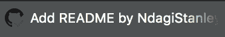

# 设置与 GitHub 的持续集成

> 原文：<https://dev.to/ronpowelljr/setting-up-continuous-integration-with-github-2apd>

*本文最初由 Stanley Ndagi* 发布在 CircleCI 的[博客](https://circleci.com/blog/setting-up-continuous-integration-with-github/)上

* * *

[持续集成(CI)](https://circleci.com/continuous-integration/) 包括在特性分支被合并到项目中的主 Git 分支之前的测试自动化。这确保了代码库不会因为可能破坏某些东西的更改而更新。另一方面，连续交付(CD)通过自动化这些分支和/或主分支的发布来构建 CI。这允许小的增量更新更快地到达您的用户，符合敏捷软件开发哲学。

在本文中，我将带您通过 GitHub 设置 CI。我们将使用一个 Python 应用程序来演示我们的 CI 管道。

以下是我们将采取的步骤:

1.  创建一个简单的 Python 应用程序(使用 Flask)
2.  为此应用程序创建测试
3.  添加`config.yml`文件
4.  推送至 GitHub
5.  配置 CircleCI
6.  用徽章更新我们的`README`
7.  创建一个公关，看看 CircleCI 的运作

## 创建一个简单的 Python 应用

#### 先决条件

如果你还没有安装 Python，请按照本地系统的说明[这里](https://www.python.org/downloads/)。Python 安装附带了`pip`(PyPA 推荐的用于安装 Python 包的工具)。

#### 构建 app

为了简单起见，根据最少的代码行，我们将创建一个 Flask 应用程序。Flask 是 Python 的一个微框架。对于我们的练习，对框架的了解很少是必要的。我们将在这里使用[的例子](http://flask.pocoo.org/)。

首先，创建一个项目目录(文件夹)并将`cd`放入其中。将此输入终端:

```
mkdir python_app && cd $_/ 
```

Enter fullscreen mode Exit fullscreen mode

接下来，打开你最喜欢的编辑器，创建一个`hello.py`文件。然后，将下面几行复制到该文件中:

```
from flask import Flask

app = Flask(__name__)

@app.route("/")
def hello():
    return "Hello World!" 
```

Enter fullscreen mode Exit fullscreen mode

#### Python 中的虚拟环境

在 Python 中工作时，强烈建议您使用虚拟环境。这允许您在一个抽象的环境中安装 Python 包，而不是整个本地机器。一些常见的方法是使用 [`virtualenv`](https://virtualenv.pypa.io/en/stable/) 或者更好的 [`virtualenvwrapper`](http://virtualenvwrapper.readthedocs.io/en/latest/) 。我们将使用模块`venv`，它是 Python3 的一部分。事情是这样的:

*   创建虚拟环境:

```
python3 -m venv venv 
```

Enter fullscreen mode Exit fullscreen mode

(注意，我们可以为虚拟环境使用其他名称，如下例所示。)

```
python3 -m venv Env 
```

Enter fullscreen mode Exit fullscreen mode

*   激活此环境:

```
source venv/bin/activate 
```

Enter fullscreen mode Exit fullscreen mode

(如果您对环境使用了另一个名称，请替换 *venv* )

您将会注意到，就在 shell 提示符告诉您虚拟环境处于活动状态之前`(venv)`。安装的任何 Python 包都将安装在此环境中。要停用该环境，只需运行:

```
deactivate 
```

Enter fullscreen mode Exit fullscreen mode

#### 运行 app

现在，让我们在编辑器中创建一个`requirements.txt`文件。将单词`Flask`添加到文件中并保存。

```
Flask 
```

Enter fullscreen mode Exit fullscreen mode

然后，在虚拟环境中，通过运行:
来安装该包

```
pip install -r requirements.txt 
```

Enter fullscreen mode Exit fullscreen mode

运行这个应用程序的最后一个命令是:

```
FLASK_APP=hello.py flask run 
```

Enter fullscreen mode Exit fullscreen mode

你可以在 [http://localhost:5000/](http://localhost:5000/) 看到浏览器上运行的应用。

## 测试

在您的编辑器中，创建一个`tests.py`文件，并将这些行粘贴到其中:

```
from hello import app
with app.test_client() as c:
    response = c.get('/')
    assert response.data == b'Hello World!'
    assert response.status_code == 200 
```

Enter fullscreen mode Exit fullscreen mode

有关测试的更多信息，请参见这些参考资料:

*   [http://flask.pocoo.org/docs/1.0/testing/](http://flask.pocoo.org/docs/1.0/testing/)
*   [https://damyanon.net/post/flask-series-testing/](https://damyanon.net/post/flask-series-testing/)

现在，让我们进行测试。打开终端并运行:

```
python3 tests.py 
```

Enter fullscreen mode Exit fullscreen mode

不应向我们的终端返回任何内容。为什么？原因是我们构造了 Flask 应用程序，使它在一次传递中不会输出到终端。这意味着我们的测试通过了。上面提到的资源给出了关于测试通过和失败的终端 UX(用户体验)的更好的例子，但是这对于我们的例子来说已经足够了。

## CircleCI 配置文件

创建一个`.circleci`文件夹，并在其中创建一个 [`config.yml`](https://circleci.com/docs/2.0/sample-config/) 文件。然后，把这几行复制进去:

```
version: 2
jobs:
  build:
    docker:
      - image: circleci/python:3.6
    steps:
      - checkout
      - restore_cache:
          key: deps1-{{ .Branch }}-{{ checksum "requirements.txt" }}
      - run:
          command: |
            python3 -m venv venv
            . venv/bin/activate
            pip install -r requirements.txt
      - save_cache:
          key: deps1-{{ .Branch }}-{{ checksum "requirements.txt" }}
          paths:
            - "venv"
      - run:
          name: Running tests
          command: |
            . venv/bin/activate
            python3 tests.py
      - store_artifacts:
          path: test-reports/
          destination: python_app 
```

Enter fullscreen mode Exit fullscreen mode

有关此`config`文件的更多信息，请参见:[https://circleci.com/docs/2.0/language-python/](https://circleci.com/docs/2.0/language-python/)。

## 推送至 GitHub

我们应该更早地初始化 Git 并进行原子提交(尽早并经常提交代码的哲学)。然而，由于本教程是关于 CircleCI 和 GitHub 的集成，我故意把它搁置到现在。

我们当前的代码结构如下所示:

[T2】](https://res.cloudinary.com/practicaldev/image/fetch/s--mql13FWZ--/c_limit%2Cf_auto%2Cfl_progressive%2Cq_auto%2Cw_880/https://thepracticaldev.s3.amazonaws.com/i/oicdlnc7jv92m3u3rocv.png)

打开你的编辑器，在工作目录中创建一个`.gitignore`文件来声明哪些文件和文件夹是我们*不想*提交给 Git 的。将以下几行复制到该文件中:

```
# Byte-compiled / optimized / DLL files
__pycache__/
*.py[cod]

# Virtualenv
venv/* 
```

Enter fullscreen mode Exit fullscreen mode

我们现在将通过运行以下命令提交我们的代码:

```
git add . 
```

Enter fullscreen mode Exit fullscreen mode

```
git commit -m "Initial commit" 
```

Enter fullscreen mode Exit fullscreen mode

去[https://github.com](https://github.com)创建一个 GitHub 账户，如果你还没有的话。然后，创建一个存储库。

[T2】](https://res.cloudinary.com/practicaldev/image/fetch/s--CW9q8qNd--/c_limit%2Cf_auto%2Cfl_progressive%2Cq_auto%2Cw_880/https://thepracticaldev.s3.amazonaws.com/i/cokim8dy78eet3ejzp0g.png)

[T2】](https://res.cloudinary.com/practicaldev/image/fetch/s--BuVmRFeq--/c_limit%2Cf_auto%2Cfl_progressive%2Cq_auto%2Cw_880/https://thepracticaldev.s3.amazonaws.com/i/rw9mlh7qgc8fbggkn8r9.png)

创建新存储库后，您将看到如下页面:

[T2】](https://res.cloudinary.com/practicaldev/image/fetch/s--5ED2IDaS--/c_limit%2Cf_auto%2Cfl_progressive%2Cq_auto%2Cw_880/https://thepracticaldev.s3.amazonaws.com/i/i36fkx81mia51u3w2bx8.png)

我们将采用第二个选项，**…推送一个现有的存储库**。跑:

```
git remote add origin https://github.com/NdagiStanley/python_app.git
git push -u origin master 
```

Enter fullscreen mode Exit fullscreen mode

## 配置 CircleCI

既然 repo 已经在 GitHub 上，我们可以通过配置 CircleCI 来完成 CI。

前往[https://circleci.com/](https://circleci.com/)。然后点击右上方的**报名**。

[T2】](https://res.cloudinary.com/practicaldev/image/fetch/s--1dDxEtQn--/c_limit%2Cf_auto%2Cfl_progressive%2Cq_auto%2Cw_880/https://thepracticaldev.s3.amazonaws.com/i/djn0jkk1dt7gghfwcjwx.png)

用你的 GitHub 账号注册 CircleCI。

[T2】](https://res.cloudinary.com/practicaldev/image/fetch/s--2P8IvOkI--/c_limit%2Cf_auto%2Cfl_progressive%2Cq_auto%2Cw_880/https://thepracticaldev.s3.amazonaws.com/i/kx77jzo1rkyxronku8bo.png)

登录后，确保您的个人 GitHub 帐户处于活动状态。如果你在几个 GitHub 组织中，其中一个可能是活跃的。只需点击下拉菜单(左上角)并选择您的 GitHub 用户名。然后，点击**添加项目**。最新的项目“python_app”出现在那里。

[T2】](https://res.cloudinary.com/practicaldev/image/fetch/s--KqrY2sBV--/c_limit%2Cf_auto%2Cfl_progressive%2Cq_auto%2Cw_880/https://thepracticaldev.s3.amazonaws.com/i/uuief10r77yulxmslqa7.png)

点击包含我们项目的行右侧的**设置项目**。在重定向的页面上，您会注意到**后续步骤**部分。如果我们没有自己的`.circleci/config.yml`文件，我们会从第 1 号**开始。我们只需要滚动到**5 号**，点击**开始构建**。**

[T2】](https://res.cloudinary.com/practicaldev/image/fetch/s---u43UY4H--/c_limit%2Cf_auto%2Cfl_progressive%2Cq_auto%2Cw_880/https://thepracticaldev.s3.amazonaws.com/i/ygu0aifdhfybsgxukele.png)

构建很快就通过了。成功了！

[T2】](https://res.cloudinary.com/practicaldev/image/fetch/s--UI-uxTET--/c_limit%2Cf_auto%2Cfl_progressive%2Cq_auto%2Cw_880/https://thepracticaldev.s3.amazonaws.com/i/uajmhch8kz9iek5g0l10.png)

在右上角，点击**设置**齿轮。然后点击左边的**项目**，最后点击 **python_app** 。

[T2】](https://res.cloudinary.com/practicaldev/image/fetch/s--PPJaAWjM--/c_limit%2Cf_auto%2Cfl_progressive%2Cq_auto%2Cw_880/https://thepracticaldev.s3.amazonaws.com/i/9nm8siqv4s1zezca5q7n.png)

你会走上这样一条路:`circleci.com/gh/<username>/python_app`。我的是`https://circleci.com/gh/NdagiStanley/python_app`。点击回购名称: **python_app** 旁边的**设置** cog。

[T2】](https://res.cloudinary.com/practicaldev/image/fetch/s--tre3KU2n--/c_limit%2Cf_auto%2Cfl_progressive%2Cq_auto%2Cw_880/https://thepracticaldev.s3.amazonaws.com/i/cmskp3k9ugp10rt75rjv.png)

熟悉可以为此项目更改的设置是很重要的。我现在将谈一谈与我们相关的问题。

在**高级设置**中，注意**仅构建拉取请求**被关闭。这意味着 GitHub 的每次推送都会在 CircleCI 上运行，包括 PRs。

在**聊天通知**中，注意你可以配置你的 Slack、HipChat、FlowDock、Campfire 和 IRC 在每次构建时得到通知。对于 Slack，[这个](https://circleci.com/blog/slack-integration/)资源是得心应手的。

在 **[状态徽章](https://circleci.com/docs/1.0/status-badges/)** 中，注意 Markdown 嵌入代码。我们将复制这段代码，粘贴到我们的自述文件中。

## 自述-状态徽章

在我们的本地机器上，通过运行:
检查到另一个 Git 分支

```
git checkout -b add_readme 
```

Enter fullscreen mode Exit fullscreen mode

打开编辑器并创建一个`README.md`文件。将以下几行复制并粘贴到该文件中:

```
README.md
# PYTHON APPLICATION
This Python application repo was created to showcase the integration between GitHub and CircleCI.
[](https://circleci.com/gh/NdagiStanley/python_app) 
```

Enter fullscreen mode Exit fullscreen mode

我给我的添加了一个标题和一个简短的描述。

现在，运行以下命令:

```
git add .
git commit -m "Add README"
git push -u origin add_readme 
```

Enter fullscreen mode Exit fullscreen mode

如果你去[https://github.com/](https://github.com/)/python _ app 你会注意到我们有了一个新的分支:`add_readme`。我们可以点击**比较并提取请求**。

[T2】](https://res.cloudinary.com/practicaldev/image/fetch/s--C1W8oUYB--/c_limit%2Cf_auto%2Cfl_progressive%2Cq_auto%2Cw_880/https://thepracticaldev.s3.amazonaws.com/i/wd4ab4pavrn86s1bms45.png)

## 打开拉式请求

我是这样建立我的公关的:

[T2】](https://res.cloudinary.com/practicaldev/image/fetch/s--P8_R-2Fv--/c_limit%2Cf_auto%2Cfl_progressive%2Cq_auto%2Cw_880/https://thepracticaldev.s3.amazonaws.com/i/vgozvrujkiaro78dohf6.png)

点击**创建拉式请求**，很快我们就会看到:

[T2】](https://res.cloudinary.com/practicaldev/image/fetch/s--Asu7CnFH--/c_limit%2Cf_auto%2Cfl_progressive%2Cq_auto%2Cw_880/https://thepracticaldev.s3.amazonaws.com/i/j3ybpqysy55kja7vc7so.png)

一个成功的构建！现在，点击**显示所有检查**。你会看到支票来自切尔莱西。

[T2】](https://res.cloudinary.com/practicaldev/image/fetch/s--hHISsnrq--/c_limit%2Cf_auto%2Cfl_progressive%2Cq_auto%2Cw_880/https://thepracticaldev.s3.amazonaws.com/i/7jbfdi45kd2oe9wm9w9v.png)

甚至浏览器的标签页图标也会显示一个成功运行的勾号:

[T2】](https://res.cloudinary.com/practicaldev/image/fetch/s--iv2AN-7j--/c_limit%2Cf_auto%2Cfl_progressive%2Cq_auto%2Cw_880/https://thepracticaldev.s3.amazonaws.com/i/qaa44wp3hqpe0p2bnii7.png)

如果您点击**详细信息**，这将把您重定向到 CircleCI 上的构建:

[T2】](https://res.cloudinary.com/practicaldev/image/fetch/s--KWTonCby--/c_limit%2Cf_auto%2Cfl_progressive%2Cq_auto%2Cw_880/https://thepracticaldev.s3.amazonaws.com/i/5l8z4xacmt6pfivn8sr6.png)

请注意，此处的 favicon 也显示构建成功:

[T2】](https://res.cloudinary.com/practicaldev/image/fetch/s--qpE84G09--/c_limit%2Cf_auto%2Cfl_progressive%2Cq_auto%2Cw_880/https://thepracticaldev.s3.amazonaws.com/i/4759lygr9oto3q3yns7p.png)

在顶部，点击 **python_app**

[T2】](https://res.cloudinary.com/practicaldev/image/fetch/s--uc1LKXTU--/c_limit%2Cf_auto%2Cfl_progressive%2Cq_auto%2Cw_880/https://thepracticaldev.s3.amazonaws.com/i/f27khgbq24zjvkesa4qb.png)

您将被重定向到该项目的版本:

[T2】](https://res.cloudinary.com/practicaldev/image/fetch/s--iMxh5olQ--/c_limit%2Cf_auto%2Cfl_progressive%2Cq_auto%2Cw_880/https://thepracticaldev.s3.amazonaws.com/i/rz51hdmxetkpbbxp34fz.png)

## 结论

现在你知道了！我们已经将 GitHub 与 CircleCI 整合在一起。总之，我们建立了一个 Python 应用程序，并为它创建了测试。然后，我们创建了一个 CircleCI 配置文件，并将代码库推送到 GitHub。最后，我们将我们创建的 GitHub 存储库连接到 CircleCI。

如果您成功地完成了，现在您可以在 GitHub 中建立自己的项目，并在 CircleCI 上配置 CI 构建。下面的链接指向我写这篇文章时的参考资料。

[https://circle ci . com/docs/2.0/configuration-reference/# full-example](https://circleci.com/docs/2.0/configuration-reference/#full-example)
[http://flask.pocoo.org/](http://flask.pocoo.org/)
[https://circleci.com/docs/2.0/configuration-reference/](https://circleci.com/docs/2.0/configuration-reference/)

* * *

关于斯坦利:从年轻的时候起，斯坦利就摆弄电子产品，用科技制造东西。现在，他是安德拉的一名工程师，他的工作涉及数据、网络和物联网。源于他一生对 DIY 的热爱，他踏上了一段召唤内心的建造者并一路教导他人的个人旅程。他关心技术如何影响社会，并寻求与致力于创造积极影响的其他人合作。