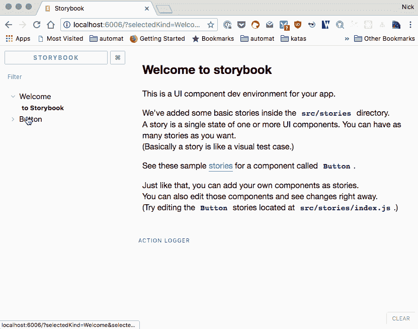

# 为 Preact 设置故事书

> 原文：<https://dev.to/nickytonline/setting-up-storybook-for-preact-p5a>

更新 2019/06/30: Storybook 现在可以通过 CLI 选择安装 Preact。更多信息请见[故事书预告](https://storybook.js.org/docs/guides/guide-preact)。TLDR `npx -p @storybook/cli sb init --type preact`。

在我的上一篇 Storybook 帖子[last Storybook 入门](https://dev.to/nickytonline/getting-started-with-react-storybook-9jh)中，我向您展示了如何安装 React story book，并给出了所有组件的快速分类。我建议在这里继续之前快速浏览一下。

在这篇文章中，我将向你展示如何使用 Preact 来创建和运行 React Storybook。假设您想要添加[故事书](https://storybook.js.org)的项目已经安装了 [Preact](https://github.com/developit/preact) 作为依赖项。

1.  一个临时的步骤是首先安装 React，所以运行`npm install react`
2.  如果你已经安装了 npx，运行`npx @storybook/cli`(如果你在一个新版本的 node 上，大多数人应该有这个)。如果没有运行`npm install @storybook/cli -g`。
3.  接下来从命令行运行`getstorybook`
4.  这将安装运行 Storybook 所需的所有依赖项。
5.  现在让我们从依赖项中卸载`react`，因为我们想要使用 preact！
6.  接下来我们需要安装 [preact-compat](https://github.com/developit/preact-compat) ，这样 preact 就可以很好地与 Storybook 配合使用。如果您需要 preact-compat 作为其他 react 库的依赖项，请将其安装到 dependencies，`npm install preact-compat`。否则将其作为开发依赖项安装，即`npm install preact-compat -D`
7.  快到了！
8.  我们需要做的最后一件事是告诉[web pack](https://webpack.js.org)(story book 在引擎盖下使用的东西)，使用 preact-compat。为此，我们需要为 Storybook 创建一个定制的 webpack 配置文件。幸运的是，Storybook 支持开箱即用。在你的 package.json 文件所在的根文件夹中，会有一个名为`.storybook`的新文件夹。其中包含与故事书配置相关的文件。在那里创建一个名为`webpack.config.js`的新文件，粘贴以下内容并保存文件。

```
module.exports = {
  resolve: {
    extensions: [".js", "jsx"],
    alias: {
      react: "preact-compat",
      "react-dom": "preact-compat"
    }
  }
}; 
```

Enter fullscreen mode Exit fullscreen mode

请注意，这是一个超级裸机 webpack 配置。您可以在这里添加任何您可能需要的东西，就像一个常规的 webpack 配置文件一样。

1.  Storybook 将在`./stories/index.stories.js`的应用程序根文件夹中为您创建一些演示故事
2.  打开该文件，删除 React 引用，并替换为`import { h } from "preact";`
3.  剩下要做的就是运行`npm run storybook`并在浏览器中导航到 Storybook。

[T2】](https://res.cloudinary.com/practicaldev/image/fetch/s--Znl3XWGN--/c_limit%2Cf_auto%2Cfl_progressive%2Cq_66%2Cw_880/https://dev-to-uploads.s3.amazonaws.com/uploads/articles/wfth0zitsjm9fv9g5vlu.gif)

## 加贺

*   如果你想看最终结果的例子，看看我在今年三月对 dev.to repo 的第一次承诺。

*   我还没有时间，但是我正在[和故事书的维护者](https://dev.to/norbertdelangen/comment/4ccd)讨论是否可能有一个开箱即用的 Preact 配置。

也许我会在某个时候谈到它，但是如果你感兴趣，那就去做吧。🙃