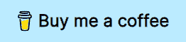

# 为基本前端开发设置磁带测试框架

> 原文：<https://dev.to/vonheikemen/setting-up-tape-testing-framework-for-basic-frontend-development-4b08>

今天我们将学习如何使用 [tape](https://github.com/substack/tape) 来测试要在浏览器中运行的代码。

> 你可以在 [github](https://github.com/VonHeikemen/tape-for-frontend) 上查看源代码示例

# 什么是磁带？

Tape 是一个 javascript 测试框架，它只提供了**基本的**特性集，因此您可以对您的代码做出断言。

# 为什么要用胶带？

这是我试图向你推销磁带的部分，但我不会那样做。

如果你在互联网上寻找更多关于它的信息，你可能会发现有人告诉你，这个框架的简单性将神奇地使你的测试(和你的整个代码库)更易于维护。请不要上当。

如果你发现自己需要模仿 ajax 调用，或者 websocket 连接，或者需要模仿你的模块所需要的补丁，那么我建议你开始寻找一个更“功能完整”的测试框架，比如 [jest](https://jestjs.io/) 。或者结账[柏树](https://www.cypress.io/)。

如果您认为磁带提供的有限功能符合您的需求，请使用磁带。

# 让我们用这些东西

从安装磁带开始。

```
npm install -D tape@5.2.2 
```

Enter fullscreen mode Exit fullscreen mode

现在，为了进行测试，我们将在名为`test`的文件夹中创建一个`simple.test.js`文件。接下来，我们创建一个测试。

```
// ./test/simple.test.js

var test = require('tape');

test('1 + 1 equals 2', function(t) {
  var sumResult = 1 + 1;
  t.equals(sumResult, 2);
  t.end();
}); 
```

Enter fullscreen mode Exit fullscreen mode

这里发生了什么事？

在第一行，我们需要`tape`，就像我们在“常规”代码库中处理任何其他模块一样。然后我们将它公开的唯一函数存储在一个变量中。我们现在使用的是`require`而不是`import`，但是我们稍后会修正这个问题。

然后我们叫`test`。第一个参数是一个标题，一个描述我们正在测试的内容的字符串。第二个参数是实际的测试，我们将其作为回调传递。

你会注意到我们在回调中得到一个对象。这个对象是我们的断言实用程序。它有一组[方法](https://github.com/substack/tape#tplann)，在断言失败时显示有用的消息。在这里我称它为`t`,因为你可以在文档中找到它。

最后，我们使用`t.end()`明确地告诉 tape 测试需要结束。

磁带的有趣之处在于，它不是某种超级复杂的测试环境。您可以像使用 node 的任何其他脚本一样执行这个测试。所以您可以简单地在终端上写下`node ./test/simple.test.js`并得到输出报告。

```
$ node ./test/simple.test.js

TAP version 13
# 1 + 1 equals 2
ok 1 should be equal

1..1
# tests 1
# pass  1

# ok 
```

Enter fullscreen mode Exit fullscreen mode

如果您想要执行多个测试文件，您可以使用 tape 提供的二进制文件。这将给你一个名为`tape`的命令，并传递一个[全局模式](https://github.com/isaacs/node-glob#glob-primer)。例如，要在一个名为`test`的文件夹中执行每个匹配以`.test.js`结尾的测试文件，我们可以用这个:
编写一个 npm 脚本

```
tape './test/**/*.test.js' 
```

Enter fullscreen mode Exit fullscreen mode

## 使用 ES6 模块

有几种方法可以实现这一点。

### 同通天塔-寄存器

> *警告*:这不适用于对 ES 模块有本地支持的节点版本。我认为这包括节点 12.17 及以后。

如果你已经安装了 babel 并配置了你喜欢的预置和插件，你可以使用`@babel/register`来编译你的测试文件，使用与你的源代码相同的 babel 配置。

```
npm install -D @babel/register@7.0.0 
```

Enter fullscreen mode Exit fullscreen mode

然后您可以使用带有`-r`标志的`tape`命令来请求`@babel/register`。像这样:

```
tape -r '@babel/register' './test/**/*.test.js' 
```

Enter fullscreen mode Exit fullscreen mode

### 带有要求的挂钩

> 警告:这不适用于巴别塔 7。

另一种解决方法是在设置脚本中使用 [require-extension-hooks](https://github.com/jackmellis/require-extension-hooks) 。

```
npm install -D require-extension-hooks@0.3.3 require-extension-hooks-babel@0.1.1 
```

Enter fullscreen mode Exit fullscreen mode

现在我们用下面的内容创建一个`setup.js`。

```
// ./test/setup.js

const hooks = require('require-extension-hooks');

// Setup js files to be processed by `require-extension-hooks-babel`
hooks(['js']).plugin('babel').push(); 
```

Enter fullscreen mode Exit fullscreen mode

最后，我们需要在我们的`tape`命令中使用`-r`标志。

```
tape -r './test/setup' './test/**/*.test.js' 
```

Enter fullscreen mode Exit fullscreen mode

### 带 esm

即使我们不传输代码，我们仍然可以使用 import 语句。借助 [esm](https://www.npmjs.com/package/esm) 包，我们可以在节点环境中使用 ES6 模块。

```
npm install -D esm@3.2.25 
```

Enter fullscreen mode Exit fullscreen mode

和胶带一起使用。

```
tape -r 'esm' './test/**/*.test.js' 
```

Enter fullscreen mode Exit fullscreen mode

> 想了解更多关于`esm`的信息，请看[这篇文章](https://dev.to/bennypowers/you-should-be-using-esm-kn3)

# 测试 DOM

想象一下，我们这里有这样的代码:

```
// ./src/index.js

// this example was taken from this repository:
// https://github.com/kentcdodds/dom-testing-library-with-anything

export function countify(el) {
  el.innerHTML = `
    <div>
      <button>0</button>
    </div>
  `
  const button = el.querySelector('button')
  button._count = 0
  button.addEventListener('click', () => {
    button._count++
    button.textContent = button._count
  })
} 
```

Enter fullscreen mode Exit fullscreen mode

我们在这里得到的(除了令人不安的缺少分号之外)是一个临时的“组件”，它有一个按钮，可以计算它被点击的次数。

现在，我们将通过触发按钮中的 click 事件来测试这一点，并检查 DOM 是否真正更新了。这是我想如何测试这个代码:

```
import test from 'tape';
import { countify } from '../src/index';

test('counter increments', t => {
  // "component" setup
  var div = document.createElement('div');
  countify(div);

  // search for the button with the good old DOM API
  var button = div.getElementsByTagName('button')[0];

  // trigger the click event
  button.dispatchEvent(new MouseEvent('click'));

  // make the assertion
  t.equals(button.textContent, '1');

  // end the test
  t.end(); 
}); 
```

Enter fullscreen mode Exit fullscreen mode

遗憾的是，如果我们尝试运行这个测试，它会因为很多原因而失败，第一个原因是节点中不存在`document`。但我们会看看如何克服这一点。

## 假冒 DOM 方式

如果您想继续在命令行中执行您的测试，您可以使用 [JSDOM](https://github.com/jsdom/jsdom) 以便使用在 node 中工作的 DOM 实现。因为我很懒，所以我将使用一个名为 [browser-env](https://www.npmjs.com/package/browser-env) 的 JSDOM 包装器来设置这个假环境。

```
npm install -D browser-env@3.3.0 
```

Enter fullscreen mode Exit fullscreen mode

现在我们创建一个安装脚本。

```
// ./test/setup.js

import browserEnv from 'browser-env';

// calling it this way it injects all the global variables
// that you would find in a browser into the global object of node
browserEnv();

// Alternatively we could also pass an array of variable names
// to specify which ones we want.
// browserEnv(['document', 'MouseEvent']); 
```

Enter fullscreen mode Exit fullscreen mode

有了这些，我们就可以运行测试并观察结果了。

```
$ tape -r 'esm' -r './test/setup' './test/**/*.test.js'

TAP version 13
# counter increments
ok 1 should be equal

1..1
# tests 1
# pass  1

# ok 
```

Enter fullscreen mode Exit fullscreen mode

但是如果您不信任 JSDOM 或者只是认为在运行测试的节点进程中注入全局变量是个坏主意，您可以用不同的方式来尝试。

## 利用真实交易

因为 tape 是一个简单的框架，所以可以在真实的浏览器中运行测试。您可能已经在使用 bundler 来编译您的代码，我们可以使用它来编译我们的测试并在浏览器中运行它们。

对于这个特殊的例子，我将展示最小可行的 webpack 配置来使它工作。让我们开始吧。

```
npm install -D webpack@4.46.0 webpack-cli@4.6.0 webpack-dev-server@3.11.2 html-webpack-plugin@4.5.2 
```

Enter fullscreen mode Exit fullscreen mode

让配置开始...

```
// ./webpack.config.js

const HtmlWebpackPlugin = require('html-webpack-plugin');
const { join } = require('path');

module.exports = {
  entry: join(__dirname, 'test', 'simple.test.js'),
  mode: 'development',
  devtool: 'inline-source-map',
  plugins: [
    new HtmlWebpackPlugin()
  ],
  node: {
    fs: 'empty'
  }
} 
```

Enter fullscreen mode Exit fullscreen mode

让我带你走一遍。

*   `entry`是我们要编译的测试文件。现在这个入口点是一个测试文件，但是您可以利用 webpack 特性来捆绑多个测试文件。
*   正在开发中，这样 webpack 就可以施展它的魔法，进行快速的增量构建。
*   `devtool`被设置为 inline-source-map，这样我们可以在浏览器中调试代码。
*   我们只有一个，html 插件创建一个开发服务器使用的 index.html 文件。
*   `node`用`fs: 'empty'`设置，因为 tape 在它们的源中使用这个模块，但是由于它不存在于浏览器中，我们告诉 webpack 将其设置为空对象。

现在，如果您使用`webpack-dev-server`命令，并在`localhost:8080`上打开浏览器，您将什么也看不到，但如果您打开浏览器控制台，您将看到磁带的测试输出。

# 其他来源

*   [用磁带和 Vue 测试工具编写极快的 Vue 单元测试](https://medium.freecodecamp.org/how-to-write-blazing-fast-vue-unit-tests-with-tape-and-vue-test-utils-be069ccd4acf)
*   [学磁带](https://github.com/dwyl/learn-tape)

* * *

感谢您的阅读。如果你觉得这篇文章有用，并想支持我的努力，请给我买一杯☕咖啡。

[T2】](https://www.buymeacoffee.com/vonheikemen)