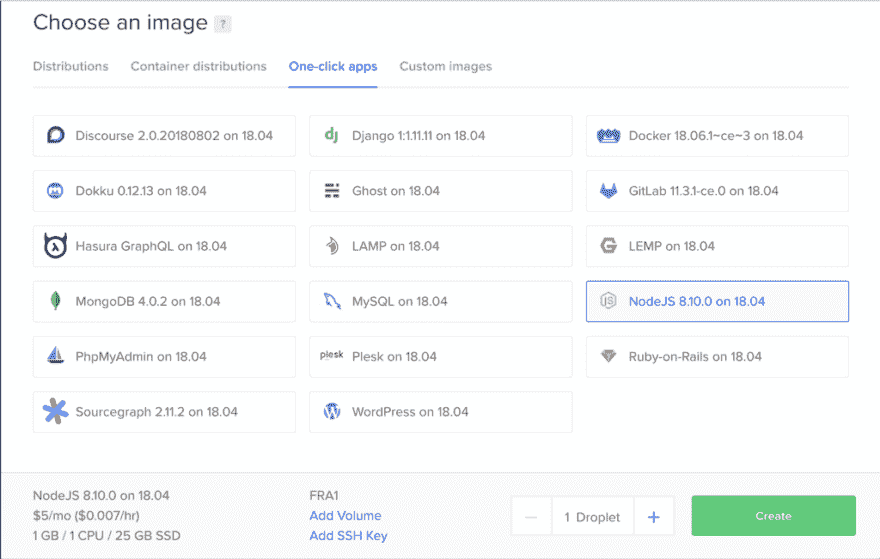
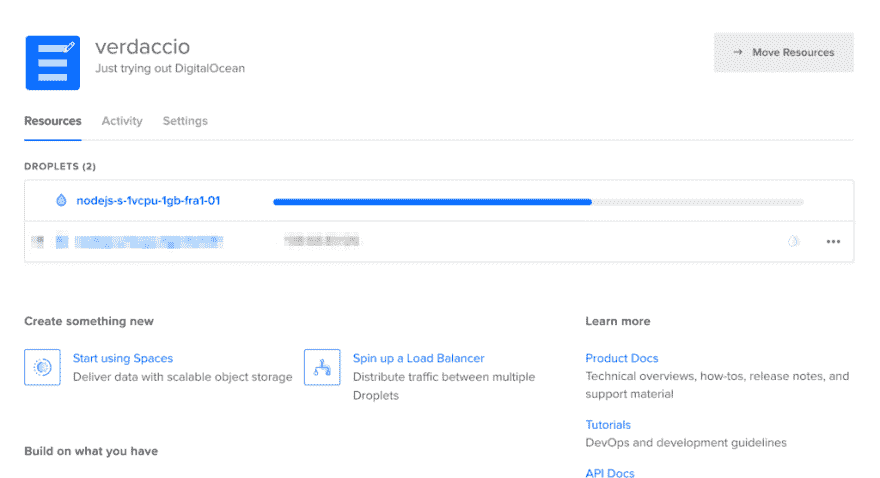
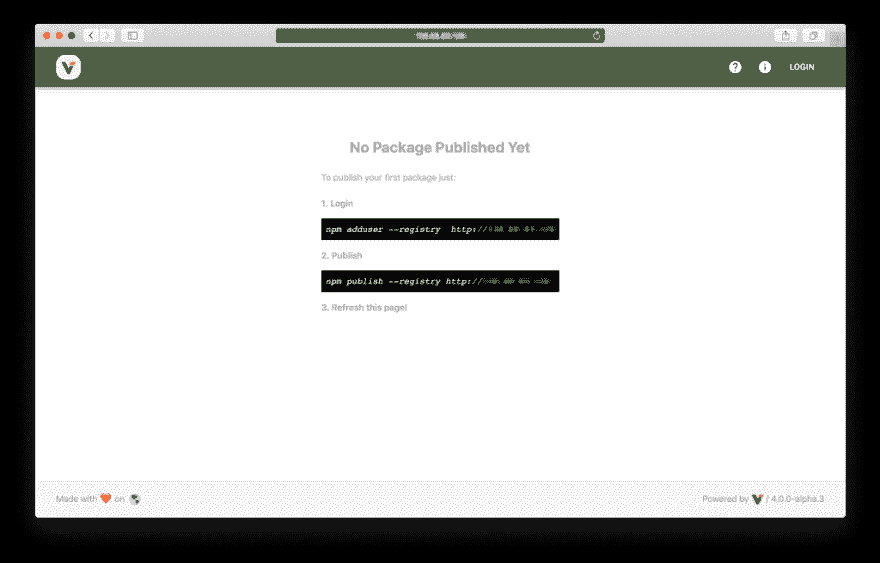

# 在数字海洋上建立 Verdaccio

> 原文：<https://dev.to/verdaccio/setting-up-verdaccio-on-digitalocean-6oi>

这是我将要写的关于在多个平台上运行 Verdaccio 的多篇文章中的一篇。

这次为了简单起见，我选择了 [DigitalOcean](https://www.digitalocean.com/) ，它提供了可承受的基础价格，如果你想运行自己的注册中心，这是一个不错的选择。

### 创建一个水滴

<figure>[](https://res.cloudinary.com/practicaldev/image/fetch/s--IHMUEvuD--/c_limit%2Cf_auto%2Cfl_progressive%2Cq_auto%2Cw_880/https://cdn-images-1.medium.com/max/1024/1%2A04T_T0af4mEZrJq4QBKKcQ.png) 

<figcaption>在创建水滴之前选择图像</figcaption>

</figure>

创建一个 droplet 相当容易，只需要选择一个图像并点击 Create，**我个人选择了 Node.js 8.10.0 版本**来简化设置。

<figure>[](https://res.cloudinary.com/practicaldev/image/fetch/s--4Nu5lY2u--/c_limit%2Cf_auto%2Cfl_progressive%2Cq_auto%2Cw_880/https://cdn-images-1.medium.com/max/1024/1%2AV1GIMttiMPYuX8FLKuumRg.png) 

<figcaption>一个水滴面板的视图</figcaption>

</figure>

创建 droplet 需要几秒钟的时间，下一步是找到通过 SSH 登录的方法，您可以在电子邮件中找到凭证。请记住，droplet 提供了 root 访问权限，接下来的步骤我不会使用 sudo。

### 安装要求

作为第一步，我们必须用下面的命令安装 [Verdaccio](https://verdaccio.org/) 。

```
npm install --global verdaccio 
```

> 为了简单起见，我们将使用 npm，但我建议使用其他工具，如 [pnpm](https://pnpm.js.org/) 或 [yarn](https://yarnpkg.com/en/) 。

我们将使用为重启和监控提供便利工具的 *pm2* 工具来处理 **verdaccio** 进程。

```
npm install -g pm2 
```

#### Nginx 配置

为了处理这个请求，我们将设置非常容易安装的 ngnix。我不会在这篇文章中包括设置网站的所有步骤，但是你可以[跟随这篇文章](https://www.digitalocean.com/community/tutorials/how-to-install-nginx-on-ubuntu-16-04)。

一旦 *nginx* 在 80 端口运行，我们必须对配置文件做如下修改

```
vi /etc/nginx/sites-available/default

location / {
 proxy\_pass [http://127.0.0.1:4873/](http://127.0.0.1:4873/);
 proxy\_set\_header Host $http\_host;
} 
```

如果你愿意，你可以使用这种配置，但是，为了简单起见，这对于本文的目的来说已经足够了。

不要忘记重启 *nginx* 以使更改生效。

```
systemctl restart nginx 
```

由于我们使用代理，我们必须更新由 **verdaccio** 提供的默认配置，以定义我们的代理传递域。编辑文件并添加您的域或 IP。

```
vi /root/verdaccio//config.yaml

http\_proxy: http://xxx.xxx.xxx.xxx/ 
```

### 运行 Verdaccio

之前我们安装了 pm2，现在是用下面的命令运行 *verdaccio* 的时候了。

```
pm2 start `which verdaccio` 
```

*注意:请注意，我们使用的 due pm2 似乎不能运行节点全局命令。*

### 使用 Verdaccio

Verdaccio 提供了一个很好的用户界面来浏览你可以通过 URL 访问的包，在我们的例子中，从数字海洋控制面板获得 IP 并访问 *verdaccio* 像【http://xxx.xxx.xxx.xxx/】T2。

[T2】](https://res.cloudinary.com/practicaldev/image/fetch/s--fVxTxood--/c_limit%2Cf_auto%2Cfl_progressive%2Cq_auto%2Cw_880/https://cdn-images-1.medium.com/max/1024/1%2Al5oyR93jMLDOJnYUv88IZg.png)

#### 安装包

npm 将在安装时使用默认的注册表，但我们愿意使用我们自己的注册表，以实现使用- registry 参数来提供不同的位置。

```
npm install --registry http://xxx.xxx.xxx.xxx 
```

如果你需要在注册中心之间切换，我建议你使用 nrm，安装它只需

```
npm install --global nrm
nrm add company-registry [http://xxx.xxx.xxx:4873](http://xxx.xxx.xxx:4873/)
nrm use company-registry 
```

通过上面的步骤，您可以以一种简单的方式切换回其他注册表，更多信息只需键入 nrm - help。

#### 发布包

默认情况下，verdaccio 需要认证才能发布，因此我们需要登录。

```
npm adduser --registry http://xxx.xxx.xxx.xxx 
```

一旦你登录了，就是发布的时候了。

```
npm publish --registry http://xxx.xxx.xxx.xxx 
```

### 包装完毕

正如你所看到的，**托管一个注册中心是非常便宜的，如果你对 UNIX** 有一定的了解，初始设置可能需要相当短的时间。

> Verdaccio 为使用默认插件的小型中型团队提供了良好的性能，如果需要的话，您可以扩展到更大的团队，但是我将在以后的文章中讨论这些主题。

如果你愿意在我们的博客中分享你写的关于 ***verdaccio*** 被安装在其他平台上的经历，只需[通过我们在 Discord](http://chat.verdaccio.org) 的聊天给我发消息，以便于协调。

* * *