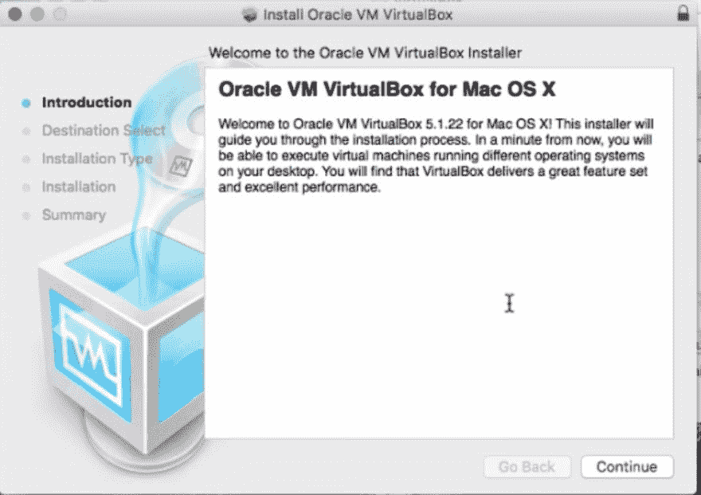
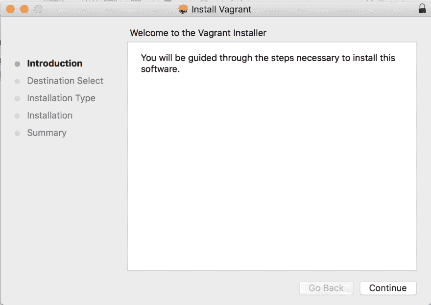
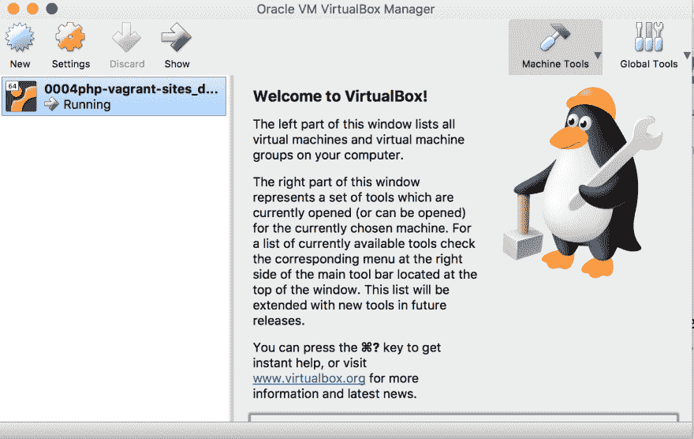
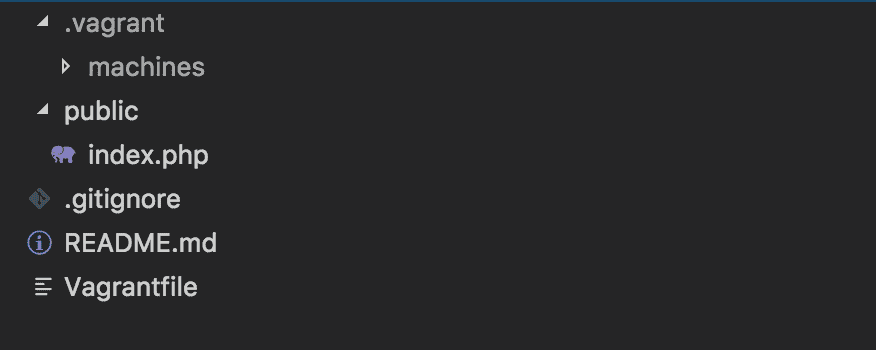
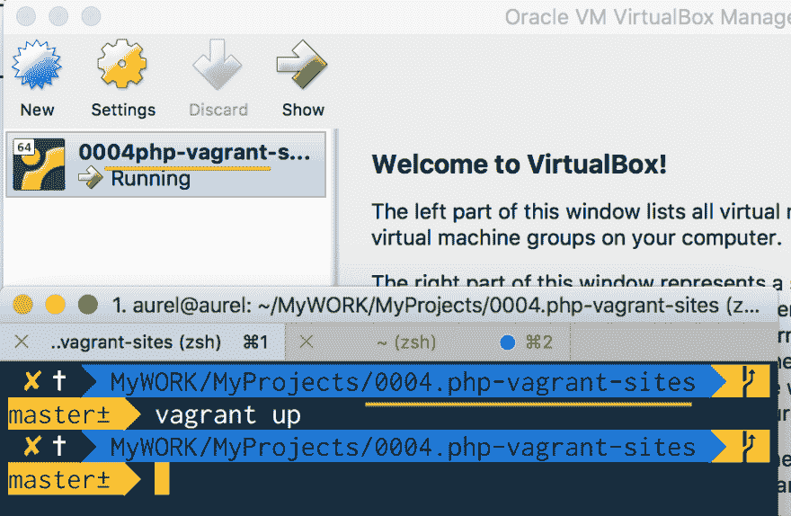

# 设置虚拟箱子、流浪者和苏格兰人箱子

> 原文：<https://dev.to/aurelkurtula/setting-up-virtual-box-vagrant-and-scotch-box--4jd8>

正如我在上一篇文章中所说的，在我的旧电脑坏掉后，我不得不买一台新的 Macbook。因此，我不得不从头开始重新安装一切。到目前为止，一切都很顺利。

以下只是对我如何设法安装虚拟盒子，流浪者和苏格兰盒子的说明。更多的是对自己的提醒

首先安装[虚拟盒](https://www.virtualbox.org/wiki/Downloads)

[T2】](https://res.cloudinary.com/practicaldev/image/fetch/s--pUV49o3W--/c_limit%2Cf_auto%2Cfl_progressive%2Cq_auto%2Cw_880/https://thepracticaldev.s3.amazonaws.com/i/7f5dtomjgarp34ra8vr3.png)

然后安装[流浪者](https://www.vagrantup.com/)

[T2】](https://res.cloudinary.com/practicaldev/image/fetch/s--r94249Lw--/c_limit%2Cf_auto%2Cfl_progressive%2Cq_auto%2Cw_880/https://thepracticaldev.s3.amazonaws.com/i/90y68b1by60p51n2dsbn.png)

正如您将看到的，两个安装都是通过单击“继续/下一步”完成的。

要测试上述软件是否正确安装，您可以将 virtualbox 作为应用程序打开。

[T2】](https://res.cloudinary.com/practicaldev/image/fetch/s--22jvFYqx--/c_limit%2Cf_auto%2Cfl_progressive%2Cq_auto%2Cw_880/https://thepracticaldev.s3.amazonaws.com/i/go4fqzwf5vgbjz9kj1wn.png)

如果您看到类似上面的内容，您就知道它已经正确安装了。(你将不需要使用它，流浪者将与 virtualbox 一起工作)。

要测试是否正确安装了 vagger，请在终端中运行`vagrant -v`。

## 安装箱子

完成以上步骤后，你需要做的就是安装盒子。这些独立的虚拟机器可以在你的本地计算机上运行，但是它们是独立的。

到目前为止，我只尝试过 [Scotch Box](https://box.scotch.io/) 是“用于本地开发的完美而简单的灯/LEMP 堆栈”

如他们的主页所示，这个框可以很容易地设置。

进入您喜欢的文件夹并运行

```
git clone https://github.com/scotch-io/scotch-box 0006.scotch-box-setup-test
cd 0006.scotch-box-setup-test 
```

Enter fullscreen mode Exit fullscreen mode

在该文件夹中，您将看到以下文件

[T2】](https://res.cloudinary.com/practicaldev/image/fetch/s--Ru4wQnjm--/c_limit%2Cf_auto%2Cfl_progressive%2Cq_auto%2Cw_880/https://thepracticaldev.s3.amazonaws.com/i/abdysp6kjitwpmy69t5n.png)

正如你所想象的，我们将把我们的工作添加到`public`文件夹中——用你想要的任何东西替换`index.php`。

在终端中，在`my-project`中，你最终会运行

```
vagrant up 
```

Enter fullscreen mode Exit fullscreen mode

现在，如果你访问 [http://192.168.33.10/](http://192.168.33.10/) ，你会看到页面上呈现的`0006.scotch-box-setup-test/public/index.php`。您可以编辑文件，然后刷新浏览器以查看更改。

## 有趣的事情要注意

虽然你不需要打开虚拟盒子应用程序，但如果你现在打开它，你会看到一个以你的文件夹名运行的盒子

[T2】](https://res.cloudinary.com/practicaldev/image/fetch/s--UkSjF3sZ--/c_limit%2Cf_auto%2Cfl_progressive%2Cq_auto%2Cw_880/https://thepracticaldev.s3.amazonaws.com/i/ym3g8a96tgzwelx1c4iz.png)

类似地，你可以运行`vagrant halt`来关闭盒子，在虚拟盒子应用程序中，你会看到“关机”的指示，现在它显示“正在运行”。

正如你所看到的，你可以通过终端控制盒子，所以你永远不需要打开虚拟盒子应用程序。

第二件我认为非常重要的事情是，当你第一次在 Scotch Box 项目上运行`vagrant up`时，一个虚拟盒子被安装在你的计算机上，它位于`/Users/{username}/VirtualBox VMs`(在 windows 上，很可能是在`C:\Users\{username}\VirtualBox VMs`)。一盒苏格兰威士忌 3.52 GB。因此，你应该为你想做的每个 web 项目安装一个盒子的想法似乎有点过头了。

## 结论

我很高兴我能够设置这个！我以前试过一次(在我的旧 MacBook 上)，结果真的出错了。但现在一切都运转良好。

我确实认为苏格兰盒子对我来说是多余的。例如，它提供了 Node 和 MongoDB，但是我想在虚拟机器上做的就是 PHP 开发！然而，开始时，这非常简单。

在我的下一篇文章中，我将尝试记录我们如何使用这个设置创建一个网站！

还有很多其他的[流浪者盒子](https://app.vagrantup.com/boxes/search)，我想知道是否有人可以留下评论，如果没有 scotch box 提供的额外服务，哪一个是 PHP 开发的最佳盒子——谢谢