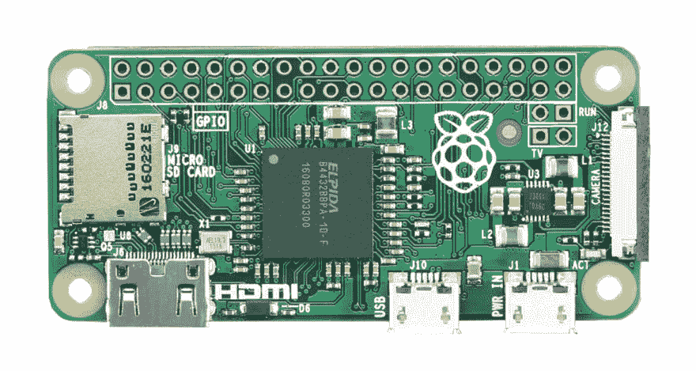
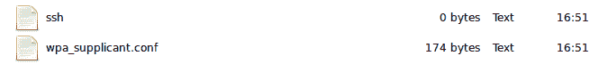
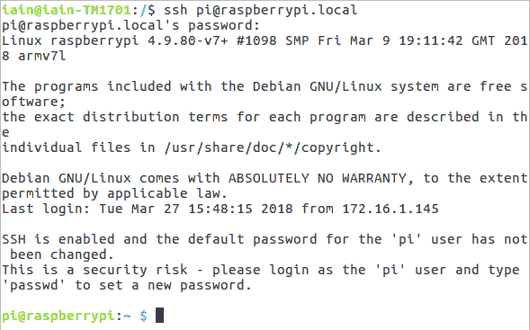
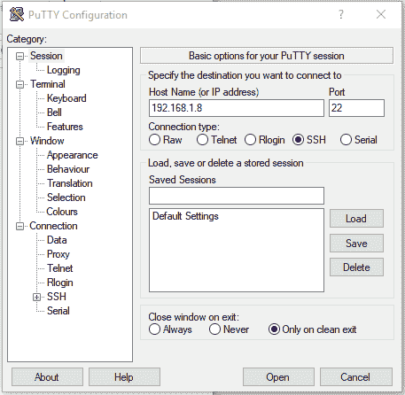
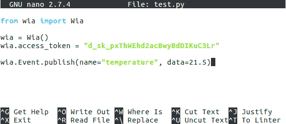
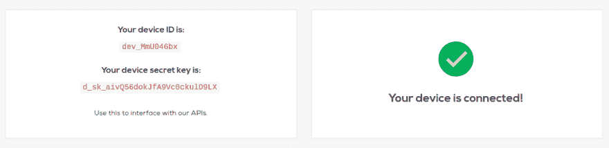
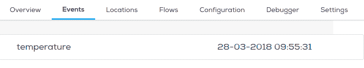

# 设置 Raspberry Pi Zero 并向 Wia 发布一个事件

> 原文：<https://dev.to/wiaio/setup-a-raspberry-pi-zero-and-publish-an-event-to-wia-2e93>

[T2】](https://res.cloudinary.com/practicaldev/image/fetch/s--IXX03luH--/c_limit%2Cf_auto%2Cfl_progressive%2Cq_auto%2Cw_880/https://files.readme.io/ab3ee43-006.jpg)

#### **组件**

您将需要以下组件:

*   树莓派零度
*   微型 sd 卡
*   SD 卡适配器
*   微型 USB 转 USB 电缆
*   以太网电缆和微型 USB 转以太网适配器(如果通过以太网连接)
*   兼容的 WiFi 芯片(如果通过 WiFi 连接)和 USB 转 micro USB 适配器(如有必要)
*   带有 SD 插槽(或合适的 SD 卡适配器)的计算机

### **安装操作系统**

*   下载 [Raspbian](https://downloads.raspberrypi.org/raspbian_latest) 并提取。img 文件
    *   在 Windows 上，右键单击下载文件夹中的 Zip 文件，然后单击`Extract All`
*   通过 SD 卡适配器将 microSD 插入计算机的 SD 卡插槽
*   接下来，您需要将 Raspbian 图像刷新到 microSD。有各种各样的应用程序可以用来做这件事，比如用于 Linux、macOS 或 Windows 的 [Etcher](https://etcher.io/)
*   从文件浏览器中打开 SD 卡——该驱动器将被标记为`boot`
*   默认情况下，SSH 访问是禁用的。要启用它，在`boot`驱动器中创建一个名为`ssh`的空文件
    *   在 Windows 上，在`boot`目录中，右键单击空白区域，滚动到`New`并选择`Text Document`。输入`ssh as`名称

### **连接网络**

#### 选项 1 -通过以太网

*   通过微型 USB 转以太网适配器和以太网电缆将 Raspberry Pi 连接到您的路由器，然后继续下一部分。

#### 选项 2 -通过 WiFi

*   通过微型 USB 端口将您的 WiFi 芯片连接到您的 Raspberry Pi。

##### 在 Mac/Linux 上

*   在`boot`驱动器中创建一个名为`wpa_supplicant.conf`的新文件
*   遵循下面的代码步骤

##### Windows 上的

*   从[这里](https://notepad-plus-plus.org/download)下载并安装 Notepad++。
*   安装完成后，在 Notepad++中进入`File > New`创建一个新文件。
*   在顶栏中，选择`Edit > EOL Conversion`。确保选择了`Unix (LF)`。如果是，它应该显示为禁用。
*   选择`File > Save`为，导航到你的`boot`驱动器并调用文件`wpa_supplicant.conf`

##### 我们所有人

*   粘贴以下代码:

**正文**

```
 country=IE
ctrl_interface=DIR=/var/run/wpa_supplicant GROUP=netdev
update_config=1

network={
  scan_ssid=1
  ssid="Your-SSID"
  psk="Your-PSK"
  key_mgmt=WPA-PSK
} 
```

Enter fullscreen mode Exit fullscreen mode

将`Your-SSID`替换为您的 WiFi 网络，将`Your-PSK`替换为您的 WiFi 密码。
这个文件将告诉 Raspberry Pi 在启动时连接到指定的网络。

[T2】](https://res.cloudinary.com/practicaldev/image/fetch/s--XFd8bBVG--/c_limit%2Cf_auto%2Cfl_progressive%2Cq_auto%2Cw_880/https://files.readme.io/dace3c3-Screenshot_from_2018-03-27_16-53-50.png)

**注意:确保您的电脑与您的 Raspberry Pi 连接在同一个网络上。**

### **开机板**

*   弹出 microSD 卡并将其插入 Raspberry Pi 的 microSD 插槽
*   将您的 Raspberry Pi 上的`PWR IN`微型 USB 连接到 5v 电源(例如您电脑的 USB 端口)
*   等待主板启动-完成启动后，绿色 LED 应停止闪烁

### **获取你的树莓派的 IP 地址**

#### 选项 1 -登录您的路由器

*   如果您可以访问您的路由器，您可以通过浏览器登录到它的管理面板。通常是类似于`192.168.0.1`、`192.168.1.1`或者`192.168.1.254`的东西
*   查看设备列表，找到您的 Pi 的 IP 地址。它应该看起来像`192.168.1.8`

**注:请注意**
当在终端或命令提示符下输入密码时，出于安全原因，您不会看到它被键入。只需输入密码，然后按回车键。

#### 选项 2 -使用 Nmap 扫描

nmap 命令(网络映射器)是一个用于网络发现的免费开源工具，可用于 Linux、macOS 和 Windows。

*   要在 Linux 上安装，请安装 nmap 软件包。为此，加载您的终端并运行命令`apt-get install nmap`。(如果由于权限原因无法运行，请尝试`sudo apt-get install nmap`)
*   要在 macOS 或 Windows 上安装，请参见 nmap.org 下载页面[这里](https://nmap.org/download.html)

要使用 nmap 扫描网络上的设备，您需要知道您所连接的子网。首先找到您自己的 IP 地址，换句话说，就是您用来找到您的 Pi 的 IP 地址的计算机的 IP 地址:

*   在 Linux 上，在终端窗口中键入`hostname -I`
*   在 macOS 上，转到`System Preferences`然后`Network`并选择您的活动网络连接以查看 IP 地址
*   在 Windows 上，转到`Settings`，然后在`Network and Internet`下，选择您的连接类型，即 Wi-Fi、以太网，点击属性(对于某些人来说，这被称为`Hardware Properties`)
*   在这里，你会看到`IPv4 address`
    *   现在您有了计算机的 IP 地址，您将扫描整个子网寻找其它设备。例如，如果您的 IP 地址是 192.168.1.5，其他设备将位于类似`192.168.1.2`、`192.168.1.3`、`192.168.1.4`等地址。

在您的终端或命令提示符下，现在在整个子网范围内使用带有-sn 标志的 nmap 命令(ping scan)。这可能需要几秒钟:
`nmap -sn 192.168.1.0/24`

**注意:上面命令中的 192.168.1 部分应该替换为您之前获得的 IP 地址的前 3 部分。**

Ping 扫描只是 ping 所有的 IP 地址，看看他们是否有反应。对于响应 ping 命令的每台设备，输出显示的主机名和 IP 地址如下:

```
Starting Nmap 6.40 ( http://nmap.org ) at 2018-04-02 12:51 GMT
Nmap scan report for Conalls-MBP (192.168.1.4)
Host is up (0.0017s latency).
Nmap scan report for iPhone (192.168.1.45)
Host is up (0.0021s latency).
Nmap scan report for raspberrypi (192.168.1.8)
Host is up (0.0038s latency).
Nmap done: 256 IP addresses (3 hosts up) scanned in 2.21 seconds
Here you can see a device with hostname raspberrypi has IP address 192.168.1.8. 
```

Enter fullscreen mode Exit fullscreen mode

#### 选项 3 -使用主机名

默认情况下，`Raspberry Pi`的主机名是 raspberrypi。如果您无法获得您的 IP 地址，您可以尝试使用`raspberrypi.local`来代替。

### **通过 SSH 连接到树莓 Pi**

##### 在 Mac 和 Linux 上

*   打开终端窗口，运行`ssh pi@ip-address`
    *   将`ip-address`替换为您在上一步中获得的值
*   系统会提示您输入密码——默认密码是`raspberry`

[T2】](https://res.cloudinary.com/practicaldev/image/fetch/s--t_1wtEF4--/c_limit%2Cf_auto%2Cfl_progressive%2Cq_auto%2Cw_880/https://files.readme.io/8fc3efc-Screenshot_from_2018-03-27_16-49-33.png)

##### Windows 上的

*   从[这里](https://www.chiark.greenend.org.uk/~sgtatham/putty/latest.html)下载 Putty，允许你通过 SSH 与你的板通信。
*   在`Host Name (or IP address)`下输入您的树莓 Pi 的 IP 地址。
*   点击`Open`按钮创建连接。

[T2】](https://res.cloudinary.com/practicaldev/image/fetch/s--xyC4ic9P--/c_limit%2Cf_auto%2Cfl_progressive%2Cq_auto%2Cw_880/https://files.readme.io/db97bb0-d4ed00b-connect-to-pi-via-putty-2.PNG)

### **向 Wia 发布事件**

*   一旦你通过 SSH 连接到 Raspberry Pi，运行`sudo apt-get install python-pip`安装 pip，一个包管理器
*   运行 sudo `pip install wia`来安装 Wia SDK。
*   通过运行`mkdir my-project`为您的项目创建一个新目录
*   通过运行`cd my-project`导航到这个新目录

对于本教程，我们将使用 python，但是您也可以使用我们的 [Node.js SDK](https://github.com/wiaio/wia-nodejs-sdk) 。

*   通过运行 touch test.py 创建一个新的 python 文件。

注意:你可以给这个文件起任何你想要的名字，但是不要把它命名为‘wia . py ’,因为这会导致一个导入错误。

*   用`nano test.py`编辑文件
*   粘贴以下代码片段开始使用:

**Python**T2】

```
 from wia import Wia

wia = Wia()
wia.access_token = "your-access-token"

wia.Event.publish(name="temperature", data=21.5) 
```

Enter fullscreen mode Exit fullscreen mode

用您设备的密钥替换`your-access-token`(您可以在 Wia 仪表板中找到它，它以`d_sk`开始)，并按照底部屏幕上的说明保存文件。

[T2】](https://res.cloudinary.com/practicaldev/image/fetch/s--kcfrjcsJ--/c_limit%2Cf_auto%2Cfl_progressive%2Cq_auto%2Cw_880/https://files.readme.io/89b6898-Screenshot_from_2018-03-27_16-45-30.png)

*   通过运行`python test.py`来运行您新创建的脚本
*   导航到 Wia 仪表板，您将看到您的设备已连接

[T2】](https://res.cloudinary.com/practicaldev/image/fetch/s--TCcLG7-0--/c_limit%2Cf_auto%2Cfl_progressive%2Cq_auto%2Cw_880/https://files.readme.io/37f0199-Screenshot_from_2018-03-28_09-55-45.png)

*   导航到“事件”选项卡，您将看到一个事件已经发布