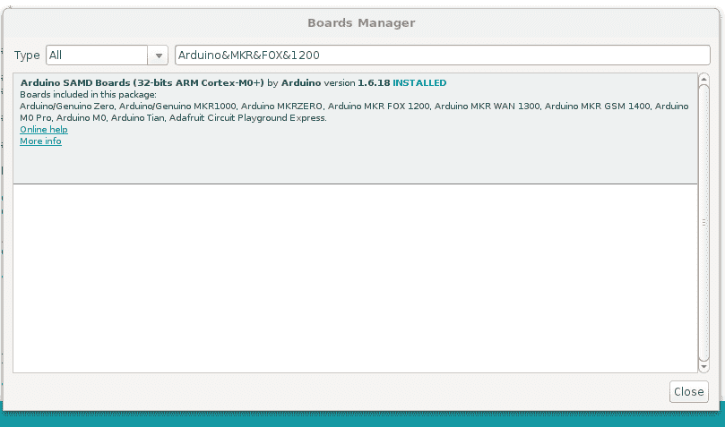
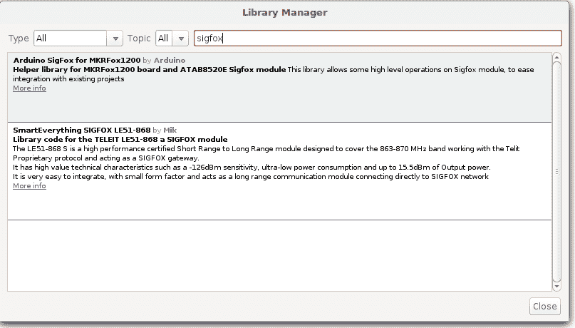
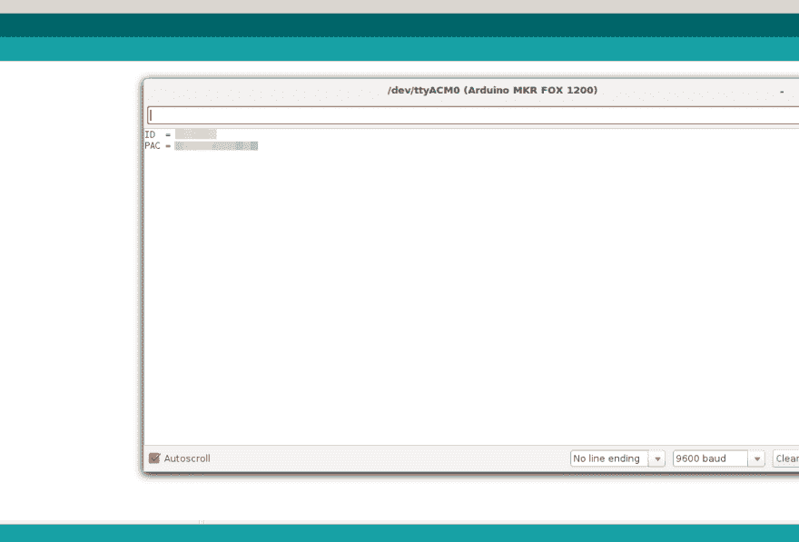
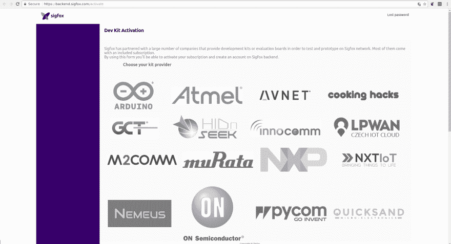
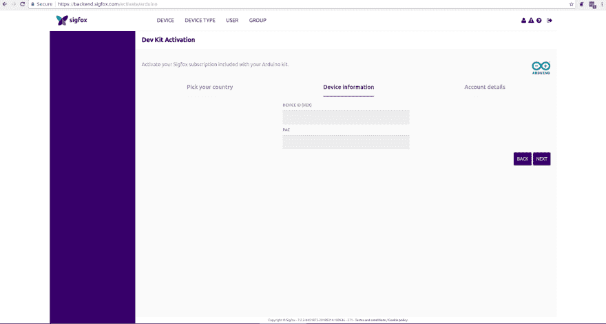
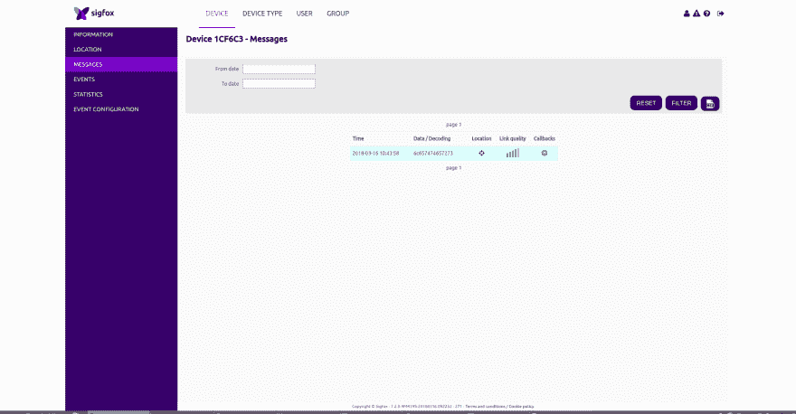
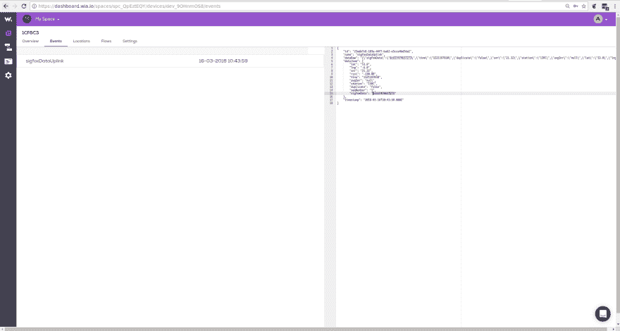

# 设置 Arduino MKR FOX 1200 并向 Wia 发布事件

> 原文：<https://dev.to/wiaio/setup-an-arduino-mkr-fox-1200-and-publish-an-event-to-wia-979>

### **组件**

*   Arduino MKRFox1200
*   Sigfox 天线
*   微型 USB 转 USB

### **设置您的环境**

如果您尚未安装，请在此下载并安装适用于您所选操作系统[的`Arduino IDE`。](https://www.arduino.cc/en/Main/Software)

*   打开 IDE 并转到`Tools > Boards > Board Manager`
*   搜索`Arduino SAMD Boards`
*   安装板的核心库

[](https://res.cloudinary.com/practicaldev/image/fetch/s--hmgrFQpX--/c_limit%2Cf_auto%2Cfl_progressive%2Cq_auto%2Cw_880/https://files.readme.io/e44b5b3-boards_manager_fox.png) 
*Arduino 董事会经理*

### **将板卡连接到电脑上**

使用微型 USB 电缆，将板上的微型 USB 端口连接到计算机上的 USB 端口。

### **安装所需库**

*   转到`Sketch > Include Libraries > Manage Libraries`
*   在搜索栏中键入`SigFox`并点击第一个选项。框的右下角会出现一个按钮，允许您安装库

为库重复安装:

*   Arduino 低功耗
*   RTCzeroT1】SIG fox 库

### **选择板卡和端口**

将它连接到电脑后，在 Arduino IDE 中，选择`Tools`

*   选择`Arduino MRKFox1200`板
*   选择正确的端口(Arduino MRKfox1200 应该在端口名称上):如果没有显示名称，您可以通过以下步骤找到端口:

#### Linux 和 Mac OS X

*   从[这里](https://www.silabs.com/products/development-tools/software/usb-to-uart-bridge-vcp-drivers)下载并安装 FTDI 驱动。为您的操作系统和体系结构选择合适的版本
*   打开终端窗口并运行命令`ls /dev/tty*`
*   查找名称以`/dev/tty`开头的设备，例如 MAC 上的`/dev/tty.usbmodemPy343431`或 Linux 上的`/dev/ttyUSB0` / `dev/ttyACM0`

注意:对于 Linux，您可能需要运行下面的两个命令。一旦你完成了，重启你的电脑。这将添加权限，允许您将草图上传到板上。

`sudo usermod -a -G tty ${USER}`
T1】

#### 窗口

*   从[这里](https://www.silabs.com/products/development-tools/software/usb-to-uart-bridge-vcp-drivers)下载并安装 FTDI 驱动。为您的操作系统和体系结构选择合适的版本
*   打开 Windows 开始菜单，搜索`Device Manager`
*   Pycom 设备的 COM 端口将被列为`USB Serial Device`或类似的名称
*   记下 COM 端口(例如 COM4)

### **安装所需的库**

### **创建新草图**

创建一个名为`sketch_sigfox_init.ino`的新文件，并添加下面的代码。

**sketch _ main . ino**T2】

```
 #include <SigFox.h>   // must include the SigFox library

void setup() {
  Serial.begin(9600); 
  while(!Serial) {}; //waits for Serial to be available
  if (!SigFox.begin()) { //ensures SigFox is connected
    Serial.println("Shield error or not present!");
    return;
  }

  String version = SigFox.SigVersion();
  String ID = SigFox.ID();
  String PAC = SigFox.PAC();

  Serial.println("ID  = " + ID);
  Serial.println("PAC = " + PAC);

  delay(100);

  // Send the module to the deepest sleep
  SigFox.end();
}

void loop() {
} 
```

Enter fullscreen mode Exit fullscreen mode

上面的代码只是等待，直到系列已经开始。这确保 Sigfox 已连接，并打印设备的设备 ID 和 PAC 号。

### **上传代码到板卡**

点击`Sketch > Upload`将代码上传至您的设备，以检索设备的 ID 和 PAC 号。

### **查看串口监视器**

*   点击右侧的`Screen Monitor`图标
*   在监视器中，应该显示设备的 ID 和 PAC*板卡 ID 和 PAC 号*

### **用 Sigfox 注册设备**

*   单击此处向 Sigfox 注册设备
*   从列表中选择 Arduino 提供商，然后选择合适的国家 * Sigfox 提供商*

### **输入设备信息**

*   将您设备的 ID 和 PAC 输入 Sigfox  * Sigfox 设备 ID 和 PAC*

进入后，您必须登录或注册 Sigfox 帐户，才能在 Sigfox 仪表板上查看您的设备。

### **代码**

创建一个名为 sketch_sigfox.ino 的新文件，并添加下面的代码。确保:

*   工具>电路板设置为 Arduino MRKfox1200
*   工具>端口设置为板的端口

```
 #include <SigFox.h>   // must include the SigFox library

void setup() {
  Serial.begin(9600); 
  while(!Serial) {}; //waits for Serial to be available
  if (!SigFox.begin()) { //ensures SigFox is connected
    Serial.println("Shield error or not present!");
    return;
  }
  Serial.print("sending");
  Serial.print(SigFox.internalTemperature())
  SigFox.begin();
  SigFox.beginPacket();
  SigFox.print(SigFox.internalTemperature()); //content of the packet

  SigFox.endPacket();
  Serial.print("sent");
}
void loop() {
  while(1);
} 
```

Enter fullscreen mode Exit fullscreen mode

*   `SigFox.beginPacket()` & `SigFox.endPacket()`是有效载荷的包装器
*   数据放在包装器之间，最大大小为`12 Bytes`
*   字符串将被转换成十六进制

### **上传代码**

*   点击草图>上传上传 MRKfox1200 的代码
*   您可以在屏幕右侧查看串行监视器的输出

### **接收 Sigfox 仪表盘上的消息**

*   去 Sigfox 仪表盘，链接是[这里](https://backend.sigfox.com/auth/login)
*   在你的 Sigfox 账户上，点击`Device`标签，点击你的`Device ID`，点击`Messages`
    [](https://res.cloudinary.com/practicaldev/image/fetch/s--I4N8972R--/c_limit%2Cf_auto%2Cfl_progressive%2Cq_auto%2Cw_880/https://files.readme.io/84051d0-Selection_022.png)
    *SIG fox 消息*

*   有效负载将以十六进制显示

*   转换为 ASCII 码以查看您的邮件

### **连接 Sigfox 和 Wia**

*   首先，Sigfox 必须与 Wia 集成才能在 Wia 中看到您的 Sigfox 消息
*   教程可以在这里[访问](https://developers.wia.io/v1.0/docs/integrations-sigfox)

### **在 Wia 上接收消息**

如果已经在 Sigfox 和 Wia 之间正确设置了回调，那么消息也应该显示在 Wia 中

[T2】](https://res.cloudinary.com/practicaldev/image/fetch/s--I4N8972R--/c_limit%2Cf_auto%2Cfl_progressive%2Cq_auto%2Cw_880/https://files.readme.io/84051d0-Selection_022.png)

*   转到您的共享空间，那里有您的 Sigfox 集成
*   在 Sigfox 网站上点击与 Sigfox 设备匹配的设备
*   单击 events 选项卡，应该会显示 Sigfox 消息

[T2】](https://res.cloudinary.com/practicaldev/image/fetch/s--cPWDRVI6--/c_limit%2Cf_auto%2Cfl_progressive%2Cq_auto%2Cw_880/https://files.readme.io/2eccda2-wia_payload.png)

如果您在设置方面需要任何帮助，或者您不理解本教程，[发推特给我们](https://twitter.com/wiaio)，发电子邮件给 [support@wia.io](mailto:support@wia.io) 或者通过对讲机聊天。**