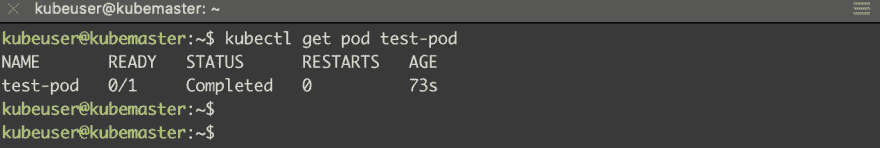

# 基于 NFS 设置动态存储类供应器

> 原文：<https://dev.to/pongsatt/setup-dynamic-storage-class-provisioner-based-on-nfs-1d4i>

这篇文章是在你的 kubernetes 集群虚拟机中设置 NFS 存储类的指南。

这是系列文章[“在虚拟机上设置您自己的 kubernetes 集群”](https://dev.to/pongsatt/setup-your-own-kubernetes-cluster-on-vms-5ln)的一部分。

在集群中，我们的应用程序可以在任何主机上运行，所以像数据库这样的应用程序需要知道在哪里保存数据。

Kubernetes 集群通过使用持久卷(PV)和集群存储资源持久卷声明(PVC)来支持这一点。我们需要定义具有底层实际存储的 PV，然后定义使用它的 PVC，然后将 PVC 绑定到应用程序。

Kubernetes 还支持存储类，我们可以将存储类设置为应用程序 PVC 作为注释，而不是手动定义 PV。然后，群集将自动为我们创建一个与存储类别相匹配的 PV。

**举例:**

```
kind: PersistentVolumeClaim
apiVersion: v1
metadata:
  name: db-claim
  annotations:
    volume.beta.kubernetes.io/storage-class: "ssdnfs"
spec:
  accessModes:
    - ReadWriteMany
  resources:
    requests:
      storage: 1Gi 
```

每个云提供商，如 AWS 或 Google，都有自己的存储类支持，将实际存储与他们现有的云存储绑定在一起。

由于我们的 kubernetes 集群位于虚拟机或裸机上，因此我们没有现成的这种功能。

在这篇文章中，我将指导您使用一个名为“nfs-client-provisioner”的程序来设置基于 NFS 的存储类。

## 先决条件:

*   虚拟机或裸机上启用了 RBAC 的 kubernetes 集群
*   NFS 服务器

我们将创建一个名为 **ssdnfs** 的存储类作为默认存储类。
让我们假设在 IP `192.168.1.119`和导出路径`/export/k8sdynamic`上有 NFS 服务器。

如果您从[前一个 post](https://dev.to/pongsatt/setup-kubernetes-cluster-using-kubeadm-hpb) 开始，您需要在主节点上。

### 1。创建存储类

运行下面的命令，为集群定义我们的存储类。

```
echo 'apiVersion: storage.k8s.io/v1
kind: StorageClass
metadata:
  name: ssdnfs
  annotations:
    storageclass.kubernetes.io/is-default-class: "true"
provisioner: k8s/nfs' | kubectl apply -f - 
```

### 2。创建服务帐户和权限

置备程序需要权限来为我们监控和创建 PV，因此我们需要一个具有适当权限的服务帐户。

创建服务帐户。

```
echo "apiVersion: v1
kind: ServiceAccount
metadata:
  name: nfs-client-provisioner" | kubectl apply -f - 
```

定义集群角色。

```
echo 'kind: ClusterRole
apiVersion: rbac.authorization.k8s.io/v1
metadata:
  name: nfs-client-provisioner-runner
rules:
  - apiGroups: [""]
    resources: ["persistentvolumes"]
    verbs: ["get", "list", "watch", "create", "delete"]
  - apiGroups: [""]
    resources: ["persistentvolumeclaims"]
    verbs: ["get", "list", "watch", "update"]
  - apiGroups: ["storage.k8s.io"]
    resources: ["storageclasses"]
    verbs: ["get", "list", "watch"]
  - apiGroups: [""]
    resources: ["events"]
    verbs: ["list", "watch", "create", "update", "patch"]
  - apiGroups: [""]
    resources: ["endpoints"]
    verbs: ["get", "list", "watch", "create", "update", "patch"]' | kubectl apply -f - 
```

将群集绑定到服务帐户。

```
echo 'kind: ClusterRoleBinding
apiVersion: rbac.authorization.k8s.io/v1
metadata:
  name: run-nfs-client-provisioner
subjects:
  - kind: ServiceAccount
    name: nfs-client-provisioner
    namespace: default
roleRef:
  kind: ClusterRole
  name: nfs-client-provisioner-runner
  apiGroup: rbac.authorization.k8s.io' | kubectl apply -f - 
```

### 3。将置备程序部署为 pod

运行以下命令，将 nfs-client-provisioner 应用程序部署到群集。

```
echo 'kind: Deployment
apiVersion: extensions/v1beta1
metadata:
  name: nfs-client-provisioner
spec:
  replicas: 1
  strategy:
    type: Recreate
  template:
    metadata:
      labels:
        app: nfs-client-provisioner
    spec:
      serviceAccount: nfs-client-provisioner
      containers:
        - name: nfs-client-provisioner
          image: quay.io/external_storage/nfs-client-provisioner:v3.1.0-k8s1.11
          volumeMounts:
            - name: nfs-client-root
              mountPath: /persistentvolumes
          env:
            - name: PROVISIONER_NAME
              value: k8s/nfs
            - name: NFS_SERVER
              value: 192.168.1.119 # nodes will need nfs-common to access nfs protocol
            - name: NFS_PATH
              value: /export/k8sdynamic
      volumes:
        - name: nfs-client-root
          nfs:
            server: 192.168.1.119
            path: /export/k8sdynamic' | kubectl apply -f - 
```

跑`kubectl get deployment nfs-client-provisioner`等着看。

[T2】](https://res.cloudinary.com/practicaldev/image/fetch/s--Y6eRz9fi--/c_limit%2Cf_auto%2Cfl_progressive%2Cq_auto%2Cw_880/https://thepracticaldev.s3.amazonaws.com/i/syaibc3lyzkq198c089n.png)

### 4。测试我们的存储类

我们将创建使用“ssdnfs”存储类的 PVC，并运行使用该 PVC 的 pod。

创造 PVC。

```
echo 'kind: PersistentVolumeClaim
apiVersion: v1
metadata:
  name: test-claim
  annotations:
    volume.beta.kubernetes.io/storage-class: "ssdnfs"
spec:
  accessModes:
    - ReadWriteMany
  resources:
    requests:
      storage: 1Mi' | kubectl apply -f - 
```

创建测试舱。

```
echo 'kind: Pod
apiVersion: v1
metadata:
  name: test-pod
spec:
  containers:
  - name: test-pod
    image: gcr.io/google_containers/busybox:1.24
    command:
      - "/bin/sh"
    args:
      - "-c"
      - "touch /mnt/SUCCESS && exit 0 || exit 1"
    volumeMounts:
      - name: nfs-pvc
        mountPath: "/mnt"
  restartPolicy: "Never"
  volumes:
    - name: nfs-pvc
      persistentVolumeClaim:
        claimName: test-claim' | kubectl apply -f - 
```

运行`kubectl get pod test-pod`,如果您看到状态“completed ”,这意味着我们的存储类工作了！

[T2】](https://res.cloudinary.com/practicaldev/image/fetch/s--j4Xj4-T_--/c_limit%2Cf_auto%2Cfl_progressive%2Cq_auto%2Cw_880/https://thepracticaldev.s3.amazonaws.com/i/181366888dhblgacl16x.png)

# 总结

此时，我们有了自己的存储类，可以用于 kubernetes 集群中的应用程序。[接下来](https://dev.to/pongsatt/set-up-nginx-ingress-with-letsencrypt-certificate-on-vms-or-bare-metal-kubernetes-cluster-j25)，我们将使用 cert-manager 设置 nginx 入口，这样我们就可以在应用程序中使用 https。