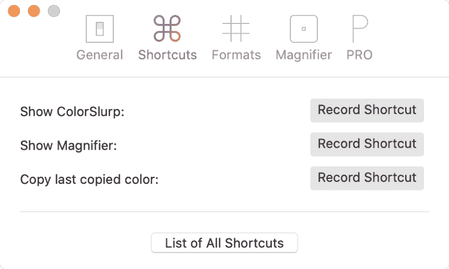
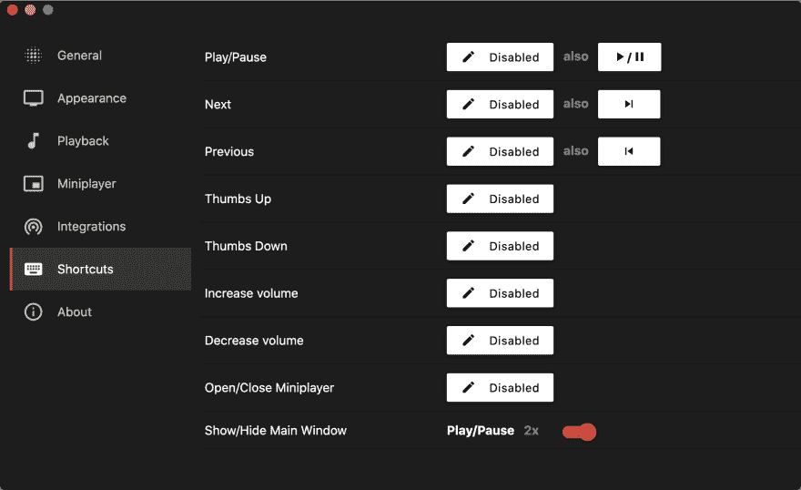
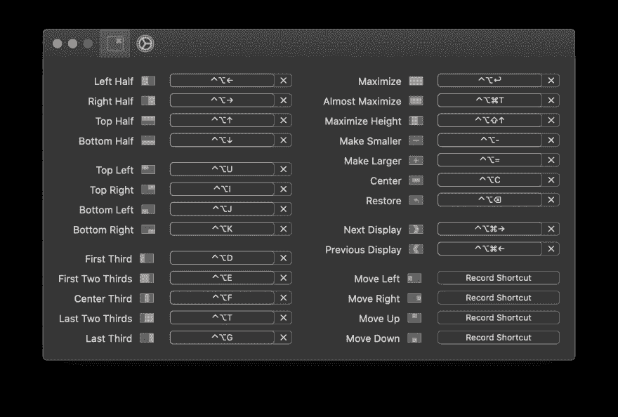

# 为开发设置 macOS

> 原文：<https://dev.to/equiman/setup-macos-for-development-3kc2>

我在 macOS 上相对较新，从 Windows 切换的最大问题之一是设置网络/移动开发所需的所有 SDK 和库。

我犯了几个错误，但我认为最终找到了一个将 macOS 设置为开发机器的好方法。

这不是一个明确的解决方案，因为有不可计数的组合，我可以涵盖所有的组合。只使用你需要的，不要安装你不会使用的 SDK 或软件。

在开始之前，强烈建议按照以下配置更改您的终端:

[](/equiman) [## 哦，我的 Zsh！+ Powerlevel10K 极客最佳终端组合！

### 卡米洛马丁内斯 9 月 25 日 1815 分钟阅读

#productivity #terminal #macos #zsh](/equiman/iterm2--oh-my-zsh--powerlevel9k-best-terminal-combination-for-geeks-58l5)

# 软件仓库

## 自制

Brew 有他自己的分类。里面的 brew 可以找到 CLI 应用程序和实用程序。里面是木桶所有图形界面的应用程序。

<figure>

```
/usr/bin/ruby -e "$(curl -fsSL https://raw.githubusercontent.com/Homebrew/install/master/install)"
brew tap homebrew/cask-fonts

brew update
brew upgrade
brew cleanup 
```

Enter fullscreen mode Exit fullscreen mode

<figcaption>https://brew.sh — usage: https://docs.brew.sh/FAQ</figcaption>

</figure>

运行该命令，并遵循医生的建议:

```
brew doctor 
```

Enter fullscreen mode Exit fullscreen mode

## SDK 侠

<figure>

```
curl -s "https://get.sdkman.io" | bash
source "$HOME/.sdkman/bin/sdkman-init.sh" 
```

Enter fullscreen mode Exit fullscreen mode

<figcaption>http://sdkman.io — usage: https://sdkman.io/usage</figcaption>

</figure>

## 权限

将权限添加到该文件夹和所附项目下的用户(或组):

```
sudo chown -R $(whoami) /usr/local/opt
sudo chown -R $(whoami) /usr/local/share 
```

Enter fullscreen mode Exit fullscreen mode

**警告:**添加下一个权限，以防只有一个用户使用您的机器。

```
sudo chown -R $(whoami) /usr/local/lib 
```

Enter fullscreen mode Exit fullscreen mode

* * *

# 通用目的

## Visual Studio 代码

<figure>

```
brew install --cask visual-studio-code 
```

Enter fullscreen mode Exit fullscreen mode

<figcaption>https://code.visualstudio.com</figcaption>

</figure>

首次运行时，按下`⌘` + `⇧` + `P`并运行命令:`Shell Command: install 'code' command PATH`。现在你可以从命令行使用`code`命令。例:`code .`打开当前文件夹的编辑器。

[](/equiman) [## VSCode -基础知识

### 卡米洛马丁内斯 9 月 27 日 1815 分钟阅读

#vscode #productivity #webdev](/equiman/my-essential-visual-studio-code-extensions-and-configurations-5197)

## 去吧

<figure>

```
brew install git
rm '/usr/local/bin/git-cvsserver'
brew link --overwrite git
brew install git-lfs
git lfs install 
```

Enter fullscreen mode Exit fullscreen mode

<figcaption>https://git-scm.com</figcaption>

</figure>

### Git 配置

为了使用 setup `git config`来使用 Visual Studio 代码而不是 Vim，运行以下命令:

```
git config --global core.editor 'code --wait' 
```

Enter fullscreen mode Exit fullscreen mode

使用此命令编辑全局配置:

```
git config --edit --global 
```

Enter fullscreen mode Exit fullscreen mode

### 合并和差异配置

如果还想使用 VScode 作为 difftool 和 mergetool。将以下配置添加到您的全局配置中。

```
[merge]
    tool = vscode
[mergetool "vscode"]
    cmd = code --wait $MERGED
[diff]
    tool = vscode
[difftool "vscode"]
    cmd = code --wait --diff $LOCAL $REMOTE 
```

Enter fullscreen mode Exit fullscreen mode

### 使用主分支

如果你想像 GitHub 一样用`main`改变你的默认分支。

```
git config --global init.defaultBranch main 
```

Enter fullscreen mode Exit fullscreen mode

## 来源树

<figure>

```
brew install --cask sourcetree 
```

Enter fullscreen mode Exit fullscreen mode

<figcaption>https://www.sourcetreeapp.com</figcaption>

</figure>

* * *

# 网页开发

## Node.js

我更喜欢通过 [Volta](https://volta.sh/) 安装 Node。

```
brew install volta 
```

Enter fullscreen mode Exit fullscreen mode

将此环境变量添加到`~/.bash_profile`和/或`~/.zshrc`文件:

```
export VOLTA_HOME="$HOME/.volta"
export PATH="$VOLTA_HOME/bin:$PATH" 
```

Enter fullscreen mode Exit fullscreen mode

要安装版本，请使用:

| 版本 | 描述 |
| --- | --- |
| `@atest` | 最新版本 |
| `@lts` | 长期支持 |
| `@#` | 合适的版本 |
| `@#.#.#` | 特定版本 |

我更喜欢 LTS 版本的作品

<figure>

```
volta install node@lts 
```

Enter fullscreen mode Exit fullscreen mode

<figcaption>https://nodejs.org</figcaption>

</figure>

要列出所有已安装的版本，请使用:

```
volta list all 
```

Enter fullscreen mode Exit fullscreen mode

要在版本之间切换，请使用相同的命令进行安装。

## 纱线(npm 替代)

<figure>

```
volta install yarn 
```

Enter fullscreen mode Exit fullscreen mode

<figcaption>https://yarnpkg.com</figcaption>

</figure>

## 套餐

用你最喜欢的节点包管理器来做:**纱**或者 **npm**

| 名字 | [纱线](https://yarnpkg.com/) | [npm](https://www.npmjs.com/) |
| --- | --- | --- |
| [角度](https://angular.io/) | `yarn global add @angular/cli` | `npm i -g @angular/cli` |
| [科尔多瓦](https://cordova.apache.org/) | `yarn global add cordova` | `npm i -g cordova` |
| [一饮而尽](https://gulpjs.com/) | `yarn global add gulp` | `npm i -g gulp` |
| [ESLint](https://eslint.org/) | `yarn global add eslint` | `npm i -g eslint` |
| [打字稿](https://www.typescriptlang.org/) | `yarn global add typescript` | `npm i -g typescript` |

## CLI 工具

用你最喜欢的节点包管理器来做:**纱**或者 **npm**

| 名字 | [纱线](https://yarnpkg.com/) | [npm](https://www.npmjs.com/) |
| --- | --- | --- |
| fkill-cli | `yarn global add fkill-cli` | `npm i -g fkill-cli` |
| [npkill](https://npkill.js.org/) | `yarn global add npkill` | `npm i -g npkill` |

## 纱线带 VSCode

如果你正在使用 Visual Studio 代码和 ESLint 扩展，需要额外的配置设置:

<figure>

```
"eslint.packageManager": "yarn", 
```

Enter fullscreen mode Exit fullscreen mode

<figcaption>Open Visual Studio Code settings with ⌘ + ,</figcaption>

</figure>

## 纱线有棱角

在 Angular CLI 中使用 Yarn，需要在 Angular 项目中运行命令。

| v1.7.4- | v6+ |
| --- | --- |
| `ng set --global packageManager=yarn` | `ng config -g cli.packageManager yarn` |

## 角控制台

Angular CLI 的威力。应用程序的便利性。

```
brew install --cask angular-console 
```

Enter fullscreen mode Exit fullscreen mode

## 浏览器

```
brew install --cask google-chrome
brew install --cask firefox
brew install --cask homebrew/cask-versions/firefox-developer-edition
brew install --cask opera
brew install --cask opera-developer
brew install --cask microsoft-edge
brew install --cask microsoft-edge-dev 
```

Enter fullscreen mode Exit fullscreen mode

参加这个免费课程:[DevTools Pro:Chrome 开发者工具基础](https://www.udemy.com/devtools-2017-the-basics-of-chrome-developer-tools/)。

* * *

# 移动

我喜欢用 SDK Man 安装 Gradle 和 Java，因为有些项目需要在不同版本之间切换，用 SDK Man 更改很容易。

## [度](#gradle)

我现在用的是 3.3 和 4.4.1 版本，如果你想用上一个版本，请避免在最后加上版本号。

<figure>

```
sdk install gradle 3.3
sdk install gradle 4.4.1
sdk use gradle 4.4.1
sdk default gradle 4.4.1 
```

Enter fullscreen mode Exit fullscreen mode

<figcaption>https://gradle.org</figcaption>

</figure>

## Java

```
sdk list java 
```

Enter fullscreen mode Exit fullscreen mode

搜索 **AdoptOpenJDK** 版本，像这个列表上的`8.0.272.hs-adpt`，像那些命令一样用在最后。

<figure>

```
sdk install java 8.0.272.hs-adpt
sdk use java 8.0.272.hs-adpt
sdk default java 8.0.272.hs-adpt 
```

Enter fullscreen mode Exit fullscreen mode

<figcaption>https://java.com</figcaption>

</figure>

## Android SDK

<figure>

```
brew install --cask android-sdk 
```

Enter fullscreen mode Exit fullscreen mode

<figcaption>https://developer.android.com/studio/#downloads</figcaption>

</figure>

有用的 SDK 管理器命令:

<figure>

| 行动 | 命令 |
| --- | --- |
| 列出包 | `sdkmanager --list` |
| 安装 NDK | `sdkmanager "ndk-bundle"` |
| 安装构建工具 | `sdkmanager "build-tools;28.0.3"` |
| 安装平台 | `sdkmanager "platforms;android-28"` |
| 更新已安装的软件包 | `sdkmanager --update` |

<figcaption>https://developer.android.com/studio/command-line/sdkmanager</figcaption>

</figure>

将此环境变量添加到`~/.bash_profile`和/或`~/.zshrc`文件:

<figure>

```
export ANDROID_SDK_ROOT="/usr/local/share/android-sdk"
export ANDROID_HOME="$ANDROID_SDK_ROOT"
export ANDROID_NDK_HOME="$ANDROID_SDK_ROOT/ndk-bundle"
export ANDROID_BT_VERSION="$(ls -tr $ANDROID_SDK_ROOT/build-tools | sort | tail -1)"

export PATH="$ANDROID_SDK_ROOT/bin:$PATH"
export PATH="$ANDROID_SDK_ROOT/build-tools/$ANDROID_BT_VERSION:$PATH"
export PATH="$ANDROID_SDK_ROOT/platform-tools:$PATH"
export PATH="$ANDROID_SDK_ROOT/tools:$PATH"
export PATH="$ANDROID_NDK_HOME/:$PATH" 
```

Enter fullscreen mode Exit fullscreen mode

<figcaption>https://developer.android.com/studio/command-line/variables</figcaption>

</figure>

## 安卓捆绑工具

```
brew install bundletool 
```

Enter fullscreen mode Exit fullscreen mode

## 安卓工作室

<figure>

```
brew install --cask android-studio
brew install --cask intel-haxm 
```

Enter fullscreen mode Exit fullscreen mode

<figcaption>https://developer.android.com/studio/</figcaption>

</figure>

第一次运行时，转到`Tools -> Create Command-line Launcher`。现在您可以从命令行使用`studio`命令。示例:`studio .`在当前文件夹中打开 IDE。

## JADX

Java 反编译器的索引

<figure>

```
brew install jadx 
```

Enter fullscreen mode Exit fullscreen mode

<figcaption>https://github.com/skylot/jadx</figcaption>

</figure>

## Scrcpy(手机屏幕共享)

<figure>

```
brew install scrcpy 
```

Enter fullscreen mode Exit fullscreen mode

<figcaption>https://github.com/Genymobile/scrcpy</figcaption>

</figure>

[](/equiman) [## 在 macOS 上共享您的 Android 屏幕和音频

### 卡米洛马丁内斯 10 月 8 日 204 分钟阅读

#productivity #tutorial #beginners #devtips](/equiman/share-your-android-screen-and-audio-on-macos-1p64)

## Xcode

从苹果商店安装就行: [Xcode](https://itunes.apple.com/co/app/xcode/id497799835?mt=12) 和 Xcode 命令行工具

```
xcode-select --install 
```

Enter fullscreen mode Exit fullscreen mode[](/equiman) [## 在某些 macOS 应用程序中启用黑暗模式

### 卡米洛·马丁内斯 9 月 24 日 191 分钟阅读

#macos #productivity #beginners #hacks](/equiman/enable-dark-mode-in-some-macos-apps-4c1f)

* * *

# 云和遥

## 码头工人

<figure>

```
brew install --cask docker 
```

Enter fullscreen mode Exit fullscreen mode

<figcaption>http://www.docker.com</figcaption>

</figure>

## FileZilla (FTP 客户端)

<figure>

```
brew install --cask filezilla 
```

Enter fullscreen mode Exit fullscreen mode

<figcaption>https://filezilla-project.org</figcaption>

</figure>

## 隐码器

为您的云文件提供免费的客户端加密。开源软件:没有后门，没有注册。

<figure>

```
brew install --cask cryptomator 
```

Enter fullscreen mode Exit fullscreen mode

<figcaption>http://cryptomator.org</figcaption>

</figure>

* * *

# 数据库

## MySQL +工作台

<figure>

```
brew install mysql
brew install --cask mysqlworkbench 
```

Enter fullscreen mode Exit fullscreen mode

<figcaption>https://www.mysql.com</figcaption>

</figure>

现在启动 MySQL 并在登录时重启:

```
brew services start mysql 
```

Enter fullscreen mode Exit fullscreen mode

或者，如果您不想/不需要后台服务，您可以只使用`mysql.server tool` :

```
mysql.server start
mysql.server stop 
```

Enter fullscreen mode Exit fullscreen mode

## PostgreSQL 和 pgAdmin

```
brew install postgresql
brew install --cask pgadmin4 
```

Enter fullscreen mode Exit fullscreen mode

将此环境变量添加到`~/.bash_profile`和/或`~/.zshrc`文件:

```
export POSTGRESQL_HOME="/usr/local/opt/postgresql"

export PATH="$POSTGRESQL_HOME/bin:$PATH"
export LDFLAGS="-L$POSTGRESQL_HOME/lib"
export CPPFLAGS="-I$POSTGRESQL_HOME/include" 
```

Enter fullscreen mode Exit fullscreen mode

初始化并启动服务器

```
initdb /usr/local/var/postgres -E utf8
createuser -s postgres
brew services start postgresql 
```

Enter fullscreen mode Exit fullscreen mode

* * *

# 微软

## [T1。Net Core SDK](#net-core-sdk)

<figure>

```
brew install --cask dotnet-sdk 
```

Enter fullscreen mode Exit fullscreen mode

<figcaption>https://www.microsoft.com/net/download</figcaption>

</figure>

将此环境变量添加到`~/.bash_profile`和/或`~/.zshrc`文件:

```
export DOTNET_HOME="/usr/local/share/dotnet/dotnet"
export PATH="$DOTNET_HOME/bin:$PATH" 
```

Enter fullscreen mode Exit fullscreen mode

* * *

# 平面设计

## Gimp(图像编辑器)

<figure>

```
brew install --cask gimp 
```

Enter fullscreen mode Exit fullscreen mode

<figcaption>http://www.gimp.org</figcaption>

</figure>

## Slurp(拾色器)

只需从苹果商店安装 [Slurp](https://apps.apple.com/us/app/colorslurp/id1287239339?mt=12) 并删除他所有的快捷方式，因为会干扰 VSCode。

[T2】](https://res.cloudinary.com/practicaldev/image/fetch/s--zQf-Z48S--/c_limit%2Cf_auto%2Cfl_progressive%2Cq_auto%2Cw_880/https://dev-to-uploads.s3.amazonaws.com/i/pnlumicio6y8sqmxirlo.png)

* * *

# 实用程序

## 邮件

不要使用默认的邮件应用程序，它很原始，根本不可用。只需从苹果商店安装 [Spark Mail](https://itunes.apple.com/app/spark-love-your-email-again/id1176895641) 即可。

## 传播者

```
brew install --cask slack
brew install --cask discord
brew install --cask microsoft-teams
brew install --cask webex-teams 
```

Enter fullscreen mode Exit fullscreen mode

## 观念

<figure>

```
brew install --cask notion 
```

Enter fullscreen mode Exit fullscreen mode

<figcaption>https://notion.so</figcaption>

</figure>

## Keka(文件压缩)

<figure>

```
brew install --cask keka 
```

Enter fullscreen mode Exit fullscreen mode

<figcaption>http://www.kekaosx.com</figcaption>

</figure>

遵循以下说明:[设置为默认压缩应用程序](https://github.com/aonez/Keka/wiki/Default-application)

## 应用清理器(应用卸载器)

配合手动安装的软件使用。安装有`brew`的软件，使用`brew remove <package_name>`或`brew remove --cask <software_name>`。

<figure>

```
brew install --cask appcleaner 
```

Enter fullscreen mode Exit fullscreen mode

<figcaption>https://freemacsoft.net/appcleaner</figcaption>

</figure>

## Karabiner(键盘定制师)

<figure>

```
brew install --cask karabiner-elements 
```

Enter fullscreen mode Exit fullscreen mode

<figcaption>https://pqrs.org/osx/karabiner/</figcaption>

</figure>

[](/equiman) [## 在 macOS 上使用 PC 键盘有什么比较好的方法？

### 卡米洛马丁内斯 9 月 23 日 182 分钟阅读

#macos #keyboard #productivity #hack](/equiman/whats-the-better-way-to-use-pc-keyboard-on-macos-3k3)

## 枪口

截屏时让尴尬的通知静音。

<figure>

```
brew install --cask muzzle 
```

Enter fullscreen mode Exit fullscreen mode

<figcaption>https://muzzleapp.com/</figcaption>

</figure>

## 推土机

隐藏 Mac 上的菜单栏图标。

<figure>

```
brew install --cask dozer 
```

Enter fullscreen mode Exit fullscreen mode

<figcaption>https://github.com/Mortennn/Dozer</figcaption>

</figure>

## 时钟

<figure>

```
brew install --cask the-clock 
```

Enter fullscreen mode Exit fullscreen mode

<figcaption>https://seense.com/the_clock/</figcaption>

</figure>

## EUL

使用 Big Sur 小工具进行状态监控

<figure>

```
brew install --cask eul 
```

Enter fullscreen mode Exit fullscreen mode

<figcaption>https://github.com/gao-sun/eul</figcaption>

</figure>

* * *

# 生产力

是的，我是那种把含有咖啡因的音乐变成 T2 音乐的开发者。

## YouTube 音乐(桌面播放器)

比起 Spotify，我更喜欢 YTM，因为我可以上传我自己的地下音乐收藏，这是公共音乐收藏所没有的。这对重金属来说是个好消息🤘。

<figure>

```
brew install --cask ytmdesktop-youtube-music 
```

Enter fullscreen mode Exit fullscreen mode

<figcaption>https://ytmdesktop.app/</figcaption>

</figure>

删除他的所有快捷方式，因为干扰 macOS 和 VSCode 的。

[T2】](https://res.cloudinary.com/practicaldev/image/fetch/s--juyQyXVZ--/c_limit%2Cf_auto%2Cfl_progressive%2Cq_auto%2Cw_880/https://dev-to-uploads.s3.amazonaws.com/i/m42s2vjcna8g2szdylo9.png)

## Spotify

<figure>

```
brew install --cask spotify 
```

Enter fullscreen mode Exit fullscreen mode

<figcaption>https://www.spotify.com/</figcaption>

</figure>

## 矩形(窗口管理)

<figure>

```
brew install --cask rectangle 
```

Enter fullscreen mode Exit fullscreen mode

<figcaption>https://rectangleapp.com/</figcaption>

</figure>

为了避免与 **Visual Studio 代码的冲突**键盘组合使用了替代快捷键。在终端运行该命令并重启矩形:

```
defaults write com.knollsoft.Rectangle alternateDefaultShortcuts -bool true 
```

Enter fullscreen mode Exit fullscreen mode

[T2】](https://res.cloudinary.com/practicaldev/image/fetch/s--YkdpM7fG--/c_limit%2Cf_auto%2Cfl_progressive%2Cq_auto%2Cw_880/https://user-images.githubusercontent.com/13651296/71896594-7cdb9280-3154-11ea-83a7-70b71c6df9d4.png)

## 让你保持清醒

一个小菜单栏实用程序，可以阻止您的 Mac 在预定义的持续时间内或只要它被激活就进入睡眠模式。

<figure>

```
brew install --cask keepingyouawake 
```

Enter fullscreen mode Exit fullscreen mode

<figcaption>https://github.com/newmarcel/KeepingYouAwake/</figcaption>

</figure>

## 知晓(追踪时间)

一个简单的菜单栏应用程序，可以记录你使用电脑的时间。

<figure>

```
brew install --cask aware 
```

Enter fullscreen mode Exit fullscreen mode

<figcaption>http://awaremac.com</figcaption>

</figure>

## 备忘单(快捷键)

只需长按`⌘-Key`键，即可获得当前应用程序的所有活动快捷方式列表。就这么简单。

<figure>

```
brew install --cask cheatsheet 
```

Enter fullscreen mode Exit fullscreen mode

<figcaption>http://www.mediaatelier.com/CheatSheet/</figcaption>

</figure>

* * *

# 奖金追踪

一旦完成你需要的安装，运行命令`brew cleanup`释放磁盘空间。

## 没有阴影的截图

只需使用 Shift `⇧` + `⌘` + `4` + `Space`，点击选择窗口时按住`⌥`。

或者你可以从终端执行下面的命令，永远禁用在捕获整个窗口时添加的阴影:

<figure>

```
defaults write com.apple.screencapture disable-shadow -bool TRUE
killall SystemUIServer 
```

Enter fullscreen mode Exit fullscreen mode

<figcaption>http://apple.stackexchange.com/a/50862/230672</figcaption>

</figure>

并更改默认位置

```
defaults write com.apple.screencapture location ~/Pictures/Screenshots 
```

Enter fullscreen mode Exit fullscreen mode

## 拖动&下降

了解这些有用的提示:

[https://www.youtube.com/embed/0dTZcKPyJzY](https://www.youtube.com/embed/0dTZcKPyJzY)

* * *

**都是乡亲们！**
**快乐编码** 🖖

[T2】](https://github.com/sponsors/deinsoftware)