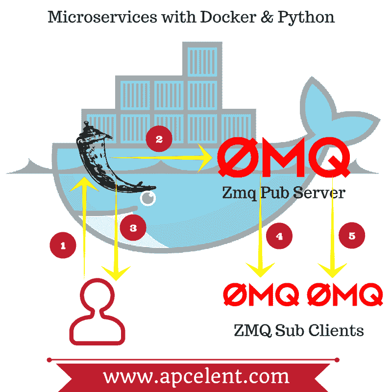

# 使用 ZeroMQ & Docker 在 Python 中设置微服务架构

> 原文：<https://dev.to/apcelent/setup-microservices-architecture-in-python-with-zeromq--docker-13nh>

## 微服务——什么？

[微服务](https://en.wikipedia.org/wiki/Microservices)是一种架构风格，其中多个独立的流程相互通信。这些流程被设计为高度可扩展、解耦，并且一次执行一个小任务。这些多种服务有自己的资源和进程，它们通过网络相互通信。

这不同于典型的客户机-服务器架构，在典型的客户机-服务器架构中，后端是一个封装了所有服务器逻辑的整体结构。微服务架构解决了关注点分离的问题。这种设计模式允许更容易的维护、更大的灵活性、可伸缩性和容错性。这种分布式架构的缺点是，如果设计不当，调试和维护会变得复杂。

## 一个样本微服务的例子

让我们来看一个场景，您正在创建一个使用微服务模式的电子商务商店。

对于 e-com 商店中的典型产品，例如 iPhone，详细信息页面显示:

*   产品的基本信息
*   您的购买历史
*   买了 iPhone 的人，也买了保护套
*   与 iPhone 相关的交易和折扣
*   商家数据
*   运输选项
*   产品证明等等。此外，示例产品详细信息页面将有多个版本的界面，以满足 web、移动和 REST API 的需求，供第三方应用程序使用。

在微服务模式中，数据分布在多个服务上。在这种情况下，它可以是

*   产品细节服务
*   商船
*   支付服务
*   交易和折扣服务
*   库存服务
*   估价服务
*   审查服务
*   推荐服务如何访问这些单独的服务？

解决方案是实现一个 API 网关，作为所有客户端的单一入口点，并根据需要调用分布在整个基础设施中的特定微服务。上述模式的一个示例行业实现是网飞 API 网关，它为不同的设备提供了多个 API 客户端。你可以[在这里](https://medium.com/netflix-techblog/optimizing-the-netflix-api-5c9ac715cf19)了解更多信息。

## 搭建样本微服务

目前有许多方法可以设置您的微服务。

在本文中，我们将使用 ZeroMQ 来建立两个进程之间的通信。ZeroMQ 提供了构建模块来开发基于套接字的可伸缩分布式系统。它是安全的——使用椭圆曲线加密(从版本 4 开始)并提供开箱即用的通信模式。

下面是一些关于 ZMQ 的[好东西](http://zeromq.org/area:faq#toc7)。MQ 表示异步工作的线程消息队列。关于 zeroMQ 的更多讨论超出了本文的范围。你应该阅读[使用 zeromq 消息](https://www.digitalocean.com/community/tutorials/how-to-work-with-the-zeromq-messaging-library) & [使用 zeromq](http://blog.pythonisito.com/2012/08/distributed-systems-with-zeromq.html) 的分布式系统。

我们将要使用的另一个工具是 [Docker](https://www.docker.com/) 。本文假设读者了解 docker 的基础知识。

ZeroMQ 有多种通信模式，让我们在 docker 容器中用 ZeroMQ 和 Flask 设置一个简单的发布订阅。下图显示了组件之间的关系和流程。

[T2】](https://res.cloudinary.com/practicaldev/image/fetch/s--aiFJHgbD--/c_limit%2Cf_auto%2Cfl_progressive%2Cq_auto%2Cw_880/https://blog.apcelent.cimg/microservices-docker-python-apcelent.png)

*   1 & 3-flask 服务器运行在 prot 5000 上，并有一个 URL /downcase/URL 满足 GET 请求，以及所有格式的请求。Params=将有一个响应，其中大写字母将被转换为小写字母，这将作为响应返回。

*   2 -响应消息也被发送到在同一个容器中运行的 ZMQ 发布者。

*   4，5-ZMQ 订阅者继续监听并将来自 ZMQ 服务器的消息保存到一个名为 subscriber.log 的文件中。

## 构建服务器

让我们看看我们的文档

```
FROM ubuntu:14.04

RUN apt-get update
RUN apt-get install -y --force-yes python python-dev python-setuptools software-properties-common gcc python-pip
RUN apt-get clean all

RUN pip install pyzmq

RUN pip install Flask

ADD zmqserver.py /tmp/zmqserver.py

# Flask Port EXPOSE 5000

# Zmq Sub Server EXPOSE 4444

CMD ["python","/tmp/zmqserver.py"] 
```

Enter fullscreen mode Exit fullscreen mode

我们选择 Ubuntu 14.04 作为我们的容器操作系统。我们安装基本的软件包。使用 pip，我们将 pyzmq - python 绑定安装到 zmq 库，我们还安装了 Flask。然后我们公开端口 5000(flask 服务器)和 4444(publisher 运行的端口)。)另外，我们复制包含 flask 和 zeromq 的所有 python 代码的脚本 zmqserver.py，并运行它。

让我们看看 zmqserver.py 的内容

```
# server.py import time
import zmq

HOST = '127.0.0.1'
PORT = '4444'

_context = zmq.Context()
_publisher = _context.socket(zmq.PUB)
url = 'tcp://{}:{}'.format(HOST, PORT)

def publish_message(message):

    try:
    _publisher.bind(url)
    time.sleep(1)
    _publisher.send(message)

    except Exception as e:
    print "error {}".format(e)

    finally:
    _publisher.unbind(url)

from flask import Flask
from flask import request
app = Flask(__name__)

@app.route("/downcase/", methods=['GET'])
def lowerString():

    _strn = request.args.get('param')
    response = 'lower case of {} is {}'.format(_strn, _strn.lower())
    publish_message(response)
    return response

if __name__ == '__main__':
    app.run(host='0.0.0.0', debug=False) 
```

Enter fullscreen mode Exit fullscreen mode

ZMQ pub 在端口 4444 上运行。我们构建一个上下文，并指定 URL。我们运行 flask 应用程序，它有一个 URL /downcase/它将参数的 GET params 转换成小写，这是响应。该响应字符串作为消息发布，并且相同的字符串作为响应返回给浏览器。

为了构建上面的 docker 映像，我们运行以下命令**sudo docker build-t docker-zmq-pub**。并运行上面的图片**docker run-name docker-pub-server-p 5000:5000-p 4444:4444-t docker-zmq-pub**

我们将容器的端口 5000 和 4444 映射到机器的端口，这样无论客户端在哪里，它都可以订阅发布者。

## 订户客户端

```
# client.py import zmq
import sys
import time
import logging
import os

HOST = '127.0.0.1'
PORT = '4444'

logging.basicConfig(filename='subscriber.log', level=logging.INFO)

class ZClient(object):

    def __init__(self, host=HOST, port=PORT):
    """Initialize Worker"""
    self.host = host
    self.port = port
    self._context = zmq.Context()
    self._subscriber = self._context.socket(zmq.SUB)
    print "Client Initiated"

    def receive_message(self):
    """Start receiving messages"""
    self._subscriber.connect('tcp://{}:{}'.format(self.host, self.port))
    self._subscriber.setsockopt(zmq.SUBSCRIBE, b"")

    while True:
        print 'listening on tcp://{}:{}'.format(self.host, self.port)
        message = self._subscriber.recv()
        print message
        logging.info(
            '{}   - {}'.format(message, time.strftime("%Y-%m-%d %H:%M")))

if __name__ == '__main__':
    zs = ZClient()
    zs.receive_message() 
```

Enter fullscreen mode Exit fullscreen mode

我们指定了发布者的 IP 地址和端口，目前它运行在同一台机器上，因此是 127。我们监听 URL tcp://IP:PORT。收到消息后，我们会将它记录到一个名为 subscriber.log 的文件中，并附上时间戳。运行客户端所需要的只是 python .py。如果你构建在上述架构之上，它可以很好地作为一个接近实时的日志聚合引擎。

我已经测试了上面的代码，可以在 Ubuntu 机器上运行。代码托管在 [github](https://github.com/codecraf8/microservices-python-docker-zeromq) 上。这是关于如何设置 zmq、docker 和 python 服务器的基本介绍，在我们的下一篇文章中，我们将使用我们在这里学到的东西来构建示例微服务。

希望这篇文章有所帮助。欢迎在评论中提交你的想法。

**延伸阅读**

[微服务](http://microservices.io/?utm_source=apcelent.com)

这篇文章最初出现在 [Apcelent 科技博客](https://blog.apcelent.com/how-to-setup-microservices-python-zeromq-docker-example.html)上。