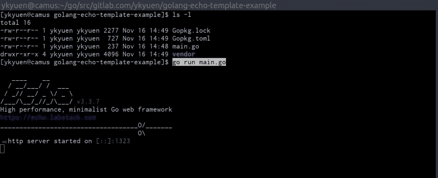
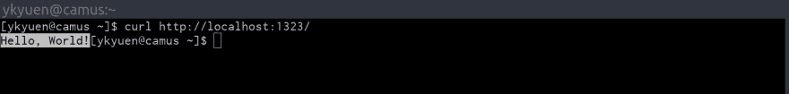

# 在 Go Echo web 框架中设置嵌套 HTML 模板

> 原文：<https://dev.to/ykyuen/setup-nested-html-template-in-go-echo-web-framework-e9b>

*最初发布在[水手长博客](https://blog.boatswain.io/post/setup-nested-html-template-in-go-echo-web-framework/)上。*

* * *

Echo 是 [Go](https://golang.org/) 中一个轻量级但完整的 web 框架，用于构建 RESTful API。它速度很快，并且包含了一系列用于处理整个 HTTP 请求-响应周期的中间件。对于渲染部分，它适用于任何模板引擎，但是为了简单起见，我选择了标准的[html/模板](https://godoc.org/html/template)包。在本文的最后，演示了嵌套模板 [Echo](https://echo.labstack.com/) 项目设置。

如果你已经知道 [Echo](https://echo.labstack.com/) 是如何工作的，那么跳到使用嵌套模板的[部分](https://blog.boatswain.io/post/setup-nested-html-template-in-go-echo-web-framework/#using-nested-template)。

## 基本回声项目设置

### 在适当的 GOPATH 下创建项目文件夹

完整的项目代码托管在 [GitLab](https://gitlab.com/ykyuen/golang-echo-template-example) 上，所以我们首先创建项目文件夹*$ GOPATH/src/git lab . com/yk yuen/golang-echo-template-example*。

### 创建 *main.go*

在新创建的文件夹中，让我们从官方网站 [Echo](https://echo.labstack.com/) 复制 hello world 示例并创建 *main.go* 。

*main . go*T2】

```
package main

import (
  "net/http"

  "github.com/labstack/echo"
)

func main() {
  e := echo.New()
  e.GET("/", func(c echo.Context) error {
    return c.String(http.StatusOK, "Hello, World!")
  })
  e.Logger.Fatal(e.Start(":1323"))
} 
```

### 使用 dep 下载 Echo 包

如果安装了 [dep](https://github.com/golang/dep) ，只需运行 **dep init** 。关于 [dep](https://github.com/golang/dep) 的更多信息你可以参考这个帖子。

*   [使用 dep 管理 Go 依赖关系](https://blog.boatswain.io/post/manage-go-dependencies-using-dep/)

或者运行 **go 获取 github.com/labstack/echo**下载 *$GOPATH* 中的 [Echo](https://echo.labstack.com/) 包。

### 运行 hello world

通过 **go 运行 main.go** 启动应用程序，然后通过浏览器或 **curl** 命令访问 [http://localhost:1323](http://localhost:1323) 。

[T2】](https://res.cloudinary.com/practicaldev/image/fetch/s--nnzHd3DZ--/c_limit%2Cf_auto%2Cfl_progressive%2Cq_auto%2Cw_880/https://thepracticaldev.s3.amazonaws.com/i/fkb9i9msht4v3s2ostpb.jpg)

[T2】](https://res.cloudinary.com/practicaldev/image/fetch/s--BwY3xuHz--/c_limit%2Cf_auto%2Cfl_progressive%2Cq_auto%2Cw_880/https://thepracticaldev.s3.amazonaws.com/i/t7ieyy30ww2hjhyqvzwy.jpg)

## 返回一个 JSON 响应

在构建 RESTful API 时，客户端更有可能希望接收 JSON 响应，而不是字符串。让我们在 *main.go* 中写一些 [Go](https://golang.org/) 代码。

*main . go*T2】

```
package main

import (
  "net/http"

  "github.com/labstack/echo"
)

func main() {
  e := echo.New()

  e.GET("/", func(c echo.Context) error {
    return c.String(http.StatusOK, "Hello, World!")
  })

  e.GET("/json", func(c echo.Context) error {
    return c.JSONBlob(
      http.StatusOK,
      []byte(`{ "id": "1", "msg": "Hello, Boatswain!" }`),
    )
  })

  e.Logger.Fatal(e.Start(":1323"))
} 
```

## 返回 HTML

类似于返回一个 JSON 对象，我们只需要在 **return** 语句中调用另一个方法。

*main . go*T2】

```
package main

import (
  "net/http"

  "github.com/labstack/echo"
)

func main() {
  e := echo.New()

  e.GET("/", func(c echo.Context) error {
    return c.String(http.StatusOK, "Hello, World!")
  })

  e.GET("/json", func(c echo.Context) error {
    return c.JSONBlob(
      http.StatusOK,
      []byte(`{ "id": "1", "msg": "Hello, Boatswain!" }`),
    )
  })

  e.GET("/html", func(c echo.Context) error {
    return c.HTML(
      http.StatusOK,
      "<h1>Hello, Boatswain!</h1>",
    )
  })

  e.Logger.Fatal(e.Start(":1323"))
} 
```

以上只是两个简单的例子， [Echo](https://echo.labstack.com/) 还有几个更方便的返回 JSON 和 HTML 的方法。详情请参考[文档](https://echo.labstack.com/guide/response)。

### 使用模板引擎渲染 HTML

正如在开始时提到的，我们可以在返回 HTTP 响应时实现模板引擎，但在此之前，让我们如下重组项目。

```
golang-echo-template-example/
  ├── handler/             # folder of request handlers
  │   └── home_handler.go
  ├── vendor/              # dependencies managed by dep
  │   ├── github.com/*
  │   └── golang.org/*
  ├── view/                # folder of html templates
  │   └── home.html
  ├── Gopkg.lock           # dep config file
  ├── Gopkg.toml           # dep config file
  └── main.go              # programme entrypoint 
```

*main . go*T2】

```
package main

import (
  "html/template"
  "io"

  "github.com/labstack/echo"

  "gitlab.com/ykyuen/golang-echo-template-example/handler"
)

// Define the template registry struct
type TemplateRegistry struct {
  templates *template.Template
}

// Implement e.Renderer interface
func (t *TemplateRegistry) Render(w io.Writer, name string, data interface{}, c echo.Context) error {
  return t.templates.ExecuteTemplate(w, name, data)
}

func main() {
  // Echo instance
  e := echo.New()

  // Instantiate a template registry and register all html files inside the view folder
  e.Renderer = &TemplateRegistry{
    templates: template.Must(template.ParseGlob("view/*.html")),
  }

  // Route => handler
  e.GET("/", handler.HomeHandler)

  // Start the Echo server
  e.Logger.Fatal(e.Start(":1323"))
} 
```

在这个 *main.go* 中，我们定义了一个名为 **TemplateRegistry** 的类型，并实现了 **[渲染器](https://godoc.org/github.com/labstack/echo#Renderer)** 接口。一个**渲染器**是一个简单的接口，它包装了 **Render()** 函数。在一个 **TemplateRegistry** 实例中，它有一个 **templates** 字段，包含了 [Echo](https://echo.labstack.com/) 服务器呈现 html 响应所需的所有模板，这是在 **main()** 流中配置的。

另一方面，我们定义了 **HomeHandler** 以便将逻辑保存在单独的文件中。

*handler/home _ handler . go*T2】

```
package handler

import (
  "net/http"

  "github.com/labstack/echo"
)

func HomeHandler(c echo.Context) error {
  // Please note the the second parameter "home.html" is the template name and should
  // be equal to the value stated in the {{ define }} statement in "view/home.html"
  return c.Render(http.StatusOK, "home.html", map[string]interface{}{
    "name": "HOME",
    "msg": "Hello, Boatswain!",
  })
} 
```

当调用 **c.Render()** 时，它执行已经在我们的 **TemplateRegistry** 实例中设置的模板，如 **main.go** 中所述。这三个参数是

1.  HTTP 响应代码
2.  模板名称
3.  可以在模板中使用的数据对象

*view/home.html*

```
{{define "home.html"}}
  <!DOCTYPE html>
  <html>
    <head>
      Boatswain Blog | {{index . "name"}}
    </head>
    <body>
      <h1>{{index . "msg"}}</h1>
    </body>
  </html>
{{end}} 
```

上面这个模板在**定义**语句中被命名为**home.html**，它可以从 **c.Render()** 中读取 **<标题>** 和 **< h1 >** 标签的**名称**和**消息**字符串。

### 使用嵌套模板

在上面的设置中，每个 HTML 模板都有一套完整的 HTML 代码，其中许多都是重复的。使用嵌套模板可以更容易地维护项目。最初，**模板注册表**中的**模板**字段包含所有的模板文件。在新的设置中，我们把它做成一个**映射**字段，每个条目都是一个特定 HTML 页面的一组模板文件。

我们将一些文件添加到项目中，它应该看起来像这样。

```
golang-echo-template-example/
  ├── handler/              # folder of request handlers
  │   ├── home_handler.go   # handler for home page
  │   └── about_handler.go  # handler for about page
  ├── vendor/               # dependencies managed by dep
  │   ├── github.com/*
  │   └── golang.org/*
  ├── view/                 # folder of html templates
  │   ├── base.html         # base layout template
  │   ├── home.html         # home page template
  │   └── about.html        # about page template
  ├── Gopkg.lock            # dep config file
  ├── Gopkg.toml            # dep config file
  └── main.go               # programme entrypoint 
```

下面的代码就是基于 [rand99](https://gist.github.com/rand99) 创造的这个[要旨](https://gist.github.com/rand99/808e6e9702c00ce64803d94abff65678)。

*main . go*T2】

```
package main

import (
  "errors"
  "html/template"
  "io"

  "github.com/labstack/echo"

  "gitlab.com/ykyuen/golang-echo-template-example/handler"
)

// Define the template registry struct
type TemplateRegistry struct {
  templates map[string]*template.Template
}

// Implement e.Renderer interface
func (t *TemplateRegistry) Render(w io.Writer, name string, data interface{}, c echo.Context) error {
  tmpl, ok := t.templates[name]
  if !ok {
    err := errors.New("Template not found -> " + name)
    return err
  }
  return tmpl.ExecuteTemplate(w, "base.html", data)
}

func main() {
  // Echo instance
  e := echo.New()

  // Instantiate a template registry with an array of template set
  // Ref: https://gist.github.com/rand99/808e6e9702c00ce64803d94abff65678
  templates := make(map[string]*template.Template)
  templates["home.html"] = template.Must(template.ParseFiles("view/home.html", "view/base.html"))
  templates["about.html"] = template.Must(template.ParseFiles("view/about.html", "view/base.html"))
  e.Renderer = &TemplateRegistry{
    templates: templates,
  }

  // Route => handler
  e.GET("/", handler.HomeHandler)
  e.GET("/about", handler.AboutHandler)

  // Start the Echo server
  e.Logger.Fatal(e.Start(":1323"))
} 
```

我们添加了一个新的 route **/about** ，它由一个 **AboutHandler** 处理，从上面突出显示的行中可以看到，**模板**映射包含不同 HTML 页面的不同模板文件集， **Render()** 将 **name** 参数作为**模板**映射键，因此它可以执行正确的模板集。

*view/base.html*

```
{{define "base.html"}}
  <!DOCTYPE html>
  <html>
    <head>
      {{template "title" .}}
    </head>
    <body>
      {{template "body" .}}
    </body>
  </html>
{{end}} 
```

**模板**语句告诉模板引擎应该在模板集中寻找`{{title}}`和`{{body}}`的定义，它们是在【home.html】的和**的**中定义的。

*查看/about.html*

```
{{define "title"}}
  Boatswain Blog | {{index . "name"}}
{{end}}

{{define "body"}}
  <h1>{{index . "msg"}}</h1>
  <h2>This is the about page.</h2>
{{end}} 
```

这里是**about handler**与 **HomeHandler** 没有太大区别。

*handler/about _ handler . go*T2】

```
package handler

import (
  "net/http"

  "github.com/labstack/echo"
)

func AboutHandler(c echo.Context) error {
  // Please note the the second parameter "about.html" is the template name and should
  // be equal to one of the keys in the TemplateRegistry array defined in main.go
  return c.Render(http.StatusOK, "about.html", map[string]interface{}{
    "name": "About",
    "msg": "All about Boatswain!",
  })
} 
```

## 总结

这只是一个使用 [Echo](https://echo.labstack.com/) 中的 [Go](https://golang.org/) 标准 [html/template](https://godoc.org/html/template) 库实现嵌套模板的基本例子。通过适当的设置，我们可以为 [Echo](https://echo.labstack.com/) 开发一个更加定制和方便的模式，甚至可以让它与任何其他模板引擎一起工作。

完整的例子可以在[gitlab.com](https://gitlab.com/ykyuen/golang-echo-template-example)找到。