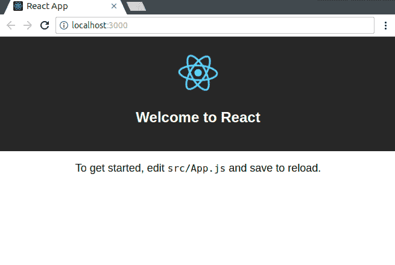

# 10 分钟后安装 React Hotloader

> 原文：<https://dev.to/bnevilleoneill/setup-react-hotloader-in-10-minutes-4ck6>

<figure>[](https://res.cloudinary.com/practicaldev/image/fetch/s--oWRh-R_3--/c_limit%2Cf_auto%2Cfl_progressive%2Cq_auto%2Cw_880/https://cdn-images-1.medium.com/max/1024/1%2AzUqNnLMhl1f6kprsmW1hcw.jpeg) 

<figcaption>照片由[【陆】上](https://unsplash.com/photos/RISlZXiSShA?utm_source=unsplash&utm_medium=referral&utm_content=creditCopyText)[下](https://unsplash.com/search/photos/loading?utm_source=unsplash&utm_medium=referral&utm_content=creditCopyText)</figcaption>

</figure>

几年前，刷新浏览器以查看 web 项目的最新更新变得很累(在更改没有按预期呈现的情况下甚至很烦人)。

为了解决这个问题，开发人员开发了几个插件和工具，可以让 DOM 在每次保存时重新呈现，甚至不需要完全重新加载。

这被称为热重装。它的工作原理是在运行时用一个更新的模块替换应用程序的一个模块，以便它可以立即使用。

这就让我们谈到了热模块更换(HMR)。

顾名思义，HMR 可以在不重启服务器的情况下替换模块，并且可以很容易地在不同的捆绑器上启用。

在 [Webpack 的](https://webpack.js.org/)网站上，它说:

> *热模块替换(HMR)在应用程序运行时交换、添加或删除* [*模块*](https://webpack.js.org/concepts/modules/) *，无需完全重新加载。这可以在几个方面大大加快开发速度。*

HMR 解决了热重新加载的问题，使调整样式变得更容易(几乎相当于在浏览器的调试器中改变样式),并且总体上加快了开发过程。

但是，当我们在 React 这样的基于组件的框架中实时重载并跟踪其状态时，会发生什么呢？我们失去了国家。

我们丢失状态的原因可以通过首先理解热重装和实时重装之间的区别来理解:

> *应用程序的热重新加载只会刷新已更改的文件，而不会丢失应用程序的状态。*
> 
> 对应用程序的实时重新加载将重新启动整个应用程序，并且加载会导致其丢失状态。

本教程的主要目的是演示我们如何快速设置 react 应用程序的 react-hot-loader，以便它的组件可以被实时重新加载而不会丢失状态。

本文的结果代码可以在 [GitHub](https://github.com/christiannwamba/react-hot-loader-demo) 上找到。

[T2】](https://logrocket.com/?cid=banner_a)

### 先决条件

1.  请确保在开始本教程之前安装了节点和 npm
2.  我们假设您对 React 有非常基本的了解，并且对 JavaScript 有一个大致的了解会很有帮助
3.  我们将使用 create-react-app 工具创建 react 应用程序

如果你的电脑上还没有 create-react-app 工具，你可以用这个命令安装它:

```
npm install -g create-react-app 
```

Enter fullscreen mode Exit fullscreen mode

### 设置开发环境

让我们启动一个 create-react-app 项目的新实例，并使用这些命令导航到新创建的目录:

```
create-react-app react-hot-loader-demo 
```

Enter fullscreen mode Exit fullscreen mode

```
cd react-hot-loader-demo 
```

Enter fullscreen mode Exit fullscreen mode

我们可以使用这个命令运行应用程序:

```
npm start 
```

Enter fullscreen mode Exit fullscreen mode

这个命令启动指向地址 [localhost://3000](http://localhost:3000/) 的 web 服务器。我们将在浏览器上访问这个地址，并保持选项卡打开，因为在整个教程中，我们将在浏览器中监控应用程序的更新和行为。

[T2】](https://res.cloudinary.com/practicaldev/image/fetch/s--JRTOgiim--/c_limit%2Cf_auto%2Cfl_progressive%2Cq_auto%2Cw_880/https://cdn-images-1.medium.com/max/655/0%2AEcS1HNjAsGcS3BAo.png)

当我们使用 create-react-app 创建一个新项目时，热模块替换(HRM)插件在 Webpack 配置文件中默认启用，尽管我们看不到该文件，因为 create-react-app 为我们配置了我们的应用程序并隐藏了配置文件。

### 检查热重装行为

我们可以通过向开箱即用的 index.css 文件添加一个基本样式来看到 HRM 的热重新加载。我们将添加一个属性值对—背景:浅蓝色—到正文样式:

```
body {
  margin: 0;
  padding: 0;
  font-family: sans-serif;
  background: lightblue;
} 
```

Enter fullscreen mode Exit fullscreen mode

保存后，应用程序会在不刷新浏览器选项卡的情况下更新。

这种行为是可能的，因为 HRM 能够在运行时替换应用程序中的代码模块。

### 用 JavaScript 文件检查热重装行为

现在让我们看看当我们编辑 App.js 文件中的内容时会发生什么，我们可以做一些基本的事情，如替换“要开始，编辑 src/App.js 并保存以重新加载。”与“这是一个教程来设置反应热加载器。”