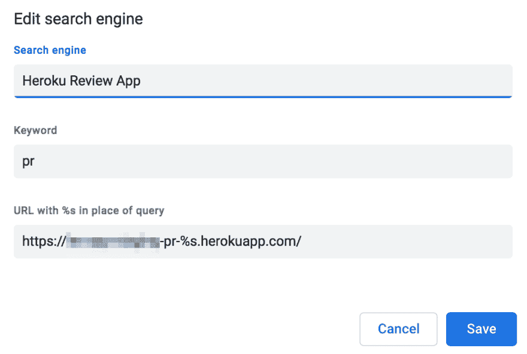
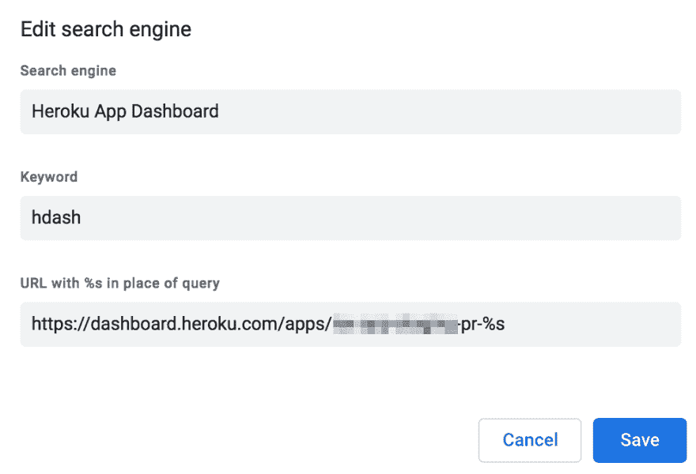

# 在 Chrome 中设置搜索引擎作为网络快捷方式

> 原文：<https://dev.to/ozzyaaron/setup-search-engines-in-chrome-as-shortcuts-to-the-web-25p4>

我完全是在偷我同事亚历克斯的勇气——这是他给我看的一个提示。

这里有一个小技巧，我们的首席测试人员向我展示了使用 Chrome 的搜索引擎自动完成功能作为 URL 的快捷方式。需要注意的是，URL 有一种格式，您可以将键入的字符串插入到 URL 中。基本上你需要一个网址，可以有一个替代品。

`https://your-app.com/users/<id>`
`https://github.com/repo/pulls/<user>`
T2】

例如，如果你在 Github 上使用 Heroku 的评论应用，你可能会得到一个类似于[https://your-prefix-1234.herokuapp.com/](https://your-prefix-1234.herokuapp.com/)的网址。

作为一名测试人员，他跳过了许多评论应用程序，因此设置了一个搜索引擎，这样他就可以键入 Github PR 号。

[T2】](https://res.cloudinary.com/practicaldev/image/fetch/s--_mqxrjSx--/c_limit%2Cf_auto%2Cfl_progressive%2Cq_auto%2Cw_880/https://thepracticaldev.s3.amazonaws.com/i/68067bjzgajxyhdqqj8w.png)

你只需在地址栏中输入`pr`，然后按 tab，输入你的 PR 号，然后按 enter。如对话框中所述，URL 被展开。

作为一名开发人员，我倾向于访问 Heroku Dashboard 查看应用程序。为此，我设置了另一个搜索引擎:

[T2】](https://res.cloudinary.com/practicaldev/image/fetch/s--m6vo8ylo--/c_limit%2Cf_auto%2Cfl_progressive%2Cq_auto%2Cw_880/https://thepracticaldev.s3.amazonaws.com/i/7dl9l0hac74bn4smpxtx.png)

这让我可以键入`hdash`、tab、PR 号、enter，然后我就进入了那个评审应用程序的 Heroku 仪表板。

鲍勃是你叔叔！

我意识到这不是突破性的，我完全是从一个同事那里偷来的(他不太可能看到这个-但是如果你看到了，你好亚历克斯！)但这确实是一个非常方便的方法。